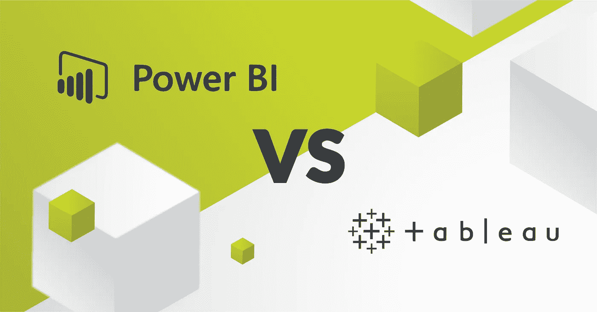
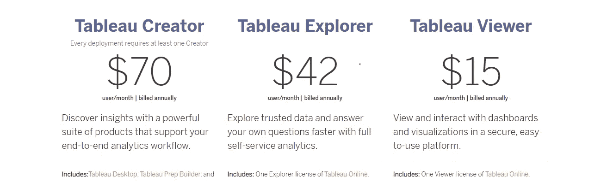
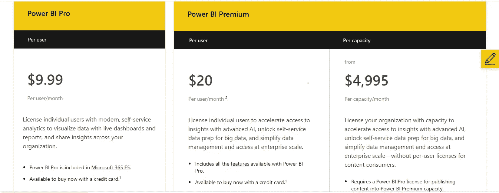
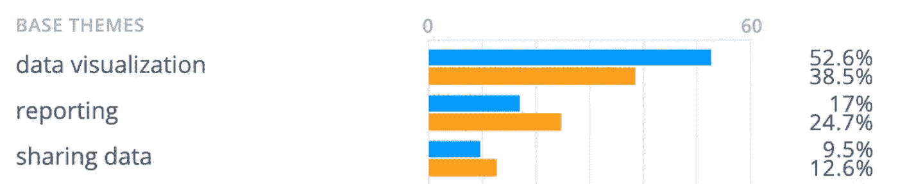

# Tableau 还是 Power BI？

> 原文：<https://medium.com/codex/tableau-or-power-bi-f5f0803b19eb?source=collection_archive---------1----------------------->

## 选择最适合你的。

[艰难的选择——Skelia 博客](https://skelia.com/articles/power-bi-vs-tableau-which-business-intelligence-tool-to-choose-in-2021/)

**可视化**在数据分析和统计中发挥着巨大的质量作用，帮助组织、品牌、教育机构、银行和其他公司提高他们的进度，并分析他们每天的工作，以赚取最大可能的利润。为了提高性能，理解数据对于做出相应的战略决策非常重要。

幸运的是，随着技术的进步，数据可视化也带来了一系列终极、智能、高效和有益的工具，来帮助公司确定实现预期目标的微小细节。目前，有许多工具可以免费获得，其中包括流行的**画面** & **电源 Bi** 以及其他工具。想知道哪个更好吗？让我们深入了解一下。

# TABLEAU 还是 POWER BI？

[图片来源:RODNAE Productions on Pexels](https://www.pexels.com/photo/black-magnifying-glass-on-black-table-7947707/)

Tableau 和 power bi 是非常流行和常用的工具，因为某些原因，包括连接到不同的数据源，预算和交互式可视化使数据看起来整洁和迷人，但使数据可展示需要努力。基于某些功能和应用，这些工具在各个方面都有所不同，并且设计有独特的策略。

# 什么是——Tableau & Power BI

**TABLEAU—**TABLEAU Software 是一家专注于商业智能的美国交互式数据可视化软件公司。它成立于 2003 年，目前总部设在华盛顿州西雅图。Tableau 是一个可视化分析平台，改变了我们使用数据解决问题的方式，使人们和组织能够充分利用他们的数据。这可以连接到几乎任何数据库，拖放创建可视化，并与点击共享。

**POWER BI —** Power BI 是微软的一项商业分析服务。凭借简单的用户界面，它赢得了分析数据核心细节的人心，并成为 Tableau 富有挑战性的竞争对手。它旨在提供交互式可视化和商业智能功能，其界面足够简单，最终用户可以创建自己的报告和仪表板。它是微软 Power 平台的一部分。

因此，哪一个是最好的将很快得到澄清。

# 什么对我最好？—比较分析

这两个软件的功能和突出显示的可访问性分为以下几个方面，以及其他突出显示的关键事实，包括:

## 1)数据处理

Tableau 在这方面有优势，因为它可以以更好的性能处理大量数据，而 Power Bi 在处理大量数据方面有所欠缺，但它可以处理有限的数据量。

[un splash 上的 Firmbee.com](https://unsplash.com/photos/QCbZ4ASLhM8)

## 2)数据来源

与 Tableau 相比，Power BI 的数据源有限，Tableau 可以访问大量数据库和服务器。以下信息来自 educba.com/power bi vs Tableau*。*

**Power BI:** SQL Server 数据库、Access 数据库、SQL Server Analysis Services 数据库、Oracle 数据库、IBM DB2 数据库、IBM Informix 数据库(Beta)、IBM Netezza、MySQL 数据库、PostgreSQL 数据库、Sybase 数据库、Teradata 数据库、SAP HANA 数据库、SAP 业务仓库应用服务器、SAP 业务仓库消息服务器(Beta)、Amazon Redshift、Impala、Google BigQuery、雪花、Exasol。

**Tableau:** Excel，文本文件，Access，JSON 文件，PDF 文件，空间文件，统计文件，其他文件(如 Tableau。超，。tds，。twbx)、连接到 Tableau Online 或服务器上的已发布数据源、Actian Matrix、Actian Vector、Amazon Athena、Amazon Aurora、Amazon EMR、Amazon Redshift、Anaplan、Apache Drill、Aster Database、Box、Cisco Information Server、Cloudera Hadoop、DataStax Enterprise、Denodo、Dropbox、EXASOL、Firebird、Google Analytics、Google BigQuery、Google Cloud SQL、Google Sheets、Hortonworks Hadoop Hive、HP Vertica、IBM BigInsights、IBM DB2、IBM PDA (Netezza) 、kognitiono、MapR Hadoop Hive、Marketo、MarkLogic、MemSQL、Microsoft Analysis Services、Microsoft PowerPivot、Microsoft SQL Server、MonetDB、MongoDB BI Connector、MySQL、OData、OneDrive、Oracle、Oracle Eloqua、Oracle Essbase、Pivotal Greenplum Database、PostgreSQL、Presto、Progress OpenEdge、QuickBooks Online、Salesforce、SAP HANA、SAP NetWeaver Business Warehouse、SAP Sybase ASE、SAP Sybase IQ、ServiceNow ITSM、SharePoint Lists、Snowflake、Spark SQL、Splunk

## 3)数据容量

正如前面在数据处理中提到的，Power bi 可以处理低数据量，每个工作区/组最多可以处理 10GB 的数据。对于超出限制的数据，数据要么需要在云中( **Azure** )如果在本地数据库中，Power BI 可以从数据库中选择或捕获数据，而不导入。另一方面，Tableau 在基于列的结构中工作，存储每列的唯一值以及数十亿行。

[泰勒维克在 Unsplash 图像上](https://unsplash.com/photos/M5tzZtFCOfs)

## 3)机器学习

谈到机器学习(ML)，所有 Python ML 内置的功能都可以在 Tableau 中使用，这使得在数据集中应用 ML 概念更加有效。然而，Power BI 与@Microsoft Azure 和其他 [Microsoft Design](https://medium.com/u/d97749d23c4a?source=post_page-----f5f0803b19eb--------------------------------) 应用程序集成，这有助于理解数据模式。

[来自 Unsplash Images 的海尔林](https://unsplash.com/photos/ndja2LJ4IcM)

## 4)理解灵活性

Power Bi 非常容易上手，而且更专注于报告和分析建模，而不是存储数据。Tableau 很有技术含量，开始时很难理解，但是一旦熟悉了，所有的选择都为你敞开了。

[图片来源:Unsplash 的 KOGU 机构](https://unsplash.com/photos/7okkFhxrxNw)

## 5)目标受众

Microsoft Power BI 主要面向新手和有经验的用户，而分析师和有经验的用户更经常使用 Tableau 进行分析。

[图片来源:Pexels 的 Mikael](https://www.pexels.com/photo/marketing-man-hands-people-6476586/)

## 6)客户支持

这两个软件都有强大的客户支持，但这可能会因免费和付费版本而有所不同。Tableau 拥有优秀的客户支持，因为有大型的社区论坛供讨论。Power Bi 通过免费的 Power Bi 帐户为他们的客户提供有限的客户支持，但通过付费版本，服务变得更好、更有效。

[技术客户支持](https://leister.azureedge.net/-/media/images/leister_internet/400-axag/general-pictures-axag/axag_support-symbol.jpg?revision=b9a85f5f-287d-478f-a23e-7c6dd8afb3ca&la=en&h=1391&w=2659&bc=ffffff&hash=D28B2596DC6338A7FD893BC91A9AB234BE45FEA2)

## 7)定价

在价格方面，Tableau 相当昂贵，需要支付一笔可观的费用，特别是用于连接第三方应用程序，而 Power Bi 非常便宜，具有成本效益，因为它还提供免费版本来支持全球客户。

***Tableau 定价:***

[Tableau 定价](https://www.tableau.com/pricing/teams-orgs)

***电力 BI 定价:***

[微软 Power BI 定价](https://powerbi.microsoft.com/en-us/pricing/)

# 有利弊吗

有许多突出的关键事实使这两种工具与众不同，如下所示:

# *画面*

## 优势

以下是使用 Tableau BI 的优点/好处:

*   降低培训成本
*   非常快速和容易地创建可视化
*   良好的客户支持
*   数据解释者讲故事的能力
*   Tableau 提供了可视化的特征
*   它帮助您组合形状和清理数据进行分析。
*   它帮助你处理大量的数据。
*   使用像 R & Python 这样的脚本语言来避免复杂表格计算的性能问题。
*   允许用户使用 Tableau Desktop 创建报告、仪表板和故事。

## 不足之处

以下是 Tableau 的缺点和不足

*   成本相对较高
*   没有变更管理或版本控制
*   与其他工具相比，它很贵。
*   导入自定义可视化有点困难。
*   没有简单的方法可以将报告嵌入到其他应用程序中。
*   Tableau 只适合能够支付许可费用的大型组织。
*   tableau 不提供对人工智能和机器学习的支持。
*   它可以与其他微软产品集成，如 Power Apps、Dynamics 365、Office 365 和使用单点登录(SSO)的 Microsoft Flow。

# * MICROSOFT POWER BI *

## 优势

使用 Power BI 的优势在于:

*   为 SaaS 解决方案提供预构建的仪表板和报告
*   提供实时仪表板更新。
*   安全可靠地连接到云中或内部的数据源
*   Power BI 提供快速部署、混合配置和安全的环境。
*   使用自然语言查询的数据探索。
*   仪表板可视化功能
*   经常添加对 excel 用户非常有用的新功能。
*   广泛的数据库连接能力问答功能发布到网上。
*   集成 Python 和 R 编码以使用可视化。
*   Power Query 提供了许多与争论和清理数据相关的选项。
*   将数据发布到 Power BI web 服务后，无需手动干预即可安排刷新。
*   Power BI 的背后是人工智能和机器学习的超强能力。

## 不足之处

使用 Power Bi 的缺点是:

*   仪表板和报告仅与具有相同电子邮件域的用户共享。
*   Power Bl 永远不会混合从实时连接访问的导入数据。
*   Power BI 不能接受大于 1 GB 的文件大小。
*   仪表板从不接受或传递用户、帐户或其他实体参数。

# 其他方面

在询问其他功能时，数据完整性和部署是需要讨论的重要方面。

[getthematic.com 的见解](https://getthematic.com/insights/content/images/size/w1000/2021/06/top-base-themes.png)

## 数据完整性和部署选项

对于**部署**， **Power BI** 有几种形式:桌面、专业、高级、移动、嵌入式和报表服务器。根据您的角色和需求，您可以使用这些服务中的一个或全部来构建和发布可视化。最基本的设置是通过 Office365 管理界面连接到 Power BI 的 Azure 租户(即使试用结束后也可以保留)。对于数据完整性，Power BI 具有 API 访问和预构建的仪表板，可快速洞察 Salesforce、Google Analytics、电子邮件营销，当然还有微软产品。

然而， **Tableau** 也有几种形式:个人、团队和嵌入式分析计划，可通过公共云服务器或私有云服务器在内部提供。Tableau 允许您通过免费试用来设置初始实例，这使您可以完全访问该工具的各个部分。在打开的仪表板中，您将看到所有可用连接的列表。连接您的数据源，然后您可以开始构建一个工作表，您的可视化将生活在其中。此外，对于**数据集成**，Tableau 在与流行的企业工具和广泛使用的连接的集成方面投入了大量资金。当您登录到该工具时，您可以查看您的帐户级别包含的所有连接。Tableau 的连接接口比 Power BI 稍微复杂一些，因为在建立连接时，您需要确定将哪些数据拉入工具中。

1.  **集成:** Tableau 在集成方面可能更先进，但 Power BI 在这一功能上获得了更多正面提及。

**获胜者:强力毕**

**2。定制:** Tableau 强大的定制选项战胜了 Power BI 更有限的产品。

**赢家:TABLEAU**

**3。速度:**说到速度，Tableau 用户说解决方案慢的可能性稍微大一点。总体而言，大约 15%的用户对性能的不同方面进行了评论，例如解决方案的速度和健壮性。幸运的是，Power BI 领先一步，报告服务速度慢的用户较少。

**获胜者:强力毕**

**4。处理多个数据源:** Power BI 是处理多个数据源的领先数据可视化工具。

**获胜者:力量毕**

**5。社区&受众:**Tableau 拥有一个大型社区论坛，有大量受众使用它来进行组织分析，因此赢得了这场竞赛。

**赢家:画面**

这些突出的事实使得这两个工具对用户来说是流行的、交互的和灵活的。

> 你认为哪一个更好？

请在评论中告诉我们。下一篇博客再见。