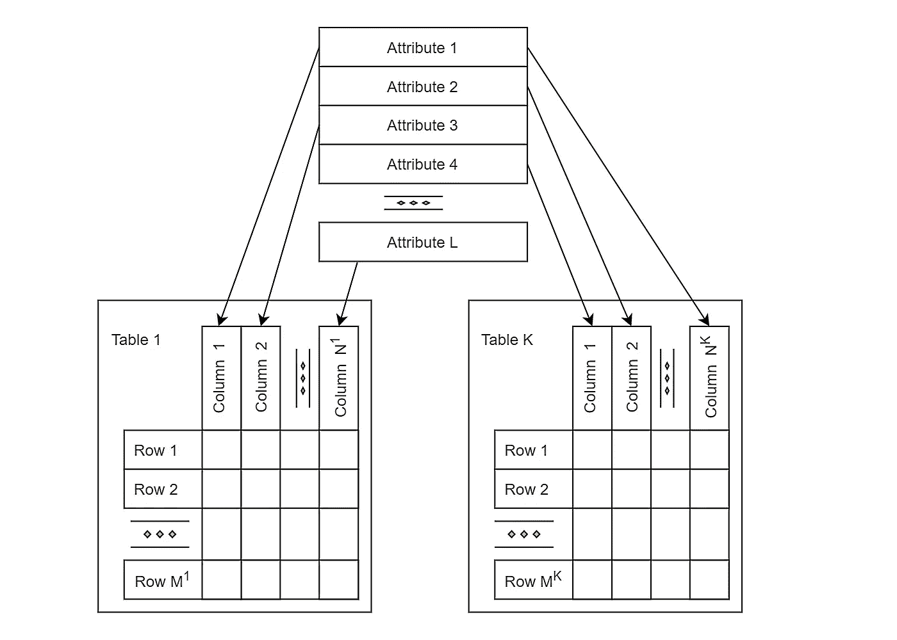
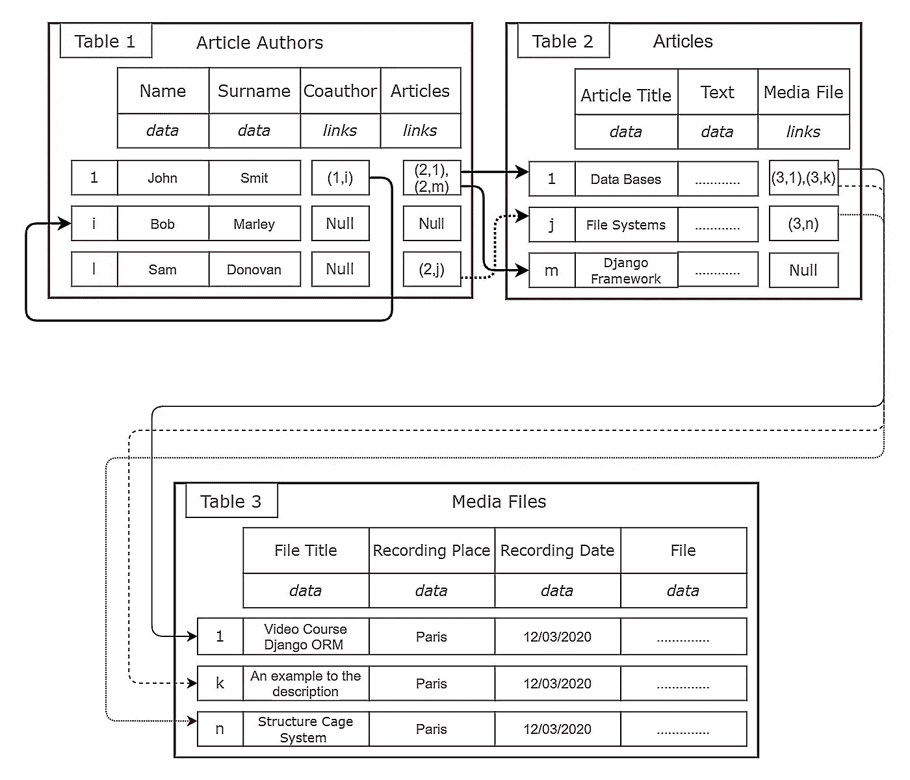
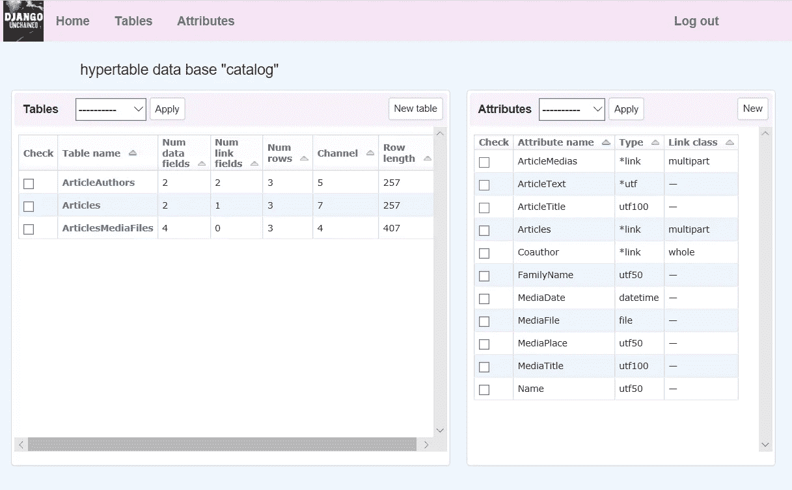

# 表格网络数据模型。第一部分。概念定义

> 原文：<https://medium.com/codex/tabular-network-data-model-part-1-conceptual-definition-49e84104b8aa?source=collection_archive---------16----------------------->

## 表格网络数据库——在关系数据库、网络数据库和面向对象编程概念的交叉点上建立数据模型和相关软件的新方法

【这是*表格网络数据模型*系列的第 2 部分。点击这里查看所有[帖子的链接。]](/@azur06400/tabular-network-data-model-series-f7b8469ed333)

所提出的数据模型被称为“表格网络”，因为表格形成了结构化信息的基础，并且关系以明确的形式被形式化，如在早期的网络数据库中。这个模型在概念层面上非常简单——其本质是不仅实际数据可以存储在表的字段中，而且可以直接链接到任何表的行。

在关系模型中，关于在数据库的创建和补充期间相关的真实实体的关系的客观知识明显丢失，并且被开发者转换成间接知识。这是典型的“一对多”和“多对多”关系，当附加的，所谓的“连接”表被用于它们的形式化时。

根据简单明了的标准，以显式形式保存关于实体关系的知识及其有效使用是表格网络模型的重要优点。它简化了真实世界的适当建模，允许减少数据库的设计和维护中的错误和变更的数量。

数据模型的网络“组件”在许多情况下可以消除聚类、索引和数据搜索的成本。

表格网络模型本身和用于其实现的技术被称为**表格网络数据库**(以下简称 TNDB)。

图 1:表格网络数据库的抽象结构。TNDB 由一组公共属性、一组表以及表的属性和列之间的关系组成。

TNDB 中的表被定义为具有有序的字段(单元)集的有序的行集(记录、元组)形式的结构。表中不允许有相同的行。所有行中具有相同序列号的字段的选择构成了表格的列。

TNDB 中的表没有标题，也就是说，列没有特殊的名称(关系模型术语中的“属性”)。

为整个数据库定义一组公共属性，作为对模拟系统的结构和参数描述进行形式化的必要和充分的特征。关系数据库的两个概念——数据库的“域”和单个关系的“属性”——本质上合二为一。

每个表中的每一列都对应于一个数据库属性。同一表中的所有行都有相同数量的字段。

表格有永远不会改变的唯一数字。被删除的表的编号不会分配给新表。为了便于编程和维护，表被分配了可以更改的符号名称。

每个属性都有一个唯一的编号，该编号在创建后不会改变。已删除属性的编号不会分配给新的属性。属性被赋予可以改变的符号名称。

数据库中一个表的每一行由一对“表号，行号”唯一标识，表中的每一个字段由一个元组“表号，行号，属性号”唯一标识。

在 TNDB 中，所有属性都分为两个不相交的类，这两个类具有完全不同的目的:

*   称为**数据类型属性**(以下简称 DTA)的属性用自定义数据值定义字段。
*   称为**引用类型属性**(以下简称 RTA)的属性定义了具有值的字段，这些值被解释为直接链接到表中的行，并表示它们的物理地址对:“表号，行号”。

结构与 TNBD 相对应的数据库被称为**超表**(以下简称 HT)，它是交叉引用表的系统。这里介绍的 hypertable 的概念和老项目中的没有任何共同之处，老项目已经在 2016 年停止了。

DTA 的含义与 Oracle 对象关系数据库中的“REF”类型的列很接近(从版本 8 开始)。它是一种内置的数据类型:一个指向行的逻辑指针或引用，提供了一种在行对象之间导航的简单机制。但是，与 REF 类型的严格定义的列(每一列都绑定到给定行中的对象类型，即特定的表)不同，HT 中的 DTA 可以包含到公共 HT 中任何表的任何行的链接，并且 DTA 字段的值可以是一个或多个链接(无序集)。

图 2:“目录”数据库(示例)

图 2 显示了表格网络模型的一个例子——一个名为*目录*的文章数据库。*文章作者*、*文章*和*媒体文件*分别是 id 为 1、2 和 3 的表格。*姓名*，*姓氏*，*文章标题*，*正文*，*文件标题*，*记录地点*，*记录日期*日期*，*文件*为数据类型属性。*合著*、*文章*、*媒体文件*为引用类型属性。“1”、“I”、“l”、“j”、“m”、“k”、“n”是行号(象征性的)。箭头显示链接(成对“表格号，行号”)指向的行。*

每个 RTA 都可以归属于以下语义类型之一:

*   "**"表示“整体——整体的一个组成部分”的关系，这意味着在移除“整体”之后需要移除所有“部分”,并且在移除任何“组成部分”的情况下，移除作为“部分”的链接源的“整体”。添加新的“部分”是允许的，并且是作为链接集的扩展来完成的。**
*   **" **Multipart** "表示“集合-部分”和“属-种”的关系，这意味着在删除“集合”(“属”)的情况下需要删除“部分”(“种”)，但反之亦然。添加新的“部分”是允许的，并且是作为链接集的扩展来完成的。**
*   **“**因**”表达的是“因-果”的关系，意思是说，无论是“因”还是“果”的去除，都不会分别导致“果”或“因”的去除，但无论如何，“因”到“果”的联系是失去的。**

****

**图 3。用于表格网络数据库的 HTed web 编辑器的屏幕截图。**

**“多对一”和“多对多”的关系分类保留在 TNDB 中，作为模拟自然系统的基本属性的反映。但是，不支持在逻辑和物理级别上正式遵守相关要求。TNDB 开发者可以(也应该)在概念层面考虑它们，限制和控制特定算法中链接的形成。**

**表格网络数据模型的概念概括了对象关系数据库的一些结构(链接、可变长度数组和作为值的二进制文件)，但不支持其他结构，如嵌套表、方法、方法重叠、封装和继承。**

**让我们稍微超前一点，讨论一下模型实现在物理层面的主要特性。这对于概念层面来说是非常重要的，因为没有它，上述概念模型就没有实用价值。**

****每个 HT 表格中每列的所有字段在数据库内存中具有相同的物理大小(字节长度),因此每个表格中的所有行也具有相同的物理大小。****

**因此，表中的任何字段都是通过行号和列号在数据库内存中直接访问的。由于在内存的单独区域中存储可变长度数据的附加机制，固定的记录长度不会导致表中出现碎片(不必要的内存开销)或需要指定数据的最大大小。**

**结果，访问数据的算法复杂性(不考虑实现特征)被降低到理论上的最小值，因为访问一行所需的时间与表中行数的相关性被消除了。对于以下操作，与关系数据库相比，物理寻址在生产效率方面提供了质的提高:**

*   **搜索和/或修改现有行的字段值；**
*   **向表的末尾添加新行。**

**与关系模型相比，使用物理行号既有优点也有缺点，因为开销与 HT 中的“显著”变化相关联，例如:**

*   **删除表；**
*   **从整个数据库中移除 RTA**
*   **从表中删除 RTA 列；**
*   **在除表格末尾之外的任何位置添加行；**
*   **删除一行。**

**任何“重大”更改都可能需要删除无效链接和修改物理行号已更改的有效链接，以保持数据库的完整性。换句话说，所有受物理行号变化影响的链接都必须立即纠正。**

**乍一看，这样的模型似乎不适合实际使用，但事实并非如此。在一大类领域中，显著的变化很少或者可以完全避免，并且在更大类的任务中，数据访问(读取和修改)的速度和添加新数据的速度具有绝对的优先权。**

**如果没有主键，在表的中间添加新行是一个“奇特”的选择；所以这个因素的影响通常可以忽略。顺便说一下，关系模型通常并不意味着对表进行排序。**

**在生产中的大多数软件应用程序中，删除整个列和表是一个极其罕见的操作。**

**如果一个数据库只是随着时间的推移而扩展，那么只有数据本身会被修改，不会有显著的变化。这是表格网络模型的理想情况(例如，不能删除历史记录的银行和会计数据库)。在逻辑层，这在许多情况下可以通过例如输入一个布尔属性作为行状态(“活动/非活动”)来实现，这样就不会在物理上删除行，而只在表的末尾添加新行。**

**逻辑和物理层的表格网络模型实现将在后续文章中详细讨论。我计划继续写表格网络模型和我的软件的具体实现。**

****更新**(2022 年 8 月 12 日)**

**从 HTMS 第三版(2022 年 8 月)开始，有两种引用类型属性(RTA):简单的**链接**(在 HTMS 第二版中)和**编号或“加权”链接**。简单链接是 HT: pair 元组(表号，行号)中的物理地址行。**

**编号(“加权”)链接—是一个简单的链接加上**权重**(实数):三元组(表号、行号、权重)。**

**在下文中，为简单起见，编号为**的链节将简称为“权重”。****

**文章[使用 HTMS 存储和应用神经网络](/@azur06400/using-the-htms-for-storing-and-applying-neural-networks-b0b23cae0160?source=your_stories_page-------------------------------------)描述了使用加权链接对多层感知器进行有效建模。**

**本文授权: [CC BY-NC-ND 4.0](https://creativecommons.org/licenses/by-nc-nd/4.0/)**

## **引文**

**[1]: *超表*。【www.hypertable.com **

**[2]: *Oracle 数据库*。[www . docs . Oracle . com/en/database/Oracle/Oracle-database/index . html](https://docs.oracle.com/en/database/oracle/oracle-database/index.html)**