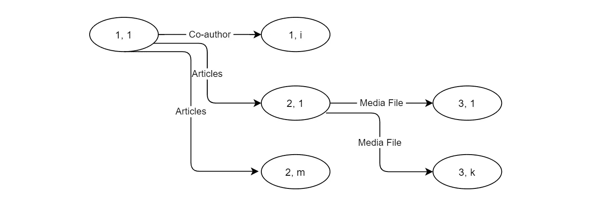
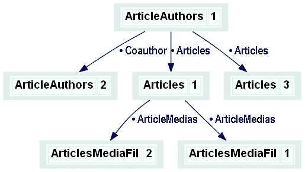
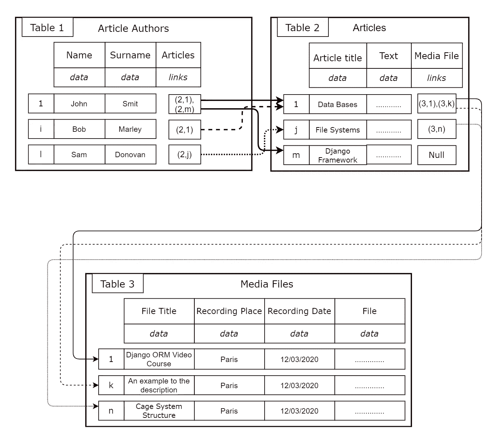
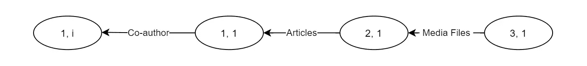
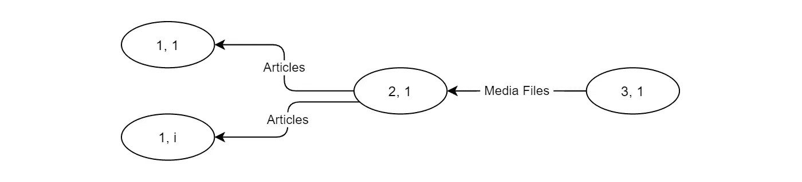
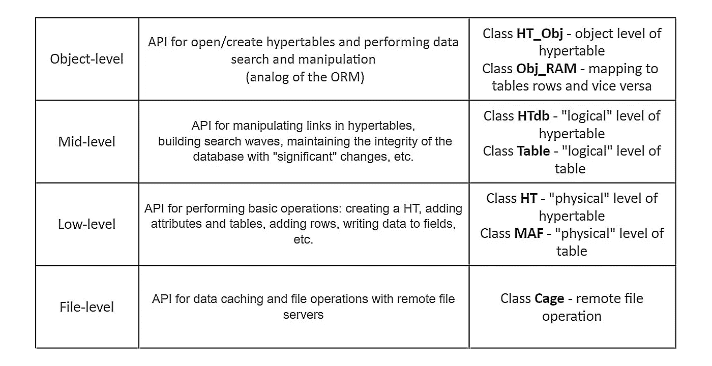

# 表格网络数据模型。第二部分。重要特征

> 原文：<https://medium.com/codex/tabular-network-data-model-part-2-important-features-99a07f514b4?source=collection_archive---------24----------------------->

## 表格网络数据库——在关系数据库、网络数据库和面向对象编程概念的交叉点上建立数据模型和相关软件的新方法

【这是*表格网络数据模型*系列的第 3 部分。点击查看所有帖子[的链接。]](/@azur06400/tabular-network-data-model-series-f7b8469ed333)

## 类库而不是数据操作语言

表格式网络模型中不使用主键和外键的概念。因此，在超表(HT，参见定义[这里](/@azur06400/tabular-network-data-model-part-1-conceptual-definition-49e84104b8aa))中没有具有主键的属性，因为从引用类型属性(RTA，参见定义[这里](/@azur06400/tabular-network-data-model-part-1-conceptual-definition-49e84104b8aa))字段直接寻址到行是可用的。

在关系数据库中，一个或几个字段(组合键)可以用作主键，其值唯一地标识表中的每一行。在 SQL 中没有这样的形式主义是不可能做到这一点的。

当使用对象关系映射(ORM)时，程序员可以显式地为表指定主键，但这在实践中很少见，因为默认情况下主键是存储行的唯一标识符(通常是自然数)的 ID 字段。因此，关系数据库内存中行的物理顺序可能与 id 的顺序不一致。

ORM 会自动创建这样的 ID 字段，并在添加新行时向其中写入唯一的值。系统的完整性通过 id 的值来维护，它们用于搜索记录(从具有外键和多对多键的字段中)。

ORM 的概念提供了一个放弃数据库查询语言的机会，通过使用适当的方法而不是查询，用 ORM 类来代替它。例如，ORM Django 包含方法`objects.all(…)`、`objects.get(…)`、`and objects.filter(…)`。

为表格式网络数据库(TNDB)开发一种特殊的数据操作语言似乎是有问题的，因为语法和语义的复杂性使得很难实现这样的引擎并在编程中使用它。

一个解决方案是采用 ORM 的思想:要使用 TNDB，必须创建一个类库，它在功能上类似于 ORM 类。换句话说，程序员收到一个通用面向对象语言的包:一组用于创建数据库和操作数据的类。

我开发的软件(类的包)比 ORM 系统有优势:所有操作都是直接使用数据库文件执行的，不需要中间翻译成 SQL，也不需要使用事务引擎来解释 SQL 查询。

## 为表格网络模型解释关系模型中的规范化概念

这一小节简要地考察了表格网络模型如何与规范化的概念相联系，这在关系数据库的理论和实践中是非常重要的。规范化关系系统的数据模型(模式)的目标是消除数据重复和获得搜索查询的冲突答案的可能性，并在删除单个事实时删除一般化的事实。

规范化关系的基础是函数依赖(FD)的概念，包括关系内部和关系之间。

通过消除所有的 FD(完全的、部分的和多值的内部关系(当然，除了非关键属性对关键属性的依赖)来应用规范化的思想在理论上是一个“模糊”的领域。

如果尽可能严格地考虑关系模型，所有的主键和外键只代表“自然的”数据库域，不应该包含用于行标识的代理键。在这种情况下，如果两个键的属性都与一个“自然”域配对，则只能使用对来连接两个表(第一个表的外键的属性与第二个表的主键的属性)。然而，在实践中，大多数关系数据库包含要在主键中使用的代理键，开发人员通常采用这种方法来避免和/或简化规范化。

有几种范式是可以区分的(其中前六种最为人所知)，每一种都是前一种的细化。开发人员在理解和满足需求方面越“先进”，数据库设计就越好，即“越接近理想状态”

实际上，在最好的情况下，大多数程序员只限于前三种。因此，在实践中几乎没有关系数据库是完全规范化的，这会导致操作和维护过程中的问题。

通过比较关系数据库中关系的范式和 HT 中表的属性，可以得出以下结论:

*   作为域和属性概念的“合并”的结果，第一范式(不包括对数据原子性的要求)在表格网络模型中被“自动”支持。
*   第二范式的要求不适用于表格网络模型，因为没有定义主键。作为替代，可以使用表内每个 RTA 字段的值对其所有数据类型属性(DTA，参见定义[此处](/@azur06400/tabular-network-data-model-part-1-conceptual-definition-49e84104b8aa))字段的值的组合的完全函数依赖性的要求。
*   如果考虑表中的任何 DTA，而不是关系中的非关键属性，则可以修改并接受第三范式的要求。

HT 的“网络”组件使得“清楚地”观察表之间的所有 FD 并在数据模型中正确地解释它们成为可能。

建模实践中的主要问题总是属性之间的多值 FD。第四和第五正常关系形式已被提出来消除这些问题中的大部分。如果 RTA 正确地反映了模拟自然系统中关系的语义和自然本质，表格网络模型就不会遇到这样的困难。

## 搜索波

对于 TNDBs，搜索查询被图论中的一个概念所取代，即搜索波。搜索波的传播(计算、形成)结果是以地址对“表号、行号”作为节点，以 RTA 作为边的有向图。TNDB 的搜索波形图是一个网络，在大多数情况下用树来表示。

搜索波可以是“正向”和“反向”

当搜索前沿从初始行穿过 RTA 场时，直接波递归地形成。因此，一个表中直达波的最大数量等于其中 RTA 字段的数量。对于熟悉图论的读者来说，应该清楚这是如何发生的。

通过包含链接到初始行(递归)的行，从“自下而上”生成反向(向后)波。

与关系数据库不同，如果不考虑从/向外部存储器物理加载和卸载数据的成本，TNDBs 中的搜索性能不依赖于存储的数据量(表中的行数)。计算搜索波所需的时间只取决于最终图的大小，而最终图是由显式链接构建的。

在 TNDB 中，可以在两个“坐标”中控制波浪的计算:

1.  通过限制搜索深度(链接数量)
2.  仅考虑(包括在 wave 中)一些区域贸易协定。

考虑使用前一篇文章 — *目录*示例数据库中[图 2 所示的 TNDB 示例计算直射波和逆射波。请注意，表 2 中行号为 1 的文章“数据库”(*文章*)有两个媒体文件——在表 3 的“1”行和“k”行(*媒体文件*)——表 2 中行号为“j”的文章(“T8”文章)有一个媒体文件——在表 3 的“n”行(*媒体文件*)。](/@azur06400/tabular-network-data-model-part-1-conceptual-definition-49e84104b8aa)

来自表 1 中第 1 行的无限制的直达波(*文章作者*)生成了图 1 所示的图。

图 1:从表 1 的第 1 行直接搜索“Catalog”示例数据库(图 2 在[前一篇文章](/@azur06400/tabular-network-data-model-part-1-conceptual-definition-49e84104b8aa))。在这个网络中，节点是表格的行(“表格编号，行编号”的对)，边(箭头)是由 RTA 的值生成的链接(它们的符号名称显示在箭头上)

图 HTed web 编辑器的屏幕截图，显示了表格网络数据库的直接波形树。

图 3 显示了一个与上一篇文章中图 2 的数据模型略有不同的例子。区别在于没有“主要作者”的概念，因此没有“共同作者”的属性(假设共同作者之间“平等”)；所以 RTA *合著*不存在，RTA *文章*的链接属于“多对多”的范畴。

图 3:目录示例数据库的第二个版本

表 3 ( *媒体文件*)中第“1”行(“Django ORM 视频课程”)的逆波示例如下:

*   对于*目录* HT 的第一种变型(见[上一篇](/@azur06400/tabular-network-data-model-part-1-conceptual-definition-49e84104b8aa)中的图 2)，见下图 4。
*   对于*目录* HT 的第二个变体(本文中的图 2)，请参见下面的图 5。

图 4:第一版目录的逆波(图 2 在[前一篇](/@azur06400/tabular-network-data-model-part-1-conceptual-definition-49e84104b8aa)中)。

图 5:第二版“目录”的逆波(本文图 2)。

TNDBs 类和 ORM 类使用搜索、过滤和保存操作，在表的行和应用程序内存中的对象之间提供对应关系(映射、转换)。

除此之外，TNDB 类可以通过图形搜索波的实现创建具有更复杂结构的对象——网络和树。换句话说，当搜索数据或修改数据时，只有一个复杂的 TNDB 对象可以包含所有必要的信息，其形式是一组简单对象的结构化集合，这些对象映射不同的行。因为使用了物理寻址，所以这个集合计算起来很快，不需要索引和哈希表。

## 超表管理系统

表格网络数据库管理系统的第一个完整的功能实现被称为超表格管理系统(HTMS)。

简单是创造 HTMS 的主要动机。使用 HTMS 并不比使用众所周知的 ORM 系统更复杂，比如 Django ORM。然而，表格网络模型比关系模型更接近真实世界，这使得设计数据库更容易。

图 6:四个 HTMS 级别:第一列包含级别的名称，第二列包含功能的简要描述，第三列包含相应软件包中的类名。“包”应该理解为 Python 包索引(PyPI，Python 编程语言的软件仓库)的术语。

HTMS 包括以下级别和包(见图 6):

*   HTMS 应用编程接口(API)的“对象级”包括用于创建 HT 对象的`HT_Obj`类，以及用于将对象映射(转换)到表格行或从表格行映射对象的`Obj_RAM`类。这一层的主要函数类是`Obj_RAM`，其方法提供了操纵、搜索和过滤数据的基本操作，结果类似于 ORM 中的`objects`方法；
*   HTMS API 的“中间层”是一组类和函数，它们构成了对象级的基础:用于组织一般的 HT 结构以及单个表的模型(类似于 Django ORM 中的`models`),用于支持 HT 属性、表、行和字段的常见操作(创建、更改、删除等)。即考虑语义类型*整体*、*多部分*、*原因*的参照类型属性的“重大”变化，形成搜索波；
*   “低级”HTMS API 是一组类和实用函数。它构成了中间层和对象层的基础；
*   “文件级”HTMS API 是远程缓存访问网络服务器上的数据库文件的子系统。

使用 HTMS 的软件开发人员可以从三个选项中选择一个。只应用中级 API。在这种情况下，对数据库的操作将以表行的“术语”来形式化。
2。仅应用对象级 API。对数据库的操作将以对象的“术语”来形式化，同时可以使用整个中级 API 装置，因为对象级类是从中级 API 类中派生出来的:`HT_Obj(HTdb)`和`Obj_RAM(Table)`。
3。应用这两种 API。

HTMS 用户界面创建为一个通用 HT 屏幕编辑器— *HTed* ，实现为一个网站。它可以连接到任何数据服务器，而不考虑应用程序。 *HTed* 用于创建、设计和编辑与 HTMS 兼容的数据库文件。它在功能上接近用于 PostgreSQL ⁴.的 *PgAdmin* web 实用程序

对于大多数应用程序，使用对象级和中级的类和函数就足够了。他们两个合起来是 HTMS 的一个**逻辑层次**。

低级和文件级——如果高级开发人员想了解 HTMS 技术，可以使用它们。他们两个加起来都是一个**身体等级**的 HTMS。

表格网络模型在 HTMS 的逻辑和物理层的实现将在以后的文章中详细讨论。我计划继续写表格网络模型和我的软件的具体实现。

HTMS 软件支持表格网络数据模型的完整实现，上传到我在⁵⁶⁷⁸⁹.`github.com`的存储库还有一个关于笼子和 HTMS 类和功能的详细描述。根据 [Apache 许可证许可的软件，版本 2.0](http://www.apache.org/licenses/LICENSE-2.0) 。

**更新**(2022 年 8 月 12 日)

本文授权: [CC BY-NC-ND 4.0](https://creativecommons.org/licenses/by-nc-nd/4.0)

## 引文

[1]: *姜戈奥姆*。[www.fullstackpython.com/django-orm.html](https://www.fullstackpython.com/django-orm.html)

[2]:埃德加·考德。1990.数据库管理的关系模型:第二版。艾迪森-韦斯利

[3]: *PostgreSQL* 。[www.postgresql.org](https://www.postgresql.org)

[4]: *PgAdmin* 。[www.pgadmin.org](https://www.pgadmin.org)

[5]: *笼式系统。*[github.com/Arselon/Cage](https://github.com/Arselon/Cage)

【6】:HTMS。github.com/Arselon/HTMST2

[7]: *HTMS 对象级别*。[github.com/Arselon/HTMS/tree/main/htms_obj](https://github.com/Arselon/HTMS/tree/main/htms_obj)

【8】:*HTMS 中层。*github.com/Arselon/HTMS/tree/main/htms_mid

【9】:*HTMS 低级别。*[github.com/Arselon/HTMS/tree/main/htms_low](https://github.com/Arselon/HTMS/tree/main/htms_low)