# 利用闪电和 IceVision 应对 Kaggle COVID 检测挑战

> 原文：<https://medium.com/codex/tackle-covid-detection-with-lightning-flash-and-icevision-3f66f28c24ac?source=collection_archive---------5----------------------->

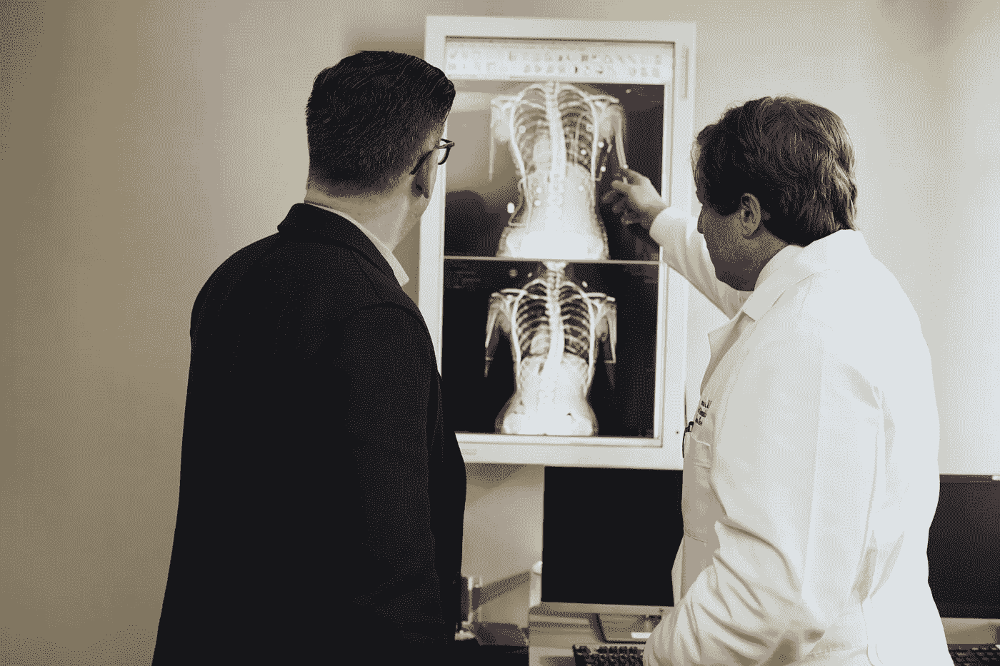

来自 [Pexels](https://www.pexels.com/photo/doctor-pointing-x-ray-result-beside-man-wearing-black-suit-2182972/?utm_content=attributionCopyText&utm_medium=referral&utm_source=pexels) 的 [LinkedIn 销售导航员](https://www.pexels.com/@linkedin?utm_content=attributionCopyText&utm_medium=referral&utm_source=pexels)的插图照片。

## 这篇文章介绍了我们如何使用[闪电](https://lightning-flash.readthedocs.io/en/stable)及其对 [IceVision 的](https://airctic.com)丰富模型和主干集合的新支持来应对卡格尔 using 费沙比奥-RSNA·新冠肺炎探测挑战。

目标检测是一项计算机视觉任务，旨在检测和分类场景或图像中的单个目标。有各种用于对象检测的模型架构，但是两种最常见的是区域提议(例如，快速/更快的 RCNN)和一次性检测(例如，SSD、YOLO)。

[Lightning Flash](https://lightning-flash.readthedocs.io/en/stable/) 团队最近发布了一个与 [IceVision](https://airctic.com/) 对象检测库的新的令人兴奋的集成，它支持几十个新的最先进的主干，可以进行微调，只需几行代码就可以进行推理。

 [## 对象检测- Flash 文档

### 对象检测是识别图像中的对象及其相关类和边界框的任务。和…

闪电闪电. readthedocs.io](https://lightning-flash.readthedocs.io/en/stable/reference/object_detection.html) 

我们参加了 [Kaggle: COVID19 检测/分类](https://www.kaggle.com/c/siim-covid19-detection)挑战，以展示新的集成，该集成展示了来自 6000 多名患者的真实且具有挑战性的 CT 扫描数据集。

检验我们的 Kaggle 内核— [**用闪电⚡️进行 COVID 检测**](https://www.kaggle.com/jirkaborovec/covid-detection-with-lightning-flash)

 [## 闪电⚡️的 Covid 探测

### 使用 Kaggle 笔记本探索和运行机器学习代码|使用来自 SIIM-费沙比奥-RSNA 新冠肺炎检测公司的数据

www.kaggle.com](https://www.kaggle.com/jirkaborovec/covid-detection-with-lightning-flash) 

> 所有的代码快照和可视化都是这个示例库的一部分，可以作为`pip install [https://github.com/Borda/kaggle_COVID-detection/archive/refs/heads/main.zip](https://github.com/Borda/kaggle_COVID-detection/archive/refs/heads/main.zip)`安装

# COVID 检测挑战

最近的 [Kaggle: COVID19 检测/分类](https://www.kaggle.com/c/siim-covid19-detection)旨在促进医学筛查，并最终协助医学专家/医生做出诊断。挑战是混合图像分类/目标检测任务。首先，您需要确定给定的 CT 扫描是否具有四种[异常](https://www.kaggle.com/c/siim-covid19-detection/data)之一，然后提供一组边界框来指示[异常](https://www.kaggle.com/c/siim-covid19-detection/data)出现的位置，以证明诊断的合理性。

虽然该任务被呈现为混合检测和分类任务，但是它也可以被建模为传统的对象检测问题，其中图像类别由检测到的[异常](https://www.kaggle.com/c/siim-covid19-detection/data)的大多数类别的集合来确定。

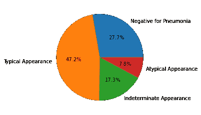

训练数据集上的标签分布。

一项**研究**代表一名独特的匿名患者，接受一次[计算机断层扫描**扫描**](https://en.wikipedia.org/wiki/CT_scan) 。单个 DICOM 图像应代表每次扫描。值得注意的是，一些带注释的图像被意外地不完全标记。这些图像和它们的注释后来被复制和修复，正如[在这个帖子中讨论的](https://www.kaggle.com/c/siim-covid19-detection/discussion/246597)。作为挑战的一部分，在训练之前，需要从数据集中过滤掉不完整的注释和重复的图像。

注释存储在两个独立的 CSV 表中。第一个表包含表示每个图像的异常类别的独热编码，第二个表包含图像中所有边界框(如果有的话)的列表。

## 加载带注释的 DICOM 图像

CT 扫描在一个 [DICOM](https://en.wikipedia.org/wiki/DICOM) 文件中提供，包括一个带有一些元数据和压缩图像位图的标题。

对于加载图像数据，我们使用`[pydicom](https://github.com/pydicom/pydicom)`包，参见下面的[示例代码如何做:](https://gist.github.com/Borda/0c4afc86db7d273da257914ff8a03d41)

加载图像后，我们根据研究 ID 合并了两个注释表。上面的代码显示了每个类的几个扫描示例，并绘制了边界框(如果它们在元数据中可用的话):

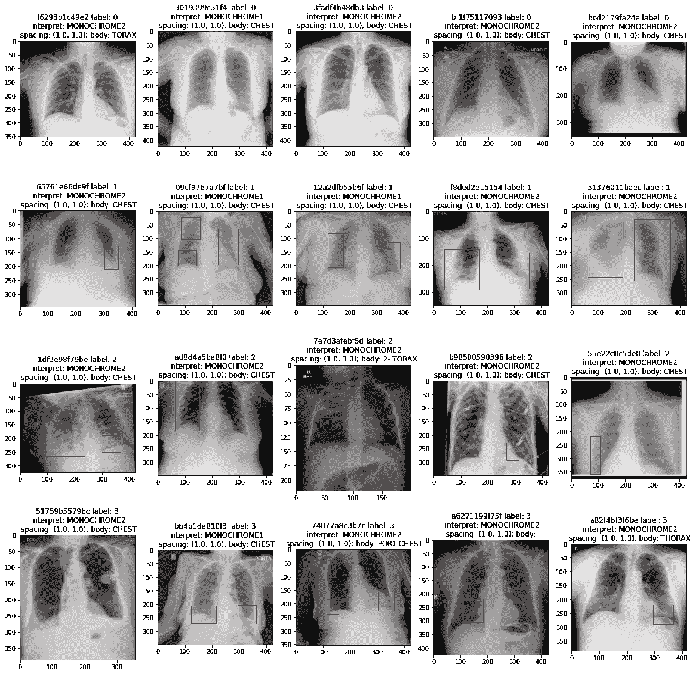

每个类(行)的几个样本的可视化，带有来自注释的着色检测边界框。

正如所料，在负扫描中没有边界框。更有趣的是，大多数阳性扫描每次扫描包含不止一个检测。

## 关于检测和标记之间关系的附加观察

让我们从计算带注释的包围盒的角度来看一下数据集。正如你从每类样本中看到的，有一些阳性病例没有检测到任何新冠肺炎。

下图显示了每个给定类的每个图像中有多少个边界框。最后，这个观察结果可以用在最终的聚合启发式算法中。

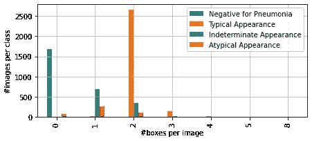

下面的饼图显示了不同研究中注释异常的分布。正如所料，没有包含边界框注释的阴性研究。

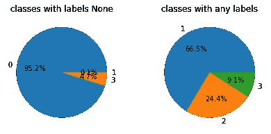

根据每个图像的注释编号或 1+检测来标记直方图。

然而，包含异常的图像中有 5%缺少边界框注释。这意味着，虽然我们可以使用对象检测来估计给定的图像类别，但这些有噪声的图像将使得用这种方法完美地模拟任务变得具有挑战性，这解释了为什么许多人使用混合图像分类/对象检测方法。

## 带效率检测的闪存基线

[Flash](https://github.com/PyTorchLightning/lightning-flash) 是一个人工智能工厂，用于快速原型制作、基线、微调和深度学习，解决商业和科学问题。它建立在强大的 [Pytorch Lightning](https://pytorchlightning.ai/) 库之上，便于大规模训练。

在 Flash 对象检测中，使用两个关键参数**主干**和**头部**初始化模型，这两个参数来自模型架构/组合:

*   **主干** —预训练的分类网络，如 ResNet50、EffieientNet，用于对象检测模型中的特征提取。
*   **Head** —定义对象检测器的架构，如 Faster-RCNN、RetinaNet 等。

 [## 对象检测— Flash 文档

### 对象检测任务识别图像中特定类别的对象的实例。目标探测器是…

闪电闪电. readthedocs.io](https://lightning-flash.readthedocs.io/en/latest/reference/object_detection.html) 

让我们用一个 [EfficientNet](https://ai.googleblog.com/2019/05/efficientnet-improving-accuracy-and.html) 主干来看看 EfficientDet head 的模式，以便更好地理解这些论点。

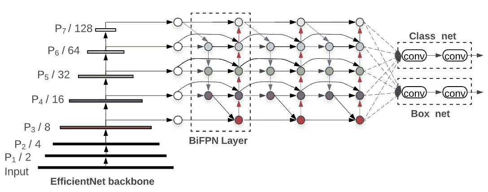

高效 Det 架构。EfficientDet 使用[efficient net](https://ai.googleblog.com/2019/05/efficientnet-improving-accuracy-and.html)；来源: [EfficientDet:实现可扩展的高效对象检测](http://ai.googleblog.com/2020/04/efficientdet-towards-scalable-and.html)。

有了 Flash，我们只需要几行代码就可以在我们的竞争数据集上微调最先进的方法，如 [EfficientDet](https://arxiv.org/abs/1911.09070) 。你需要做的就是将 Kaggle 对象检测标签转换为 COCO 格式，设置模型和训练参数，然后开始训练…

## 1.将数据集转换为 COCO 格式

在实践中使用完美的注释是非常罕见的，而且通常只出现在标准/基准数据集。IceVision 和 Flash 集成目前使用 [COCO 数据集格式。](https://www.immersivelimit.com/tutorials/create-coco-annotations-from-scratch)COCO 格式由一个包含原始图像的文件夹和一个 JSON 注释文件组成，其中包含以下元数据:

1.  数据集中每个图像的相对图像路径和大小
2.  每个图像的边界框及其类别索引的列表
3.  边界框类索引和标签之间的映射

在 COCO 中，边界框包括图像中右上角的坐标以及边界框的宽度和高度。我们需要编写一个自定义脚本来完成从比赛注释到 COCO 格式的转换。这些步骤在提供的[笔记本](https://github.com/Borda/kaggle_COVID-detection/blob/main/notebooks/COVID-detection-with-Lightning-Flash.ipynb)中有描述，代码可以在提供的[资源库](https://github.com/Borda/kaggle_COVID-detection)中找到。

## 2.创建数据模块

在 Flash 中，`from_coco`方法加载在最后一步中创建的 COCO 图像和注释文件。我们可以提供一个`batch_size`来充分利用我们的 GPU，并提供一个`image_size`来为我们的模型调整图像的大小。

[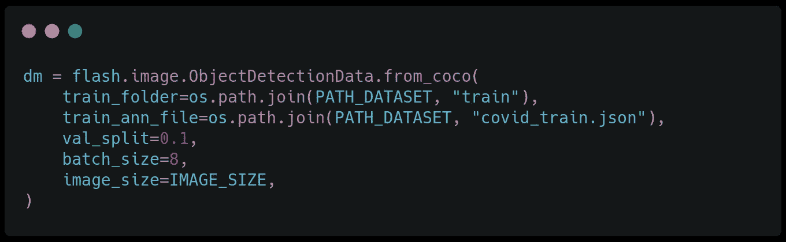](https://github.com/Borda/kaggle_COVID-detection/blob/03727f3ba4fbed889e4668db80fc4ad580e78dcc/kaggle_covid/cli_main.py#L18-25)

来自 Flash 对象检测任务培训脚本的代码片段。

## 3.构建任务

为了构建对象检测任务，我们选择模型骨干。在本例中，我们使用最先进的 EfficientDet 和 EfficientNet D5 主干网。我们通过实验将学习率设置为`1e-5`，我们可以使用 [Optuma](https://optuna.org/) 或 [Grid.ai](https://docs.grid.ai/products/run-run-and-sweep-github-files) 进行超参数搜索来优化该值。

[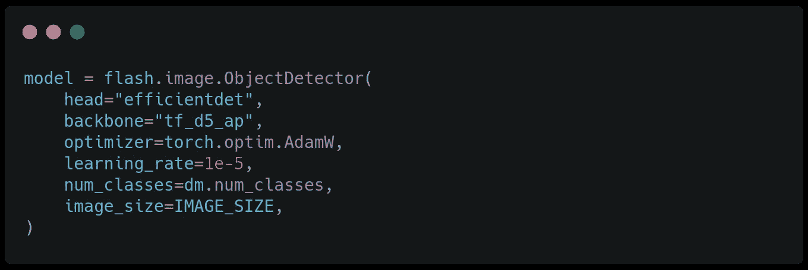](https://github.com/Borda/kaggle_COVID-detection/blob/03727f3ba4fbed889e4668db80fc4ad580e78dcc/kaggle_covid/cli_main.py#L27-L35)

来自培训脚本的代码[片段](https://github.com/Borda/kaggle_COVID-detection/blob/03727f3ba4fbed889e4668db80fc4ad580e78dcc/kaggle_covid/cli_main.py#L27-L35)。

## 4.创建教练并微调模型

闪电侠的`Trainer`继承了闪电的`Trainer`，使我们能够有效地利用所有我们知道和喜爱的教练旗帜。为了进行训练，我们使用方法`finetune`，它采用一个参数`strategy`来配置微调过程。例如，下面的`freeze_unfreeze`策略冻结了前 10 个时期的骨干，以便只更新头部，然后将训练扩展到整个模型。

[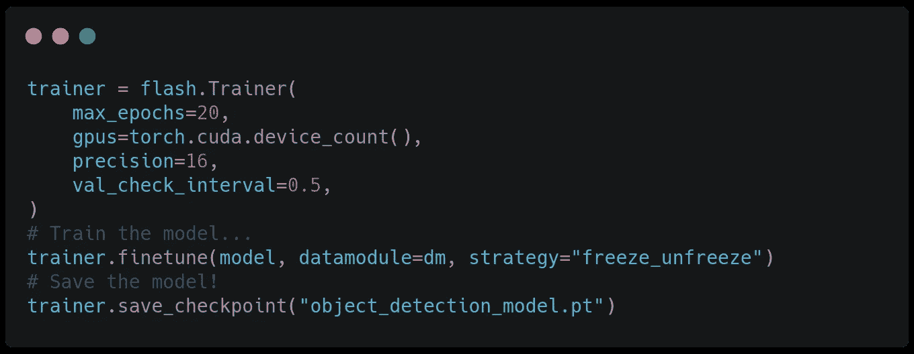](https://github.com/Borda/kaggle_COVID-detection/blob/03727f3ba4fbed889e4668db80fc4ad580e78dcc/kaggle_covid/cli_main.py#L37-L48)

来自培训脚本的代码片段。

使用内置的 Tensorboard logger，我们可以实时观察训练过程，看看训练损失是如何减少的。

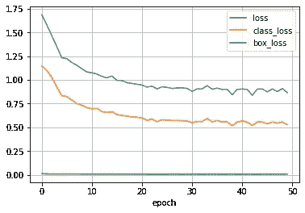

在训练结束时，我们保存微调后的模型，以便我们可以进行推断。

## 5.加载模型并运行预测

现在我们有了一个训练有素的模型。是时候评估我们模特的表现了。以下代码显示了 Flash 如何从文件中加载预训练模型并根据测试数据集进行预测的简单用例:

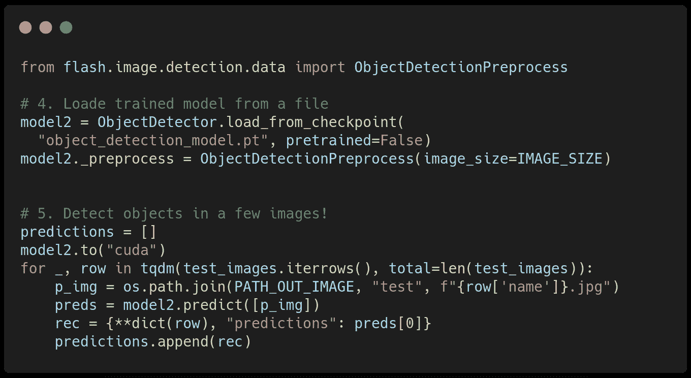

预测脚本的代码片段。

你有它；在本文中，您学习了如何

1.  对对象检测数据集执行探索性数据分析。
2.  使用 Flash 和 IceVision 训练端到端的先进对象检测模型。
3.  评估经过训练的模型，为 [Kaggle: COVID19 检测/分类](https://www.kaggle.com/c/siim-covid19-detection)挑战生成 Kaggle 提交。

敬请关注以下有闪电有闪光的故事！

 [## Flash 0.5 —您的 PyTorch AI 工厂！

### 新的令人兴奋的集成，8 个新任务，Torch ORT 支持，Flash Zero，等等。

devblog.pytorchlightning.ai](https://devblog.pytorchlightning.ai/flash-0-5-your-pytorch-ai-factory-81b172ff0d76) 

***对更酷的 Pytorch 闪电集成感兴趣？
关注我，加入我们牛逼的*** [***懈怠***](https://join.slack.com/t/pytorch-lightning/shared_invite/zt-pw5v393p-qRaDgEk24~EjiZNBpSQFgQ) ***社区！***

# 关于作者

Jirka Borovec 拥有 CTU 大学的计算机视觉博士学位。他已经在几家 IT 创业公司和公司从事机器学习和数据科学工作几年了。他喜欢探索有趣的世界问题，用最先进的技术解决它们，并开发开源项目。