# 使用分析解决性别偏见

> 原文：<https://medium.com/codex/tackling-gender-bias-using-analytics-4ed71d5b4b2?source=collection_archive---------9----------------------->


由 [Dainis Graveris](https://unsplash.com/@dainisgraveris?utm_source=medium&utm_medium=referral) 在 [Unsplash](https://unsplash.com?utm_source=medium&utm_medium=referral) 上拍摄的照片

当你听到“0.77 美分”时，一个越来越有争议的话题——性别薪酬差距——可能会浮现在你的脑海中。今天，我们将探索包含美国劳动力信息的[美国劳工统计局数据集](https://www.bls.gov/opub/)来回答以下问题:

*   哪些行业受影响最大和最小？
*   所有行业的性别工资差距都一样吗？
*   美国人的平均工资会因性别而异吗？

为了回答这些问题，我们将把上面提到的数据集(可在 [Kaggle](https://www.kaggle.com/jonavery/incomes-by-career-and-gender) 上获得)导入到 Arctype SQLite 数据库中，在那里我们将使用查询和仪表盘来操作和解释数据。

# 探索数据集

数据集包含 558 个实例(或行)和 7 个属性(或列)。在进行统计之前，我们需要将数据集加载到 Arctype 中。Arctype 是 PostgreSQL、MySQL 和 SQLite 的一个易于使用的 SQL 客户端。使用 Arctype，您可以创建表并可视化数据集，而无需编码。

要将 CSV 文件作为表格导入，只需在任何工作区中选择“表格”,然后单击位于其他表格控件中的上传按钮:

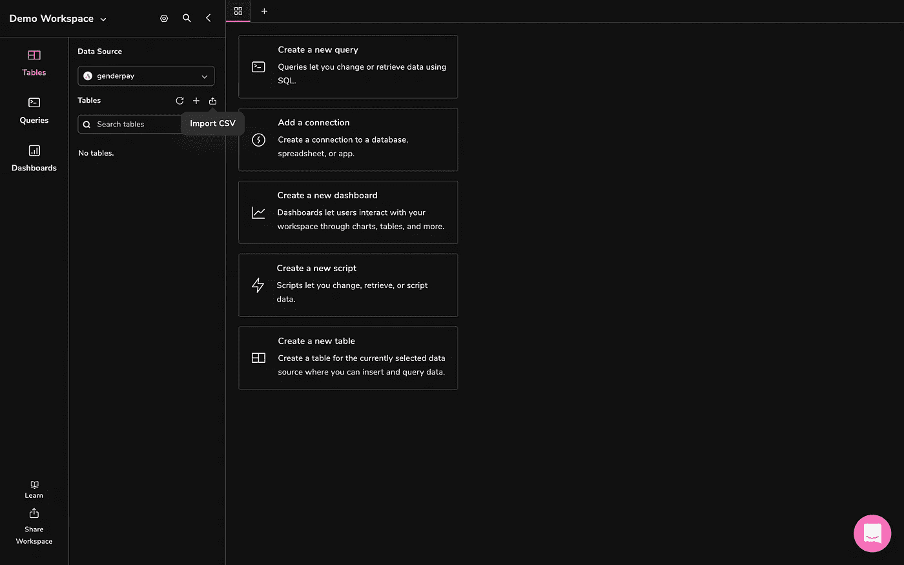

跟随本教程[获取更多信息。](https://docs.arctype.com/qeries/importing-a-csv)

成功导入 CSV 数据后，包含该表的新选项卡将出现在您的工作区中。工资差距数据集看起来像这样:

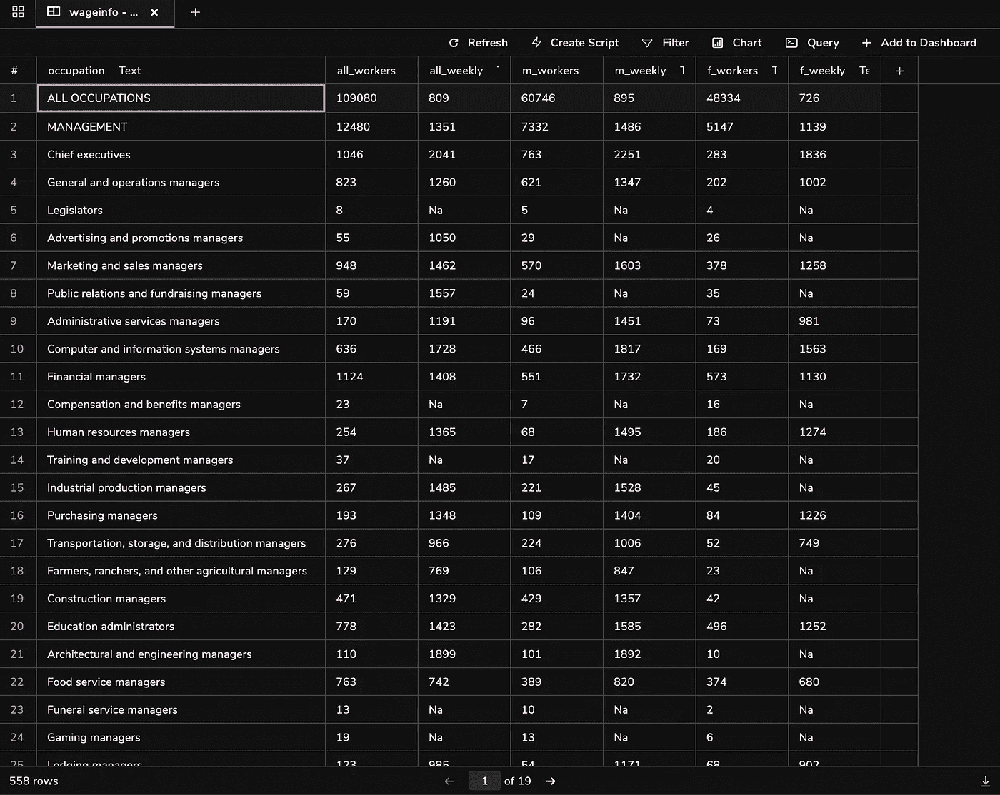

# 从 SQLite 数据集中删除空值

在我们继续进行数据分析之前，为了避免在执行数学运算时出现差异，我们需要检查数据中是否有任何空值，这可以使用以下查询公式的变体来执行:

```
DELETE FROM table_name WHERE condition;
```

让我们插入我们的值来删除`m_weekly`或`f_weekly`为‘Na’的行

```
DELETE FROM wageinfo WHERE 'Na' in (m_weekly, f_weekly)
```

# 向 SQLite 表中添加计算列

我们现在还剩 142 行—让我们在表中添加一些新列，为我们的男女比较计算基本统计数据:

1.  **m _ share——男性工人占工人总数的比例**
2.  **f _ share——女职工占职工总数的比例**
3.  **Non _ weighted _ all _ weekly——两性每周收入的非加权平均值**
4.  **差距——男女工人周收入的差异**
5.  **比率——女性与男性工人周收入的比例**
6.  **工人比率——女性与男性工人的总比率**

在 SQLite 中添加新列相当简单。只需插入表名、所需的列名、数据类型和默认值(如果需要):

```
ALTER TABLE table_name
ADD column_name data_type default_value(optional);
```

我们将用以下值替换上面的查询:

```
ALTER TABLE wageinfo ADD m_share FLOAT NULL;
ALTER TABLE wageinfo ADD f_share FLOAT NULL;
ALTER TABLE wageinfo ADD non_weighted_all_weekly FLOAT NULL;
ALTER TABLE wageinfo ADD gap INT NULL;
ALTER TABLE wageinfo ADD ratio FLOAT NULL;
ALTER TABLE wageinfo ADD ratio_of_workers FLOAT NULL;
```

**注意，在 SQLite 中，我们一次只能添加一列。因此，需要重复添加剩余的列。**

我们最初为所有新列分配了默认值 NULL。现在，让我们根据公式填充这些列:

```
UPDATE wageinfo 
    SET m_share = CAST(m_workers AS FLOAT)/all_workers;
UPDATE wageinfo 
    SET f_share = CAST(f_workers AS FLOAT)/all_workers;
UPDATE wageinfo 
    SET non_weighted_all_weekly = CAST(m_weekly AS FLOAT)+f_weekly/2;
UPDATE wageinfo 
    SET gap = m_weekly - f_weekly;
UPDATE wageinfo 
    SET ratio = CAST(f_weekly AS FLOAT)/m_weekly;
UPDATE wageinfo 
    SET ratio_of_workers = CAST(f_workers AS FLOAT)/m_workers;
```

CAST as FLOAT 命令很重要，因为除法运算会产生小于 1 的值。因为这些列的默认类型是整数或数字，所以新列的最终取整值为 0。

# 使用 Arctype 图表可视化统计数据

现在，是时候使用可视化来解释我们的数据集了！我们先来看看基于性别的收入最平等和不平等的职业。

# 用水平条形图比较最平等和不平等字段

`ratio`越接近 1 的字段可以被视为越相等的字段，而`ratio`越接近 0 的值则表示差异很大。使用下面的 SQL 查询，我们可以按降序对数据进行排序，以获得女性与男性收入比例最高的前 10 个职业:

```
SELECT
    LOWER(wageinfo.occupation) AS occupation, 
    wageinfo.ratio 
FROM 
    wageinfo
ORDER BY 
    wageinfo.ratio DESC 
LIMIT 
    10;
```

输出应该如下所示:

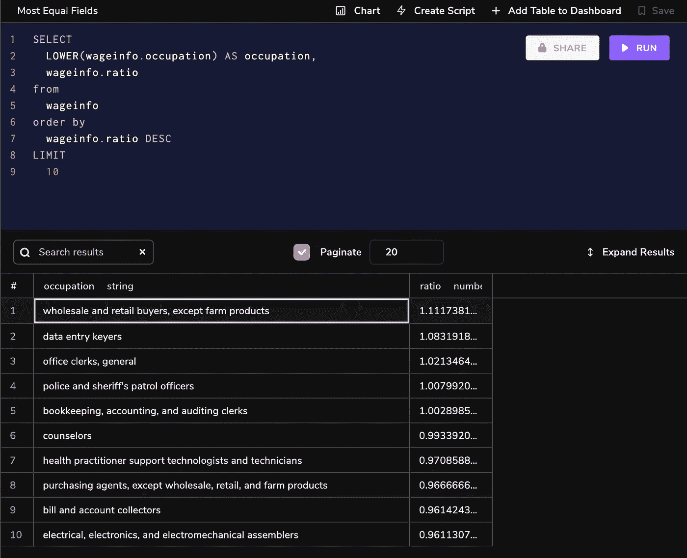

类似地，要获得最不平衡的字段，我们可以简单地颠倒排序顺序，获得前 10 个结果。

```
SELECT
    LOWER(wageinfo.occupation) AS occupation, 
     wageinfo.ratio 
FROM 
    wageinfo
ORDER BY 
    wageinfo.ratio ASC 
LIMIT 
    10;
```

为了并排比较这些比率，让我们创建两个显示这些比率的水平条形图。运行查询后，从查询窗口顶部的选项中选择“图表”。应用程序右侧会出现一个图表类型列表:

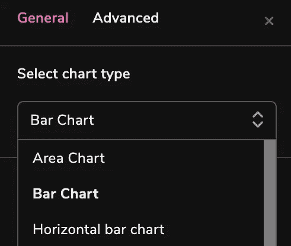

选择“水平条形图”选项，并填写 X 轴和 Y 轴的标签。生成的图表应该如下所示:

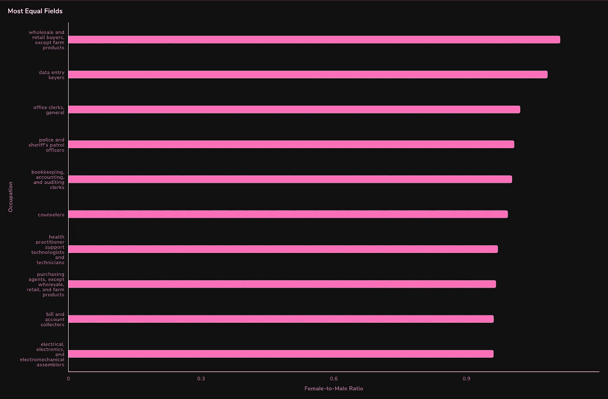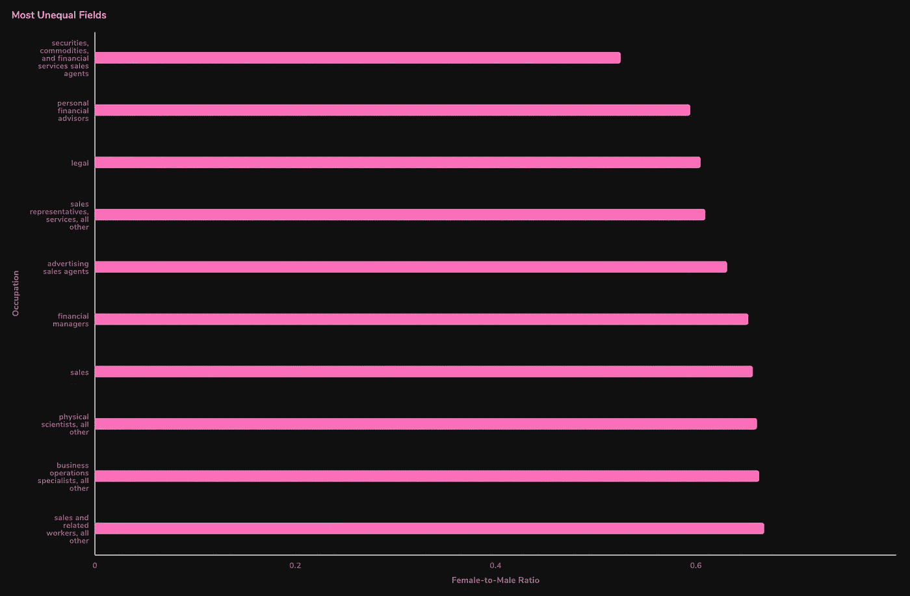

# 更多水平条形图:可视化不同职业中的女性代表

为了检索女性比例最大的字段，我们将按 f_share 降序对数据进行排序。对于女性比例最小的字段，颠倒排序顺序并提取前 10 名:

```
SELECT
  LOWER(wageinfo.occupation) AS occupation,
  wageinfo.f_share * 100 AS f_share
FROM
  wageinfo
ORDER BY
  wageinfo.f_share DESC (or ASC for smallest share)
LIMIT
  10;
```

**注意:我们将** `**f_share**` **乘以 100，以便以百分比而不是小数的形式输出值。**

对于这个查询，我们也将使用一个水平条形图。按照相同的步骤，最终的图表应该是这样的:

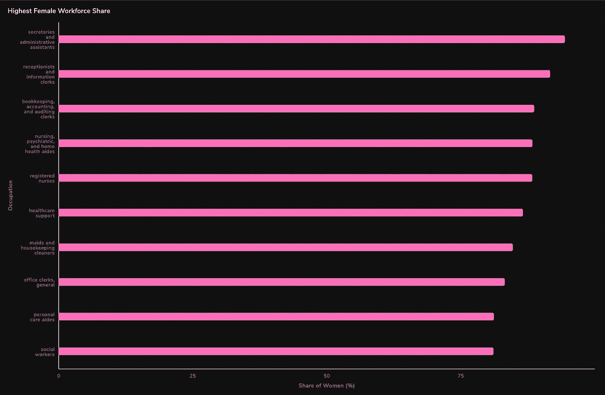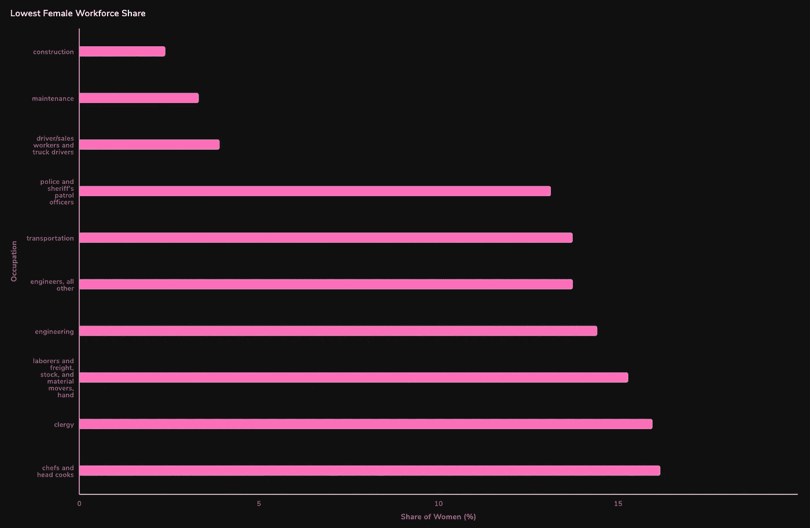

妇女所占份额最小的领域不一定是收入最高的领域。因此，以性别作为驱动力来看待这个问题——至少从这个角度来看——可能是模棱两可的，而且可能会产生误导。

然而，我们可以对男女在薪酬最高和最低领域的比例进行比较。

# 使用堆积水平条形图可视化高收入职业中的性别细分

我们现在将在单个查询中提取`m_share`和`f_share`，并使用如下查询对每个职业进行比较:

```
SELECT
  LOWER(wageinfo.occupation),
  wageinfo.non_weighted_all_weekly,
  wageinfo.f_share * 100 AS '% Female',
  wageinfo.m_share * 100 AS '% Male'
from
  wageinfo
order by
  wageinfo.non_weighted_all_weekly DESC (ASC for lowest incomes)
LIMIT
  10;
```

选择 X 轴为`f_share`和`m_share`，Y 轴为职业的堆叠水平条形图选项。生成的图表如下:

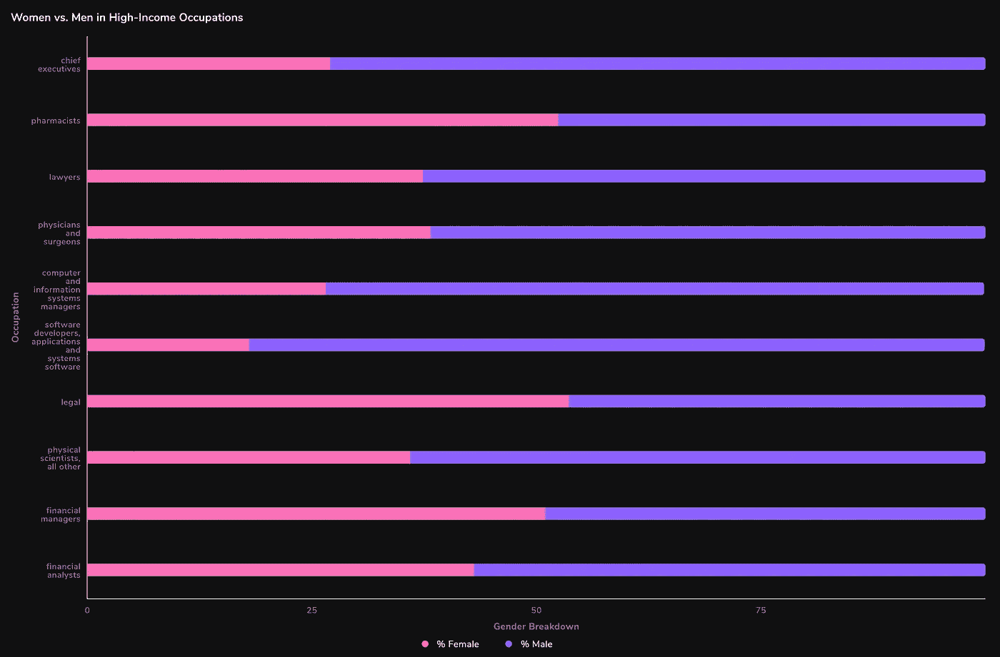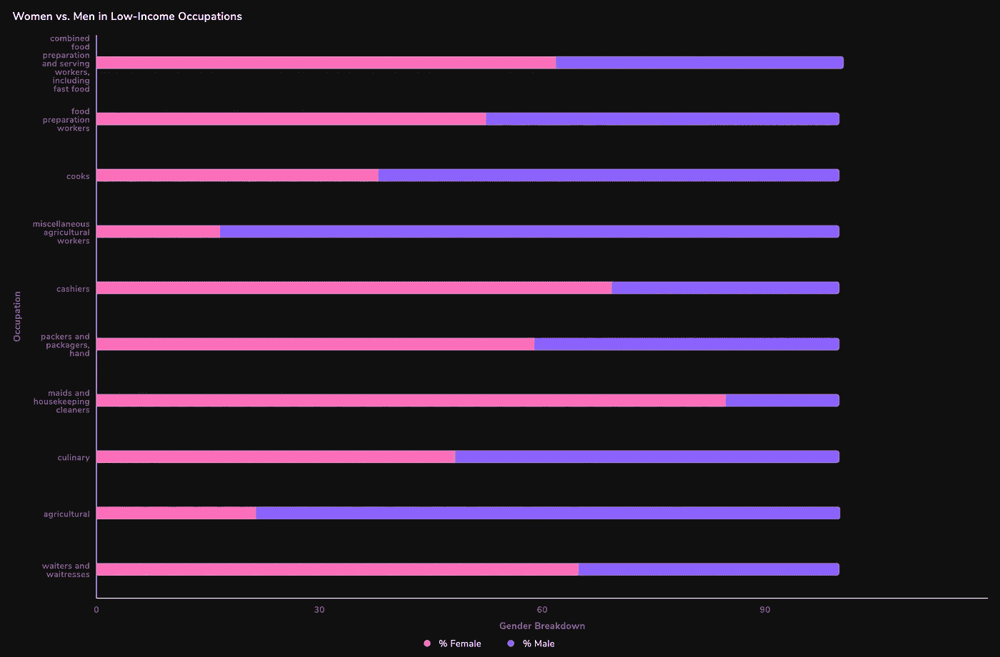

我们可以看到，薪酬最高的领域主要由男性主导。这种反差在首席执行官、工程师等职业中尤为明显。虽然收入最低的领域情况较好，妇女往往在劳动力中占较大比例，但我们仍然可以注意到农业等领域主要由男性驱动。然而，更重要的是，随着收入的减少，女性代表(总的来说)越来越多，这表明工资差距实际上是存在的。

# 使用多变量条形图比较男女平均收入

我们还可以将在同一领域工作的男性和女性的平均工资与总体平均周收入进行比较。这将使我们对工资实际上是否因性别而异有所了解。

首先，让我们提取按平均周收入降序排列的薪酬最高的领域:

```
SELECT
  LOWER(wageinfo.occupation),
  wageinfo.m_weekly AS 'Male',
  wageinfo.f_weekly AS 'Female',
  wageinfo.all_weekly AS 'Overall'
FROM
  wageinfo
ORDER BY
  wageinfo.all_weekly DESC
LIMIT
  10;
```

从图表菜单中选择条形图。将职业设置为 X 标签，同时在 Y 轴上绘制女性、男性和整体。我们应该得到以下输出:

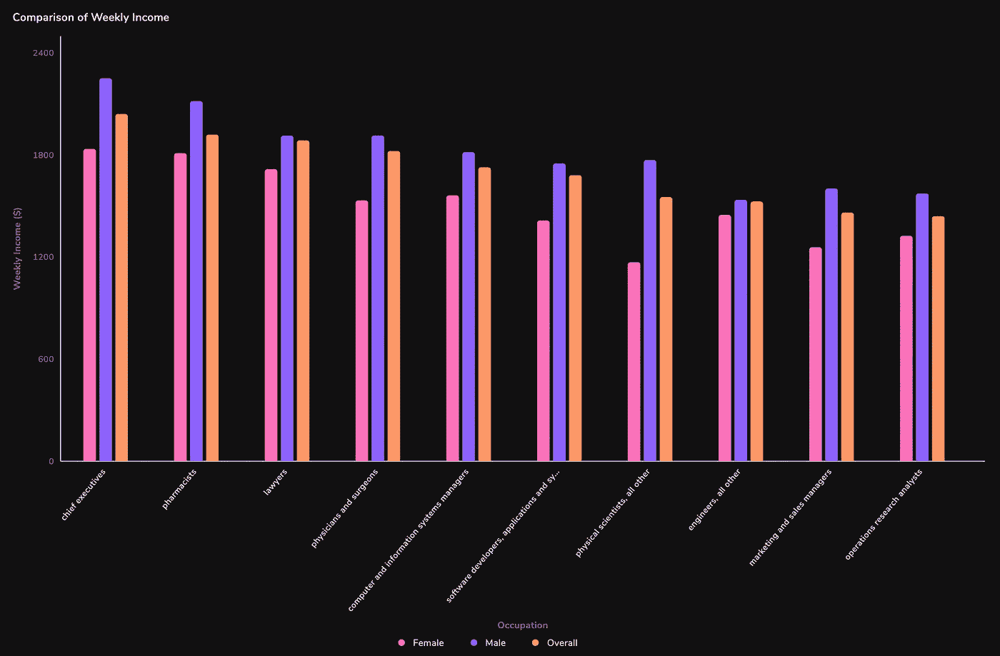

# 结论

在这篇文章中，我们通过比较有意义的统计数据，如周收入、份额等，探讨了美国的工资差距。使用 SQL 和 Arctype 进行分析，我们已经确定了受影响最大和最小的字段(参见**“最平等与不平等字段”**)。相应的柱状图表明，像批发和医疗保健这样的职业，女性和男性的比例相当。另一方面，法律和金融等领域的情况则严重得多。

然而，我们的分析也表明，性别严重失衡的职业——女性和男性都占主导地位——不一定与收入最高和最低的工作相关(见**“不同职业中的女性比例”**)。

因此，我们转而研究了按职业划分的性别，这有助于我们深入了解所有行业的工资差距是否相等。这里的堆积条形图(见**“高收入和低收入职业的性别分类”**)清楚地显示了男性主导的氛围，尤其是在高薪领域。另一方面，工资较低的领域，如收银员和家政，主要由女性主导。虽然不同行业的工资差距不同，但大多数行业仍然明显偏向男性。

为了回答最后一个问题——关于收入如何随性别而变化——我们提取了每个职业的总体平均周收入，然后将其与男性和女性的周收入进行比较(参见**‘比较平均收入’**)。我们不禁注意到，女性收入在大多数——如果不是所有——类别中都低于平均收入。不可避免的是，男性收入远远超过了这个门槛。

这里的数据很清楚:在一个女性占总人口 49%的世界里，我们仍然需要努力提高包容性和我们对性别的认知——尤其是在劳动力市场。