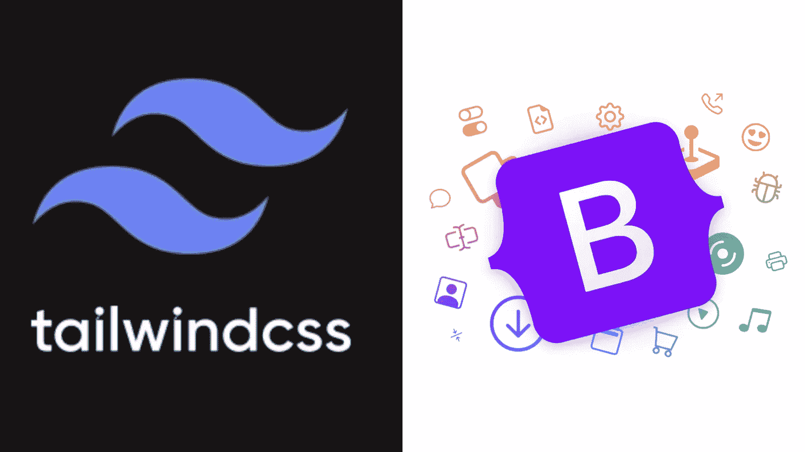

# 顺风和自举很烂？然后构建自己的框架

> 原文：<https://medium.com/codex/tailwind-and-bootstrap-sucks-then-build-your-own-framework-441d24240fa?source=collection_archive---------6----------------------->

## 网络流氓面临的挑战。

顺风和引导 CSS 框架。

在我们开始之前，这里有一个免责声明:

*我从未用过顺风。自举？也许有一两次，那是很久以前的事了，我记不太清了。我是其中任何一个的拥护者吗？不。我讨厌他们吗？不。老实说，我一点也不关心他们。🤷‍♀️我还有其他的* …