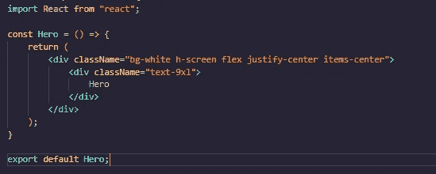
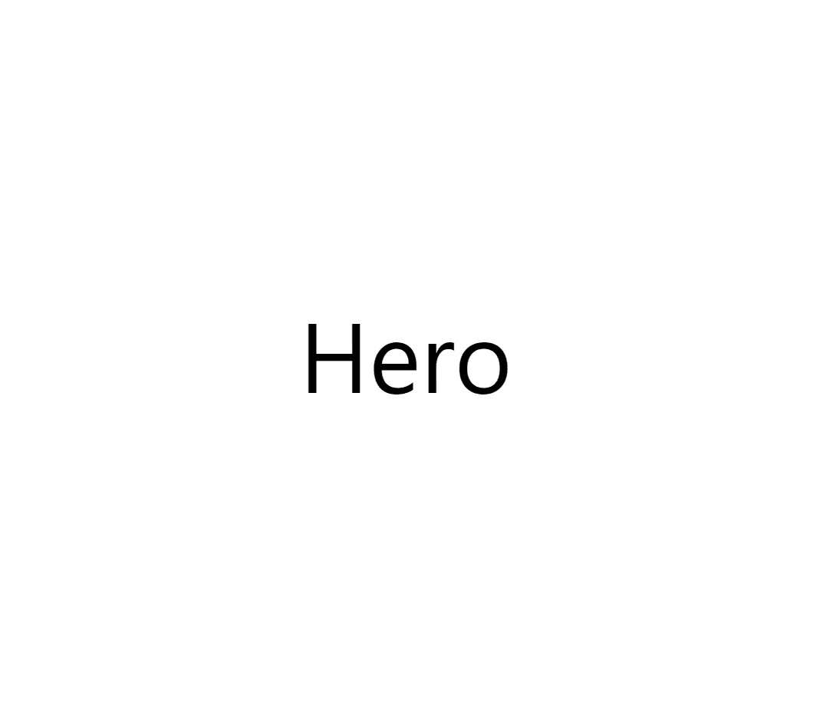
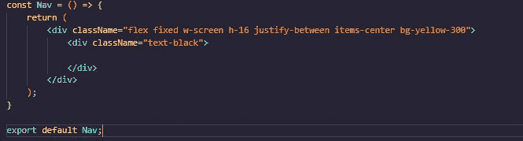
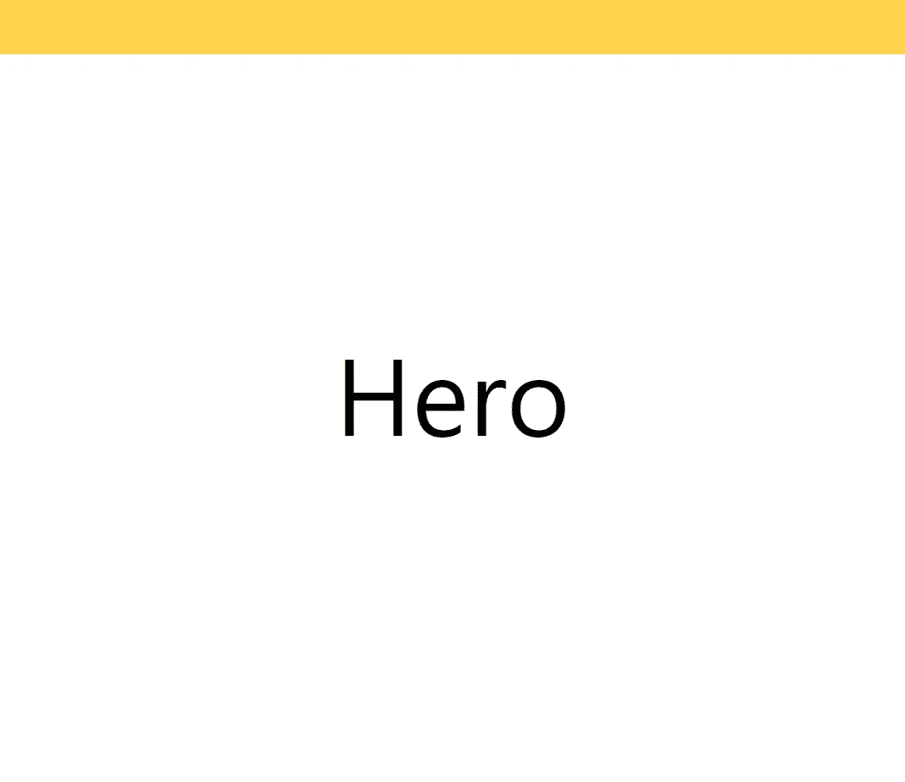
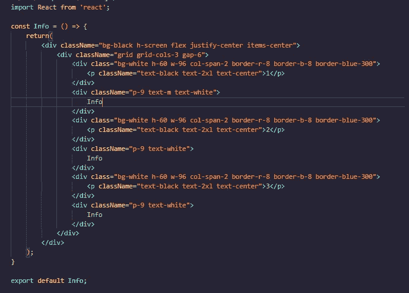
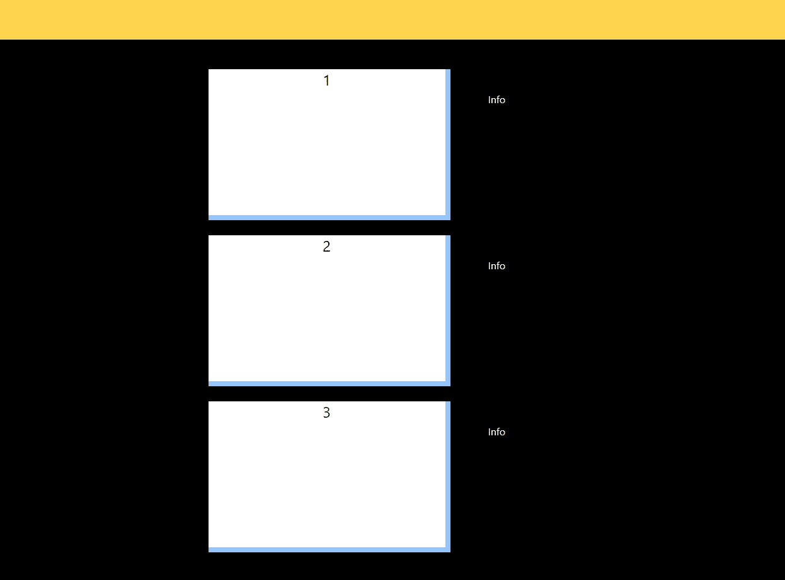
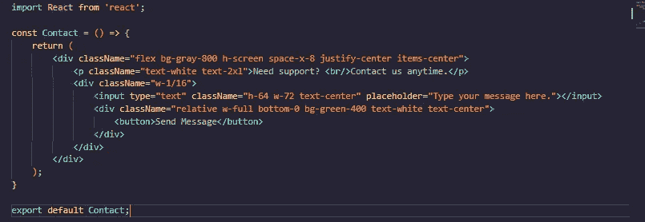
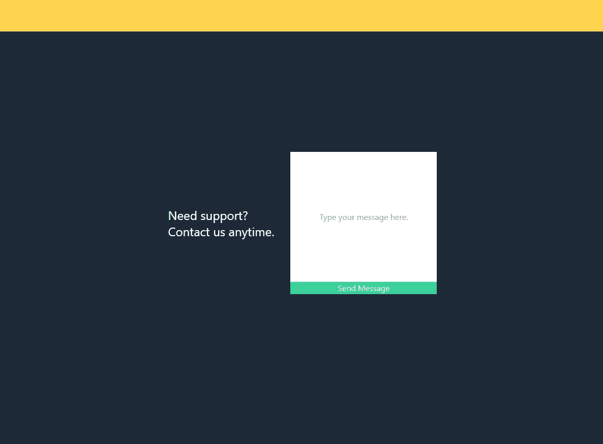
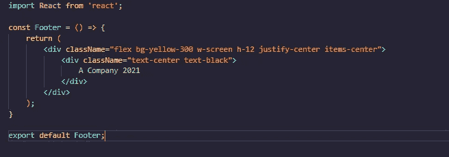
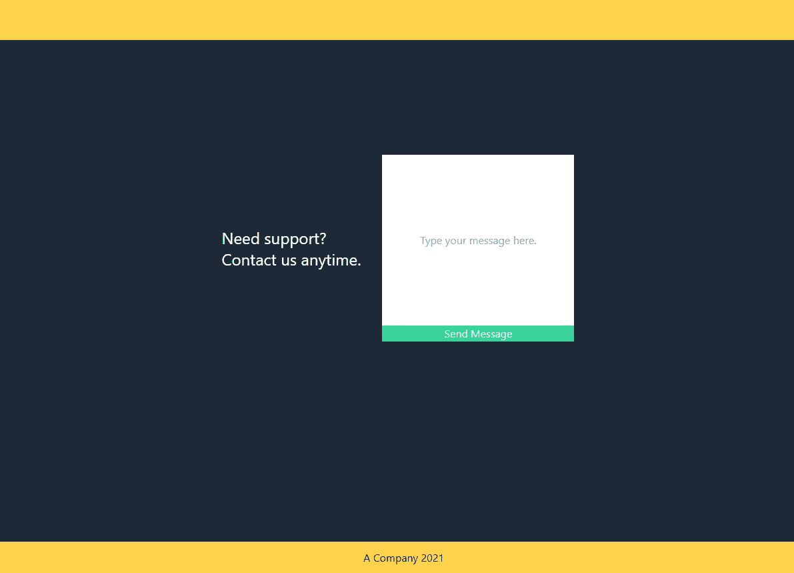

# 使用 React.js 的 TailwindCSS(第 2 部分)

> 原文：<https://medium.com/codex/tailwindcss-with-react-js-pt-2-f7135de03ecf?source=collection_archive---------9----------------------->

詹姆斯·哈里逊在 [Unsplash](https://unsplash.com?utm_source=medium&utm_medium=referral) 上拍摄的照片

如果你还没有读过《T4》第一部分的话，就好好读一读吧！这是 React.js 框架中使用的 TailwindCSS 的第 2 部分。现在我们已经安装了 TailwindCSS，让我们开始制作组件。你可以给你的 create-react-app 起任何名字，我个人就把我的命名为 TailwindCSS。

从 App.js 文件中删除样板代码，我们稍后会用到它。来做个英雄成分吧！

# 海罗（人名）；英雄（电影名）

英雄部分是你的用户在你的网站上看到的第一件东西，以此来建立第一印象。你可能已经注意到，其他网站会显示带有标语或动画图形的徽标。让我们为这个项目制造顺风吧！

让我们创建一个 components 文件夹，其中将包含我们的 Hero.js 文件。

这里我们将背景颜色设置为白色，高度覆盖整个屏幕。我们还使我们的文本在页面上居中。将它导出并放到 App.js 文件中，这样我们就可以看到结果了。

英雄区。

现在它真的很简单，所以让我们做一个导航栏吧！在组件中，我们将创建一个 Nav.js，以便我们可以将其导出到 App.js。

# 导航栏

所以现在我们把它变成了一个柔性盒子，它的宽度可以包围屏幕。我们还将导航条的高度设置为 16 像素，所有的项目都居中。这是它现在的样子:

让我们添加我们的基本 TailwindCSS 样式应用程序的其他部分，以便它们可以是栏上的项目。

# 信息

接下来我们将制作一个信息部分。信息部分是关于公司和他们提供的产品或服务。您可能会看到它旁边的图形、图像幻灯片或网格。在添加之前，让我们先创建一个基本结构。

我们为信息使用了相同的

样式，并在边上添加了网格布局和文本。我们将背景设置为黑色，并将所有项目居中。我们现在有三个网格，间距由 gap-6 设置。在我们实际的网格中，我们将高度和宽度设置为 60 像素，并设置了一个边界来创建三维阴影。

我们的导航栏是固定在屏幕上的！信息部分也占据了整个屏幕。一旦我们的导航项目被添加，我们可以随时在网站的不同部分之间切换。

接下来，我们将添加一个联系页面。

# 接触

联系页面通常是向公司发送查询的最后一部分。我们将创建一个基本的输入类型框，并添加一些基本的样式。

让我们设置屏幕的高度。除了居中之外，这一次我们将 x 轴上的项目间隔 8 个像素，因为边上有一个文本描述。我们还将设置输入框和发送按钮的高度和宽度。按钮已经放置在输入框的底部，带有“相对 w-全底-0”。

这样，它看起来就像这样！

最后，让我们创建页脚！

# 页脚

页脚很简单，将被放置在页面的最底部。我们只需给它添加一些样式和文本，瞧。

不算太差！

对于第 3 部分，我们将向我们的 TailwindCSS 风格的站点添加更多内容。从标志，背景，模拟产品的描述，动画/效果，以及更多的造型。