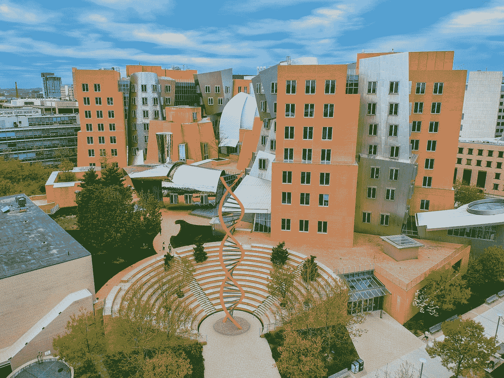

# 在线免费学习麻省理工学院的计算机科学学士课程

> 原文：<https://medium.com/codex/take-mits-bachelor-s-of-computer-science-courses-free-online-d749a1e80045?source=collection_archive---------0----------------------->

## [法典](http://medium.com/codex)

## 提供免费学士学位课程的链接。

由[蒂莫西·卡西斯](https://unsplash.com/@tkassis?utm_source=medium&utm_medium=referral)在 [Unsplash](https://unsplash.com?utm_source=medium&utm_medium=referral) 上拍摄

麻省理工学院有丰富的在线课程，包括计算机科学学士学位所需的几乎所有课程。

这些课程包括计算结构、算法导论等