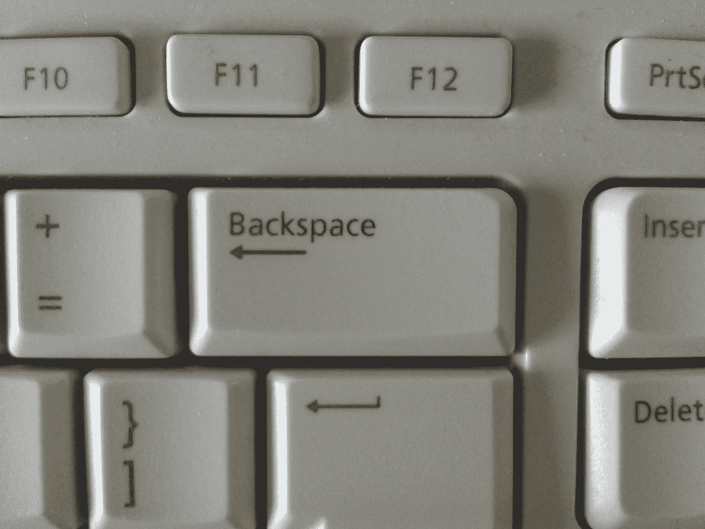
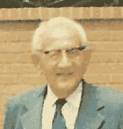
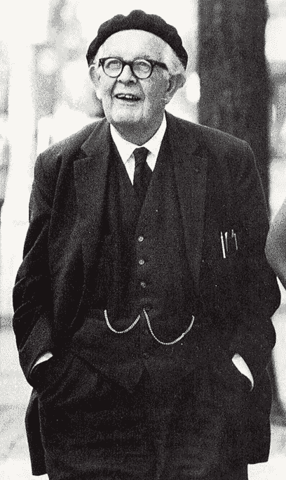

# 花时间少写代码

> 原文：<https://medium.com/codex/take-the-time-to-write-less-code-1bf0ab385a38?source=collection_archive---------0----------------------->

IMAG0021 退格键| [汤姆·安德森](https://www.flickr.com/photos/twic/6964040155)

所有的程序员都知道简单的系统是关键——或者至少我们声称我们知道，我们试图让这一点通过我们开明的程序员的头脑流到我们的指尖，进入我们的 C+plus 和 sharps。两周后，我们提交了一个 pull 请求，在我们的斗篷上为我们即将获得的所有荣誉准备了空间，穿上我们的月桂树休息服，却发现评论者似乎跟不上我们的思路。

显然有一个错误…

也许我们不小心把公关发给了会计部的某个可怜虫。这种事情曾经发生在一个人身上——我在书上读到过。糟糕，没有。公关都准备好了。是时候纠正评论者了。“你只是没有正确思考。”我们开始感到有点沮丧。我们是一管牙膏，它明亮的薄荷色丝带渗进了水槽。原来这个人终究不傻！事实上，他们很困惑，因为事实证明我们写了一个不那么简单的系统。这是——喘气— *很难理解。*

# 事实证明，简单的事情很难。

[《染色洋葱》|地图循环](https://www.flickr.com/photos/135328452@N08/21469652702/in/photolist-yHczKU-oLWKdy-bwQkR8-8ikJGY-7xRE6a-5P7Tp2-nnfWs6-oLWGZz-6U5BtF-5ygU3K-4PsQMP-5fgUm5-mqqdnr-726NSK-4rU2GJ-meRgHx-dH44D4-5Qoos3-646eKc-nnzy43-2vveNW-npiPs8-5iq1tD-6iwtAL-8Arg1M-6PnVhf-cc1SbW-oukBej-rLDRLM-6uFfTC-aSZqZD-h1fABc-c9LoJw-d1ZwiQ-4r9ttf-6hXAvM-c9LoRo-fHyrWA-LjnX1f-8AujyE-chyVE7-8qWKZM-bwKHFm-cSwHMU-ppHkjA-5rvP7o-9ry6Ei-7iwycm-8drLkq-5wLKAX)

不要误解我的意思，我可以整天想出表面上看起来很简单的界面，只是它们没有解决任何现有的问题，或者内部一团糟。这还算简单吗？嗯，恐怕不行，我的朋友。当你打开真正简单的东西的门时，你不会发现满满一盘意大利面在等着你。取而代之的是一张桌子，上面摆着一个干净的白色盘子，中间放着一个正北方向的饺子:没有红酱，没有阿尔弗雷多，但有 daggum，有嚼劲。

在一个真正简单的系统中，当你开始深入每一层时，你只会发现越来越简单的部分。食物隐喻在这里是最重要的，也许这是因为我刚刚切了一个洋葱，但是想象一下一个刀片嘎吱嘎吱地穿过你的系统的连续层。这里没有惊喜，每一层都在另一层里面，每一层都有相同的颜色和稠度，每一层都越来越小，直到你到达另一面，没有洋葱可以切了。

这些是简单的系统。

一些系统具有非常简单的表面积:它们看起来像一个普通的洋葱，但你发现当你的刀开始滑过这些层时，你的刀片划破了一些坚硬的东西，然后瞬间世界变黑了:有人在这个洋葱上缝了一颗手榴弹。其他洋葱有一个非常奇怪的特性，随着你的洋葱越来越深，你会发现每个洋葱环都变得越来越大。这怎么可能呢？洋葱怎么里面比外面大？这些系统被称为**单工**系统。它们隐藏了它们的复杂性，虽然它们仍然适合放在保鲜盒里很好，但你应该如何制作一个半路出家的*灭蚁灵*？

# 努力使系统更简单。

[《长发公主》|乔安娜·科卡雷利](https://www.flickr.com/photos/narghee-la/14563436273)

[帕斯卡的格言](https://quoteinvestigator.com/2012/04/28/shorter-letter/)在这里特别适用。

> “我把它做得比平时长，因为我没有时间把它改短。”

这是在帕斯卡为一位朋友写的 19 封信中发现的。天啊，深呼吸，布莱斯，把它削掉。

别担心，我不是计算机科学家(至少不是一个很好的科学家)——我实际上是写代码的。我和你站在象牙塔的底部，用我的拳头敲打着石头:“[肯·汤普森](https://computerhistory.org/profile/ken-thompson/)，肯·汤普森，放下你脖子上的胡子！”我不会像一个年轻无能的弗雷德·布鲁克斯那样思考这些事情并传授智慧。我知道有时间压力。开会有业务人员要你做见不得人的行为。我知道你的孩子这周生病了，你已经 43 小时没睡了。然而，我也知道大多数时候我们没有决定事情应该是简单的，这意味着事情变得复杂。

科罗纳多酒店| [维基媒体](https://upload.wikimedia.org/wikipedia/commons/4/42/Coronado_del_Hotel_from_the_beach.jpg)

大学毕业后第一份工作大约一年后，我发现了一种叫做可支配收入的东西。我已经不知道那是什么感觉了，但在当时，这是一个顿悟，因为这意味着，在[我亲爱的妹妹](https://mrsemily.com/)的建议下，我可以买一些东西，比如一包意大利辣香肠，然后吃掉它们。意大利香肠之后，我买了我的第一次也是最后一次飞行课。我们在圣地亚哥湾上空的一架双座飞机上，教练让我抓住驾驶杆驾驶飞机(我们飞行员把看起来像驾驶杆的东西叫做“驾驶杆”)。在我们下面，我看着雄伟的[德尔科罗纳多酒店](https://en.wikipedia.org/wiki/Hotel_del_Coronado)呼啸而过，但我没有机会数塔，因为我太分心了:我正在努力与该死的棍子战斗。仅仅过了几分钟，我的胳膊就累了，我记得我说了一些类似这样的话，“伙计，这架飞机就是不能直线飞行。”沉默了一会儿，教官通过耳机回电道:“是的，这就是为什么你必须驾驶飞机的原因。”

这是编程简单的系统。相信我，我是驾驶飞机的专家:我相信这就是所谓的飞行员。自然的趋势不仅仅是一点混乱和一些糟糕的命名惯例——自然的趋势是从令人毛骨悚然的天空中掉下来，带走美国第二大木结构建筑。

# 简单需要的不仅仅是直觉。

[《乌龟》|克里斯蒂娜·瓦格纳](https://www.flickr.com/photos/narghee-la/14563436273)

在诺贝尔经济学奖得主丹尼尔·卡内曼的书《思考，快与慢》的前几章中，卡尼曼解释了我们的直觉是多么有用(他称之为“系统 1”)。直觉总是在引擎盖下工作:一个你无法超前思考的快速系统，一个你无法关闭的基本系统。

当我们用直觉编程时，我们就是诗人(我不是指丁尼生水平，我指的是那种甚至不押韵的后浪漫主义的东西)。我们是随风飘散的树叶。我们感到自由和富有表现力。

> [“那得看情况了](https://www.poets.org/poetsorg/poem/red-wheelbarrow)
> 
> [基于](https://www.poets.org/poetsorg/poem/red-wheelbarrow)
> 
> [一个失踪的人](https://www.poets.org/poetsorg/poem/red-wheelbarrow)
> 
> [分号](https://www.poets.org/poetsorg/poem/red-wheelbarrow)

然后卡尼曼用接下来的几十章解释了直觉被证明是错误的许多具体方式*。当面对需要深入思考的信息时，我们的直觉会把我们引入歧途。我们受制于它的启发法的许多怪癖。我们的贝叶斯思维受到贝叶斯不一致的困扰。他们还对他们开展业务的当地环境产生了不适当的依恋。*

*当有经验的放射科医生被要求评价胸部 x 光片时，*在多次展示同一张照片时，有 20%的时间*会自相矛盾。不要低估咖啡和开放窗口在你的“专家代码评审意见”中的作用。*

*我的史诗就这么多: [*括号丢了*](https://en.wikipedia.org/wiki/Paradise_Lost) 。*

*幸运的是，我们的大脑配备了一个逻辑的、有意识的计算系统(被形象地命名为“系统 2”)，可以分析和纠正我们直觉的错误判断。写诗很有趣，但诗歌植根于我们当前的语境，更不用说糟糕透顶的商业逻辑了。当然，缺点是使用系统 2…很难。根据卡尼曼的说法，研究人员可以判断一个人是否进行了积极的思考，因为我们的瞳孔会放大。我们的心率加快。我们的细胞做额外的事情，就像细胞做的一样(也许是有丝分裂？).而且——系统 2 不仅需要额外的力量才能运行，而且比系统 1 慢几个数量级。*

*让事情变得更简单需要额外的努力，而你将为此付出代价。*速度会遭受*。编写简单的代码是非常不自然和不直观的。不要认为这对你来说很容易，从经验上来看，你是错的。*

*再说技术。*

# *简化事情的技巧:Polya 方法。*

**

*这真的是这家伙最好的照片吗？| [维基百科](https://en.wikipedia.org/wiki/George_P%C3%B3lya#/media/File:George_P%C3%B3lya_ca_1973.jpg)*

*一位名叫乔治·波利亚的数学家(火星人)将他相当大的脑力花在思考如何教学上。波利亚认为，应该教人们解决一般问题的技能，而不是教人们具体的数学方法。他写了很多关于如何解决问题的大部头书——当然，最大的问题是没有人真的再去读大部头书了。*

*以下是波利亚喜欢问自己的一些问题。你会认为你已经做了所有你能做的思考，但我不相信你。*

## *这个问题可以分成更简单的问题吗？*

*问题分解是每个人都认为自己拥有的一项有价值的技能，但我发现很少有人真正做到了(看看你，我)。我喜欢这个问题是因为它暗示了一个强大的算法:二分搜索法。先说最终结果。现在把它分解成零——你肯定什么也不懂，对吗？这基本上就是一个真正的*单元*测试应该是什么样的:什么都没有。我们一点一点地回过头来，填充中间的细节。*

*当我写一个新系统时，我喜欢先写出一些详细的用法。我不想只写几行或几个单元测试，我想在我写之前就原型化一个完整的用例来发现结果应该是什么。这有助于保留一些诗意而不牺牲一致性。然后我通过编写我的第一个测试用例回到零。*

*您的测试用例本身可以使用同样的技术。Gary Bernhardt 有很多很棒的测试视频，但是他在[的这个免费视频](https://www.youtube.com/watch?v=RAxiiRPHS9k)中忽略了逆向编写测试用例的想法:从完成的测试开始。在做任何事情之前，先写你的断言，然后备份并弄清楚如何到达那个断言。如果你发现自己写了好几天的脚手架，也许你的系统不是那么简单。*

## *我能把这个和我已经理解的东西联系起来吗？*

*你应该读一本令人大开眼界的书，名为 [Mindstorms](https://www.amazon.com/Mindstorms-Children-Computers-Powerful-Ideas/dp/0465046746/ref=sr_1_2?ie=UTF8&qid=1549336097&sr=8-2&keywords=mindstorms+book) ，它通过 syntonics 解决了这个问题:与个人事物的关系。这本书的重点是教孩子，但我发现它对教像我这样的老克里特人很有启发。这里的想法是把问题变成与你有很深个人关系的东西。在儿童的情况下，他们使用 *body syntonics* 将编程环境(徽标)映射到儿童的身体上:儿童可以理解的东西。这也发挥了我们的直觉优势。我们的直觉是围绕如何使用我们的身体而形成的。*

*在 LOGO 的例子中，他们的 API 是基于向一只在画布上移动的乌龟发出指令。*走二十个单位。转三十度。把你的笔放在纸上。走 10 个单位。这个孩子可以随便走动来思考这个问题。他们可以“成为海龟”来发展:移动和转动他们的身体，采取物理步骤来逐步完成程序。这使得跟踪代码比阅读测试简单 100 倍。像这样调试代码要简单 1000 倍。**

*如果你的下一个系统是这样设计的会怎么样？不是用海龟(虽然*如果…* )而是把问题映射到你已经理解的东西上，并在那里解决它。把问题变成你能用手或卡片解决的东西。我最喜欢的数学教授会坚持认为，如果我们可以通过画一幅画来框定一个抽象的问题，那么我们就会更成功地完全理解并最终解决它。暂且不谈 UML 和流程图，它们只是稍微有点关系— *我能画出这段代码吗？**

# *简化事物的技巧:皮亚杰风格。*

**

*本文|让·皮亚杰瞥见[维基百科](https://en.wikipedia.org/wiki/Jean_Piaget#/media/File:Jean_Piaget_in_Ann_Arbor.png)*

*头脑风暴在让你兴奋的同时，也会让你了解让·皮亚杰的教学哲学。在游戏行业，我发现绝大部分的游戏制作过程实际上都是投资在制作游戏的工具上。当与艺术家和设计师合作时，这些工具必须是高度迭代的。*

*想象自己是下一个**使命召唤:甚至更多现代战争 III:重装上阵**中的艺术家。当然，你对专营权感到厌烦，但它在简历上看起来很棒。你正在[收紧第 3 关](https://knowyourmeme.com/memes/tighten-up-the-graphics-on-level-3)的画面，但是需要 10 分钟来部署你的改变并进入游戏来玩它们。在游戏行业显而易见的事情在软件开发中并不明显:3 级将会很糟糕。*

*迭代循环越紧，您自然会*进行越多的迭代。这就是皮亚杰的用武之地。皮亚杰相信没有课程的教学。你怎样教学生最好？通过让他们*实验*并自己得出答案。找到自己答案的学生倾向于将答案内化，他们能更好地理解材料。这是迭代循环的核心。当你能快速迭代时，你会迭代得更频繁。代码将更具流动性。你将进行实验。实验带来解决方案和理解。**当目标是构建一个简单健壮的系统时，提前考虑每一个突发事件并不是关键:迭代才是**。**

**

*要点| [肖恩·马森提](https://www.flickr.com/photos/smemon/5076178739)*

# *把事情变得更简单的技巧:中等风格。*

*这些想法让我们的头脑运转起来，但是暂时远离这些云，记住一些具体的、可行的项目，这将有助于使事情变得更简单。此外，我认为在媒体上发布一篇科技文章确实需要要点。*

*   ***在创作之前消费整个系统**。这是 TDD 的核心，但 TDD 不是二分搜索法:它不是从整个系统开始，而是逐步建立起来的。这可能导致功能性的、不相关的或难以使用的组件堆积如山。在使用 TDD 之前，更进一步，消耗全部最终结果。哦还有:TDD 大师。*
*   ***把问题化整为零**。不要自作多情，少想一次。你的狗应该能够掌握你的系统的基本部分。*
*   ***想象、制作或画出一个实物**。我们擅长操纵物质:我能拿着这个物体吗？我能穿过它吗？它能正确地插入另一个东西吗？在一个已知领域进行推理对于解决问题来说是非常强大的。*
*   ***传播直觉的危险**。如果你的团队凭直觉编程，你的 PRs 可能没什么帮助。让所有人达成共识。*
*   ***试验设计模式**。它们有足够的数量让我们不断学习新的。方便的是，当我们使用已建立的模式时，我们可以将一些思维从我们的直觉转移到一个可预测的系统上。*
*   ***学习重构工具**。如果很难给一个变量起一个更简单的名字，你就不要重命名它。如果很难将一个类分成两部分，你应该避免这样做。掌握可以消除这种摩擦的工具，为你做更多的工作。*
*   ***收紧你的迭代循环**。这和上面的是齐头并进的。如果实验和改变事物一千次很快，你会毫不犹豫地尝试新事物。*
*   ***多想一想**。积极参与第二系统。放大瞳孔。*

# ***需要更多的研究***

*整个论述的问题是(除了我没有花足够的时间使这篇文章更短之外)，我是在深思熟虑之后起草的。我还在完成句子。皮亚杰和波利亚已经离开了一段时间，一些令人印象深刻的当代思想家 T2、T4 接过了 T7、T8 和 T9 的火炬。这是我的论文，就在它应该在的结尾:**简单很难——所以要更努力地思考**。*