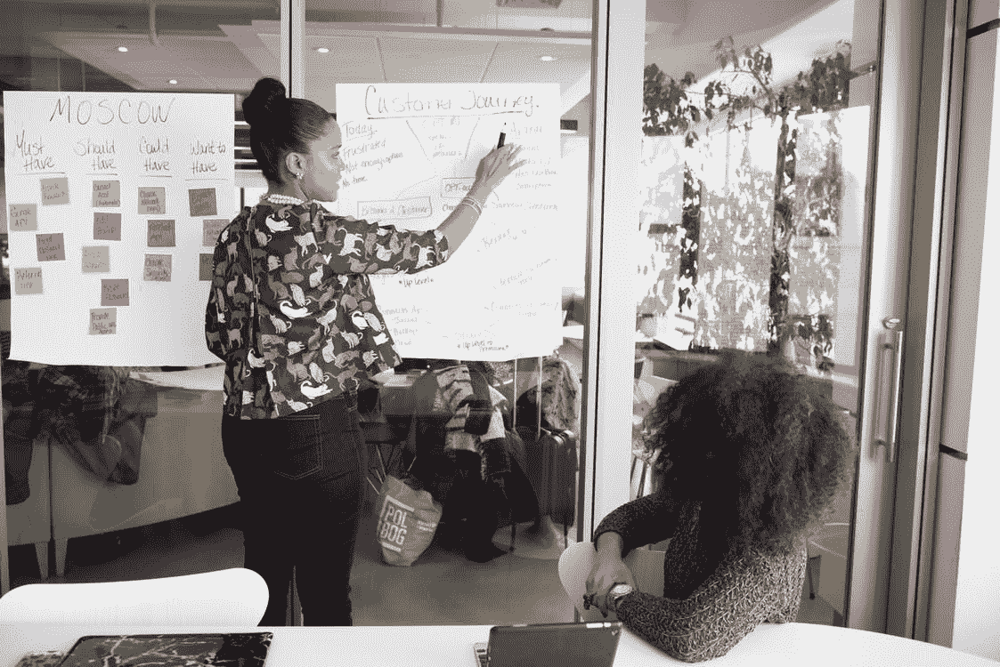

# 和非技术人员谈论技术问题

> 原文：<https://medium.com/codex/talking-to-non-technical-people-about-technical-things-95b089565a4e?source=collection_archive---------13----------------------->

*免责声明:所有观点都是我自己的*

[照片](https://www.pexels.com/photo/two-women-having-a-meeting-inside-glass-panel-office-1181615/)来自 Pexels 的 Christina Morillo

作为一名软件工程师，你会在职业生涯中花费惊人的时间与非技术人员讨论技术问题。根据您的角色，您可能会发现自己处于这些情景中的任何一种

1.  向您的经理解释紧急错误修复
2.  与客户谈论为什么…