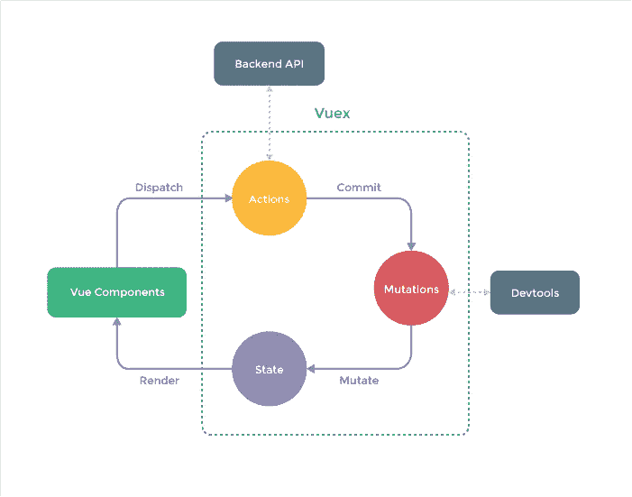

# 纠结前端状态管理？使用商店！！！

> 原文：<https://medium.com/codex/tangled-with-front-end-state-management-use-the-store-86632c20f2ef?source=collection_archive---------6----------------------->

蒂姆·莫斯霍尔德在 [Unsplash](https://unsplash.com?utm_source=medium&utm_medium=referral) 上的照片

说实话，前端应用程序上的状态管理是一项繁琐的工作。
甚至从普通 JavaScript 的时代到拥有许多高级 JS 框架和库的时代。

状态管理可以在应用程序的所有三层中完成，无论是后端、数据库还是前端。但是，在本文中，我们将专门讨论 it 前端的状态管理。

让我们从我备受赞赏的 WWWH 风格开始吧，也就是什么、为什么、何时和如何。

# 什么？

首先，我们需要了解什么是状态？

状态只是客户端在给定时间点的系统快照或表示。它可以以无缝的方式操作和表示，尤其是在单页应用程序中。

概括地说，国家管理模式

状态基本上是数据存储，包括应用相关数据、用户数据、导航信息、通信相关数据等。对于我们处理的任何类型的数据，它都可以被操纵或消费。

至于状态管理，我们可以通过各种操作来操纵状态。它可以是用户操作、API 响应、导航更改等。另一方面，我们可以通过查询该存储来显示应用程序的最新状态。就这么简单。

从上图可以看出，这是一个连续的圆形图案。但是基本上，如果我们从存储开始，存储具有用于呈现视图的应用程序的初始状态，从那里，用户执行任何动作，这又触发状态的突变并继续。

有多个库为不同的 javascript 框架提供状态管理，例如:

> NgRx 为角度
> Redux 为反作用
> Vuex 为 Vue

# 为什么？

现在我们已经了解了什么是状态和状态管理，让我们看看为什么我们需要它？

Nirmal Rajendharkumar 在 [Unsplash](https://unsplash.com?utm_source=medium&utm_medium=referral) 上拍摄的照片

还记得我们曾经将一堆东西存储到 localstorage 中，这些东西可以在整个应用程序中操作和使用吗？那么你肯定会记得组织所有这些关键价值观的痛苦。

状态管理解决了组织应用程序状态的主要难点，而无需您经常担心。

状态管理帮助我们设置、操作、组织和同步应用程序中所有组件的当前状态。

它还帮助我们使 API 交互和通过 API 的数据流更加平滑和一致。它可以帮助我们缓存(不是字面意义上的)响应，以便我们可以在需要时快速检索它们。

它还有助于我们简化多个组件之间的通信，因为集中存储有助于所有组件与其交互，以便集中更改或访问数据。

# 什么时候？

那么，我们什么时候能想到使用商店呢？有哪些使用商店会让我们受益的用例？

人们可以想到的使用商店的场景主要有两种:

1.  应用程序包含许多需要频繁交互的组件
2.  应用程序经常消耗冗余数据。

但是，如果您正在开发一个具有组件筒仓的简单应用程序，您最好不要使用它，因为它实现状态管理会很复杂和缓慢。

我们如何决定何时使用状态管理？我想借用 ngrx 网站上的以下段落:

一个很好的指南，可能有助于回答这个问题，“我需要 NgRx 存储吗？”伊斯兰教法的原则是:

*   **共享**:被许多组件和服务访问的状态
*   **水合**:从外部存储中持久化和再水合的状态。
*   **可用**:重新输入路线时需要可用的状态。
*   **取回**:必须取回的状态，有副作用。
*   **受影响的**:受其他来源的动作影响的状态。

# 怎么会？

我们可以通过简单地使用帮助我们实现状态管理的库来使用状态管理。对于 javascript 框架来说，它是不同的。

然而，实现商店的基本概念对所有人都是一样的。

Vuex 的工作流程

有 4 个角色需要记住:

*   **状态**:它是存储应用程序状态的真实/数据的来源
*   **视图**:消耗状态呈现给用户
*   **动作**:哪些是状态变化的原因
*   **突变**:特定动作触发，最终改变状态。

我不想为所有的 JS 框架添加代码片段，我想把您重新定向到来自各种 JS 框架的众所周知的和完善的库的文档。

*   角度: [NgRx](https://ngrx.io/guide/store)
*   反应: [Redux](https://redux.js.org/introduction/getting-started)
*   Vue: [Vuex](https://vuex.vuejs.org/guide/#the-simplest-store)

快乐学习！！！