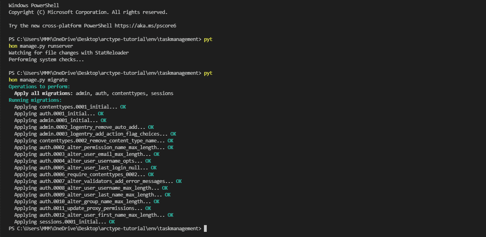
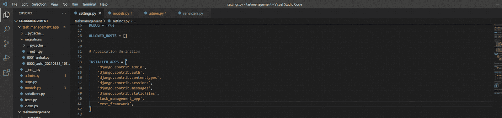

# Python 任务管理应用教程

> 原文：<https://medium.com/codex/task-management-app-tutorial-with-python-1ce08bdea21d?source=collection_archive---------8----------------------->


在本教程中，我们将首先使用 Python 在 Django 中构建一个简单的待办事项应用程序。然后，我们将探索在数据库客户机中可视化结果数据的一些方法。想建立一个分析仪表板或 twitter 刮刀？查看这些以前的教程。

[](https://arctype.com/blog/analytics-dashboard-django/) [## 使用 Django 和 Arctype 构建分析仪表板

### 作为 Python 的首要 web 框架，Django 为许多 web 应用程序的构建提供了基础…

arctype.com](https://arctype.com/blog/analytics-dashboard-django/) [](https://arctype.com/blog/twitter-api-python/) [## 使用 Tweepy、Django 和 Arctype 构建 Twitter 热图

### 在本教程中，我们将学习如何使用官方 Twitter API 管理 tweet 活动并生成热图…

arctype.com](https://arctype.com/blog/twitter-api-python/) 

## 先决条件

要完全理解本教程，您需要以下内容:

*   [Python 3.8](https://www.python.org/downloads/) 或更新版本
*   基本了解 [Django 3.0 或更新版本](https://docs.djangoproject.com/en/4.0/intro/overview/)
*   一个 IDE ( [PyCharm](https://www.jetbrains.com/pycharm/features/) ， [VS Code](https://code.visualstudio.com/docs) )。
*   像 [Arctype](https://arctype.com) 这样的 SQL 客户端
*   [SQL](https://sqlbolt.com/) 的基本工作知识

# Python 设置

## 安装 Python

首先，让我们使用[这个链接](https://www.python.org/downloads/)来安装 Python。然后，我们可以选择我们的操作系统并下载它。本教程是在 Windows 上构建的。我们可以运行命令`Python --version`来检查 Python 是否成功安装在我们的系统上。如果安装了 Python，我们会得到如下所示的响应:


## 创建虚拟环境

让我们为这个项目创建一个隔离的虚拟环境。虚拟环境帮助我们避免在系统上全局安装依赖项。这有助于确保其他项目的依赖项不会包含在我们当前项目的依赖项中，即使它们都在同一台本地机器上。为此，运行以下命令。


接下来，通过导航到新虚拟环境的基本目录来激活虚拟环境(在我们的示例中，它的名称是“env”)。然后，导航到脚本文件夹并运行可执行文件“激活”


# Django 设置

您可以[用 pip 安装 Django Web Framework](https://www.djangoproject.com/download/) ，然后按照这些步骤操作。

## 创建项目

现在，让我们创建项目。我们可以通过运行命令`django-admin startproject`后跟项目名称(在本例中为`taskmanagement`)来实现这一点。完整的命令应该如下所示:

```
django-admin startproject taskmanagement
```

在这里，我们可以随意命名项目，但是一定要有描述性。

## 创建应用程序

让我们导航到`taskmanagement`文件夹并创建一个应用程序。为此，我们使用命令`python manage.py startapp`，然后是应用程序的名称，在我们的例子中，我们将其命名为`task_management_app`。


应用程序创建成功。我们现在可以在我们最喜欢的 IDE 中打开项目。

## 迁移

在 Django 中，我们使用迁移来移动我们对模型所做的更改(添加一个字段，删除一个模型，等等)。)到我们的数据库模式中。首先，我们需要迁移到我们的数据库。运行命令`python manage.py makemigrations`。`makemigrations`用于根据对项目中模型的更改创建新的迁移。输出如下所示。



现在让我们运行我们的应用程序，看看我们是否已经成功安装，我们的项目设置是否正确。为此，我们将目录更改为我们的项目，并运行命令`python manage.py runserver`:


我们已经在 http://127.0.01:8000/启动了我们的开发服务器！因此，我们现在可以打开浏览器，使用该 URL 访问我们的应用程序。如果一切正常，与下图相同的屏幕将显示为默认的 Django 页面。


现在我们想在`settings.py`文件中做一些配置。我们要做的第一件事是在已安装的应用程序中添加应用程序的名称，如下图所示，然后将 MySQL 数据库添加到 Django。


## 编辑 Settings.py 以将 MySQL 添加到 Django

在您的`settings.py`文件中，编辑下面的代码并用连接到您的 SQL server 所需的详细信息替换它:

```
DATABASES = {
    'default': {
        'ENGINE': 'django.db.backends.mysql',
        'NAME': 'database_name',
        'HOST': '127.0.0.1',
        'PORT': '3306',
        'USER': 'username',
        'PASSWORD': 'password',
    }
}
```

# 待办事项列表应用程序数据模型

接下来，我们要创建一个模型。该模型将决定任务如何存储在数据库中。任务将有七个属性，任务的一个`title`、一个`description`、一个`startTime`、一个`endTime`、一个`completed`状态，以及一个`created on`和一个`updated on`列来标记我们的任务何时被首次创建和更新。

注意:我们的`startTime`和`endTime`使用了`DateTime`类。这将分别保存任务开始和完成的日期和时间。我们已经将`created_on`字段的`auto_now_add`属性设置为 true。这将使用任务创建的当前日期和时间自动填充该字段。


现在让我们继续进行迁移。每当我们的模型发生变化时，我们都需要进行迁移。完成后，我们将在 migrations 文件夹中找到一个新文件，如下所示。


我们没有手动编写这段代码。这是 Django 为我们处理的 SQL 代码。接下来，我们使用 python manage.py migrate 进行迁移。迁移负责应用和重新应用迁移。


现在，我们通过在管理面板上注册任务来测试 CRUD 操作是否成功，如下所示:

```
from django.contrib import admin
from .models import Task

class TaskAdmin(admin.ModelAdmin):
      list_display = ("title", "description", "startTime",  "endTime", "completed", "created_on", "updated_on")

admin.site.register(Task, TaskAdmin)
```


# 任务管理 API

为了构建 API，我们将安装并使用 [Django REST 框架](https://www.django-rest-framework.org/#installation)。

## 创建超级用户并添加 rest_framework

让我们用下面的命令创建一个超级用户:`python manage.py createsuperuser`


接下来，我们需要将 Django `rest_framework`添加到已安装应用的列表中。



## 创建序列化程序

JSON 代表 JavaScript 对象符号。序列化程序将模型类转换为 JSON，这样前端就可以处理接收到的数据。

```
from django.db.models.fields import Field
from rest_framework import serializers
from .models import Task

class TaskSerializers(serializers.ModelSerializer):
    class Meta:
        model = Task
        fields = ("id", "title", "description", "startTime", "endTime", "completed", "created_on", "updated_on")
```


## 创建视图

该视图只是一个 Python 函数，接受 HTTP 请求并返回响应。例如，这个响应可以是 HTML 内容。视图本身包含了向对其进行 HTTP 调用的客户机返回响应所必需的业务逻辑。

```
from django.db.models.query import QuerySet
from django.shortcuts import render
from rest_framework import viewsets
from .serializers import TaskSerializers
from .models import Task

# Create your views here.

class TaskView(viewsets.ModelViewSet):
    serializer_class = TaskSerializers
    queryset = Task.objects.all()
```


## 网址

URL 用于将路径表达式映射到 Python 函数(您的视图)。它首先接收 HTTP 请求，并将它们路由到 views.py 中正确的匹配函数来处理请求。现在，让我们转到项目文件夹中的 URL，并添加以下代码:

```
from django.contrib import admin
from django.urls import path
from django.urls.conf import include
from task_management_app import views
from rest_framework import routers

router = routers.DefaultRouter()
router.register(r'tasks', views.TaskView, 'task')

urlpatterns = [
    path('admin/', admin.site.urls),
    path('api/', include(router.urls)),
]
```


## 访问我们的端点

要访问我们的端点，请运行您的应用并访问[http://127 . 0 . 0 . 1:8000/API/tasks/](http://127.0.0.1:8000/api/tasks/)并添加一项任务。


嘣！我们的任务管理器上有它。我们可以通过将任务的`Id`附加到 URL 来获得特定的任务。我们还可以更新或删除特定的任务。

这一节已经告诉我们如何构建一个执行 CRUD 操作的任务管理应用程序。现在，我们将使用 SQL 客户端来可视化数据库中的数据。

# 可视化和查询任务数据

接下来，我们选择我们最熟悉的 SQL 类型。在本文的过程中，我们将[连接到一个 MySQL](https://arctype.com/mysql/drivers/python-mysql) 关系数据库。


# 可视化表格

我做了一个样本数据。本教程的 csv 格式。首先，我创建了一个 Google sheet，将其导出为一个. csv 文件，然后导入。该数据表包含列:`id`、`title`、`description`、`completed`、`created on`、`startTime`、`endTime`和`updated on`。这是我们在表格视图中导出的数据集:


## 创建仪表板以将活动分组在一起

现在，我们将显示我们的活动列表。首先，我们将编写一个显示数据集的 SQL 查询。点击侧边栏旁的`Queries`选项卡，并选择`Create query`按钮。


我们可以从重命名查询开始，并将其保存在编辑器的标题中:

```
SELECT COUNT(*) AS tables_priv FROM `excel_for_arctype_data_sheet_1_1`;
```

我们得到的结果应该看起来像下面的截图:


接下来，我们现在可以单击`Dashboard`选项卡来创建一个新的仪表板。然后，我们用我们喜欢的名称重命名我们的仪表板。


接下来，点击“添加选项卡”并选择`Chart`:


然后，点击选择图表数据并选择`activities_count`:


更改仪表板组件的标题，并选择`Score Card`作为图表类型。然后，我们现在可以拖动要显示的`table_priv`列。


接下来，我们创建一个表格组件来显示效率最高的活动。

创建一个名为`activities_complete`的新查询。然后，我们可以在其中执行以下命令:

```
SELECT 
    SUM(completed) AS list_of_completed_activities 
FROM 
    `excel_for_arctype_data_sheet_1_1` 
WHERE 
    title = {{Atitle}};
```


然后，从我们已经创建的活动仪表板部分单击`add`按钮，并选择`table`:


最后，我们单击选择图表数据按钮，并选择我们之前创建的`Title`查询。


## 创建饼图

在这里，我们将使用 Arctype 创建图表组件，以便在饼图中显示数据集。

我们使用前面的查询命令开始这个过程。然后，只需选择图表类型并将其更改为`Pie Chart`并将`tables_priv`拖动到列类别。

## 在一个仪表板中混合不同类型的图表

在这里，我们将使用 Arctype 创建图表组件，以便在条形图中显示数据集。我们重复与饼图相同的过程。

我们将图表类型更改为`Bar Chart`，并将`tables_priv`拖动到列类别中。然后，我们配置图表以匹配我们想要的任何设置。


# 结论

本文分为两个部分。首先，我们学习了如何使用 Python 框架(Django)来创建任务管理系统。其次，我们使用 SQL 客户端探索了任务管理应用程序的数据模型。当我们这样做的时候， [Arctype](https://arctype.com) 使用查询和仪表板来可视化我们的表和列。我们还学习了如何将数据集展示为饼图、条形图、面积图和折线图。