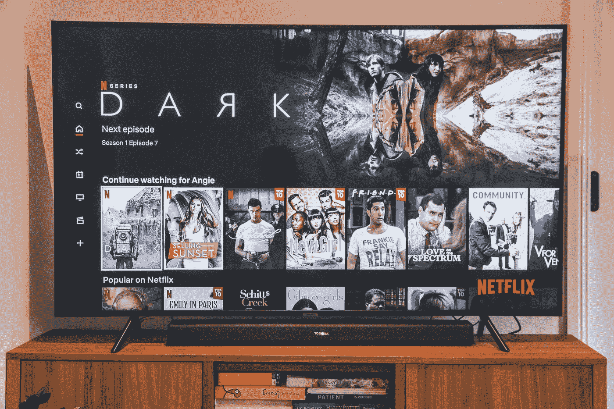

# TCL 荣获两项 CES 2023 创新奖

> 原文：<https://medium.com/codex/tcl-wins-two-ces-2023-innovation-awards-9a742b06892c?source=collection_archive---------4----------------------->

## 巩固了其在电视市场的地位

由[马克斯·卡斯布拉克](https://unsplash.com/@popcornmatch?utm_source=medium&utm_medium=referral)在 [Unsplash](https://unsplash.com?utm_source=medium&utm_medium=referral) 上拍摄的照片

根据 OMDIA 的《2022 年全球电视机 H1 报告》的数据，全球电视市场的主导者之一和领先的消费电子公司 TCL 电子在全球液晶电视市场占据前 2 名的位置，证实了其主导地位。