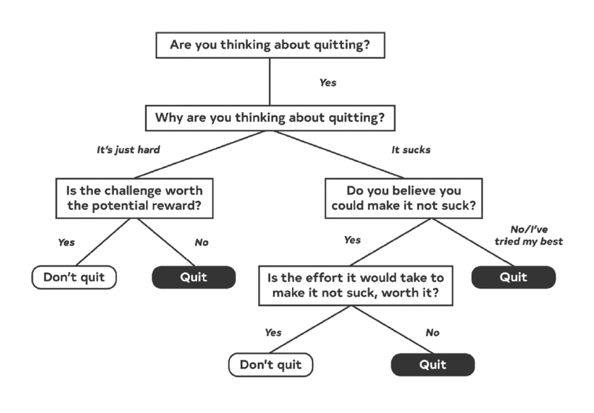

# 教师到后端软件工程师

> 原文：<https://medium.com/codex/teacher-to-backend-software-engineer-798a39767f79?source=collection_archive---------12----------------------->

## 我如何在将近 30 岁时改变我的职业。

照片由[丹·迪勒梅达](https://unsplash.com/@ddealmeida?utm_source=Hashnode&utm_medium=referral)在 [Unsplash](https://unsplash.com/?utm_source=Hashnode&utm_medium=referral) 上拍摄

我想我过去的决定为我现在的成就铺平了道路。希望通过分享我的经历，我能够让别人相信追求梦想永远不会太迟。不管你的年龄或背景如何，这都适用。

我现在的道路不是传统的，也不是我从 6 岁开始学习编码的结果。

2013 年，我从赫尔大学毕业，获得心理学学士学位。我想成为一名临床心理学家，但首先需要工作经验。毕业没几个月，我就找到了一份实习特殊教育教师的工作。然而，最终我意识到那不是最适合我的道路。因此，我辞职了。

那时候，公司不愿意雇佣任何在教育系统工作过的人。这是因为担心候选人无法适应变化了的环境。尽管我有这个限制，我还是设法在一家名为爱的购物有限公司找到了一份网站助理的工作；正是在这家公司，我想成为一名工程师的愿望开始增长。

自从成为远程工作者以来，与同事一起工作的学习机会是我最怀念的事情。倾听其他人在做什么，他们面临的问题，以及他们计划如何解决这些问题。这就是我过去在爱购物有限公司做的事情，这也激发了我对软件开发的兴趣。一天，首席工程师和一位主管谈论统计意义。原来他们在主页上做 A/B 测试，他们在看当前的结果。

在露营地露营

这激发了我对数字营销的兴趣，所以我选择了数字营销课程，并开始在这个领域寻找新的工作。就在那时，我在露营和房车俱乐部找到了一份数字内容助理的工作。从这里，我开始与工程团队一起工作，学习前端开发。不幸的是，在工作中出现了一种情况，他们不打算替换工程团队，而是希望将大部分工作外包出去，只留下一名前端工程师来指导和支持新成立的外部团队。

这也让我有机会通过与工程团队密切合作，了解前端开发和不同的流程，获得一些宝贵的经验。在我不得不回到我的老团队之前，我与团队紧密合作了三个月。我继续为 CRO 团队工作了 3 个月，然后我辞职了。我在开发团队的短暂经历让我对自己的未来产生了疑问。我是想继续做 CRO 的工作，还是又改变了主意，想要些不同的东西？我打赌你能猜到接下来发生了什么。2017 年 8 月，我递交了通知书，重新回到大学学习计算机科学硕士学位。

快进到今天，我现在是一名软件工程师，在一家名为 [Optimizely](https://www.optimizely.com/) 的公司工作了将近 4 年。我最初是作为一名集成工程师开始工作的，负责在 Optimizely 的个性化平台上为客户提供服务和故障排除。我现在在后端团队工作，为平台构建数据密集型应用程序。

在我的旅程中，你可能会注意到一个共同的主题。一旦我意识到有些东西不适合我，我就放弃了。我没有留下来看“事情是如何发展的”；我刚离开。对于一些人来说，我可能会显得鲁莽和不负责任，很多人告诉我，他们更愿意雇佣在一个职位上工作了 3 年以上的人。然而，时代在变，你需要做对你自己而不是别人来说正确的事情。史蒂夫·巴特利特在他的书《快乐性感的百万富翁》中有一个极好的图表，展示了一个人在决定辞职时可以采取的思维过程:

史蒂夫·巴特利特关于何时知道是时候辞职的框架

# 下一步是什么？

老实说，我不知道。我已经不再制定长期目标，因为它们从来都不会实现。相反，我决定尝试活在当下，专注于更小的目标，比如每天阅读 10 页，或者每周 3 次，每次 30 分钟专注于我的个人项目。这些年来我学到的一件事是，生活是一场马拉松，而不是短跑，所以你不妨享受它。