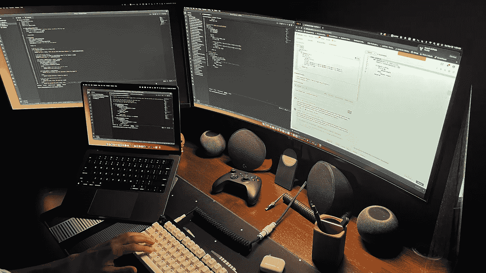

# 软件工程师的技术基础！

> 原文：<https://medium.com/codex/tech-essentials-for-software-engineers-d40117e622b5?source=collection_archive---------0----------------------->

## 试着抓住其中的一些来改善你的编码体验吧！

我的办公桌！

我不认为要成为一名优秀或高效的软件工程师，你需要具备本文中提到的所有这些东西，因为没有这些东西，你肯定也能把工作做好。然而，拥有这些东西会让你编码的日子更加轻松愉快！我也是一个坚定的信徒…