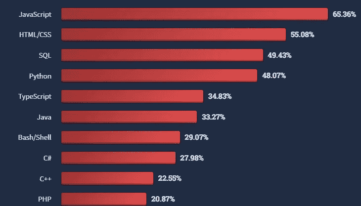
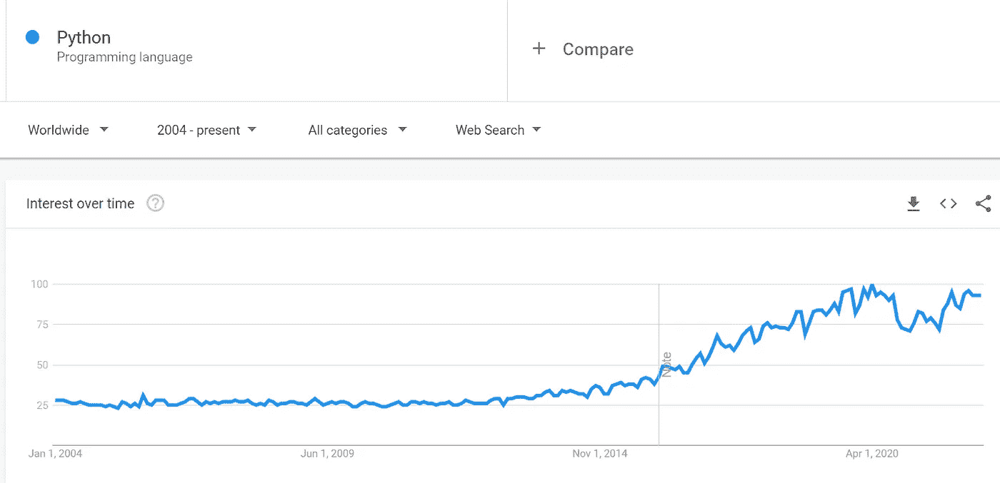

# 技术趋势

> 原文：<https://medium.com/codex/tech-trends-320d825fa7a5?source=collection_archive---------5----------------------->

卢卡·布拉沃在 [Unsplash](https://unsplash.com/s/photos/tech?utm_source=unsplash&utm_medium=referral&utm_content=creditCopyText) 上的照片

年复一年，科技的变化比以前更快。对于当前和潜在的技术来说，它正在成为一个竞争非常激烈的市场。*这场竞赛给用户和企业带来了高性能和高效的软件/应用、加密货币、令人敬畏的视频游戏，当然还有元宇宙。*疫情也极大地改变了科技行业。随着技术的不断变化，景观让我们看看技术走向未来。 ***谷歌趋势*** **(GT)** 以及类似***stack overflow*(SO)**survey 2022 这样的科技调查提供了一种很酷的方式来可视化这些趋势。

# 编程语言

以下是 SO 列出的 10 种最受欢迎的语言。当你看到哪种语言更受欢迎来学习编码时，偏好仍然非常相似。

[流行语言](https://survey.stackoverflow.co/2022/#section-most-popular-technologies-programming-scripting-and-markup-languages)

现在让我们来详细看看其中的一些，并根据目前的趋势来看看它们的最终命运。

## Java Script 语言

JS 是一种*面向对象的*、*声明性的*、*原型化的、单线程的*、*动态的*语言。因为它的*解释、轻量级和及时的复杂性*，在过去的 10 年里，它一直是最受欢迎的语言。这也是万维网的核心技术之一。

*   *发布时间:1995 年*
*   开发人员:网景公司的布伦丹·艾希

[JS 趋势](https://trends.google.com/trends/explore?date=today%205-y&q=%2Fm%2F02p97,%2Fm%2F03g20,%2Fm%2F015tjh,%2Fm%2F0n50hxv)

Node.js 和 React.js 是目前最流行的 js 框架。另一方面，Angular 很受欢迎，但当它从 AngularJS 变成 Angular(2+)时，受到了沉重的打击。

[流行的 web 框架](https://trends.google.com/trends/explore?date=today%205-y&q=%2Fm%2F0bbxf89,%2Fm%2F012l1vxv,%2Fm%2F0268gyp,%2Fg%2F11c6w0ddw9,%2Fg%2F11c0vmgx5d)

拥有大型应用程序的企业可能会发现，围绕 Angular 的不确定性很难继续下去。大约在同一时间， ***React*** 和 ***Veu*** 提供了更稳定的选项，因此凭借其轻量级和现代的 UI 功能而广受欢迎。将现有应用程序迁移到这些框架上也更快、更顺畅，学习曲线也更浅。这些框架很有可能会继续成为 web 开发的焦点。它们在学习编码的人中也很受欢迎。

[流行的 web 框架/技术](https://survey.stackoverflow.co/2022/#section-most-popular-technologies-web-frameworks-and-technologies)

## 计算机编程语言

Python 是一种*动态类型的通用语言*。它支持多种编程范例，如*面向对象*和*函数式编程*。近年来，随着 AI/ML 的兴起，python 越来越受欢迎。由于其简单性、平台独立性和健壮性，Python 已经成为 ML 的首选语言。

*   上映时间:1991 年
*   *开发者:Python 软件基金会*

[Python 趋势](https://trends.google.com/trends/explore?date=all&q=%2Fm%2F05z1_)

根据 SO 的调查，学习编码的人更有可能从 python 开始。当前的技术趋势有利于 Python，看起来它有一个光明的未来，特别是随着 AI/ML 和数据科学的兴起。

## Java 语言(一种计算机语言，尤用于创建网站)

Java 是一种通用的面向对象编程语言,目的是编写一种语言并在任何地方运行。在第一次发布后，它的多功能性使它在跨平台应用程序开发中很受欢迎。这些特性和互联网的兴起使 Java 的受欢迎程度扶摇直上。但近年来，随着新编程语言的兴起，谷歌为 Android 放弃了它，AI/ML 不受欢迎，Java 的受欢迎程度逐渐下降。

*   *发布时间:1995 年*
*   *开发商:甲骨文*

[Java 趋势](https://trends.google.com/trends/explore?date=all&q=Java)

Java 作为最流行的编程语言之一已经享受了很长一段时间。在 SO 调查中，它仍然排在前 10 名。许多企业应用程序仍然由 Java 和 spring 提供支持。所以我不认为 Java 会很快被消灭。即使是现在，GT 在趋势帮助页面上用它做例子还是很流行的。

[趋势帮助页面](https://support.google.com/trends/answer/4359550)

对于 Java 爱好者或憎恨者来说，这里有一篇[**的好文章**](/elca-it/is-java-dead-yet-d2f2e742161f#:~:text=According%20to%20Google%20Trends%2C%20the,both%20suffer%20a%20slow%20decrease.) 更详细地描述了 Java 的流行和可预见的未来。

## 科特林

Kotlin 是一种现代简洁的多平台通用语言，旨在完全嵌入 Java 和其他语言。它与主要针对 JVM 框架和库的 Java 生态系统兼容。在谷歌于 2019 年 5 月宣布将 Kotlin 作为 Android 的首选语言后，它在原生移动应用市场上受到了欢迎。有了 Android 的支持，Kotlin 的未来似乎一片光明。

*   *发布时间:2011 年*
*   *开发者:JetBrains*

[科特林趋势](https://trends.google.com/trends/explore?date=2011-01-01%202022-07-04&q=kotlin)

目前，它在 SO 调查中排名第 15 位，但毫无疑问，它有望在未来几年中攀升。

[科特林人气](https://survey.stackoverflow.co/2022/#most-popular-technologies-language)

## GraphQL

GraphQ 是一种用于开发 API 的查询和操作语言。自 2008 年以来，它越来越受欢迎。移动网络上有限的数据使用无疑将它置于 REST 等现有 API 模型之上。多年来，许多公司都在采用它，如 Instagram、Twitter、Github 等。随着它在弹簧靴起动器中的新集成，似乎它的受欢迎程度将在未来几年继续上升。

*   *发布时间:2012 年*
*   开发商:脸书

[GraphQL 趋势](https://trends.google.com/trends/explore?date=2012-01-01%202022-06-27&q=%2Fg%2F11cn3w0w9t)

GraphQL 不在 SO 调查中，但我发现这种前景很酷，可以直观地展示它的发展和市场价值。GraphQL 社区还发布了 [**年度报告**](https://graphql.org/foundation/annual-reports/) ，如果你想试一试的话，会很有意思。

[GraphQL 风景](https://landscape.graphql.org/)

# 框架/工具

## 饭桶

按照目前的趋势，很明显 git 是最流行的版本控制系统。Git 的协作便利性、速度、分布式版本控制系统，以及对开源项目的免费托管使得它如此受欢迎，超过了 SVN。简而言之，在未来几年，它的受欢迎程度可能会遵循当前的轨迹。

[git 趋势](https://trends.google.com/trends/explore?date=all&q=%2Fm%2F05vqwg,%2Fm%2F08441_,%2Fm%2F012ct9)

[git 人气](https://survey.stackoverflow.co/2022/#section-version-control-version-control-systems)

## [弹簧](https://spring.io/why-spring)

它是最著名的开源 Java 应用程序框架之一。它灵活、快速，并且有很好的社区支持。这些年来，它在 java 世界变得如此流行，以至于如果你是一名 java 开发人员，人们已经认为你知道 spring。在过去的几年里，随着其他编程语言和框架如 NodeJs 和 Django 的兴起，spring 的流行程度可能会发生一些变化。但是现在，它仍然是 Java 世界的焦点。

春季趋势

*   *发布时间:2002 年*
*   *开发商:VMWare*

根据 SO 2022 调查，它仍然是最受欢迎的框架和库的前五名。

[春季人气](https://survey.stackoverflow.co/2022/#most-popular-technologies-misc-tech)

## 码头工人

[Docker](https://www.docker.com/) ，一个开源项目，是一个基于容器构建应用的软件平台。它的简单性和在云上运行应用程序的能力使得它在最近几年里大受欢迎。

*   *发布时间:2013 年*
*   *开发商:Docker 公司*

[码头工人趋势](https://trends.google.com/trends/explore?date=2013-01-01%202022-06-27&q=Docker)

随着云中容器化的兴起，Docker 的受欢迎程度将在未来几年继续增加。

[码头工人受欢迎程度](https://survey.stackoverflow.co/2022/#other-tools)

# 数据库

没有数据库的应用程序是不完整的。它帮助应用程序存储、访问和操作数据。有不同类型的数据库和它们各自的查询语言。由于适度的硬件要求、速度和对几乎所有类型应用程序的支持，Mysql 非常受欢迎。

[DB 趋势](https://trends.google.com/trends/explore?date=today%205-y&q=Mysql,PostgreSQL,SQLite,MongoDB,Redis)

但正如过去几年的趋势所示，其他类型的数据库也越来越受欢迎，如 MongoDB、Redis 和 elastic search。这在新开发人员中也很受欢迎。所以看起来这些可能会在未来几年抢走一点 MySQL 的风头。

[热门 DBs](https://survey.stackoverflow.co/2022/#section-most-popular-technologies-databases)

# 云平台

云计算的概念自 20 世纪 90 年代以来一直令人兴奋，但它在 21 世纪初开始变得更加流行。直到 2010 年，Vmware 一直是云和服务器虚拟化领域的老大。但最近几年，它的头把交椅让给了 AWS 和 Azure。AWS 如此受欢迎是因为它的低成本、广泛的工具和可定制的选项。它帮助企业实现其当前基础设施向 AWS 的低成本迁移。

[云趋势](https://trends.google.com/trends/explore?date=today%205-y&q=AWS,%2Fm%2F04y7lrx,Google%20cloud,Firebase,vmware)

随着 Vmware 和 AWS 的合作，*容器化*和*编排*的兴起，云似乎正走向混合市场。

[云人气](https://survey.stackoverflow.co/2022/#section-most-popular-technologies-cloud-platforms)

# 流行理念

Visual Studio 代码是最受欢迎的 IDE 之一，它具有轻量级、可靠、不太复杂的特性、健壮性、可扩展的体系结构以及 web 开发的兴起。

[IDE 趋势](https://trends.google.com/trends/explore?date=today%205-y&q=%2Fm%2F0134xwrk,%2Fm%2F0ds5dxz,%2Fm%2F03v0mn,%2Fm%2F0b6h18n,%2Fm%2F04t89l)

Android studio 背后的 JetBrains 公司开发的 Intellij Idea 是 Java 和 Kotlin 开发人员最流行的 IDE 之一。他们还提供 python 的 PyCharm。随着 android 的崛起和对各种语言(社区版本上的有限功能)/框架的支持，以及现代智能设计，其受欢迎程度预计将会上升。

[流行的 IDE](https://survey.stackoverflow.co/2022/#section-most-popular-technologies-integrated-development-environment)

在 Intellj 的社区版本发布后，Eclipse 的受欢迎程度一直在下降。对于文本编辑器来说，凭借高性能和流畅的 UI，Notepad++已经越来越受欢迎。另一方面，Vim 因其速度和高配置性而广受欢迎。我认为 ide 的未来与它们支持的编程语言/框架成正比。ide 的稳定性、性能和易用性也会影响它们的寿命。

# 同步工具

众所周知，自疫情问世以来，变焦因其用户友好性、更好的性能和易用性而变得非常流行。我添加了 Discord，因为即使公司出于各种原因不使用它。它已经拥有大量的观众。

我已经使用了所有这些工具，我认为即使它们有很好的功能可供选择。如果你曾经和多个团队一起工作过，你会知道说服他们使用同一个工具仍然很复杂。根据 GT 和 SO 调查 Zoom，团队目前是明显的赢家。

[同步工具流行度](https://survey.stackoverflow.co/2022/#section-most-popular-technologies-synchronous-tools)

# 摘要

有了这些数据，最大的问题是 ***技术将走向何方？*** 如果我们看看每个类别中流行的技术和框架，看起来技术正朝着*构建更快、低成本、轻量级、易于扩展、自动化和智能(AI/ML)软件*的方向发展。因此，未来支持这些功能的技术更有可能在市场上成长，而其他技术可能会慢慢衰落。我也是这么想的，你们呢？你们认为这项技术会走向何方？