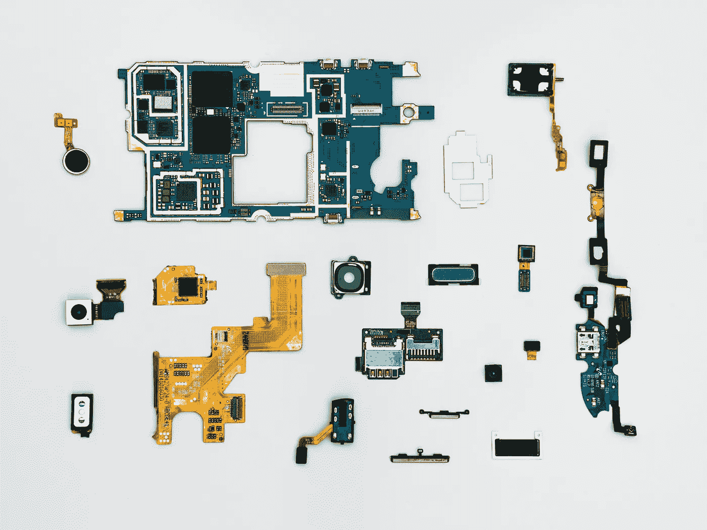

# 企业对 2022 年技术趋势的预测

> 原文：<https://medium.com/codex/tech-trends-that-enterprises-are-anticipating-for-2022-829532a8580f?source=collection_archive---------10----------------------->

过去两年对整个世界来说都不容易，因为人们一直受到疫情的影响。尽管如此，试图导航“下一个常态”的整个过程也是设计更美好未来的迫切需要的推动力。利用技术为我们即将到来的生活构建有效的解决方案就是其中之一。随着越来越多的创新解决方案的开发，企业正在将其流程外包给快速强大的工具。通过这样做，他们可以用超能力武装他们的员工，让他们完成具有竞争优势的工作。

Gartner 的研究强调，过去十年的 IT 预算增长率为 3.6%，比 2020 年的 [***水平高出 2%。该分析基于对 2400 名全球首席信息官和多个行业的技术专家的研究。由于生存需要创造性地使用技术，增长之路也将强调技术的创新使用。***](https://www.gartner.com/en/newsroom/press-releases/2021-10-18-gartner-identifies-the-top-strategic-technology-trends-for-2022)

企业预计 2022 年的技术趋势是:

# 网络安全网

从 [***像网络钓鱼***](https://shuftipro.com/blog/gdpr-phishing-scams-a-novel-trap-to-scoop-up-information/) 这样的诈骗和网络攻击，新潮科技的演变都有网络犯罪作为其黑幕的一面。为了应对日益升级的复杂网络犯罪风险，企业纷纷开发技术驱动的解决方案。控制诈骗最广泛使用的技术是(AI)人工智能有能力应对和减少现实生活中发生的网络欺诈。 [***人工智能*** ***网络安全***](https://shuftipro.com/blog/cybersecurity-vs-user-experience-knowing-the-art-of-balancing/) 的三个关键原则是:

*   在已经存在的网络攻击数据上指导 ML(机器学习)模型
*   生成对网络威胁的自动响应
*   在过去的基础上预见未来的攻击

一种用于增强和适应网络控制的分布式架构策略被称为网络安全网格。它通过将网络安全的边界转移到个人或主体的身份，提供了一种更加个性化的网络安全方法。这种转变有助于减少几乎所有行业的网络事件，尤其是金融行业。

# 边缘的云

[***云采用***](https://shuftipro.com/blog/on-premises-vs-cloud-services-two-sides-of-the-same-coin/) 修改了 IT 业务、治理和操作系统(CloudOps、FinOps 功能)。数字化转型的主要目标已经从满足对行业持怀疑态度的公司的 IT 需求，转变为满足每个行业甚至子行业的战略需求。全球的 SaaS(软件即服务)供应商正在与全球的系统集成商合作，提供标准化的加速器，可以轻松适应独特的差异化。

随着这种趋势越来越受到关注，使用应用程序将最终成为一种聚集而不是创造的方法。行业流程将成为被购买的战略产品，解放企业，使其将资源集中在竞争优势和战略的关键领域。

# 呈现商业智能

部署商业智能模型的组织现在正在获得它所提供的一套功能。各行各业现在都在理解消费者洞察的影响，并加以利用。所有努力都是为了利用从自动化和物理资源的组合中收集的信息来影响和增强客户行为。

# 决策智能

随着 it 要求越来越高，任何企业的决策权对于获得竞争优势都非常重要。决策智能是一种实用的方法，通过彻底了解决策是如何制定的以及如何估计输出，并通过反馈进行管理，来增强决策能力。

# 在任何地方工作

称远程工作不仅仅是 2020 年的狂热，而是一场翻天覆地的变化是完全正确的。雇员和雇主都突然意识到，合作完成工作已经成为过去。

一般来说，对于员工来说，在家中舒适地执行任务是舒适和方便的。锁定和简化协议的适度优势引发了思考。员工可以和生病的父母呆在一起，或者住在更便宜的社区，从而获得远程收入。

这一进程的势头要求雇主以更有效的方式数字化和简化流程。这产生了软件需求，因为有影响力的解决方案是必须实现的。

# 面部和声音识别

多亏了神经网络和机器学习，人脸和语音识别技术正在跨国界发展。创新的人脸识别算法甚至可以在低分辨率图像中区分人脸和背景。 [***人脸识别***](https://shuftipro.com/blog/face-verification-trends-and-benefits-for-the-corporate-world-in-2021/) 正在帮助企业提高管理敏感客户数据的应用程序的安全性，提供增强的用户体验。语音识别做同样的事情，并专注于语音驱动的界面提供的与应用程序连接的便利性。

# 总结一下

在这个数字时代，保持对 [***技术趋势***](https://shuftipro.com/blog/5-technology-trends-to-disrupt-banking-in-2020/) 的了解势在必行。先进的技术以最美妙的方式重塑了现有的业务，引起了市场的巨大变化。最有可能利用这些技术潮流的公司会超越他们的竞争对手，成为行业领导者。唯一的出路是密切关注这些趋势，并尽早调整自己。