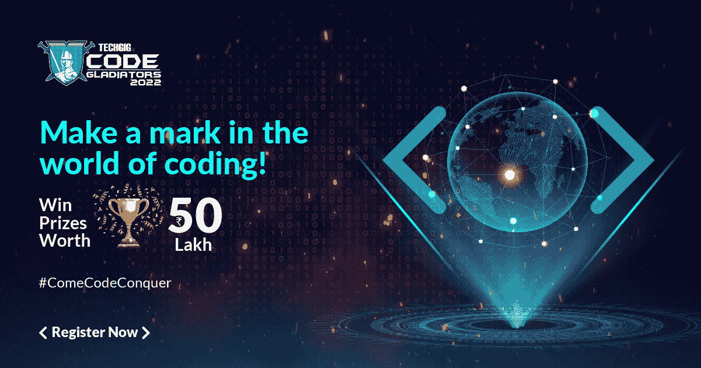

# TechGig 代码角斗士 2022:世界上最大的开发者人才搜索开始注册

> 原文：<https://medium.com/codex/techgig-code-gladiators-2022-worlds-biggest-talent-hunt-for-developers-opens-for-registration-eaea5cb6a8f5?source=collection_archive---------19----------------------->

“谁是世界顶尖的开发者？”-世界上价值数万亿美元的公司的命运取决于这一关键发现的答案，而 TechGig Code Gladiators 旨在简化这一探索。《代码角斗士》是世界上最艰难的编码比赛，录取率只有 0.25%。

*   *全球最大的编码搜索，在前八个版本中吸引了超过 150 万开发人员*
*   *Code Gladiators 今年举办了第九届 codeathon 和四次主题黑客马拉松*
*   2022 年黑客马拉松基于小众技术，如人工智能、机器学习、虚拟助手和 Azure 云服务
*   *最高选择 56 种编程语言供开发者编码；最新版本包括 Java 11、Java 17 和 TypeScript】*
*   *合作伙伴包括全球科技巨头甲骨文、Paylogic、NTT 数据、惠普企业、Kore.ai、微软 Azure、Persistent、Colruyt Group、RenewBuy、Providence、Publicis Sapient* 和 *Allstate India*

*‘谁是世界顶尖的开发者？* '-世界上价值数万亿美元的公司的命运取决于这一关键发现的答案，而 [TechGig Code Gladiators](https://www.techgig.com/codegladiators?sourcetype=TG_Medium) 旨在通过在全球范围内寻找软件开发人员来简化这一任务。作为全球最大的编码比赛，Code Gladiators 在去年获得 316 万注册后，最近推出了 2022 年版。只有 0.25%的接受率，代码角斗士也是世界上最艰难的编码比赛。

[Code Gladiators 2022](https://www.techgig.com/codegladiators?sourcetype=TG_Medium) 有许多行业首创的产品来鼓励编码创新。例如，开发人员可以用 56 种编程语言编写代码，包括较新的语言，如 Java 11、Java 17 和 TypeScript。2022 年版包括一场代码马拉松和四场主题黑客马拉松，内容涉及人工智能、机器学习、虚拟助手和 Azure 云服务等新时代技术。NTT 数据黑客马拉松提出利用人工智能解决医疗保健挑战。相比之下，微软 Azure 黑客马拉松只对女性开发人员开放，鼓励她们在平台上设计基于编码的解决方案。每次黑客马拉松的冠军都可以赢得价值 35 万卢比的奖金。还有十几个其他每日和每周的奖品可以赢取。总的来说，代码角斗士提供了价值 500 万卢比的奖品和参与公司的招聘机会。

此外，开发人员可以在 TechGig 网站上练习去年的问题，以便更好地准备。参与者可以在网站上参加 25 个以上最新技能的技能测试，包括 SQL、[机器学习](https://www.techgig.com/codegladiators/machine-learning?sourcetype=TG_Medium)、Python 和 AngularJS。他们可以免费生成自动化的基于技能的 TG Pro 个人资料，其中陈述了他们基于行业的技能得分，并帮助他们快速入围工作。

Code Gladiators 是由 TechGig 组织的年度编程比赛，tech gig 是印度最著名的技术社区，拥有 420 万软件开发人员。2022 年版于 3 月 22 日开始，已获得超过 52，313 次注册。

在解释 Code Gladiators 时，**tech gig 的业务主管 Sanjay Goyal 说:“**tech gig**Code Gladiators 是世界上最大的编码狩猎活动，是所有开发人员展示其技能的无与伦比的机会。对于开发人员来说，这是一个完美的平台，他们可以用最好的程序员来测试技能，分析他们的优势和需要改进的地方。当每个人都渴望有机会在他们的领域中崛起和发光时，Code Gladiators 为开发人员提供了一个实时的竞争机会，在行业同行中建立网络，会见技术领导者并得到认可。**

**今年，甲骨文和 Paylogic 作为冠名合作伙伴加入了[代码角斗士](https://www.techgig.com/codegladiators?sourcetype=TG_Medium)。黑客马拉松的合作伙伴包括 NTT 数据、惠普企业、 [Kore.ai](https://www.techgig.com/codegladiators/intelligent-virtual-assistants?sourcetype=TG_Medium) 和[微软 Azure](https://www.techgig.com/codegladiators/azure-women-rsquo-s-hackathon-2022?sourcetype=TG_Medium) 。其他合作伙伴包括 Persistent、Colruyt Group、RenewBuy、Providence、Publicis Sapient 和 Allstate India。**

**谈到他们的合作伙伴关系，NTT 数据服务公司营销、通信和企业社会责任副总裁 Ankur Dasgupta 表示:“我们很高兴与 TechGig 一起推出 [NTT 数据人工智能黑客马拉松](https://www.techgig.com/codegladiators/nttdata?sourcetype=TG_Medium)，以寻找全球 IT 和 ITES 行业的顶尖人才，同时培养学生通过使用新兴技术来想象新的可能性。随着世界见证了对更好、更易获得的医疗保健的需求，这次活动为全球的技术爱好者提供了一个展示他们的想法和才华的机会，这将有助于让世界变得更美好。”**

**在 [Code Gladiator](https://www.techgig.com/codegladiators?sourcetype=TG_Medium) s 注册是免费的！**

****关于 TechGig 代码角斗士:****

*****tech gig Code Gladiators 始于 2014 年，注册人数只有 12K，现已成为世界上最大的编程比赛，每年有 30 万以上的开发者注册。Code Gladiators 是世界上最大的技术盛会，它将最好的程序员、顶级 IT 公司和技术领导者聚集在一个平台上。*****

**Code Gladiators 背后的愿景是为开发人员创造一个全球平台，展示他们的编程技能，并在一个地方会见受人尊敬的技术领袖和创新技术公司。《吉尼斯世界纪录》已将该活动认定为世界上最大的在线编程竞赛。这一记录之前由中国的百度保持。它还因编码员在 Limca 世界纪录的一项活动中的最高参与度而受到好评。**