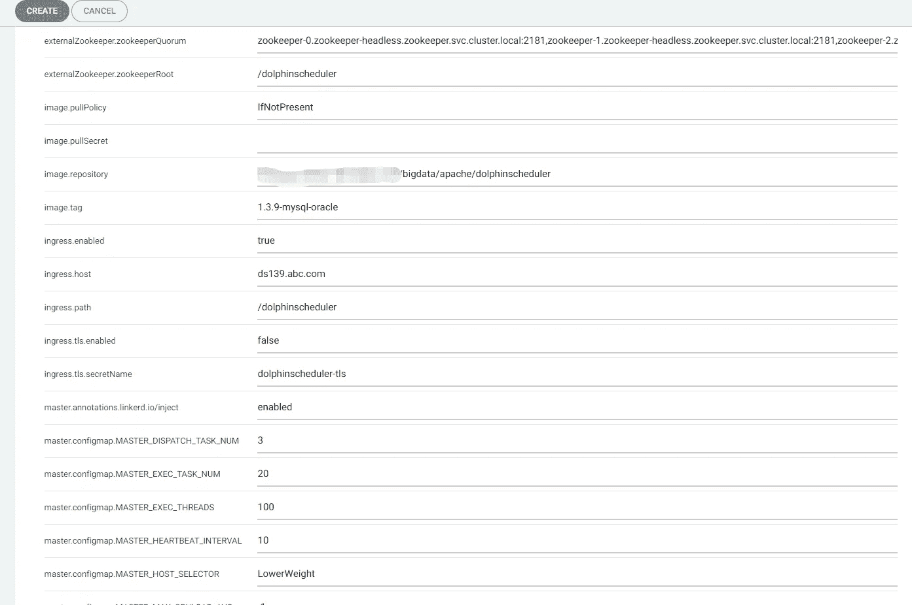
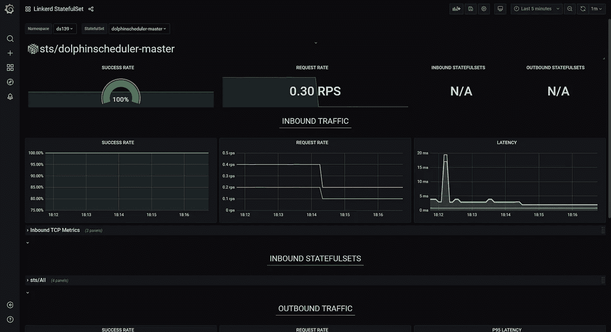

# Apache DolphinScheduler 在 Kubernetes 系统中的技术实践

> 原文：<https://medium.com/codex/technical-practice-of-apache-dolphinscheduler-in-kubernetes-system-ac7a7be73df4?source=collection_archive---------0----------------------->


作者|杨典

深圳交通中心数据与算法平台架构师。从事 IT 技术和咨询 17 年，工作内容涵盖数据开发、算法工程开发、IT 企业架构设计、数据治理、企业数字化转型，为大型机构提供 IT 系统实施项目服务，物流、企业供应链、银行、汽车、大型央企等行业的专业 IT 服务和管理。

编者按:

> Kubernetes 是基于容器技术的集群系统，实现容器编排，提供微服务和总线，涉及大量知识系统。
> 
> 本文从作者的实际工作经验出发，向我们展示了 DolphinScheduler 在实践场景中的使用和技术分享，希望能对有相同经历的人有所启发。

# 主题演讲

*   海豚调度器高效的云原生部署模式，节省了 95%以上的人力资源和工作时间；
*   gitops 技术提升了 DolphinScheduler 软件的 DevOps 管理能力，提高了软件交付效率和安全审计能力；
*   基于 cloud-native 的水平扩展、健康探针和滚动发布技术为 DolphinScheduler 带来了更强大的系统功能。
*   可视化资源管理实现了海豚预定的 CMDB 的管理能力。
*   集成到基础设施和服务网络中的可观测性技术支持标准化和稳健的监控功能。
*   结合对象存储技术满足了大量分布式算法对统一文件存储的需求。
*   与 Kubernetes 作业技术系统的深度集成，实现了混合调度器资源的相同调用功能。

# 我们为什么要用 DolphinSchedule？它给我们带来了什么价值？以及我们遇到了哪些问题？

DolphinScheduler 是一个优秀的分布式、易于扩展的可视化工作流任务调度平台。

在我所从事的领域，DolphinScheduler 的应用可以快速解决企业数据开发的十大痛点:

*   多源数据连接和访问，技术领域大部分常见的数据源都可以访问，添加新的数据源不需要太多的改动；
*   多元化+专业化+海量数据任务管理，真正围绕大数据的问题(Hadoop 家族，Flink 等。)任务调度，与传统的调度器有显著的区别；
*   图形化的任务安排，超级便捷的用户体验，与商业产品的竞争能力，尤其是对绝大多数不能直接拖拽生成数据任务的国外开源产品；
*   任务细节、丰富的任务视图、日志和时间运行轴显示，很好地满足了开发人员对精细化数据任务管理的需求，快速定位缓慢的 SQL 和性能瓶颈；
*   支持多种分布式文件系统，丰富用户对非结构化数据的选择；
*   原生多租户管理，满足大型组织的数据任务管理和隔离需求；
*   全自动分布式调度算法，平衡所有调度任务；
*   集群监控的原生功能，可以监控 CPU、内存、连接数、Zookeeper 状态，适合中小企业一站式运维；
*   原生任务报警功能，最大限度降低任务操作风险；
*   强大的社区化运营，倾听客户真实的声音，不断增加新功能，不断优化客户体验。

基于早期的微服务技术，DolphinScheduler 采用服务注册中心的概念，通过使用 Zookeeper 来执行集群的分布式管理

(很多大数据技术使用 Zookeeper 作为去中心化的集群管理)，工人主节点可以任意添加，

或者您可以独立部署 API 管理和警报管理。作为企业级技术模块，实现了微服务分离、独立部署、模块化管理的良好技术特性。然而，在容器化云原生快速发展的时代，这种基础技术模式存在很多不足:

*   需要从地面部署，无论是安装在物理机上还是虚拟机上，DolphinScheduler 都需要数百次 shell 操作，一个节点集群可能需要数千次 shell 操作；
*   一个标准化的企业级 DolphinScheduler 涉及到大量基础环境的管理，通常需要 8 个以上的节点、主机和 IP 地址。位置带来一定的管理难度；
*   添加一个节点还需要几十个操作(安装 Java、配置主机、设置 DS Linux 用户、设置免密码登录、修改安装节点配置文件)，整个集群需要停机重启；
*   大型企业通常有多个集群支持不同的业务，会带来大量重复性的工作负载；
*   调度器具有一些可观测性功能，但无法与主流工具集成；
*   调度器整体还是需要日常例行的检查工作，比如核心 java 进程的异常退出；
*   对于调度器在不同需求和场景下的配置设置，没有有效的管理机制或工具；

识别这些技术缺陷的核心思想是:

*   如何将 DolphinScheduler 整合到当今主流的云原生技术中？
*   如何用较少的人力资源部署 DolphinScheduler，能否实现全自动的集群安装部署模式？
*   如何实现 DolphinScheduler 的无服务器化，大幅降低 CMDB 的技术组件、主机、IP、域名等管理成本
*   如何标准化技术组件实现规范？
*   能做到无人监管，系统自愈吗？
*   它能自动膨胀而没有感觉吗？
*   如何构建和整合可观测系统？

# c**loud——通过** Kubernetes 技术实现 DolphinScheduler 的原生功能

作为云原生系统技术事实上的标准，Kubernetes 为整个 IT 应用技术体系带来了革命性的改变。Kubernetes 主要基于

服务注册和发现、负载均衡、自动化软件发布和回滚、容器化隔离、软件自愈、分布式配置管理等核心技术特征。

核心技术特性作为基础设施，不需要修改应用代码，自然集成各种优秀的技术特性。不仅仅是 Kubernetes，我们还整合了 CNCF 的很多优秀项目，开展了以下工作:

*   docker 容器化包实现了企业内部离线安装(airgap 安装)的需求。
*   DolphinScheduler 的部署技术得到了改进。我们使用了 helm 和 argocd 来大大简化和实现一键部署。
*   应用所需配置的管理优化，配置内容的 gitops 管理机制通过 argocd 技术实现，并支持完整的审计能力；
*   Kubernetes 的横向有状态应用副本扩展技术，大大简化了应用扩展的操作难度；
*   Kubernetes 的标准化健康探针技术使调度器的所有技术组件具有强大的自愈能力；
*   Kubernetes 和 argocd 的滚动发布技术，实现了 DolphinScheduler 工具优雅无意义的升级；
*   Kube-Prometheus 技术的使用为 DolphinScheduler 带来了标准化的可观测能力；
*   强大的 UI 技术，解决 CMDB 可视化管理、基于 Kubernetes 的组件配置管理、应用日志管理等的工具。；

此外，我们还为 DolphinScheduler 引入了更强大的工具，以获得更丰富的云原生功能:

*   通过 Kubernetes 服务注册发现和入口技术实现无服务器的服务器无关性；
*   Linkerd 为 DolphinScheduler 带来了服务网格的功能，提高了所有 API 的管理和监控能力；
*   DolphinScheduler 的 Kubernetes 资源调度技术。
*   结合对象存储技术 minio，统一了非结构化数据技术。

我们所做的一切工作都是为了让 DolphinScheduler 更强大，运行更稳定，对人力的需求更低，可观测性更好，生态更丰富完整。

# 首先，向云原生平台的过渡任务。

为了成为运行在 cloud-native 上的技术组件，充分继承 cloud-native 的各种技术特性，DolphinScheduler 首先需要在 cloud-native 技术的基础上快速实现部署和运行，即将大部分企业应用迁移到 Kubernetes 环境中。由于开源社区
的贡献，我们快速构建了 DolphinScheduler java 应用程序 jar 包的 docker 映像，并使用优秀的 Helm 工具包实现了基于 Kubernetes 声明式部署的脚本。这是融入 cloud-native 最重要的一步，即成为 Kubernetes 的管理对象。这些任务不仅使云原生用户和组织更方便、更快捷地使用工具，还为 DolphinScheduler 用户使用工具带来了数百倍的工作效率提升。

这里我们列举 2 家公司在迁移 DolphinScheduler 到 Kubernetes 环境中的一些常见的转换工作，其中离线安装是为了解决生产环境下的网络安全问题，DolphinScheduler 个性化插件的镜像重构是为了实现不同企业间各种数据的客户交换。这些工作解决了企业使用 DolphinScheduler 的各种实际问题。

*   修改 value.yaml 文件中的镜像，实现离线安装(air-gap install)；为公司内部安装的 harbor 或其他公有云私有仓库进行拉取、标记和推送。替换值文件中的镜像信息，这里我们推荐使用 Always 方法拉取镜像。在生产环境下，每次都尽量检查是否是最新的镜像内容，以保证软件对产品的正确性。制作一个没有写标签信息的图像，在生产环境中是非常危险的。建议使用 Always 来澄清每个版本的标签。

```
image:
repository: "apache/dolphinscheduler"
tag: "1.3.9"
pullPolicy: "IfNotPresent"
```

执行 helm 命令的主机可以实现离线安装。

```
kubectl create ns ds139helm install dolphinscheduler . -n ds139
```

*   集成 DataX、MySQL、Oracle 客户端组件，先下载以下组件
    [https://repo 1 . maven . org/maven 2/MySQL/MySQL-connector-Java/5 . 1 . 49/MySQL-connector-Java-](https://repo1.maven.org/maven2/mysql/mysql-connector-java/5.1.49/mysql-connector-java-)5 . 1 . 49 . jar
    https://repo 1 . maven . org/maven 2/com/Oracle/database/JDBC/ojd BC 8/
    [https://github.com/alibaba/DataX/blob/master/userGuid.md](https://github.com/alibaba/DataX/blob/master/userGuid.md)

根据提示编译构建，文件包在
{ DataX _ source _ code _ home }/target/DataX/DataX/

基于以上插件组件创建一个新的 docker 文件，基础镜像可以使用已经推送到私有仓库的镜像。

通过执行升级

```
FROM harbor.abc.com/apache/dolphinscheduler:1.3.9COPY *.jar /opt/dolphinscheduler/lib/RUN mkdir -p /opt/soft/dataxCOPY datax /opt/soft/dataxhelm upgrade dolphinscheduler -n ds139
```

*   一般推荐使用独立的外部 PostgreSQL 作为生产环境中的管理数据库，使用独立安装的 Zookeeper 环境(我在本例中使用了 Zookeeper 操作符[https://github.com/pravega/zookeeper-operator](https://github.com/pravega/zookeeper-operator)，它与 Apache DolphinScheduler 调度在同一个 Kubernetes 集群中)。我们发现，使用外部数据库后，完全删除并重新部署 Kubernetes 中的 Apache DolphinScheduler，任务数据、租户数据、用户数据等。这再次验证了系统的高可用性和数据完整性。(如果 PVC 被删除，历史作业日志将丢失)

```
externalDatabase:type: "postgresql"driver: "org.postgresql.Driver"host: "192.168.1.100"port: "5432"username: "admin"password: "password"database: "dolphinscheduler"params: "characterEncoding=utf8"externalZookeeper:zookeeperQuorum: "zookeeper-0.zookeeper-headless.zookeeper.svc.cluster.local:2181,zookeeper-1.zookeeper-headless.zookeeper.svc.cluster.local:2181,zookeeper-2.zookeeper-headless.zookeeper.svc.cluster.local:2181"zookeeperRoot: "/dolphinscheduler"
```

相比传统模式下上百个 shell 命令的操作，通过一个配置文件修改，一行安装命令，就可以让 DolphinScheduler
的 8 个组件全自动安装，节省了大量的人力成本和操作错误。对于多个 DolphinScheduler 集群来说，这将是一个巨大的人力成本降低，业务部门的等待时间将从几天减少到一个小时以内，甚至 10 分钟。

# 如何基于 Argo 光盘部署 GitOps

Argo CD 是一个基于 CNCF Kubernetes 和孵化项目的声明性 GitOps 连续交付工具，也是 GitOps 的最佳实践工具。更多 GitOps 详情，请参考[https://about.gitlab.com/topics/gitops/](https://about.gitlab.com/topics/gitops/)


GitOps 可以为 Apache DolphinScheduler 的实现带来以下优势。

*   集群软件的图形化一键式安装；
*   Git 记录完整发布过程，一键回滚；
*   方便的 DolphinScheduler 工具日志查看。

使用 Argo 光盘实施安装步骤:

*   从 GitHub 下载 Apache DolphinScheduler 源代码，修改值文件，参考上一章 helm 安装中需要修改的内容；
*   在修改后的源代码目录下新建一个 git 项目，推送到公司内部的 GitLab。GitHub 源代码的目录名是 docker/kubernetes/dolphin scheduler；
*   在 Argo CD 中配置 GitLab 信息，我们这里用的是 https 模式；


*   Argo CD 创建一个新的部署项目并填写相关信息



*   刷新并提取 git 中的部署信息，以完成最终的部署工作。可以看到 pod、configmap、secret、service、ingress 等资源被自动拉起，Argo CD 显示 git push 之前使用的提交信息和提交者用户名，完整记录了所有发布事件信息。同时还可以一键回滚到历史版本。


*   通过 kubectl 命令可以看到相关的资源信息；

```
[root@tpk8s-master01 ~]# kubectl get po -n ds139
NAME READY STATUS RESTARTS AGE
dolphinscheduler-alert-96c74dc84-72cc9 1/1 Running 0 22m
dolphinscheduler-api-78db664b7b-gsltq 1/1 Running 0 22m
dolphinscheduler-master-0 1/1 Running 0 22m
dolphinscheduler-master-1 1/1 Running 0 22m
dolphinscheduler-master-2 1/1 Running 0 22m
dolphinscheduler-worker-0 1/1 Running 0 22m
dolphinscheduler-worker-1 1/1 Running 0 22m
dolphinscheduler-worker-2 1/1 Running 0 22m[root@tpk8s-master01 ~]# kubectl get statefulset -n ds139
NAME READY AGE
dolphinscheduler-master 3/3 22m
dolphinscheduler-worker 3/3 22m[root@tpk8s-master01 ~]# kubectl get cm -n ds139
NAME DATA AGE
dolphinscheduler-alert 15 23m
dolphinscheduler-api 1 23m
dolphinscheduler-common 29 23m
dolphinscheduler-master 10 23m
dolphinscheduler-worker 7 23m[root@tpk8s-master01 ~]# kubectl get service -n ds139
NAME TYPE CLUSTER-IP EXTERNAL-IP PORT(S) AGE
dolphinscheduler-api ClusterIP 10.43.238.5 <none> 12345/TCP 23m
dolphinscheduler-master-headless ClusterIP None <none> 5678/TCP 23m
dolphinscheduler-worker-headless ClusterIP None <none> 1234/TCP,50051/TCP 23m[root@tpk8s-master01 ~]# kubectl get ingress -n ds139
NAME CLASS HOSTS ADDRESS
dolphinscheduler <none> ds139.abc.com
```

*   您可以看到所有的 pod 分散在 Kubernetes 集群中的不同主机上，例如，workers 1 和 worker 2 位于不同的节点上。


我们配置了 ingress，公司通过在公司内部配置泛域名，可以很方便的使用域名进行访问；


您可以登录域名进行访问:

http:ds . 139 . ABC . com/dolphin scheduler/ui/#/home

具体配置可以修改值文件中的内容:

```
ingress:
enabled: true
host: "ds139.abc.com"
path: "/dolphinscheduler"
tls:
  enabled: false
  secretName: "dolphinscheduler-tls"
```

*   查看 Apache DolphinScheduler 各个组件的内部日志很方便:


*   检查部署的系统，3 个 masters，3 个 workers，Zookeeper 都配置正常；


主管理


工人管理

*   使用 Argo CD，可以非常方便地修改 master、worker、api、alert 等组件的副本数量。Apache DolphinScheduler 的 helm 配置也保留了 CPU 和内存的设置信息。这里我们在 value 中修改复制值。修改后，git 将其推送到公司内部的 GitLab。

```
master:

 ## PodManagementPolicy controls how pods are created during initial scale up, when replacing pods on nodes, or when scaling down.
podManagementPolicy: "Parallel"
 ## Replicas is the desired number of replicas of the given Template.
replicas: "5"

worker:
 ## PodManagementPolicy controls how pods are created during initial scale up, when replacing pods on nodes, or when scaling down.
podManagementPolicy: "Parallel"
 ## Replicas is the desired number of replicas of the given Template.
replicas: "5"

alert:
 ## Number of desired pods. This is a pointer to distinguish between explicit zero and not specified. Defaults to 1.
replicas: "3"

api:
 ## Number of desired pods. This is a pointer to distinguish between explicit zero and not specified. Defaults to 1.
replicas: "3"
```

*   只需点击 Argo CD 上的同步即可同步，相应的 pod 会根据需要添加


```
[root@tpk8s-master01 ~]# kubectl get po -n ds139
NAME                  READY STATUS RESTARTS AGE
dolphinscheduler-alert-96c74dc84-72cc9 1/1  Running 0    43m
dolphinscheduler-alert-96c74dc84-j6zdh 1/1  Running 0    2m27s
dolphinscheduler-alert-96c74dc84-rn9wb 1/1  Running 0    2m27s
dolphinscheduler-api-78db664b7b-6j8rj 1/1  Running 0    2m27s
dolphinscheduler-api-78db664b7b-bsdgv 1/1  Running 0    2m27s
dolphinscheduler-api-78db664b7b-gsltq 1/1  Running 0    43m
dolphinscheduler-master-0       1/1  Running 0    43m
dolphinscheduler-master-1       1/1  Running 0    43m
dolphinscheduler-master-2       1/1  Running 0    43m
dolphinscheduler-master-3       1/1  Running 0    2m27s
dolphinscheduler-master-4       1/1  Running 0    2m27s
dolphinscheduler-worker-0       1/1  Running 0    43m
dolphinscheduler-worker-1       1/1  Running 0    43m
dolphinscheduler-worker-2       1/1  Running 0    43m
dolphinscheduler-worker-3       1/1  Running 0    2m27s
dolphinscheduler-worker-4       1/1  Running 0    2m27s
```

不仅是 Helm，基于 argoc 的 gitops 技术为整个 DolphinScheduler 工具提供了图形化、自动化、可跟踪、可审计、强大的 DevOps、回滚和监控功能，无需 DolphinScheduler 进行任何代码修改。

# **迁移到云原生平台后，自我修复是 DS 可以轻松实现的直接优势**

众所周知，当代的 IT 环境总是处于不稳定的状态。换句话说，云原生技术系统将服务器、操作系统和网络的各种故障视为集群中的常规事件。当最终用户无法通过浏览器正常访问 DolphinScheduler 的一个任务管理页面时，或者当 dDolphinScheduler 无法运行一个常规的大数据任务时，就已经太晚了。而且业务运维团队也不能经常监控重启。

但是在 DolphinScheduler 转向云原生之前，只能依靠日常监控来检查 master/worker/api 等组件是否正常运行，通过 DolphinScheduler 管理 UI，或者通过 jps 检查 java 进程是否存在。当一个企业有几十上百个调度环境时，不仅成本高，更重要的是系统的可用性存在巨大风险。

值得注意的是，Kubernetes 技术本身具有自动重启和恢复标准化应用程序的有状态和部署类型的能力，甚至 CRD 本身也可以自动重启和恢复。当应用程序出现故障时，会记录异常事件，并重新拉动应用程序以重启应用程序，Kubernetes 会记录 pod 重启的次数，以便技术人员快速定位故障。

除了标准化的自愈，还有主动的健康监测方法。即构建服务接口通过 livenessProbe 主动探查 DolphinScheduler 的技术组件，超过重试次数后自动重启 DolphinScheduler 上运行的 pod 通过 readinessProbe 实现临时服务连接，集群在出现异常时自动切断对异常 pod 的访问流量，异常消失后自动恢复对 pod 的流量请求。

```
livenessProbe:enabled: trueinitialDelaySeconds: "30"periodSeconds: "30"timeoutSeconds: "5"failureThreshold: "3"successThreshold: "1"readinessProbe:enabled: trueinitialDelaySeconds: "30"periodSeconds: "30"timeoutSeconds: "5"failureThreshold: "3"successThreshold: "1"
```

# 标准化的定量监控系统增强了 DolphinScheduler 的可观察性

我们知道 Prometheus 已经是 cloud-native 系统下监控工具事实上的标准，将 DolphinScheduler 的标准监控纳入 Prometheus 系统是一个系统需要进行的标准化工作。Kube-Prometheus 技术可以监控 Kubernetes 集群下的所有资源。有状态集、名称空间和 pod 是 DolphinScheduler 的三个主要资源特性。通过 kube-prometheus 技术，对 CPU、内存、网络、io、副本数量等进行日常监控。是自动完成的，不需要任何额外的开发。

*   我们使用 Kubernetes 中的 Kube-Prometheus 操作符技术，在部署后自动监控 Apache DolphinScheduler 的每个组件的资源。
*   请注意，kube-prometheus 的版本需要与 Kubernetes 的主要版本相对应。[https://github.com/prometheus-operator/kube-prometheus](https://github.com/prometheus-operator/kube-prometheus)


# 作为数据服务提供商，DolphinScheduler 通过服务网格技术实现服务链路的可观测性管理，并将其纳入内部服务治理体系

DolphinScheduler 不仅需要一般的资源监控，还需要服务调用链的监控技术。通过服务网格技术，可以实现 DolphinScheduler 内部服务调用和 DolphinScheduler API 外部调用的可观测性分析，优化 DolphinScheduler 产品的服务。

此外，作为数据工具的服务组件，DolphinScheduler 可以通过服务网格工具无缝集成到企业的内部服务模式中。它在不修改 DolphinScheduler 代码的情况下启用了诸如 TLS 服务通信能力、客户端服务通信重试机制和跨集群服务注册发现等特性。通过服务网格技术，可以实现对 Apache DolphinScheduler 的 API 外部服务调用和内部调用的可观测性分析，以优化 Apache DolphinScheduler 产品服务。

*   我们使用 linkerd 作为集成的服务网状产品，这也是 CNCF 的优秀研究生项目之一。


*   只需修改 Apache DolphinScheduler helm 的值文件中的注释并重新部署，就可以快速注入 mesh proxy sidecar，以及 master、worker、API、alert 等组件。

```
annotations: #{}
   linkerd.io/inject: enabled
```

您可以观察组件之间的服务通信质量、每秒的请求数量等。



# DolphinScheduler 与云原生生态工作流调度的结合

要成为真正的云原生调度工具，DolphinScheduler 需要能够调度云原生作业流。

DolphinScheduler 调度的任务都是在固定的 pod 中执行的。在这种模式下，任务开发技术的隔离要求比较高。换句话说，当一个固定的 pod 运行不同的代码开发任务时，会出现未知的运行环境故障，基础设施资源的隔离性得不到保证。尤其是在 Python 语言环境下，一个团队中会有不同版本的 Python 基础包和依赖包，版本之间的差异甚至可能出现在上百种组合中。依赖包中的微小差异都会导致整个 Python 程序运行错误。这也是阻止 DolphinScheduler 运行大量 Python 应用的障碍。这里我们用最简单的方式进行优化，让 DolphinScheduler 可以快速与 Kubernetes 作业系统集成，具有强大的任务隔离和并发能力。

*   使用标准的 Kubernetes API 系统进行作业提交。可以通过 kubectl cli 命令和 rest API 直接提交任务。
*   将 argo 或 kubectl 命令文件上传到 DolphinScheduler，并在 DolphinScheduler 的 shell 任务中提交。
*   使用 argo 工作流项目的 argo cli 命令或 rest API 命令提交，因为 argo 工作流具有更强大的任务组合功能。
*   无论是 Kubernetes 还是 argo 工作流，都需要添加 watch 功能，因为 Kubernetes 是异步技术，需要等待任务完成。

这里我们使用 argo 工作流的代码示例，通过下面的脚本、shell 或 API，可以调用异构调度器的混合使用模式。

http restful 调用模式

```
curl --request POST -H "Authorization: ${ARGO_TOKEN}" -k \--url https:/argo.abc.com/api/v1/workflows/argo \--header 'content-type: application/json' \--data '{"namespace": "argo","serverDryRun": false,"workflow": {"metadata": {"name": "python01","namespace": "argo",},"spec": {"templates": [{"name": "python-app","container": {"name": "","image": "python:3.8.0","command": ["python"],"args": ["main.py"]"resources": {}}}],"entrypoint": "python-app","serviceAccountName": "argo","arguments": {}}}}'curl --request POST -H "Authorization: ${ARGO_TOKEN}" -k \--url https:/argo.abc.com/api/v1/workflows/argo/python01 (check whether workflow ends)
```

argo cli 调用模式

```
vim python-app.yamlapiVersion: argoproj.io/v1alpha1kind: Workflowmetadata:name: python01namespace: argospec:entrypoint: python-appserviceAccountName: argotemplates:- name: python-appcontainer:image: python:3.8.0command: ["python", "main.py"]argo submit python-app.yamlargo watch python-app -n argo (check whether workflow ends )
```

# Apache DolphinScheduler 与 S3 对象存储集成，从 HDFS 升级到 S3 文件技术

分布式算法是云原生使能技术的领域之一，比如 Google 的 kubeflow 技术，将 TensorFlow 和 Kubernetes 完美结合。分布式算法通常使用文件，s3 作为一个行业范围的对象存储技术标准，已经成为分布式算法领域数据文件的分布式算法技术事实上的标准。当然，DolphinScheduler 还集成了兼容 s3 标准的 minio 技术系统，通过简单的配置即可实现 S3 文件管理。

*   修改 S3 的值，建议使用 IP+端口指向 minio 服务器。

```
common:
 ##Configmap
configmap:
  DOLPHINSCHEDULER_OPTS: ""
  DATA_BASEDIR_PATH: "/tmp/dolphinscheduler"
  RESOURCE_STORAGE_TYPE: "S3"
  RESOURCE_UPLOAD_PATH: "/dolphinscheduler"
  FS_DEFAULT_FS: "s3a://dfs"
  FS_S3A_ENDPOINT: "http://192.168.1.100:9000"
  FS_S3A_ACCESS_KEY: "admin"
  FS_S3A_SECRET_KEY: "password"
```

*   minio 中存储 dolphin 文件的桶的名字是 dolphinscheduler。我在这里为测试创建新的文件夹和文件。minio 的目录位于上传操作的租户下。


# 基于云原生技术的 Apache DolphinScheduler 展望

作为新一代云原生大数据工具，Apache DolphinScheduler 未来有望在 Kubernetes 生态中集成更多优秀的工具和功能，以满足多样化用户群体和场景的更多需求。

*   与 Argo-workflow 集成，用户可以通过 api、cli 等调用 Apache DolphinScheduler 中的 Argo-workflow 单个作业、dag 作业和周期性作业。；
*   使用 HPA 自动伸缩工人，实现无人值守横向扩展；
*   整合 Kubernetes 的 Spark 算子和 Flink 算子工具，实现全面的云原生；
*   实现多云和多集群分布式作业调度，强化无服务器+faas 类的架构属性；
*   使用 sidecar 定期删除工人作业日志，实现无忧运维；

最后，我强烈建议您使用 Slack 与 Apache DolphinScheduler 社区进行交流！


# 加入社区

参与 DolphinScheduler 社区并为其做出贡献的方式有很多，包括:

文档、翻译、问答、测试、代码、文章、主题演讲等。

我们假设第一个 PR(文档、代码)是简单的，应该用来熟悉提交过程和社区协作风格。

所以社区整理了以下适合新手的问题列表:【https://github.com/apache/dolphinscheduler/issues/5689

非新手问题列表:【https://github.com/apache/dolphinscheduler/issues? q = is % 3A open+is % 3A issue+label % 3A % 22 volunteer+wanted % 22

如何参与投稿:[https://dolphin scheduler . Apache . org/en-us/community/development/contribute . html](https://dolphinscheduler.apache.org/en-us/community/development/contribute.html)

社区官网
[https://dolphinscheduler.apache.org/](https://dolphinscheduler.apache.org/)

GitHub 代码库:[https://github.com/apache/dolphinscheduler](https://github.com/apache/dolphinscheduler)

你的项目之星很重要，不要犹豫，点亮阿帕奇海豚调度❤️之星