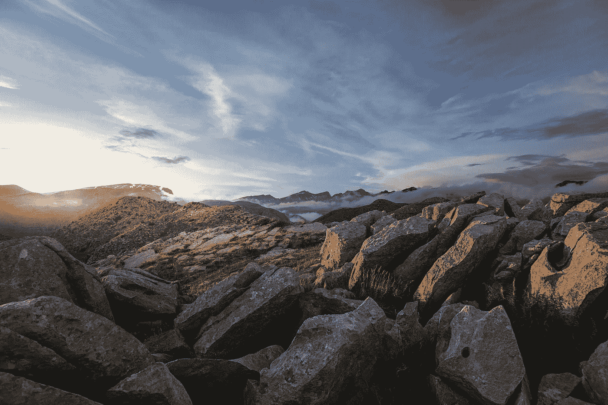

# “技术与未来的终结”:解读詹姆斯·布里德的未来观

> 原文：<https://medium.com/codex/technology-and-the-end-of-the-future-understanding-james-bridle-s-vision-of-the-future-c2fded596271?source=collection_archive---------18----------------------->

伊庇鲁斯，照片由 Giannis Katemoglou 在 Unsplash 上拍摄

## 在 2019 年 TEDxPatras 的一次题为“当人工智能遇到地球”的演讲中，演讲者詹姆斯·布赖德(James Bridle)描述了希腊伊庇鲁斯(Epirus)一个田园般的农村环境，当太阳落山时，他和一些朋友在湖边。有人在吹单簧管，青蛙发出声音，这是一个非常宁静的场景。过了一会儿，他在树林里散步，注意到一些被打入地里的木桩，上面有写着字母和数字的标签。这些标记是横跨伊庇鲁斯数千公里的巨大网格的一部分，用于地震勘探计划，旨在发现可开采的石油和天然气矿藏。

## 在这个田园诗般的环境中，人工智能程序被开发并用于生产最终可能摧毁自然的东西:更多的石油生产和消费，这是另一个有争议的技术使用的例子——使用高度发达的技术，而不考虑环境或社会成本。

詹姆斯·布里德是英国作家、艺术家、记者和技术专家，生于 1980 年，现居希腊。他拥有计算机科学和认知科学硕士学位，专攻语言学和人工智能。他写关于文学、文化和网络的文章，他的文章被《连线》、《大西洋》、《卫报》和《金融时报》发表。他定期在电台、会议、大学和其他活动中发表演讲，他是纽约大学交互式电信项目的兼职教授，荷兰艺术学院的讲师，雅典奥纳西斯航空无限排练学校的召集人。

詹姆斯·布赖德写了**《新黑暗时代:技术和未来的终结》** (2018 年)和**《新的视角:超越人类智慧》** (2022 年)。

在**《新黑暗时代》(New Dark Age)**中，他对我们无力应对影响我们思考、理解和行动能力的日益复杂的技术过程提出了严峻的看法。

他说:*“在过去的一个世纪里，技术的加速已经改变了我们的星球、我们的社会和我们自己，但是它并没有改变我们对这些事情的理解。造成这种情况的原因很复杂，答案也很复杂，尤其是因为我们自己完全陷入了技术系统，而技术系统反过来又塑造了我们的行为和思维方式。我们不能站在他们之外；没有他们，我们无法思考。*

我们的技术是我们今天面临的最大挑战的同谋:失控的经济体系使许多人陷入贫困，并继续扩大贫富差距；全球政治和社会共识崩溃，导致民族主义、社会分裂、种族冲突和影子战争加剧；气候变暖，威胁着我们所有人。"

在他的书中，他使用了许多学科，从计算机科学到地理和气象学，从历史到政治，来证明他的基本命题:我们收集的关于世界的信息越多，我们就越不能理解它。对 Bridle 来说，我们生产和处理不断增长的信息量的能力，与我们对世界的理解的相应增长并不匹配。我们拥有大量的知识，但我们还没有学会如何思考。几乎无限的计算能力所产生的世界愿景总是要求更多——更多的能量，更多的数据，但这产生了一个恶性循环:解决方案只会加速它打算解决的症状。我们当前的社会和环境问题构成了他所描述的即将到来的“新黑暗时代”，这个时代迫切需要我们开发新的方式来理解、分析和应对塑造我们世界的技术。我们需要一种新的“技术素养”。

在他的新书**“新的观察方式:超越人类智能”**中，鉴于人工智能的快速发展，James Bridle 再次审视了技术对现代社会的影响，并探讨了对理性的更广泛理解应该如何帮助我们重新审视关于人类卓越的假设。

在探索章鱼、蜜蜂甚至植物等动物的智能时，Bridle 呼吁理解除我们之外的智能，以此作为理解技术、社会和环境复杂相互作用的手段，使用人工智能来帮助我们通过遵循自然和生命体固有的逻辑以另一种方式解决问题。

在这本书的结尾，马勒回到伊庇鲁斯，见证了一个完全不同的开发项目:一个金属农场。最近，研究人员发现了一些被称为超积累植物的植物家族，它们能够在富含金属的土壤中生长。这些植物从土壤中吸收金属并储存在它们的嫩枝和叶子中，在这个过程中修复土壤。由于该地区的土壤含有铬、铁、钴和镍，大多数植物都难以在其中生存，这个名为 agromining 的项目将允许修复污染的土壤，同时收获和开采金属，这与上述石油和天然气开发项目的理念完全相反。

Bridle 的艺术作品围绕着他的书。他的作品在画廊、博物馆和网上展示，展示了技术替代用途的想法和技术，如柠檬电池 **Aegina 电池**、http://jamesbridle.com/works/aegina-battery、**风车 03** 、对传统希腊风车的再现[http://jamesbridle.com/works/windmill-03](http://jamesbridle.com/works/windmill-03)、**放射虫系列**， 一批刻有放射虫图像的 100 瓦光伏发电机——微型海洋生物用二氧化硅构建矿物骨架([http://jamesbridle.com/works/solar-panels-radiolaria-series](http://jamesbridle.com/works/solar-panels-radiolaria-series))、**服务器农场**，一个利用植物和其他生物构建计算机的项目([http://jamesbridle.com/works/server-farm-test-plot-001](http://jamesbridle.com/works/server-farm-test-plot-001))和**萨罗尼克·塞加尔**，一个可以由新手建造的木结构家庭卧室结构([http://jamesbridle.com/works/saronic-segal](http://jamesbridle.com/works/saronic-segal))。

在他的博客**booktwo.org**([http://booktwo.org](http://booktwo.org))中，他写下了自己的作品和想法。