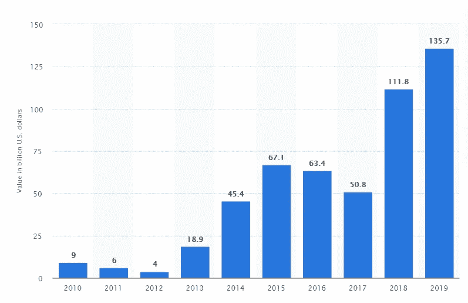

# 科技在金融中的关键作用——金融科技

> 原文：<https://medium.com/codex/technologys-pivotal-role-in-finance-the-fintech-5e8f15e51279?source=collection_archive---------0----------------------->

Alexandre Debiève 在 [Unsplash](https://unsplash.com?utm_source=medium&utm_medium=referral) 上的照片

## 药典

## 深入探究这一革命性的概念，并开始探索它在塑造未来方面的潜力

# Fintech 是什么意思？

每一次探索都从定义开始。说完这些，我们再来看看 Fintech(金融科技)的实际定义。

> **Fintech 是一个术语，指的是由技术驱动的金融领域的创新。此外，它还指任何通过技术手段向客户提供增强的金融服务的公司。**

最近几天，金融科技正在通过将金融的视角从人工转向自动化来塑造世界的进程。金融科技释放的力量被公司、企业家等所利用。寻找最佳工作流程管理、金融服务等解决方案。

在成立之初，fintech 只是作为银行和其他金融机构的后端系统。几年后，它扩大了网络，更加专注于基于消费者的应用。Fintech 的基本前提是——*‘通过易用的技术让人们获得各种金融服务’。*

金融科技以其潜力而闻名，正在被部署到各个领域，如教育、投资管理、银行服务、非营利组织和筹款组织。金融科技提供的更广泛的可访问性正在改变客户跟踪其家庭支出和促进其融资的观点。

下一个耐人寻味的问题是，除了为客户预算应用程序，fintech 还有哪些创造性的创新？

# 金融科技创新

## **1。区块链**

这是世界上增长最快的金融科技应用之一，预计未来将快速增长。区块链在其母技术比特币和加密货币发明后达到了顶峰。区块链引领金融数字化时代更上一层楼。基本上，区块链是一种分布式账本技术(DLT)，由区块分隔，以在广泛的网络上存储交易。这项技术帮助一个人与另一个人进行交易，而不需要中介或第三方组织。区块链以其独特的方式验证身份并保护交易不被篡改，从而树立了一个商标。投资者对区块链行业很贪婪，正在向其市场投入数十亿美元。

## **2。InsurTech 和 RegTech**

保险业是世界上最古老的行业之一，缺乏创新和技术。为了打破这种局面，InsurTech(保险技术)应运而生。InsurTech 的愿景是用创新的设计和技术打破旧的保险业模式。为了打破陈旧，从竞争中脱颖而出，InsurTech 初创公司正在使用人工智能(人工智能)和深度学习(机器学习的一个子集)来建立更好的模型，并为个人优化政策。由于其监管问题，InsurTech 一直是一个有争议的想法，但在 RegTech(监管技术)的帮助下，不再是这样了。

保险业是一个高度监管的金融部门，有许多法律和法规，需要非常仔细地规划。但是，在 InsurTech 的案例中，初创公司在建立完善的监管模型方面落后了。为了解决这些问题，引入了 RegTech。这是一个技术驱动的监管处理管理系统，使用 SaaS(软件即服务)构建，以帮助初创公司和企业构建监管系统，以高效、低成本地满足他们的标准。最近几天，随着在线交易和互联网的使用越来越多，数据泄露和网络攻击在公司中不断发生。在 RegTech 的帮助下，公司受到监督，进行的网上交易完全安全。此外，它还利用数字化环境实时检测异常和欺诈活动。

## **3。开放式银行**

开放银行是一个概念，其中银行允许通过使用第三方组织的应用程序接口(API)访问客户的交易和其他金融数据。通过使用这些数据，第三方组织构建银行或其他金融应用程序，让客户体验数字货币管理的新景观。通过开放式银行应用程序，人们可以探索各种各样的功能，如费用监控、数字钱包和简单的点对点交易。开放银行应用程序的最佳现实例子是 [Mint](https://www.mint.com/) ，它提供了一体化的金融管理工具。

# 全球金融科技投资

随着金融科技行业的发展速度比以往任何时候都快，投资者的目光逐渐转向了它。

资料来源:[统计局](https://www.statista.com/)

这个条形图展示了从 2010 年初到 2019 年底全球金融科技投资的趋势。可以看出，尽管 2017 年有所下降，但从 2012 年的 40 亿美元增长到 2019 年底的 1357 亿美元。投资者认为这种革命性的技术将带来金融业的巨大变化，因此他们开始在投资组合中为金融科技初创公司和公司留出空间。此外，最近几天，天使投资人承诺为金融科技初创公司提供巨额资金，以管理他们的一轮融资。特别是两家公司，即 [Opendoor](https://www.opendoor.com/) 和 [Credit Karma](https://www.creditkarma.com/) 以其向客户提供解决方案的理想方式赢得了投资者的青睐。进一步阅读了解这些公司。

## **开门**

Opendoor 是一家技术驱动的房地产公司，允许人们即时买卖房屋，这使得这家公司脱颖而出。Opendoor 从客户那里获得收入，其形式是每次交易过程中收取的费用，无论是购买还是出售房屋。通常，根据他们团队的说法，从总金额中收取的费用百分比在 7%到 13%之间，但从未超过 13%。Opendoor 自成立以来已经从许多风险投资家和天使投资人那里筹集了几轮基金。

1.2014 年 3 月，它从 Khosla Ventures 获得了 995 万美元的风险投资，开始运营。

2.2018 年，它从软银集团愿景基金筹集了约 4 亿美元的资金。

3.后来，在 2019 年，它筹集了由通用大西洋公司牵头的 3 亿美元资金。在此次融资时，Opendoor 的企业估值为 38 亿美元。

## **信用因缘**

从它的名字我们就可以了解到，信贷卡玛是一家个人金融公司尤其是征信。它以向顾客提供免费服务而闻名。它的一些最佳服务包括税务准备、资金管理和识别错误。作为一家无偿公司，Credit Karma 如何创造收入？这很简单。Credit Karma 与各种金融公司合作，并通过其应用程序向客户推荐他们的产品。如果客户根据给定的推荐购买产品，Credit Karma 会从其外部合作中赚取费用。从这些收入中，Credit Karma 可以管理其免费服务和工具。与 Opendoor 一样，Credit Karma 自成立以来已经领导了各种系列的筹款活动。

1.2009 年 11 月，它完成了一笔 250 万美元的首轮融资交易，来自 QE 投资者以及 SV Angel、Felicis Ventures 和 Founders Fund。

2.2013 年，它从 Ribbit Capital 和 Susquehanna Growth Equity 获得了 3000 万美元的 B 轮融资。

3.2014 年，它获得了来自 CapitalG、Tiger Global Management 和 Susquehanna Growth Equity 的 1.6 亿美元 C 轮融资。

截至 2015 年底，Credit Karma 的估值为 35 亿美元，已筹集资金 3.685 亿美元。令人惊讶的是，2020 年 2 月，软件公司 Intuit 宣布以 71 亿美元的价格收购 Credit Karma。

# 印度的金融科技投资

印度被认为是世界上领先的金融科技中心之一，2019 年印度的金融科技投资几乎翻了一番，从 2018 年的 19 亿美元增加到 37 亿美元。根据 Business Line 的一份报告，尽管疫情的情况不佳，保险技术领域的投资到目前为止一直在飙升，从 1.12 亿美元增加到 1.86 亿美元。印度金融科技投资的激增是因为初创公司的稳定增长，这些公司为牢牢抓住金融科技奠定了坚实的基础。需要强调的是，印度拥有全球第二大金融科技初创公司，有 2565 家公司，而 2014 年只有 737 家。印度金融科技投资的两个最突出和最理想的驱动因素是 Paytm 和 T2 policy bazaar。

## **Paytm**

Paytm 是一家电子商务支付网关，也是一家总部位于印度的金融科技公司。它是人们广泛使用的支付网关之一。举例来说，Paytm 目前拥有超过 1.4 亿用户(全球 3.65 亿用户)，仅在印度登录金融服务的客户就实现了 30 亿次会话。Paytm 目前正处于胚胎阶段，以实现其数字卓越的愿景，这可以在 2018-2019 财年的年度报告中看到。在该报告中，我们可以观察到他们的运营收入(324.4 亿卢比)远低于其支出流(672.8 亿卢比)。但是，从公司的角度来看，这笔费用被视为对未来增长的投资，因为他们的费用主要用于支付网关费用(2，241，000 卢比)和促销活动(3，366，000 卢比),以将产品分发给不同地区的客户。Paytm 的收入模式完全基于佣金和其他外部附属机构。Paytm 的融资额高于 OpenDoor 和 Credit Karma。在筹款的过程中也涉及到一些大玩家。

1.2015 年 3 月，它与中国电子商务巨头[阿里巴巴集团](https://www.alibabagroup.com/en/global/home)达成交易，获得 pay TM 40%的股份。在与阿里巴巴集团的交易之后，Paytm 得到了 T2 塔塔集团总经理拉坦·塔塔的个人支持。

2.2015 年后，它从[山地资本](https://mountainlp.com/)筹集了 6000 万美元资金。

3.2017 年 3 月，Paytm 获得了单个投资者的最大一轮股权[软银](https://global.softbank/)，使 Paytm 的估值达到 10 亿美元。

4.2018 年 8 月，它与世界上最大的投资公司[伯克希尔·哈撒韦](https://berkshirehathaway.com/)达成了一笔 3.56 亿美元的交易，使该公司能够收购 pay TM 3%至 4%的股份。

截至 2019 年 11 月 25 日，Paytm 筹集了 10 亿美元，作为各投资公司牵头的基金。

## **政策集市**

PolicyBazaar 是一家保险聚合公司和金融科技公司，总部位于印度，以其各种保险计划而闻名。最近，它推出了名为“冠状病毒定期保险”的冠状病毒定期保险，这代表了它在制定保险计划方面的乐观态度。随着 RegTech 和 InsurTech 等新兴技术的出现，PolicyBazaar 的不断增长和传播永无止境。PolicyBazaar 的收入模式是可以理解的。首先，PolicyBazaar 作为附属机构与外部保险公司合作。其次，它推广外部保险公司的保险产品，并在其网站上创建一个门户网站。最后，如果客户购买任何代理产品，PolicyBazaar 将从其附属公司或外部保险公司获得佣金。由 PolicyBazaar 基金牵头的系列被认为是从上述公司筹集资金最多的一轮。

从种子开始，[Info Edge](http://www.infoedge.in/),[Naukri.com](http://naukri.com/)的母公司在 2008 年中期投资了 278 万美元。

1.2011 年晚些时候，[英特尔投资](https://www.intel.com/content/www/us/en/intel-capital/overview.html)(英特尔公司的补贴)和 Info Edge 共同投资了 830 万美元作为风险投资。

2.A 轮:PolicyBazaar 从英特尔投资公司和 Inventus Capital Partners 获得了 900 万美元的 A 轮投资。

3.B 轮:2013 年秋天，这一轮 B 轮融资再次由其老股东英特尔资本、Info Edge 和 Inventus Capital Partners 牵头，与 PolicyBazaar 达成了一笔 500 万美元的交易。

4.C 轮:在这一轮融资中，它与老虎环球管理公司一起从现有投资者那里获得了 2000 万美元。

5.D 轮融资:PolicyBazaar 在 D 轮融资中从 Premji Invest 筹集了约 4000 万美元，prem Ji Invest 是 Wipro 董事长阿齐姆·普莱姆基的个人投资子公司。除了 Premji Invest， [Steadview Capital](https://sites.google.com/view/steadview/) 和 ABG 资本也参与了 D 轮融资。

6.E 轮:在这轮融资结束时，PolicyBazaar 获得了 7700 万美元，由至少三名新投资者领投，包括 [TrueNorth](https://truenorth.co.in/) 和 [IDG 风险投资伙伴](https://www.idgcapital.com/)。在 E 轮融资中，各种媒体报道称波士顿资产管理公司[惠灵顿管理集团](https://www.wellington.com/en/)投资了 PolicyBazaar。

7.F 轮:2018 年 6 月，PolicyBazaar 在 F 轮融资结束时共筹集了 2.38 亿美元。这轮融资主要由软银集团牵头，软银集团以 1.5 亿美元的价格收购了 policy bazaar 15%的股份。

从种子期开始，PolicyBazaar 自成立以来共筹集了 3.66 亿美元。

# 结论——金融科技的未来

金融科技公司将在金融业占据主导地位，因为它们在生产率方面的效率，以及为客户探索各种金融产品提供空间。金融科技链的增长速度比以往任何时候都快，因为它通过其工具为客户优化资金管理变得更加简单。是时候正确看待事情了。

## Fintech 未来会有怎样的表现？

金融科技的技术进步将重塑许多行业的基础设施，使其功能适应自动化和人工智能的数字环境。

首先，金融科技的发明可以破坏许多其他遗产系统，如银行、保险等。因为他们无法保持相当于金融科技网络的快速速度。其次，数据和分析将在未来发生转变。数据将成为一家公司的基本要素，这不会改变，但数据的分布将根据金融科技网络而改变。最重要的是，客户体验将是关键。毫无疑问，金融科技(fintech)将成为下一个为客户提供金融和科技新时代景观的大事件。

## 我们能从金融科技的增长中获利吗？

对金融科技公司的投资将是巨大的，我们甚至无法想象。这将是最佳投资金融科技初创公司的时机。由于基于金融科技的创业公司目前处于萌芽阶段，你可以以更低的价格购买他们的股票，并在未来几个月内以非常高的价格出售。此外，金融科技初创公司和公司的不断增加将在未来创造数百万个就业机会。

## Fintech 是未来的好职业吗？

这是绝对的肯定。金融科技是一个革命性的概念，将通过数字化和自动化改变整个社会。所以，会有很多适合你的创新和创意的工作。重要的是，我们需要用当前的技术来更新自己，比如区块链、人工智能、智能合同、拥有合法资源的闪电网络。如果你不知道从哪里开始，有大量的文档和在线课程。所以，选择你的道路，找到你的激情，打造产品，永远不要结束你的学习。

**快乐创新！**