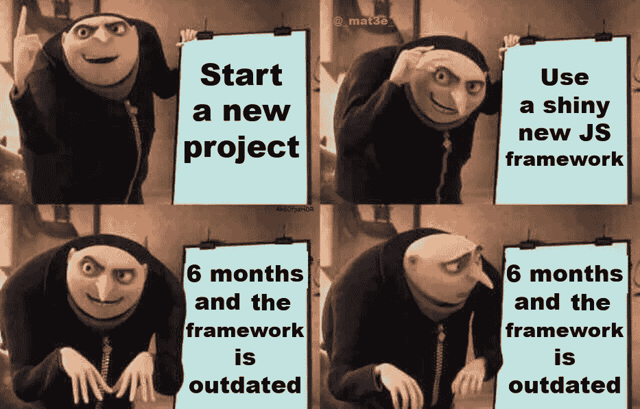

# 科技对新奇事物的极度痴迷

> 原文：<https://medium.com/codex/techs-deadly-obsession-with-novelty-20b4a5f721cb?source=collection_archive---------20----------------------->

## 更新更好，但更好并不总是更好。

来源:Reddit

作为工程师，如果有一件事是我们喜欢做的，那就是改变事物。只要有可能，为什么不把它变得新颖、华丽、闪亮呢？毕竟，创新是游戏的名字，对吗？当你挑战现状并以全新的方式重塑它时，伟大的事情就会发生。