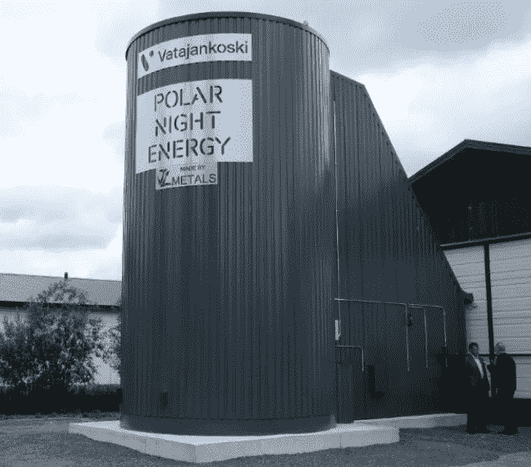

# 说说一个“沙电池！”

> 原文：<https://medium.com/codex/tell-me-about-seasonal-heat-storage-499d7998aa30?source=collection_archive---------5----------------------->

## 认识创新者极地夜间能源及其季节性储热！

[砂仓(极地夜间能源媒介)](https://images.squarespace-cdn.com/content/v1/5c46f3f95b409bd645a27646/9f547053-74b0-414d-b803-2b0499d6416d/Sand_battery.jpg?format=1500w)

简而言之，极地夜间能源公司希望提升太阳能和风能，以满足每个人的取暖和用电需求。为了实现这一目标，他们申请了高温、大规模储热的专利。