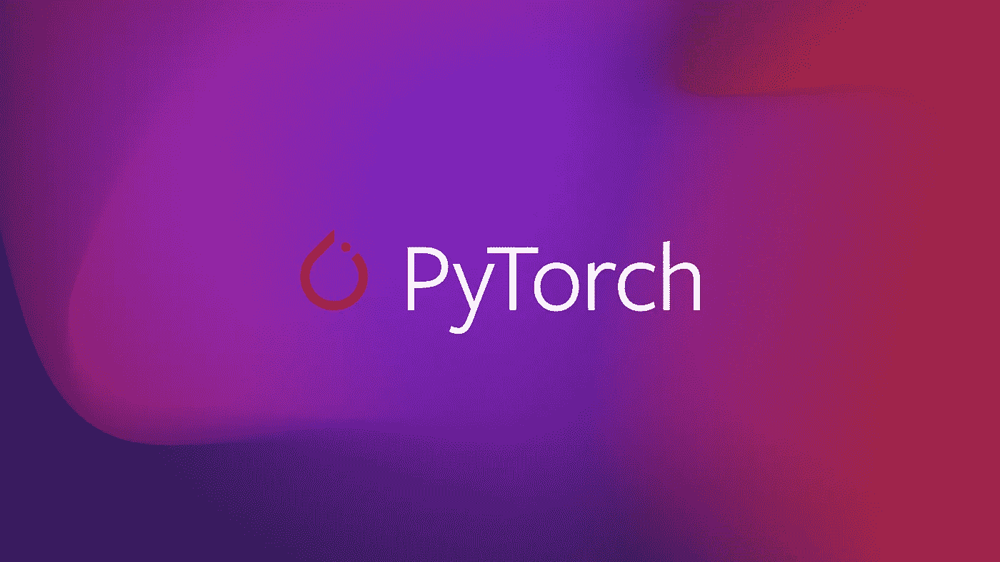

# PyTorch 中的张量基础

> 原文：<https://medium.com/codex/tensor-basics-in-pytorch-252a34288f2?source=collection_archive---------14----------------------->

张量是 PyTorch 库的基本数据结构。

D eep 学习是监督机器学习的主流之一，使用输入和标记输出，我们的目标是开发一个将输入映射到输出的函数。*深度学习*是*深度的*，确切地说，它的模型学习许多*层*的转换，其中每一层提供一个级别的表示[1]。深度学习框架在传播思想方面发挥了至关重要的作用。第一代允许简单建模的框架包括 [Caffe](https://github.com/BVLC/caffe) 、 [Torch](https://github.com/torch) 和[the ano](https://github.com/Theano/Theano)【1】。在本教程中，我们将讨论 PyTorch 中张量的基础知识。



# 安装 PyTorch

**PyTorch** 是一个基于 Torch 库的开源机器学习库，用于计算机版本和自然语言处理等应用，主要由脸书的 AI 研究实验室(FAIR)开发。

PyTorch 有两个高级特性:

*   张量计算(如 [NumPy](https://en.wikipedia.org/wiki/NumPy) )通过[图形处理器](https://en.wikipedia.org/wiki/Graphics_processing_unit) (GPU)实现强大加速
*   [深度神经网络](https://en.wikipedia.org/wiki/Deep_neural_networks)建立在基于类型的[自动微分](https://en.wikipedia.org/wiki/Automatic_differentiation)系统上

关于安装指南，请参考 PyTorch 网站[这里](https://pytorch.org/get-started/locally/)。在为该版本选择了一些特性(如操作系统、包和语言)后，您可以按照出现在`Run this Command:`中的命令或者按照给出的 URL 下载并安装源代码。为了利用 CUDA 功能，您的系统应该配备 NVIDIA GPU。为了检查你的系统是否支持 CUDA，请点击查看[。](https://developer.nvidia.com/cuda-gpus)

# 张量

PyTorch 引入了一个基本的数据结构:张量。对于那些来自数学、物理或工程的人来说，术语*张量*与空间、参考系统以及它们之间的转换概念捆绑在一起【2】。在深度学习方面，张量是向量和矩阵在任意维数上的推广。换句话说，**张量是一个多维数组。**


张量[2]

从上图可以看出，张量代表一个(可能是多维的)数值数组。对于一个轴，张量(在数学上)对应于一个*向量*。对于两个轴，一个张量对应一个*矩阵*。多于两个轴的张量没有特殊的数学名称。

PyTorch 不是唯一处理多维数组的库。NumPy 和 tensor 中的多维数组有几个共同点。然而，当谈到加速器时，GPU 很好地支持加速计算，而 NumPy 只支持 CPU 计算。第二，张量类支持自动微分。这些性质使得张量类适合深度学习。下面，我们将带您了解 PyTorch 中张量的一些主要操作。

# 将 PyTorch 库导入 Python 脚本

你可以用

`import torch`

在代码实现中使用 Pytorch。

# 检查您的系统中是否有 CUDA

使用以下代码检查您的系统是否支持 CUDA 进行 GPU 加速。

```
torch.cuda.is_available()
```

输出为布尔型，其中`True`表示有 CUDA，而`False`表示没有 CUDA。

# 构建张量

你可以直接调用张量变量

```
#an empty multi-dimensional (2 * 3 * 2) tensor
torch.empty(2, 3, 2)# a 1*12 vector
torch.arange(12)#a random 1*2 matrix 
torch.rand(1, 2)#a random 1*2 matrix drawn from Gaussian distribution 
torch.randn(1, 2)#a zero-filled 1*2 matrix 
torch.zeros(1, 2)#a 1*2 matrix filled with only 1
torch.ones(1, 2)#Specifying the type of the elements of the tensor
torch.ones(1, 2, dtype=torch.int)
```

或将列表或 NumPy 数组转换成张量

```
#converting list into tensor
x = [1, 2, 3, 4, 5]
torch.tensor(x)#converting NumPy into tensorimport numpy as np
x = np.array([1, 2, 3, 4, 5])
y = torch.from_numpy(x)# *Assign a copy of `x` to `y` by allocating new memory
y = x.clone()*
```

> *请注意，在将 NumPy 转换为张量时，它们都指向内存中的同一个位置。换句话说，如果你改变了 NumPy 变量，* `*x*` *这里的张量版本，* `*y*` *，也随之改变。*

# 张量的类型和形状

使用下面的代码，你可以检查张量的类型及其组成元素。

```
x = torch.ones(1, 2, dtype=torch.int) #type of variable
type(x)#type of the elements of tensor
x.dtype#type of the elements of tensor
x.type()#shape of tensor
x.shape#total number of elements in a tensor
x.numel()
```

# 限幅

可以通过以下方式访问给定维度中的给定元素或元素子集

```
x = torch.rand(5, 3)
#tensor([[0.4788, 0.8171, 0.7119],
         [0.9143, 0.4804, 0.0356],
         [0.7858, 0.5312, 0.0178],
         [0.9417, 0.1743, 0.0691],
         [0.7302, 0.6352, 0.8515]]#first column
x[:, 0]# first row
x[0, :]#row:1, column:3
x[1,3]
```

要访问非张量类型格式的张量的单个元素，我们可以使用`item()`方法，如下所示

```
#tensor format - tensor(0.4804)
x[1,3]#scalar format
x[1, 3].item()#scalar format with type
float(x[1, 3]) 
int(x[1, 3])
```

注意`item`方法只适用于张量的一个元素。如果将它应用于多维数组张量，就会产生误差。

```
x[:,1].item()
```


如果“item”用于多维数组，则出现错误

# 调整大小/整形

我们可以通过以下方式调整预定义张量的大小

```
# a 3*5 tensor
x = torch.rand(3, 5)#resize x to 1*15
y = x.view(15)#PyTorch can set the dimension automatically if -1 is given
y = x.view(-1, 3)#another way to reshape the tensor
x.reshape(5, 3)
```

请注意，调整后的张量维数乘积应该保留在输出中。例如，您可以将 3*5 的大小调整为 2*8，因为第一个大小是 15，第二个大小是 16。我们通过为我们希望张量自动推断的维度放置`-1`来调用自动维度发现功能。

# 串联

我们可以使用 concatenate 操作按行(dim=0)或按列(dim=1)堆叠矩阵。

```
#concatenate along row
torch.cat((X, Y), dim=0)#concatenate along column
torch.cat((X, Y), dim=1)
```

# **算术运算**

张量是 PyTorch 处理不同操作和存储数据的主要模块。不同的算术运算可以用不同的格式实现。

```
#defining two 2*2 tensor
x = torch.rand(2,2)
y = torch.rand(2,2)#Addition
x+y
torch.add(x,y)#Subtraction
x-y
torch.sub(x, y)#Multiplication
x*y
torch.mul(x, y)#division
x / y
torch.div(x, y)#*exponentiation, x to power y
x**y*#functional operation
torch.exp(x)
```

PyTorch 还支持就地操作。它使您能够将操作的输出直接赋给给定的变量。在机器学习模型处理成千上万个参数的情况下，这可以为你节省大量内存。此外，我们可能会从多个变量指向相同的参数。如果我们不就地更新，其他引用仍然会指向旧的内存位置，这使得我们的部分代码可能会无意中引用过时的参数。操作的就地版本如下:

```
#add x to y and replace it into y
y.add_(x)#also
y += x#subtract
y.sub_(x)
#also
y -= x#multiplication
y.mul_(x)
#also
y *=x#division
y.div_(x)
#also
y /=x
```

> 一般来说，当 PyTorch 中的任何方法中有下划线`_`时，表示修改就地发生。

# 将张量转移到 CPU 或 GPU

张量可以驻留在 CPU 或 GPU 中。为了利用 GPU 的能力，张量应该转移到 GPU 范围。

```
if torch.cuda.is_available():   # first check if CUDA is available
    device =torch.device("cuda") # set the device to CUDA
    x = torch.ones(5, device=device) #move the tensor to GPU#another form of GPU transfer
y = torch.ones(5)
y = y.to(device)
```

如果我们想把变量传送回 CPU，我们可以用`to('cpu')`方法作为

```
#move back to the CPU
x = x.to("cpu")
```

CPU 后移对于执行一些操作是必要的，特别是当从张量转换到 NumPy 时，这将在下面讨论。

**张量到数字**

只有当变量驻留在 CPU 上时，才能将张量转换为 NumPy 格式。如果张量位于 GPU 中，会抛出错误。要想成功，首先要把张量传入 CPU。

```
#tesnor resides in CPU
x = torch.ones(1, 5)#convert tensor to NumPy
z = x.numpy()
```

如果张量驻留在 GPU 中，首先应该将其移回 CPU，然后转换为 NumPy:

```
if torch.cuda.is_available():   
    device =torch.device("cuda") 
    x = torch.ones(5, device=device) #move the tensor to GPU#Since x is located in GPU, it should move back to CPU
x = x.to("cpu")
z = x.numpy()
```

就是这样！

# 参考

【1】[https://d2l.ai/chapter_introduction/index.html](https://d2l.ai/chapter_introduction/index.html)

[2]史蒂文斯、伊莱、卢卡·安提加和托马斯·维赫曼。*用 PyTorch 进行深度学习*。曼宁出版公司，2020。