# 实践中的 TensorFlow 2.0 自定义回调:更好数据产品的实用程序

> 原文：<https://medium.com/codex/tensorflow-2-0-custom-callback-in-practice-an-utility-for-data-products-be6a066f6eb1?source=collection_archive---------4----------------------->


来源:https://en.wikipedia.org/wiki/TensorFlow

## 增加增量效益和改善神经网络训练的回调策略

正如我们所知，神经网络是一系列模拟人脑运作的算法，用来识别大量数据之间的关系。在神经网络的设计过程中，我们有无数的选择来使模型最适合给定的数据。在我准备 [google TensorFlow 开发者认证考试期间，](https://www.credential.net/a093f35c-bb93-42ec-b524-75d5e2f9265c#gs.qlqwrz)我学到了一些很酷的技术来提高深度学习模型的质量。除了一些关键时刻艰苦的 n/w 设计选择，如节点数、层数、大量变量&偏置初始化、激活函数等。有一些唾手可得的成果，比如控制学习速度，训练次数等等。在训练非常深的神经网络期间，平衡训练过程的一种方法是在训练过程中最优地添加早期停止。虽然 TensorFlow 2.0 回调主要用于类似于 XGBoost/LGBM 等 ML 算法中的早期停止方法，但它对训练具有完全的控制权。在这篇博客中，我将讨论不同的回调 TensorFlow 2.0 回调方法——标准的和定制的。

## **回调和收益**

通俗地说，回调就是我们可以用来控制神经网络(NN)训练的控制器之一。具体来说，回调是在训练期间可以实现以下功能的功能块:
a)基于性能监控的早期停止
b)控制学习速率
c)定期存档最佳可用模型权重
d)训练的有条件硬停止
在进入不同的回调策略之前，让我们简要讨论一下回调在模型质量和工程方面的实际好处。

**i)正则化**:由于回调概念的中心思想是训练的早期停止，在 ML 机制中，这是一种简单而有效的正则化技术。由于这种技术是克服可能的 ***过度拟合*** 问题的唾手可得的果实，杰弗里·辛顿称之为“美丽的免费午餐”，很多时候这些简单的技术给我们带来了显著的改善。

**ii)资源节省:**复杂的神经网络训练，涉及大量计算，基于人工智能的应用程序中的大量反向传播计算，涉及图像和视频(例如，自动驾驶汽车、[虚拟现实](https://en.wikipedia.org/wiki/Virtual_reality)等)。)具有 1000 次迭代(时期)的训练过程需要大规模的基础设施。下表说明了 3 种标准 CNN 架构在不同硬件平台上的典型训练运行时间，这些平台从一般的 CPU 到非常高端的 GPU。这只是使用涉及静态图像训练的标准架构的单个训练过程。训练许多这样的网络的复杂 AI 系统(涉及视频),每个网络具有许多模型拟合选项(超参数调整),可以很容易地花费几天时间/相当于 GPU 计算的并行操作。

为了收集更多与 N/W 培训过程的工程方面相关的信息，我建议您阅读本文。[https://www . researchgate . net/publication/328458615 _ Evaluating _ Training _ Time _ of _ Inception-v3 _ and _ Resnet-50101 _ Models _ using _ tensor flow _ across _ CPU _ and _ GPU](https://www.researchgate.net/publication/328458615_Evaluating_Training_Time_of_Inception-v3_and_Resnet-50101_Models_using_TensorFlow_across_CPU_and_GPU)

通过回调方法的智能，训练的最佳早期停止将节省大量的 GPU 时间。此外，TensorFlow 2.0 回调方法为我们提供了定期保存更新的模型权重的灵活性，因此在可能出现云断开问题的情况下，我们可以节省重新运行的资源。

为了获得大概的成本(美元)节省估计，例如使用 GCP，我宁愿参考以下链接[https://cloud.google.com/products/calculator/](https://cloud.google.com/products/calculator/)

[https://cloud.google.com/compute/gpus-pricing](https://protect-eu.mimecast.com/s/bbiZCRllJSnzZkNH91mbR?domain=cloud.google.com)

**业务应用**

现在，我们将简要讨论这些不同的回调策略，根据一个所有行业都非常通用的预测方法-时间序列预测，它适用于任何行业。这里我将首先生成典型的模拟时间序列，然后结合不同的回调方法训练 NN，以影响训练过程，最终达到我们的目标。包括数据准备代码在内的详细方法可以在这个 [github 库](https://github.com/nitsourish/TF2_callbacks-)中找到。

**步骤 1:时序准备**

这里我们创建一个 idea 时间序列，具有趋势性、季节性和 4000 个时间戳的噪声。以下是该系列的组成部分。

```
time_period = 4000
baseline = 10
trend = trend(time,0.05)  
baseline = 10
amplitude = 35
slope = 0.004
noise_level = 3
seasonality_period=400
```

我们已经合成了 3350 个时间戳训练数据和 650 个时间戳的测试/验证窗口。我们选择均方误差(MSE)作为这个问题的单一评价指标。

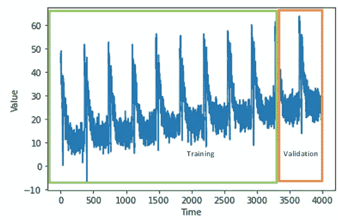

合成时间序列

**第二步:设置基准**

由于该系列在数学上具有可预测的模式，让我们通过平滑该系列来创建一个大概的解决方案——基准移动平均线(MA)解决方案。当平滑信号时，MSE 是 45.5676。

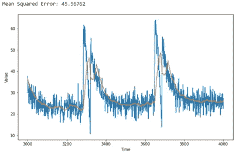

移动平均预测

我们能使用更复杂的统计建模技术来改进预测吗？让我们试着用一个标准的 ARIMA(自回归综合移动平均)模型来得到更精确的解。

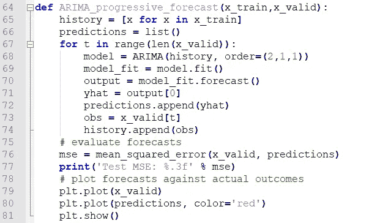

现在，我们有了一个优秀的模式和验证基准，MSE 为 21.882，几乎减少了 50%。

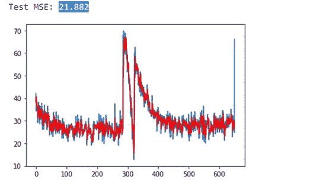

ARIMA 预测

由于我们已经有了近乎完美的预测模式，让我们来探索一下神经网络是否能超越这个基准。

**第三步:带回叫功能的 NN 训练**

> 数据准备

首先，我们必须准备好数据，使其适合输入标准的神经网络。与任何其他 ML 问题一样，我们必须将数据分为特征和标签。在这种情况下，我们的特征实际上是序列中的一些值，我们的标签是下一个值。这里的值的数量是窗口大小。我们采用一个数据窗口来训练模型，以预测下一个值。例如，如果我们取 20 个时间戳(窗口大小)，20 个值将被用作特征，下一个值是标签，并且该模式将以滚动窗口为基础遍历整个系列。

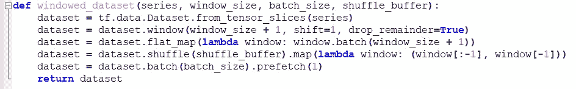

以下是 N/W 的数据准备和输入方法的设置

```
window_size = 20
batch_size = 32       
shuffle_buffer_size = 1000 #To break Sequence bias 
```

> 模型架构

现在的架构是一个 2 层双向 LSTM(长短期存储器)，LSTM。尽管出于监控目的，我们将着眼于 MSE，但对于训练优化，Huber 损失将用作损失函数，这是稳健回归中的标准函数，与平方误差损失相比，对数据中的异常值不太敏感。

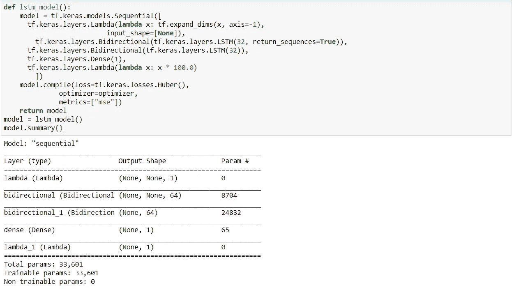

*   *第一个 Lambda 层增加了处理一维数组维数扩展的灵活性。窗口数据集是一批二维数据。但是 LSTM 期待三维；
*   批量大小、时间戳数量和序列维度。
*   第二个 lambda 函数将输出放大 100 倍。由于 LSTM 图层中的默认激活函数是 tanh(双曲正切激活),因此会输出介于负 1 和 1 之间的值。由于时间序列值的顺序为 10 秒，随着时间传播逐渐上升，将原始输出乘以 100 的系数使得 N/W 输出与目标大致相同，因此有助于学习过程。

在将带有回调的 NN 应用于基于 ML 的预测时，我们可以将这些方法大致分为两类——1)标准的 TF 方法，2)定制的回调子类

**1)** **标准 TF 方法**

a)***ModelCheckpoint***:作为一个标准的 TF 2.0 回调方法，model check point 基于定义的评估指标的最佳值(例如，准确性、损失等)，在某些时期后定期将模型保存为检查点文件(hdf5 格式)。).虽然不控制训练，但是这种方法在恢复重要的训练信息方面是有用的，特别是在非常长的训练时期的情况下，以避免在系统故障的情况下丢失训练更新。例如，在更便宜的 AWS EC2 spot 实例上的训练，即使 m/c 突然不可用，训练也可以从最后保存的重量恢复。

```
checkpoint_filepath = '/callback/model.h5'
model_checkpoint_callback = ModelCheckpoint(
    filepath=checkpoint_filepath,
    save_weights_only=True,
    monitor='val_mse',
    mode='min',
    save_best_only=True)
```

b) **提前停止回调**:这是默认的 TF2 回调方法，防止模型过拟合。早期停止在训练期间监视保持验证集上每个时期的模型性能，并基于以下预定义的收敛条件终止训练。通过此功能，我们可以监控任何内部 TF 指标(val_accuracy，val_mse)或任何自定义指标函数(val_auc，val_r2)

I)耐心:评价指标无改善的时期数。

ii)min_delta:满足改进标准的被监控度量值的预定义最小变化。

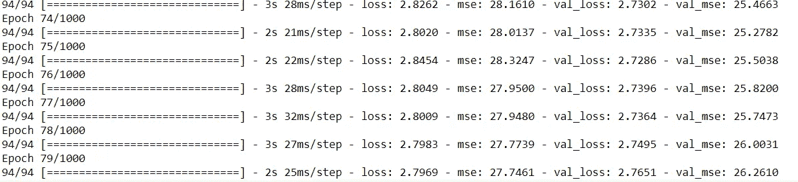

TF2 回调-提前停止

尽管有一个不错的初始解决方案，但是在太低的耐心值的情况下，总是有陷入局部最小值的可能性，并且不能实现最大性能。此外，如果模型已经达到全局最小值，非常高的耐心值可能会降低性能(过度拟合)和不必要的额外时段运行。
准确地说，这里训练停止，因为 MSE 在 5 个时期内没有提高到 25.2782 以上，但我们不知道这是否是这种 NN 配置下的最佳解决方案。如果我们绘制损失随时期的演变，似乎训练和验证曲线在大约 75 个时期后变平。

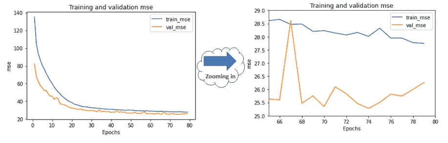

训练和验证 MSE 图

然而，当我们放大该区域时，我们发现训练 MSE 呈下降趋势，验证 MSE 呈波动轨迹。这意味着，如果我们再等几个时期来超越可能的局部最小值，可能还有进一步改进的余地。但是我们不知道还需要多少次训练来提高。

c)

**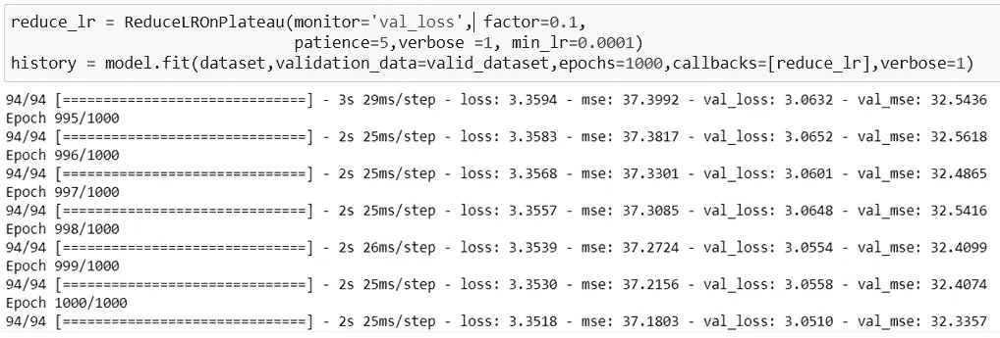**

**虽然它没有早期停止功能，但一旦学习停滞，模型通常会受益于将学习速率动态降低 2-10 倍，以克服过拟合问题(新学习速率(LR) =因子* LR)。**

**还有其他 TF2 实用程序回调方法，如 BaseLogger、CSVLogger、CallbackList、ProgbarLogger、TensorBoard 等。主要是为了更详细的培训信息(日志)。**

**对于标准回调方法，没有基于评估度量的单个值的条件停止实现。到目前为止，我们得到的最佳 MSE 是 25.2782，这与基准测试数据 21.882 相差甚远。我们可以使用相同的 N/W 架构改进模型吗？我们将在下一节探究答案。**

****2)** **定制回调子类****

**这些回调方法属于 TF2 基类“tf.keras.callbacks”。通过对这些回调进行子类化，我们可以通过添加训练的条件停止来在训练过程中带来更大的灵活性，并且可以在训练/批次/时期开始或结束时执行某些功能。这里，可以有条件地停止训练，以达到评估度量的单个定义值。这些函数的名称解释了用途，例如“on_epoch_end”或“on_epoch_begin”等。一般来说，对于一个非常长的时间周期，如 CNN 应用程序和一个非常高分辨率的图像，最好等到时间周期结束，因为可能会有明显的波动。
让我们将这个策略应用到我们的案例中，看看它是否能击败 21.882 的基准 MSE。**

**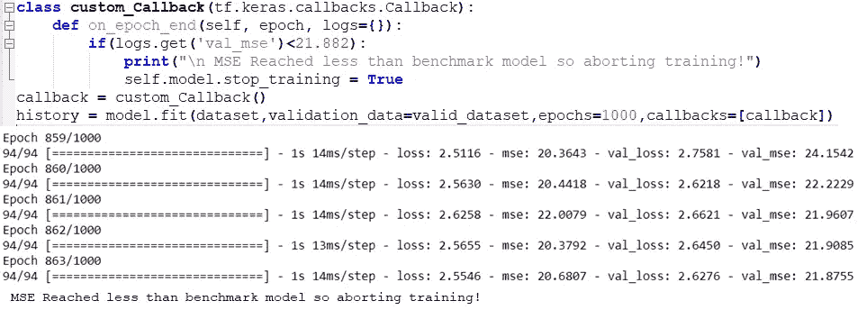**

**使用自定义回调子类进行培训**

**随着等待，直到第 839 个时期结束，我们看到训练条件收敛，因为我们达到验证 MSE 21.8755，刚好低于定义的基准 MSE 21.882。我们是否可以通过运行更少的历元来实现相同的目标，从而节省一些计算资源？**

> *****learning rate scheduler***:如果我们通过搜索大范围的学习率(LR)来包含调整学习率的智能，我们就可以。该功能允许在
> 学习过程开始时大幅度改变重量，在
> 学习过程结束时进行小幅度改变或微调。通常，训练以相对较大的值开始，并在随后的训练时段中减小该值。为了调整学习率，我们应用了一个自定义 lambda 函数，该函数通过将当前 epoch 作为参数并将其作为调度参数传递给 tf.keras.callbacks 类来返回所需的学习率。通过快速运行 100 个历元，LR 探测范围从 1e-8 到 1e-4，我们选择最佳稳定 LR 为 1e-5。**

```
lr_schedule = tf.keras.callbacks.LearningRateScheduler(
    lambda epoch: 1e-8 * 10**(epoch / 20))
```

**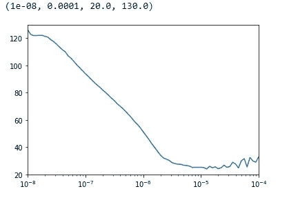**

**寻找最佳 LR**

**现在，结合自定义回调子类和学习率调度器，我们可以将选择最佳 LR 1e-5 的训练时间减少到 115！。最后，通过应用带有回调子类的 ModelCheckpoint，我们可以定期保存最佳模型，以避免任何信息丢失。**

**这样，我们通过将目标 MSE 21.589 提高 1.35%(改进的验证 MSE 21.589)，节省了大量计算资源。**

**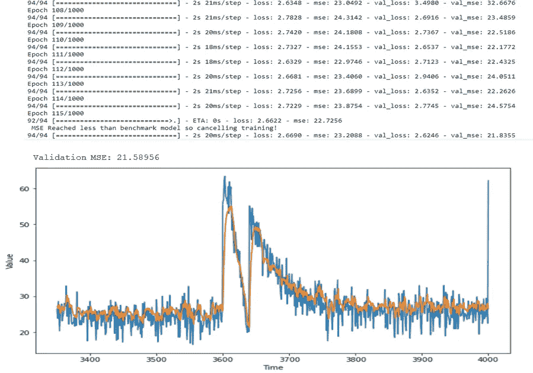**

## **外卖:**

**虽然 TensorFlow 有大量的功能来设计神经网络、控制训练过程和优化计算资源，但 TF2 的这一特殊功能不仅帮助我们构建惊人的数据产品，还帮助我们更密切地关注模型训练。虽然 TF 有许多选项来减少过度拟合，但提前停止训练的回调方法是为学习、监控、记录和资源优化添加指导原则的最简单方法之一。**