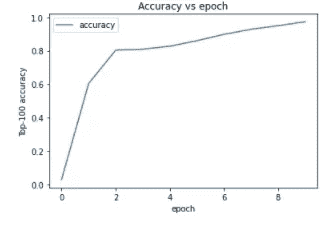
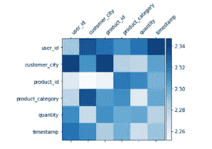

# 零售数据集上的 TensorFlow 深度学习推荐器

> 原文：<https://medium.com/codex/tensorflow-deep-learning-recommenders-on-retail-dataset-ce0c50aff5fa?source=collection_archive---------0----------------------->

## 推荐引擎

## 利用 TensorFlow 2.0 新的灵活库在零售数据集上部署推荐引擎。


个性化是赢得消费者关注的关键。[在](https://unsplash.com/@thecreative_exchange?utm_source=medium&utm_medium=referral) [Unsplash](https://unsplash.com?utm_source=medium&utm_medium=referral) 上创意交流的照片。

过去几年，零售数据呈指数级增长。更有甚者，新冠肺炎将大量交易从线下转移到了线上。随着移动应用程序(尤其是社交媒体)之间数据集成的增加，公司对消费者的活动、行为、情绪和偏好有了更多的了解。我们如何利用这些输入来产生一个有效的、有管理的、个性化的推荐引擎，以适应不断变化的零售动态中的实时变化？我们不仅需要一个强大的引擎来处理大量的文本、时间和图像数据，还需要一个灵活的库来适应这些输入的波动。

为了解决这个问题，我想介绍一下 TensorFlow 的新推荐库(TFRS)，它有潜力扩大规模以应对这些挑战。我的假设是，它仍然是一个正在进行中的库，但截至目前，他们已经发布了几套工具，允许我们建立一个混合引擎，利用神经网络的嵌入层，同时简化输入和输出的过程。我将在一个开放的零售数据集上演示这个库的一个简单应用，目标是在现有的推荐工具中增加可用的推荐工具。

[](https://www.tensorflow.org/recommenders) [## TensorFlow 推荐器

### TensorFlow 推荐器(TFRS)是一个用于构建推荐系统模型的库。它有助于…的完整工作流程

www.tensorflow.org](https://www.tensorflow.org/recommenders) 

# 为什么我们需要一个灵活的库？

许多使用简单基于用户的相似性或基于内容的相似性的推荐算法经常面临为了消耗许多信息流而扩大规模的限制，导致失去获得预测准确性的机会。根据我的经验，用额外的滤波器增加输入通道以减少数据误差和数据稀疏是一个复杂的过程，更难构建，也更难维护。

我们需要一个能够并行化输入流的库，例如文本嵌入和标记化、数据规范化和数据稀疏化，这样就可以无缝地处理它们，而不会过度消耗计算能力。使用纯粹的深度学习可能会导致更昂贵的计算能力，因此，我们需要一个更简单的 API 来有效地处理这些计算。我相信 TFRS 有能力解决这些问题——在不久的将来，它将会大大扩展，所以让我们学会从零开始建设。

# 目标

这篇文章的目的是展示 TFRS 推荐者库对一个客户的零售数据。我很感激 TF 在其[网站](https://www.tensorflow.org/recommenders)上发布了源代码。我在一个开放的巴西电子商务数据集上改编了他们的代码，这个数据集来自 Olist，可以在 [Kaggle](https://www.kaggle.com/olistbr/brazilian-ecommerce/home/) 上获得。使用 TF 库使我们能够构建灵活的模块化模型，能够在轻松调整模型复杂性的同时添加多个特性。

[](https://taufik-azri.medium.com/recommendation-system-for-retail-customer-3f0f80b84221) [## 零售客户推荐系统

### 使用 Python TensorRec 模块的实践示例

taufik-azri.medium.com](https://taufik-azri.medium.com/recommendation-system-for-retail-customer-3f0f80b84221) 

本文不是对推荐系统的介绍。那些想了解基于用户推荐的基本原理的人可以阅读我之前写的一篇文章[这里](https://taufik-azri.medium.com/basic-fundamentals-of-recommendation-system-collaborative-recommendation-9ef794a8661d)。我还写了另一篇关于使用上面显示的 TensorRec 模块(使用 TensorFlow 的早期版本)运行引擎的深入文章。

我将按照这个顺序来演示模型，依次增加复杂度和实用性:
-检索模型
-排名模型
-添加文本和时间戳嵌入
-多任务推荐，结合检索和排名
-使用跨网络添加更多功能。

每个模型都从前面的模型中添加了元素，所以最后，我们将有一个完整的模型，可以满足不同的输入类型。

# 资料组


已清理数据集的样本行。

这些数据由来自巴西的电子商务平台提供商 Olist 在 Kaggle 中提供。数据集由客户交易、客户信息和产品信息组成。我将几个不同的表格合并成一个，如下图所示。我还通过将产品类别与原始产品 id(这是一个长字符串)的数字分类相结合来细化产品 ID。我还将事务的时间转换成 Unix 时间戳。

它包含我们特别需要的发动机基本信息，即:

客户 ID:由 user_id 标识。
产品 ID:由 product_id 标识。
评级:以数量标识。

客户和用户 id 很重要——我们通过客户购买的产品来识别他们的偏好，以及购买了相同商品的具有相同配置文件的其他用户的类似产品。购买物品的数量类似于电影数据集中的评级-我们可以假设，如果客户购买了大量物品，他/她对该物品的正面情绪更高，这在概念上相当于用户在电影数据集中的评级。

还有其他可用的特性，它们是:
Time:由时间戳标识——事务的日期和时间，这里转换为 Unix epoch。
地理位置:由客户 _ 城市标识。
产品特征:由产品 _ 类别标识。
明确评级:由 review_score 确定。

这些附加特征可能有助于提高模型的准确性。我们还可以派生出许多其他特性，比如客户细分或产品排名，但现在让我们专注于这些可用的特性。

我将演示一个非常简单的引擎，它接受用户 ID、产品 ID 和数量，然后随着我们向全尺寸模型前进，逐渐添加其他特性。我们的目标是学习模型的基本组成部分，这样我们就可以很好地根据需要对模块进行模块化安排。

# 检索和排序

TFRS 提供了两种类型的任务——**检索和排名**。检索任务在所有可能的选择中选择一个初始候选集。目标是排除用户可能不感兴趣的候选项。检索任务可以处理数百万个候选项，而只返回少数几个项目，因此可以节省计算能力和内存。

另一方面，排序采用检索任务的输出，选择几个最可能的项目，从上到下对它们进行排序。它通常会返回每个项目的概率分数，并从最高分到最低分对它们进行排序。

模型构建块按以下顺序堆叠:
-构建用户、项目和评级(数量)数据。
-建立查找表，混洗数据集。
-定义连续层和模型塔。
-拟合和评估。

## **检索任务—数据准备**

让我们开始为检索任务选择数据。我们只需要准备两组参考表——一个项目表，它将是推荐项目的参考表，另一个交互(查询)表(或排名表，在 IMDB 电影示例中)显示用户以前的购买历史。下面是构建这些数据的代码。完整代码可从 [GitHub 获得。](https://github.com/fickaz/TFRS-on-Retail-Data/blob/207e973514cc9cad3e76cca4457ac55147567a54/src%20a.%20Retrieval.ipynb)

代码本质上是将所需的特性选择到一个具有 TF dictionary 数据类型的表中。请注意，quantity 是一个数字特性，它作为一个浮点数被复制到字典中。通常，当您传递一个与 TF 需求不兼容的特性时，您会遇到如下的错误消息:

```
Tensor conversion requested dtype int64 for Tensor with dtype float32: <tf.Tensor 'IteratorGetNext:4' shape=(None,) dtype=float32>
```

避免这种错误的关键是确保正确定义数字数据类型，无论是整型还是浮点型。

## 检索任务-查找表和混洗数据集

我们需要分类特征的原始值到检索模型中嵌入向量的参考映射(查找表)。如果您不理解这意味着什么，请不要担心，它们是将被插入并用作模型层中的参考的矢量化元素。

要做到这一点，我们需要一个惟一的词汇表，它将一个原始特征值映射到一个连续范围内的整数，然后这个整数将被映射到模型内嵌入表中的相应嵌入。我们还将打乱数据集，然后将数据按 80–20 的比例分成训练测试段。

## 检索任务—定义连续层和模型塔

在我们选择了数据并准备了查找表之后，我们构建了一个模型塔，其中模型接受输入，将它们堆叠为嵌入层，然后将它们传递到任务和损失计算中。该塔有五个重要组成部分:候选(项目)模型、查询(用户)模型、任务(检索)、度量(分解的 top - *k* )和损失计算。

有四个输入我们需要插入到塔:
-候选模型:项目，嵌入到连续的层。
-查询模型:用户，嵌入顺序层。
-任务，也就是检索任务。
-度量损失的指标:使用因子分解的 top - *k* 检索精度。
-损失函数:衡量他们之前购买的实际产品的损失。

上面的代码可能显得冗长和吓人，但本质上它将用户嵌入和项目嵌入传递到连续的层中。之后，我们定义任务和指标来计算损失函数。您会注意到，我们传递的列名与我们在数据准备过程中选择的特性相同。

## 检索模型——拟合和评估

现在，我们已经准备好使用上面定义的模型塔来拟合模型并评估其准确性。

我们将用户和项目嵌入，并将其传递到模型塔中。我们使用 Adagrad 优化器来最小化每次迭代中的损失，但也有其他选项，如 AdamOptimizer 和随机梯度下降(SGD)。之后，我们拟合十个时期的模型，并检查 top - *k* 所选项目的准确性。正常情况下，一个像样的深度学习模型应该运行至少 100 个时期，但这里我们只运行 10 个时期，只是为了演示。


该模型似乎不错，在十个时期，前 10 项的准确率接近 90%。时间越长，精确度越高，但对于许多模型来说，情况未必如此。您通常会发现，在某个时期之后，准确率通常会变平，因此，图表通常可以直观地显示变化率，如下所示。



## 检索模型—为用户检索热门项目

最后一步是检索每个用户的热门项目。我们可以使用蛮力搜索所有检索到的项目并生成前十名，这里是为用户 40 这样做，输出显示在代码下面。


我们刚刚使用检索任务构建了一个简单而有效的推荐引擎。然而，TF 还提供了另一个叫做 ranking 模块，对于具有数百万或更多大小的大型数据集，它在计算上更有效。它从最好到最差排列所有项目，然后运行检索任务从短列表中检索选定的项目。

# **排名模型**

排名模型可以通过从最高到最低排列所有项目来帮助检索，预测用户可能喜欢或不喜欢它的概率。在检索任务之前过滤掉与用户不相关的项目是有用的，使得检索任务在计算上高效。在这个例子中，我们将查看一个非常简单的排名模型，之后，我们将添加更多的功能，并将排名和检索模型合并为一个多任务模型。完整的代码在这里产生[。](https://github.com/fickaz/TFRS-on-Retail-Data/blob/207e973514cc9cad3e76cca4457ac55147567a54/src%20b.%20Ranking.ipynb)

这里，我们将之前在检索任务中构建的相同查询和候选模型插入到模型毛巾中。唯一不同的是，这里我们使用排名任务，我们使用 RMSE 而不是分解的 top - *k* 来计算准确性指标。


这个过程和往常一样——我们在训练和测试数据上调用 fit，然后评估指标。然而，正如我们所看到的，在四个时代之后，RMSE 并不是很好。因此，在下一节中，我们将看到如何通过添加更多的特性来改进模型，然后将排序和检索模型结合在一起。

# 添加文本和时间戳功能


TFRS 可以处理相似单词的产品名称。例如，该模型可以建立带有名称“燕麦”或“小麦”的盒装的相似性关系。在 [Unsplash](https://unsplash.com?utm_source=medium&utm_medium=referral) 上由 [Franki Chamaki](https://unsplash.com/@franki?utm_source=medium&utm_medium=referral) 拍摄的照片。

TFRS 库的一个强大特性是它能够将文本和时间戳标记到特性中。该库可以将文本处理成词袋，这些词袋可以影响项目之间的相似性度量。例如，给两盒标有单词“oat”的谷物，TF 可以建立一个相似性网络，将这两者联系在一起。类似地，对于时态数据，TF 可以在分析大约在同一时间购买商品的用户时处理时态记录。让我们探索如何将文本和时间特性添加到模型中，并选择查看添加时间戳是否会显著提高准确性。完整的代码在这里产生[。](https://github.com/fickaz/TFRS-on-Retail-Data/blob/207e973514cc9cad3e76cca4457ac55147567a54/src%20c.%20Adding%20Text%20and%20Timestamp%20Embedding.ipynb)

对于检索任务，我们遵循相同的过程。这里，在数据准备中，我们将时间戳添加到交互表中。注意对 *float* 数据类型的强调，因为如果 TF 不能处理它，您可能会遇到数据类型错误。

数字特征必须标准化，因为这样做可以提高计算效率和准确性。这里我们将时间戳分成 1000 个线性间隔的桶。这与两年来几乎每秒钟的数据相比是一个巨大的减少。还有其他标准化数字数据的方法，比如标准化。

在将查询和候选模型传递到模型之前，我们将它们分开，以允许更多的堆叠嵌入层。在用户模型(查询模型)中，除了用户嵌入，我们还增加了时间戳嵌入。随后在顺序塔中，我们添加了是否使用时间戳的选项，这样我们就可以看到使用时间和不使用时间之间的区别。

对于候选模型，我们希望该模型通过学习彼此相似的单词来学习文本特征。它还可以识别 OOV(词汇之外的)单词，因此，如果我们预测一个新项目，该模型可以适当地计算它们。

下面，将通过标记化(拆分成构成词)来转换项目名称，然后是词汇学习，然后是嵌入。

定义了用户模型和项目模型之后，我们可以将它们插入到完整的模型塔中，然后在其中实现我们的损失和度量逻辑。注意，我们还需要确保查询模型和候选模型产生大小兼容的输出嵌入。因为我们将通过添加更多要素来改变它们的大小，所以最简单的方法是在每个查询和候选模型后使用密集投影图层。

我们准备试用我们的第一款产品。让我们从不使用时间戳特性来建立基线开始。

```
model = RetailModel(use_timestamps=False)
model.compile(optimizer=tf.keras.optimizers.Adagrad(0.1))
model.fit(cached_train, epochs=3)
model.evaluate(cached_test, return_dict=True)
```


在运行了三个纪元后，top 100 的精度并不是很好，对于其他更高阶的精度更差。如果我们通过运行行 retail model(use _ timestamps = True)来包含时间戳会怎么样？


正如我们所见，结果略有改善。尽管我们只在三个时期运行它，但我们可以看到精确度提高了。这种改进表明，时间对引擎的推荐决策产生了积极的影响。

# 基于 ReLU 的 DNN 的多任务推荐器

由于我们已经分别学习了排序和检索任务，现在我们可以将它们加在一起，以产生我们希望的更好的模型。改编 TF 制作的指南，我将提供一个选项来衡量模型内部的检索和排序，允许一个模型对另一个模型的计算有更大的影响。如果我们给排名任务分配一个大的损失权重，我们的模型将集中于预测评级(但是仍然使用来自检索任务的一些信息)；如果我们给检索任务分配一个大的损失权重，它会更关注检索。此外，我们还将在模型塔中添加多个整流线性单元(ReLU)密集层。下面是模型塔，堆叠了用户模型、项目模型、基于 ReLU 的 DNN 层、检索和搜索任务以及损失计算。完整的代码在这里产生[。](https://github.com/fickaz/TFRS-on-Retail-Data/blob/207e973514cc9cad3e76cca4457ac55147567a54/src%20d.%20Multi-task%20recommenders.ipynb)

## 评级专用模型

根据我们分配的权重，模型将为任务编码不同的平衡权重。让我们从一个只考虑评级任务的模型开始。在这里，我们将全部权重分配给评级任务，而将零权重分配给检索。

```
model = Model(rating_weight=1.0, retrieval_weight=0.0)
model.compile(optimizer=tf.keras.optimizers.Adagrad(0.1))cached_train = train.shuffle(100_000).batch(8192).cache()
cached_test = test.batch(4096).cache()model.fit(cached_train, epochs=3)
metrics = model.evaluate(cached_test, return_dict=True)print(f"Retrieval top-100 accuracy: {metrics['factorized_top_k/top_100_categorical_accuracy']:.3f}.")
print(f"Ranking RMSE: {metrics['root_mean_squared_error']:.3f}.")
```


前 100 名的准确度似乎很低，RMSE 也不是很好。如果我们只使用检索呢？


我们可以看到精度提高了，但 RMSE 下降了。让我们运行一个在这两个任务上都有正权重的模型。


我们可以看到准确性和 RMSE 都有所提高。随着更多的纪元，模型将显示出显著的改进。但到目前为止，我们只有时间戳作为附加功能。我们如何将它们整合到一个单一的模型中？

# **利用交叉网络整合各种输入**

强大的推荐引擎允许它接受来自各种功能的输入。随着用户和项目功能的丰富可用性，TFRS 提供了一个跨网络模块，该模块在将所有功能的图层传递到 DNN 前馈传播之前，基本上将所有功能的图层合并为一个多多项式图层。我们也可以在 DNN 层之后运行跨网络层，或者并行运行它们。让我们看看如何将所有可用的功能组合、准备并插入模型塔中。完整代码可在[这里](https://github.com/fickaz/TFRS-on-Retail-Data/blob/main/src%20e.%20Cross%20Network.ipynb)获得。

虽然这个数据准备代码可能看起来很长，但是与前面的代码的唯一不同之处在于，我们添加了我们想要合并到模型中的所有特性，并为每个项目检索唯一的引用表。这里，我们将产品类别和客户城市包含到交互表中，并分别为它们创建一个惟一的查找表。

这里我展示了完整的用户模型，分为两个类。首先，用户模型对文本特征进行符号化，对数字特征进行分块。它们被堆叠成层，然后在 QueryModel 中传递到 Cross Network 和 ReLU DNN。项目模型遵循类似的步骤，但此处未显示。然后，我们将用户和项目模型插入到如下所示的完整模型塔中，类似的任务从多任务模型中复制而来。

现在，我们可以使用 32 个嵌入层、评级和检索的相等权重以及 3 个时期来拟合和评估模型。

```
cached_train = train.shuffle(100_000).batch(8192).cache()
cached_test = test.batch(4096).cache()model = CrossDNNModel([32], rating_weight=0.5, retrieval_weight=0.5, 
                      projection_dim=None)model.compile(optimizer=tf.keras.optimizers.Adagrad(0.1))model.fit(cached_train, validation_data=cached_test,
        validation_freq=5, epochs=3)metrics = model.evaluate(cached_test, return_dict=True)print(f"Retrieval top-100 accuracy: {metrics['factorized_top_k/top_100_categorical_accuracy']:.3f}.")
print(f"Retrieval top-50 accuracy: {metrics['factorized_top_k/top_50_categorical_accuracy']:.3f}.")
print(f"Retrieval top-10 accuracy: {metrics['factorized_top_k/top_10_categorical_accuracy']:.3f}.")
print(f"Retrieval top-5 accuracy: {metrics['factorized_top_k/top_5_categorical_accuracy']:.3f}.")
print(f"Retrieval top-1 accuracy: {metrics['factorized_top_k/top_1_categorical_accuracy']:.3f}.")
# print(f"Ranking RMSE: {metrics['root_mean_squared_error']:.3f}.")
```

结果如下所示:


准确率为 58%，这个模型做得还不错，也许通过更高的迭代可以获得更高的准确率。令人惊讶的是，我们首先构建的更简单的检索模型实现了更高的准确性，但这可能是巧合——其他复杂的数据将受益于跨网络和 DNN 功能。

交叉网络的一个好处是，我们可以实际了解到特征之间交互的重要性。这里，我们绘制了在神经网络迭代期间计算的权重矩阵。较深的颜色显示较强的习得交互，在这种情况下，客户位置显示与产品 id 有很强的相关性。



# 结论


拥有一个实时的天气数据来预测用户的情绪会增加推荐引擎的相关性。由[克雷格·怀特黑德](https://unsplash.com/@sixstreetunder?utm_source=medium&utm_medium=referral)在 [Unsplash](https://unsplash.com?utm_source=medium&utm_medium=referral) 上拍摄的照片。

我的目标是展示 TFRS 的模块化和灵活性，希望它可以帮助数据科学家在各种零售和科学环境中构建和部署推荐引擎。我们可以利用这个库将推荐引擎扩展到更复杂的数据，减少对编程的关注，更多地关注不同数据流的扩展，比如来自 Spark 的数据流。想象一下，如果我们可以获取实时的天气数据流，并预测用户在雨天想要购买什么，我们可能能够提高网站访问或产品购买的转化率。这种实时情绪预测需要一个灵活而强大的计算引擎来接收连续的数据流，我相信 TFRS 可以成为一个强大的工具。

# 参考

推荐系统的广泛与深度学习。在*第一届推荐系统深度学习研讨会论文集*中，第 7–10 页。2016.

马丁·阿巴迪等人，《张量流:大规模机器学习的系统》在*第 12 届{USENIX}操作系统设计与实现研讨会({OSDI} 16)* ，第 265–283 页。2016.

王若希等人，《DCN·V2:改进的深度和交叉网络以及网络规模学习的实践课程，以对系统进行排序》载于【2021 年网络会议论文集，第 1785–1797 页。2021.

王若希等人，《广告点击预测的深度和交叉网络》ADKDD'17 会议录第 1–7 页。2017

Tensorflow 推荐器。[https://www.tensorflow.org/recommenders](https://www.tensorflow.org/recommenders)