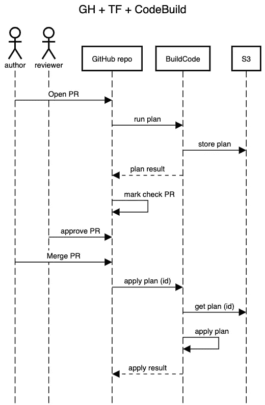
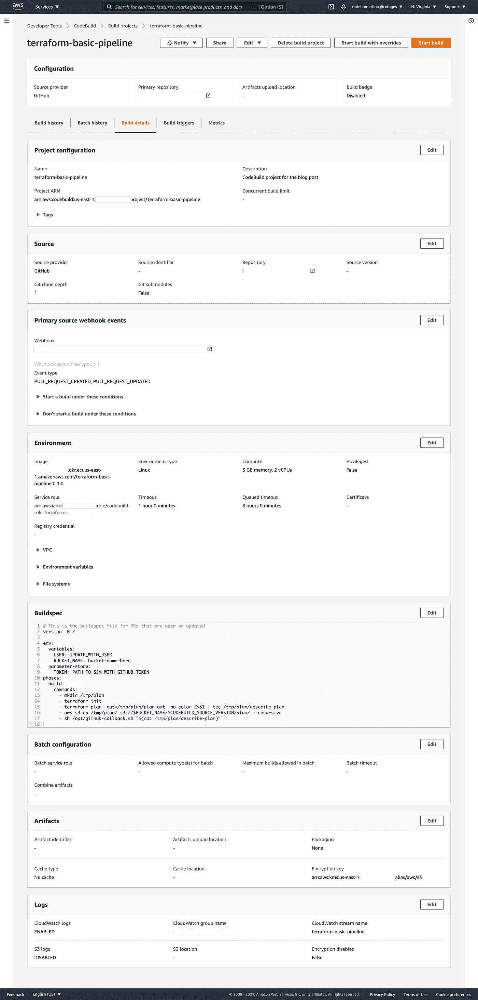

# 地形基础管道

> 原文：<https://medium.com/codex/terraform-basic-pipeline-105a84864c2e?source=collection_archive---------2----------------------->

在 Terraform 中使用实时存储库已经变得非常流行。动态存储库是一个存储库，其中定义了所有基础架构，并且应该是动态的。这意味着，一旦合并了拉取请求(PR ),基础设施就会根据这些更改进行更新。

实时回购方法需要一些自动化，主要是为了避免以下问题:

*   太多人访问生产环境。您不希望太多的人访问您的生产环境来应用对基础设施的更改。
*   即使工程师有权访问某个帐户，该帐户也可能不是存储库要更改的帐户。
*   Terraform 计划甚至无法运行。这很可怕，但它确实发生了，这取决于针对目标客户执行计划的难易程度。

让我们看看如何设置一个工作流来知道计划是有效的，并自动应用该计划。在这篇文章中，我将使用这些技术:GitHub、Terraform、AWS CodeBuild 和 AWS S3。但是，您可以用其他工具做同样的事情。

下面的例子只是一个工作流程，它可能不是最好的或者可能不符合你的需要，但是它将有助于演示所有必要的管道。

工作流程非常简单，以下是解释:

1.  一名工程师(作者)创建了一个 PR 来更新 GitHub live repo 中的基础设施
2.  live repo 调用 CodeBuild 来创建 Terraform 计划
3.  生成的地形图存储在 S3
4.  计划的结果作为评论发布在 PR 中
5.  基于计划的结果，它标记通过所有检查的 PR
6.  另一名工程师(审核人)负责审核和批准请购单
7.  作者合并了 PR
8.  GitHub 调用 AWS CodeBuild 并通过从 S3 获取在步骤#2 中创建的计划来运行`terraform apply`
9.  `terraform apply`的结果作为备注发布在 PR 中

让我们看一下创建管道所需的配置

# GitHub 配置

1.  创建一个个人令牌，允许 CodeBuild 与 GitHub 交互。你可以在这里按照[的指示](https://docs.github.com/en/github/authenticating-to-github/creating-a-personal-access-token)。请记住，这是一个概念验证，但应该通过 GitHub 应用程序或服务帐户在更像生产的环境中完成。令牌将需要访问存储库。
2.  可选地，在*分支*下的存储库设置中启用[要求在合并](https://docs.github.com/en/github/administering-a-repository/managing-a-branch-protection-rule)之前通过状态检查选项。这是一个很好的做法，因此您强制运行计划以允许 PR 被合并。

# AWS S3

1.  创建一个存储桶来存储计划

# AWS 代码构建

## 运行计划的代码生成项目

1.  使用 GH 令牌创建一个指向 Terraform live 存储库的 CodeBuild 项目来运行一个计划
2.  使用事件 create `PULL_REQUEST_CREATED`和`PULL_REQUEST_UPDATED`创建地形平面图。稍后，我们将创建另一个项目来应用该计划
3.  作为环境安装的一部分，我们将使用 0.15.10 版的首选 Terraform 版本。Terraform 计划将存储在 S3，因此我们需要一个新的 Docker 映像来添加 AWS CLI。
4.  由于 CodeBuild 主机可能会被不同的用户使用，所以最好让构建映像在 ECR 中可用，这样可以避免 Docker Hub 的[速率限制。我们在没有遇到 Docker Hub 描述的速率限制条件的情况下，经历了代码构建中的速率限制错误，这使我们认为 IP 正在为不同的用户回收，从 AWS 的角度来看这是有意义的。](https://www.docker.com/increase-rate-limits)
5.  授予 ECR repo 由 CodeBuild 提取的权限

1.  服务角色，创建一个新角色或使用您已创建的角色，并确保您拥有正确的权限。对于测试，我们添加了一个 EC2 实例，因此我们的权限非常少。但是，在您的设置中，请确保您拥有 CodeBuild 运行和应用该计划所需的所有权限。如果你没有正确的权限，你会在 CodeBuild 中看到一条消息告诉你。
2.  在本例中，我们没有任何针对 VPC 和子网的自定义配置，因此您可以将其留空
3.  我们将使用 3GB RAM 2vCPU 来运行构建
4.  在构建规范中，添加 Terraform 命令来运行计划

这里要提到几件事:

*   用您的用户更新用户
*   我把 GitHub 令牌存储在 SSM，但是如果你愿意，你可以把它粘贴到变量部分。
*   `[CODEBUILD_SOURCE_VERSION](https://docs.aws.amazon.com/codebuild/latest/userguide/build-env-ref-env-vars.html)`是一个环境变量，CodeBuild 为您设置了关于 PR 的信息。我们将用它来命名 S3 物体
*   github-callback 脚本是用 PR 中的注释回调 github 以发布计划的代码

# 要应用计划的代码生成项目

1.  如上所述，创建一个具有相同特征的项目，除了:
2.  使用事件`PULL_REQUEST_MERGE`
3.  在 buildspec 文件中添加以下内容

之后，您可以创建一个 PR，并在 CodeBuild 运行计划之后等待您的计划被发布，对于合并也是如此。

下面是一些代码构建项目的截图:

运行计划的 CodeBuild 项目

要合并的 CodeBuild 项目与上面的类似，只是从 GitHub 监听的事件类型有所变化。它只会听`PULL_REQUEST_MERGED`

您可以使用一些片段来检查我们的存储库，以创建 Docker 映像和所需的 AWS 资源。

# 考虑

*   此工作流程的一个缺陷是，当您在合并 PR 后应用更改时，不太可能有人会查看 PR 中的评论来了解它是否成功应用。此外，如果应用失败，修复将不得不在另一个 PR 中解决。
*   另一个工作流程可能是在 PR 被批准后，具有正确权限的人可以从 PR 中给出的链接应用计划。假设`terraform apply`工作正常，PR 中有一个帖子，然后 PR 可以自动或手动合并。这样做的问题是，您需要记住在合并之前运行`apply`命令，否则 repo 将没有活动的基础设施。
*   如果您不了解基础设施，设置自动化是很麻烦的，需要几个步骤才能做好。这可能非常耗时，这就是为什么我们 [Xtages](https://xtages.com) 希望提供易于使用和设置的开箱即用的工作流程。请继续关注更多的更新，因为我们正在建立我们的 MVP。

代码片段可以在 https://github.com/Xtages/demo-tf-codebuild-pipeline 的[中找到。](https://github.com/Xtages/demo-tf-codebuild-pipeline)

*原载于 2021 年 5 月 11 日 https://www.xtages.com**[*。*](https://www.xtages.com/blog/posts/terraform-basic-pipeline/)*