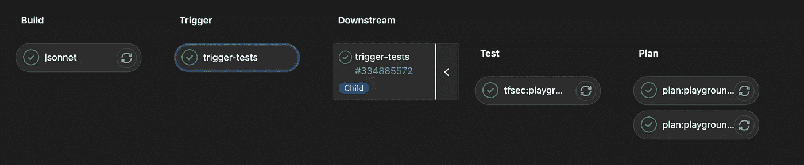

# 使用 GitLab 子管道和 Jsonnet 的 Terraform CI/CD

> 原文：<https://medium.com/codex/terraform-ci-cd-using-gitlab-child-pipelines-and-jsonnet-81f02a18dbe4?source=collection_archive---------4----------------------->


如果您正在阅读本文，那么您可能知道 Terraform 和 GitLab CI 功能，因此我不会在本文中涉及这些内容。如果您想了解这些主题的更多信息，关于 [Terraform](https://www.terraform.io/) 、 [Terraform workspaces](https://www.terraform.io/docs/cli/workspaces/index.html) 和 [Gitlab CI](https://about.gitlab.com/stages-devops-lifecycle/continuous-integration/) 概念的几个链接将是一个很好的起点。

Gitlab CI 已经可以用于您的 Terraform CI/CD。实际上，只需编写几行 YAML 代码，就可以描述一个轻型/简单地形项目的管道，该项目将计划并应用您的代码。然而，当涉及到为几个环境编写的 Terraform 项目，跨越几个帐户和工作空间时，编写一个 CI/CD 来保持您或您的团队成员的可读性和可维护性会变得很麻烦。

减轻和缓解上述问题的一个方法是使用 YAML 锚，或者 Gitlab 关键字 extends。由于这些，您可以通过复制/粘贴一些带有移动变量的块来实现一些模板化和添加新的作业。我会说，少于 5 个帐户或工作区是没问题的，但是如果超过几个，你将引入大量的副本/面食，这可能导致人为错误。

当讨论 Gitlab 中的模板化作业时，一个有趣的特性是父/子管道，它允许您基于一些配置作业动态或不动态地生成作业。Gitlab 为一些语言提供了模板，这里我们将使用 [Jsonnet](https://jsonnet.org/) 来简化编写。

那么，我们要建造什么？又是怎么做到的？

我们希望构建一个 Gitlab CI/CD 管道，它将需要尽可能少的代码行来创建必要的作业集，以运行 terraform plan/apply 来应用新的工作空间，方法是利用 Jsonnet 来动态生成几个作业。

# 我们如何实现它？

首先，我们想描述一下我们的计划工作。使用 Jsonnet，地形规划作业可以描述如下:

如您所见，这是一项 Gitlab CI 工作，但我们没有像往常一样在 YAML 进行描述，而是在 Json 中进行描述。但是让我们把它分解一下:

*   这是我们将在本文后面调用的函数的名称，它有 3 个参数:`cloud`、`env`、`workspace`。这些将被填充，但现在作为占位符。

```
plan(cloud, env, workspace)::{}
```

*   `image:`描述我们将使用的跑步者形象
*   `stage: 'plan'`是我们管道阶段的名称
*   `script:`包含我们的跑步者运行的命令。这是动态事物发生的地方。我们在我们的环境文件夹中更改 dir，运行`terraform init`，选择我们的工作区并运行`terraform plan`。
*   `rules:[]`表示当提交是 merge_request 的一部分时，或者当它针对默认分支运行时，只有在特定环境文件夹中有更改时，我们才希望运行该作业。
*   `artifacts:`描述了我们的工件，在这种情况下，我们希望使我们的计划成为 apply 将使用的工件。

*一个旁注关于变量* `*$COMMIT_REF_NAME*` *和* `*$DEFAULT_BRANCH*` *。由于 CI 预定义变量不会从父管道传递到子管道，所以我们必须将它们显式地作为变量传递(我将在本文后面解释)。*

提到申请工作，让我们看看它是什么样子的！如上所述，Terraform 应用作业应写成这样:

这里有一些明显的区别:

*   `stage:`成为适用
*   `rules:when:'manual'`表示我们想要明确点击播放按钮来运行作业
*   `needs:`表示必须在该工作区的计划成功后运行

恭喜你！我们现在有两个需要填充值的框架作业！

让我们在另一个 jsonnet 文件中这样做，该文件用于实际生成我们需要的 gitlab-ci 文件。下面是配置:

在 gitlab-ci.jsonnet

`local`是一个 Jsonnet 变量。我们首先导入前面的文件，并在 json 对象中描述我们的参数。这是声明`cloud`和`workspace`占位符的地方。

在本例中，`organization`模块有一个同名的工作空间，而`staging`和`production`有两个不同的工作空间，名为`env-region`。

现在让我们看看如何使用我们的骨架和局部变量来实际生成工作。这是通过对变量运行函数来实现的，其中有两个嵌套的 for 循环:

在 gitlab-ci.jsonnet

我们现在已经准备好以 json 的形式生成 Gitlab 作业了。我们预计有 5 个计划工作和 5 个应用工作。让我们试着运行`jsonnet gitlab-ci.jsonnet > generated-gitlab-ci.yml`，看看会有什么结果。

我们已经可以看到，在 Jsonnet 的 70 行代码中，我们生成了将近 300 行工作。

无论如何，我想现在是自动化的时候了，因为这是我们的最终目标！我们现在有两个 Jsonnet 文件，但是我们仍然缺少必需的。gitlab-ci.yml 文件需要启动管道。

首先，我们需要描述将用于生成所有作业并触发 terraform 子管道的父管道，如下所示:

*   `stages`:

*   我们的作业生成，我们将结果文件公开为一个`artifact`:

*   子管道触发器:

让我们来分解最后一项工作:

*   `variables:`是我们将需要的预定义 CI 变量传递给子管道的地方
*   `trigger:`包括两个文件:一个文件描述子管道的缓存和阶段，以及上一步生成的作业

# 将碎片拼在一起

一旦您将在其中一个 terraform 文件中提交更改，您的合并请求的分离管道应该类似于下面的管道:



terraform 的 merge_request 中的 Gitlab CI 父/子管道

上面的图像不是来自我们建立的管道，因为我正在做的 Terraform 项目有点不同，但是除了`tfsec`的工作，你的计划管道应该是一样的。

你可能认为我们只是做了我们通常在一个普通的 YAML `.gitlab-ci.yml`文件中做的事情，但是在这个过程中添加了 2 个新的文件来管理。“*有什么意义？”*你可能会问。现在，您可以为一个额外的模块或工作空间运行相同的管道，只需在您的`local conf {}`变量中添加一行代码。

当然，还有很多其他的东西可以改进这个示例代码，但重点是让您大致了解父/子管道可以为您的 Terraform 管道带来什么。

在撰写本文时，有一点需要注意的是，在 MR 中还不能使用 terraform 报告，而这恰好非常有用。但是 Gitlab 有一个开放的问题，让子管道工件在 MR。

我的 GitLab repo 中用于本文的所有代码。感谢您阅读本文，我希望它能帮助您为您的 Terraform 项目构建高效的 GitLab CI 管道！如果有，让我在评论里看看吧！