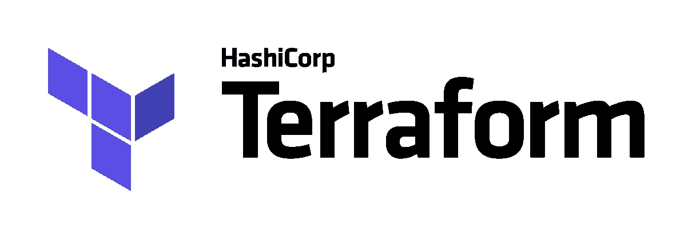

# 具有附加节点组的 Terraform 资源调配 EKS 集群

> 原文：<https://medium.com/codex/terraform-provisioning-eks-cluster-with-additional-node-groups-bf9c6a9f2528?source=collection_archive---------7----------------------->

马西莫·博图里在 [Unsplash](https://unsplash.com/s/photos/computer?utm_source=unsplash&utm_medium=referral&utm_content=creditCopyText) 上拍摄的照片

**Terraform** 是一款流行的供应工具，用于安全高效地构建、更新和版本控制基础设施。这也是众所周知的基础设施即代码(IaC)技术。