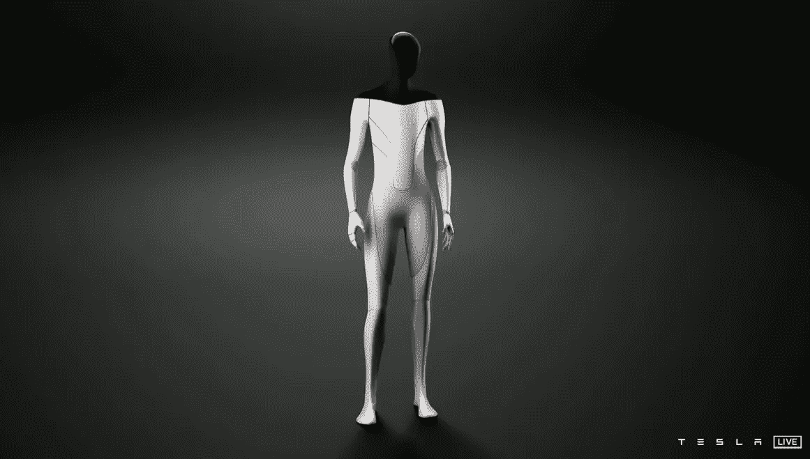
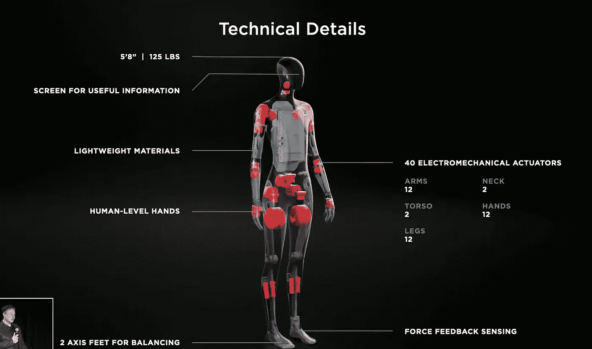
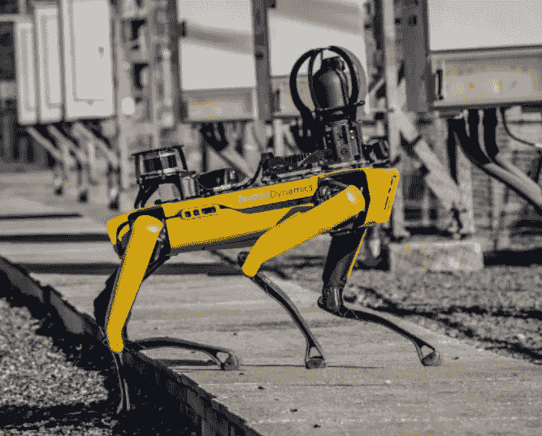
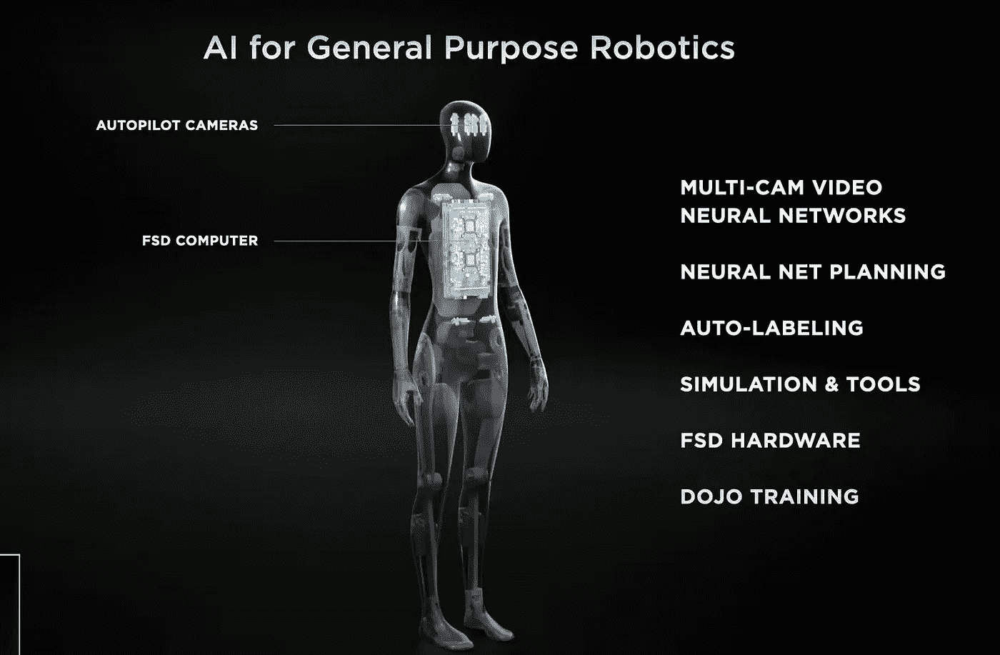
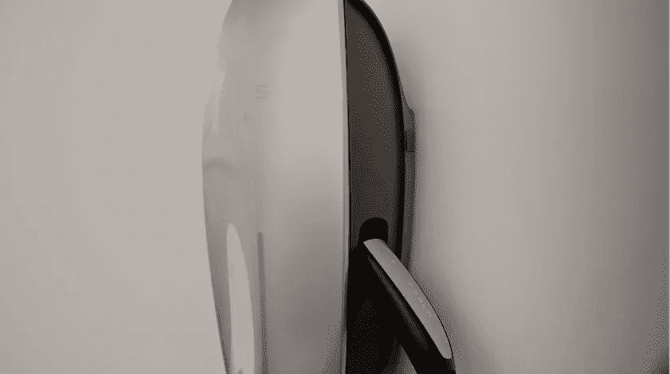

# 特斯拉机器人:简要回顾

> 原文：<https://medium.com/codex/tesla-bot-a-brief-lookback-3446af5e43b7?source=collection_archive---------15----------------------->

[特斯拉机器人](https://youtu.be/j0z4FweCy4M?t=7519)

在 2021 年 8 月 10 日特斯拉一年一度的人工智能日期间，该公司宣布了其未来开发人形机器人的计划，名为特斯拉机器人，又名擎天柱。

[特斯拉艾日](https://www.youtube.com/watch?v=j0z4FweCy4M)

围绕这个机器人有很多炒作。一些人直截了当地称之为玩笑，而另一些人则表现出担忧。就个人而言，我喜欢这个机器人简单的设计和光滑的外观。

AI 日提到的这个机器人的主要目标是做 ***危险又无聊的任务。*** 如果你仔细观察*特斯拉不仅仅是一家汽车公司，它还是最大的机器人公司之一*。所以它制造人形机器人的举动并不令人惊讶。令人惊讶的是，在演示过程中跳舞的是一个人，而不是真正的机器人。

# 当前详细信息

*   完全铰接的身体，手与人平齐
*   身高:1 米 72 或 5.8 英尺
*   臂长重量容量:5 公斤
*   承载能力:20 公斤
*   地面提升能力:68 公斤
*   机器人重量:56kg
*   电池和充电(未提及)
*   最高速度:8 公里/小时
*   带有 40 个机电接头的轻质材料
*   [道场](https://www.tesla.com/AI#Dojo)超级计算机
*   8 台摄像机
*   头部带有显示信息的显示屏
*   [Autopilot](https://www.tesla.com/support/autopilot) AI 系统与特斯拉汽车中的相同

# 费用

没有关于特斯拉机器人价格的具体信息。目前，推测大约在 1 万或更高。

[波士顿动力现场](https://www.bostondynamics.com/solutions/inspection)

作为对比，目前的*波士顿动力* [**现货**](https://www.bostondynamics.com/products/spot#:~:text=Spot%20is%20an%20agile%20mobile,Watch%20the%20Launch%20Video) 零售价为 74.5k，其[规格](https://support.bostondynamics.com/s/article/Robot-specifications)低于特斯拉 bot。更不用说那个点是部分遥控的。从演示来看，特斯拉机器人似乎将完全由人工智能驱动。

另一个人形零售机器人***[*软银机器人*](https://www.softbankrobotics.com/) 售价 1600 美元，但从长远来看，每月订阅将使拥有成本更高。***

***如果你将拥有一辆特斯拉[的成本与其他同系列汽车的成本进行比较。从长远来看，特斯拉的汽车可能是赢家。特斯拉的](https://www.investopedia.com/articles/active-trading/041515/economics-owning-tesla-car.asp) [Model 3](https://www.tesla.com/model3) 是最*实惠、最受欢迎的车型之一*。如果该公司的未来目标是让这款机器人取得商业成功，那么它的可负担性将会发挥重要作用。***

# ***隐私问题***

***正如在人工智能日提到的，机器人将有 8 个带神经网络的摄像头来导航周围的世界，就像特斯拉汽车一样。但与汽车不同，这个机器人将与人类有更密切的互动。这引起了相当多的隐私问题。***

***当前的[特斯拉隐私](https://www.tesla.com/legal/privacy)政策通知称大量数据是匿名收集的。现在还不清楚这个机器人是否也是如此。这些年来，人们越来越关心他们的在线隐私。*你觉得为什么现在每个网站都要求* [*cookie 权限*](https://gdpr.eu/cookies/) *？随着人工智能的加入，隐私变得比以往任何时候都更有争议。****

# ***安全性***

******

***与**一样令人印象深刻的是自动驾驶**数千小时的驾驶经验。已经发生过自动驾驶仪无法[识别停车应急车辆](https://www.nytimes.com/2021/08/16/business/tesla-autopilot-nhtsa.html)的事件。另一方面，*被黑了怎么办？有人可以通过这个机器人掌握你的大量信息，或者监视你。****

***还有其他问题要问，比如机器人到底要怎么控制？多久会有一次安全更新？当它去超市时，它将如何支付？凭我们的实体卡？或者它会像 apple pay 一样内置在钱包中？***

***如果它开始变得奇怪怎么办？首席执行官埃隆·马斯克在演讲中说***

> ***“我们把它设定在一个机械的层面上，在一个物理的层面上，你可以逃离它，并且很有可能压倒它。所以希望这不会发生，但你永远不知道”***

***在特斯拉汽车中，自动驾驶仪会警告司机立即控制局面，或者你可以随时强行控制局面。但是在人形机器人形态下，这将会变得复杂和危险，取决于系统故障何时发生。***

# ***行为***

***没有信息表明这个机器人的行为技能会如何。在演示过程中，首席执行官埃隆·马斯克提到特斯拉机器人将是友好的。作为对比，现在的语音助手可以给你讲一个笑话，甚至给你唱一首生日歌。那么特斯拉机器人将如何展示它的友好呢？它在宠物周围会有怎样的表现？当有人试图伤害机器人的身体时它会做什么？***

***在浏览几篇关于特斯拉机器人的文章和视频时。看了很多评论。有些很有趣，许多表明了我们都有的普遍关注***

> ***这可能只是技术乌托邦或反乌托邦的开始。***

***许多人希望有一个好的机器人朋友。由于全球孤独危机似乎没有任何好转，人工智能可能是一个值得研究的解决方案，当然要谨慎。***

# ***充电和存储***

***目前，没有关于特斯拉机器人充电和电池寿命的信息。会不会用同一个特斯拉汽车的家用充电站？这对已经拥有特斯拉的人来说肯定是有利的。***

******

***[特斯拉家用充电](https://www.tesla.com/support/home-charging)***

***也没有关于这个机器人将如何被*储存*的信息。如果你要去度假，你会把它放在房子里，还是关掉它，把它放在车库里。***

# ***对劳动力的影响***

***总的来说，所有的人工智能机器人肯定会引起人们对人类劳动力未来的担忧。公司可能会雇用特斯拉机器人来代替人类完成危险的任务，这将是一件好事。它肯定会拯救许多人的生命。但不要忘记***

> ***人工智能在工作中是一把双刃剑。***

# ***生产***

***在介绍过程中，有人提到原型将在 2022 年的某个时候推出。特斯拉有过分强调其时间表和产品发现的历史。例如， [CyberTruck](https://www.tesla.com/cybertruck) 于 2019 年亮相，其发布时间已被推迟至 2023 年。所以我不太确定特斯拉机器人是否会很快上市。***

***尽管如此，看看特斯拉是如何彻底改变电动汽车行业的。我希望在不久的将来我们能看到这个机器人投入使用。但目前，我们只能等待特斯拉机器人的第一个官方原型，看看这个故事如何展开。***

## ***参考***

*** [## 人工智能和自动驾驶仪

### Dojo 芯片 Dojo 芯片构建人工智能训练芯片，为我们的 Dojo 系统提供动力。实施来自的尖端技术…

www.tesla.com](https://www.tesla.com/AI)  [## 特斯拉机器人:这一切都归功于机器人埃隆·马斯克

### 特斯拉在一天宣布了一个机器人的诞生。埃隆·马斯克是 fin……

www.automobile-propre.com](https://www.automobile-propre.com/tesla-bot-tout-ce-quil-faut-savoir-sur-lincroyable-robot-delon-musk/)  [## 不要想太多:埃隆·马斯克的特斯拉机器人是个笑话

### 特斯拉的埃隆·马斯克发布了特斯拉机器人:一个人形机器人，马斯克说特斯拉将建造 next 的原型…

www.theverge.com](https://www.theverge.com/2021/8/20/22633958/tesla-bot-elon-musk-ai-day)  [## 特斯拉 Cybertruck 价格，传闻发布日期，内饰，规格和最新消息

### 可以说，特斯拉 Cybertruck 将是未来几十年内上路的外观最独特的汽车。如果它…

www.tomsguide.com](https://www.tomsguide.com/news/tesla-cybertruck)  [## 特斯拉 Bot 价格:特斯拉 Bot 的价格是多少，在哪里可以买到特斯拉 Bot？

### 截至目前，特斯拉机器人还没有具体的价格标签。然而，根据多方消息，该机器人可能会花费…

stealthoptional.com](https://stealthoptional.com/robotics/tesla-bot-price/)  [## 特斯拉机器人到底是什么，它的价格是多少？

### 埃隆·马斯克刚刚宣布特斯拉将开始开发一款名为特斯拉机器人的人形机器人，旨在…

bernardmarr.com](https://bernardmarr.com/what-really-is-the-tesla-bot-and-how-much-will-it-cost/)  [## 埃隆·马斯克的特斯拉机器人引发了严重的担忧——但可能不是你想的那样

### Elon Musk 宣布了一款人形机器人，旨在帮助人们完成那些重复、无聊的任务。麝香…

theconversation.com](https://theconversation.com/elon-musks-tesla-bot-raises-serious-concerns-but-probably-not-the-ones-you-think-166714)***