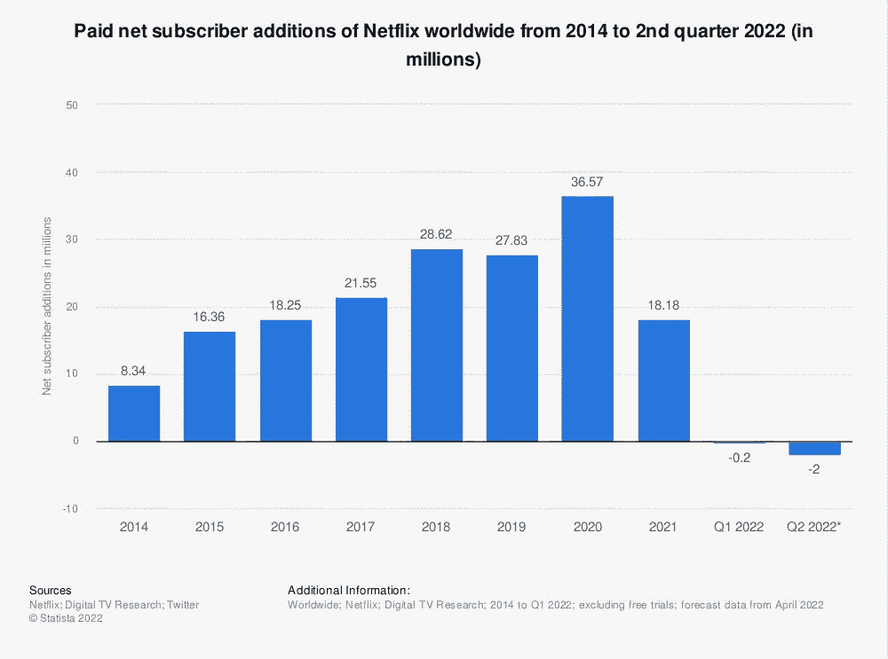

# 特斯拉的网飞问题

> 原文：<https://medium.com/codex/teslas-netflix-problem-dc79a13127e7?source=collection_archive---------1----------------------->

## 竞争到来

泰斯拉将会遇到和网飞一样的问题。竞争。

# 网飞

从 2014 年到 2022 年第二季度网飞全球的付费净用户增长( [Statista](https://www.statista.com/statistics/196645/quarterly-net-subscriber-additions-of-netflix-since-2009/) )

当网飞开始*制作*而不仅仅是分发内容时，这是一个很大的风险，但它似乎得到了回报。在 2013 年他们第一次制作了《T4》的《纸牌屋》之后，订户数量开始激增。