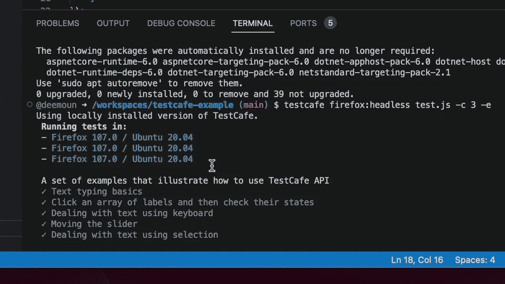

# 在你的浏览器中测试自动化。不需要本地设置？

> 原文：<https://medium.com/codex/test-automation-in-your-browser-no-local-setup-needed-11bcbd64765c?source=collection_archive---------2----------------------->

测试自动化现在是 QA 工程师的基本任务之一。但是我们目前的大部分工作都涉及到复杂的环境准备和测试设置。

我正在研究如何在浏览器中运行测试，而不需要太多的配置工作。在运行 GitHub CodeSpaces 之后，我立即想到了可以尝试的解决方案。