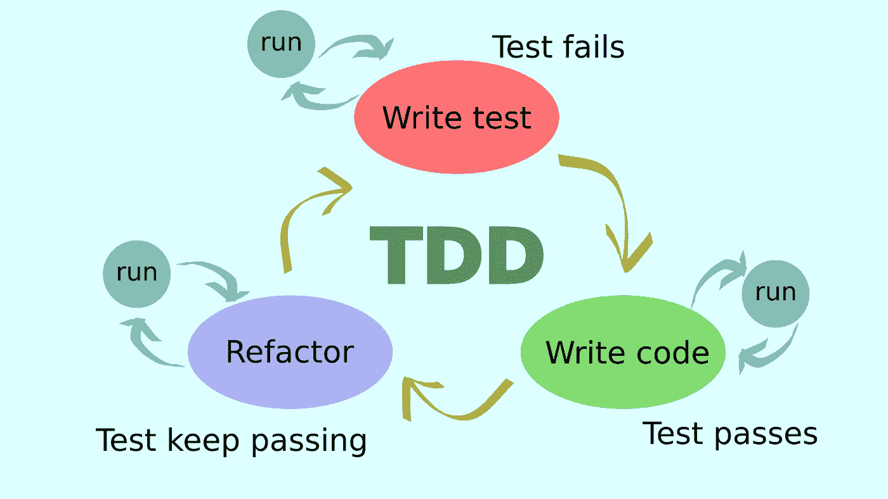
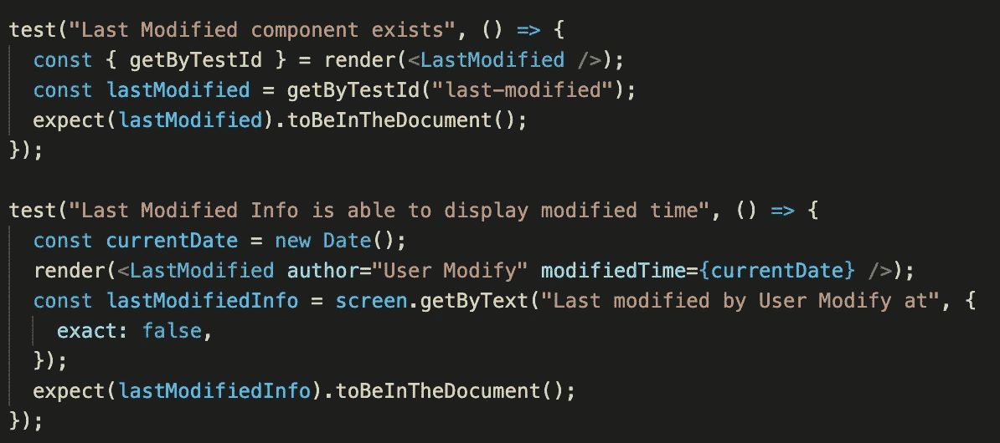
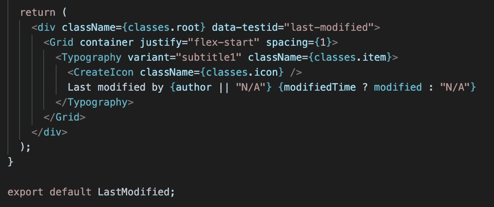
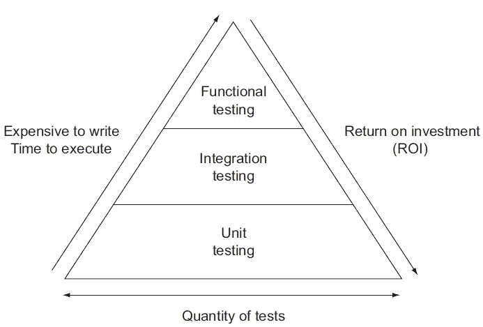
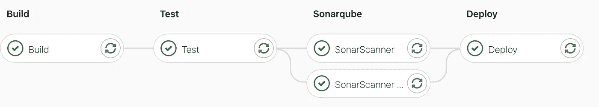

# 测试驱动开发:安全网

> 原文：<https://medium.com/codex/test-driven-development-27710d5edd78?source=collection_archive---------5----------------------->

图片来源:[prophage.blogspot.com](http://prophage.blogspot.com/2015/07/coding-responsibly-part-iii-testing.html)

我第一次了解 TDD 的时候，我想，“哦，天哪。我们真的要这么做吗？为什么你要做一个注定要失败的测试？这怎么说得通？”我甚至惊讶于 TDD 被认为是编程中的最佳实践之一。坦白说，有相当一段时间，我确实在编写测试代码时遇到了一些麻烦。我很难理解为什么我们需要做这项额外的工作。但这些是我在意识到它塑造我写出更好的代码而不是给我增加负担之前的想法。怎么会？我们现在就开始吧！

> "如果你的代码不可测试，那么它就不是一个好的设计." *—迈克尔·费瑟斯*

# 测试驱动开发及其规则

**测试驱动开发**是一个开发过程，它形成了一个测试代码和验证它做什么的循环。基本上，这是一个对功能进行测试的过程，测试它们，然后编写代码通过测试。简而言之，TDD 的一个周期是这样的:

图片来源: [pinterest](https://i.pinimg.com/originals/b9/be/51/b9be514dd54f4a058943099020284deb.png)

*   **红色**

首先，我们为程序中的每个小功能编写一个测试。*“但是我们什么都没写。有什么好考的？”我知道。这部分可能看起来有点混乱——编写一个肯定会失败的测试。但是编写这个测试可以防止您编写重复的代码或者更糟糕的不必要的代码。这是我为最后修改的组件编写代码之前的一个失败测试的例子。*

测试示例

在编写实现之前测试失败

*   **绿色**
    测试失败后，我们编写一段代码，这段代码将帮助我们通过测试。在我的例子中，我需要编写一个代码来创建最后修改的组件。感谢之前的测试，我只写了几行必要的代码。

编写实现后通过测试

*   **重构** 通过测试后，我们可以改进我们的代码，使其更加简单有效——这一步叫做重构。应该注意的是，当你重构一个代码时，它不应该创建一个新的功能或者使修改后的代码不能通过测试。重构的唯一目的就是提高代码的质量。前一个例子中的代码足够简单，所以我不需要重构它。

# 单元测试 vs 集成测试 vs 功能测试

有三种类型的测试，没有一种比其他的更重要。每一个都有一个重要的角色，可以帮助开发人员和测试人员创建更高级的测试。

图片来源:[softwaretestinghelp.com](https://www.softwaretestinghelp.com/the-difference-between-unit-integration-and-functional-testing/)

*   **单元测试—** 从程序员的角度编写的测试，以测试一个单元或程序的最小部分。它是独立测试的，没有依赖性。单元测试占据了金字塔的最大部分，包含了程序的实体部分。它们很容易写，这就是成本低的原因。为了编写单元测试，我们可以使用一种叫做白盒测试的技术。为了做白盒测试，测试人员需要知道程序的内部结构。当我们执行功能测试时，从单元测试中获得的文档将是有用的。
*   **集成测试** —测试不同的模块在与其他模块组合后是否还能正常工作。
*   **功能测试** —从用户角度编写的测试，目的是测试可能依赖于数据库等其他服务的系统功能。功能测试与集成测试相关，有时被认为是同一件事。但是功能测试检查整个应用程序的功能，而集成测试只检查系统的几个集成模块。为了编写功能测试，我们可以使用一种叫做黑盒测试的技术。与白盒不同，测试人员不需要知道应用程序的内部结构，因为它毕竟是从用户的角度编写的。

要知道你的测试覆盖了你的代码多少，有一个叫做**代码覆盖率**的测量方法。这是衡量测试套件质量的一个强有力的标准。覆盖率越高越好。覆盖率达到 80%就足够了。但是对于这个项目，我们的目标是超过 90%的覆盖率。

100%覆盖我的一个分支机构。从 sonarqube 看。

# TDD 和干净代码

您可能没有想到，但是 TDD 与干净的代码有关系。编写糟糕的测试和不编写测试是一样的。随着应用程序的发展，测试可能需要一些修改。记得我们可以重构测试和代码吗？如果测试是肮脏的，那么我们将很难重构或改变它们。写代码有自己的指南，写测试也是如此。我们称之为**第一**原则:

*   **快速** —测试应该快速运行。测试运行的时间越长，我们就越懒，不想再测试一次。更不用说，会浪费时间。
*   **独立** —测试不应该依赖于任何其他测试。这意味着，测试应该以任何顺序运行，并且不会影响其他测试。
*   **可重复** —测试应能在不同的环境中重复进行。我们必须确保测试不仅在本地通过，而且在另一个开发人员的计算机上通过。
*   **自验证** —测试应该只有两个值:通过或失败。查看日志看测试是否顺利很累。
*   **适时** —测试应在实际实施前编写。如果我们在编写代码之前编写了实现，那么编写测试可能需要一些时间。

# TDD 及其对团队的好处

在我阅读的几乎每一篇关于 TDD 的文章中，都提到 TDD 有助于提高代码的质量。尽管不得不编写测试用例可能会耗费时间，但这将节省我们调试的精力，因为这将减少新错误的数量。

对我来说，它帮助我避免代码重复。此外，它节省了我写代码的时间，这些代码以后将是无用的。TDD 帮助我们专注于需要做的事情。此外，如果团队中的任何一个成员发生了意外，而他们只编写了测试，那么其他成员可以简单地了解其他成员打算做什么以及需要完成什么。

这也增加了我们对改变的信心。如果出现冲突，并且我们不知道是什么导致了冲突，那么合并彼此的工作将会很麻烦。但是如果我们已经做了一些测试，并且看到我们的测试以高覆盖率通过了，那么我们点击合并按钮的恐惧就会变小。这是因为 TDD 给了我们一个保证，我们的代码已经按照我们计划的方式工作了，并且合并应该是安全的。

实践 TDD 可能需要一些时间，但这是值得的。毕竟，熟能生巧！

## 参考资料:

 [## 单元测试、集成测试和功能测试的区别

### 单元测试、集成测试和功能测试的区别。单元测试考虑检查单个组件…

www.softwaretestinghelp.com](https://www.softwaretestinghelp.com/the-difference-between-unit-integration-and-functional-testing/)  [## 什么是测试驱动开发(TDD)？带示例的教程

### 测试驱动开发(TDD)是一种软件开发方法，在这种方法中，测试用例被开发出来，以指定和…

www.guru99.com](https://www.guru99.com/test-driven-development.html)  [## TDD 的好处既不清楚，也不是立竿见影的

### 让我从故事的结尾开始，然后回到开头。从个人经验测试驱动…

scrumology.com](https://scrumology.com/the-benefits-of-tdd-are-neither-clear-nor-are-they-immediately-apparent/)  [## 干净的代码:单元测试

### TDD，或测试驱动开发，或红绿重构。

medium.com](/@shley_ng/clean-code-unit-tests-c0c871219f75)  [## 代码覆盖率介绍| Atlassian

### 代码覆盖率是一个可以帮助你理解你的源代码有多少被测试的度量标准。这是一个非常有用的指标…

www.atlassian.com](https://www.atlassian.com/continuous-delivery/software-testing/code-coverage) 

https://www . sim form . com/Unit-testing-vs-functional-testing/#:~:text = Unit % 20 testing % 20 is % 20 fast % 20 and，% 20to % 20the 要求。