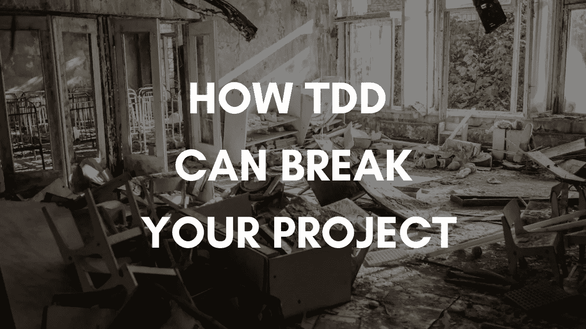

# 测试驱动的开发有一个巨大的缺陷，而且根本不是关于测试的

> 原文：<https://medium.com/codex/test-driven-development-has-1-tremendous-flaw-and-is-not-about-testing-at-all-64eaeaa248b3?source=collection_archive---------3----------------------->

## 有一些更关键的东西可能会破坏你的代码

图片由[作者](http://www.arnoldcode.com)经由 Canva.com 制作

TDD 是最佳实践吗？其他方法都是愚蠢的吗？他们两个我都不相信。即使你使用 TDD，也不是为了写测试。