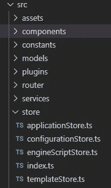
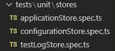
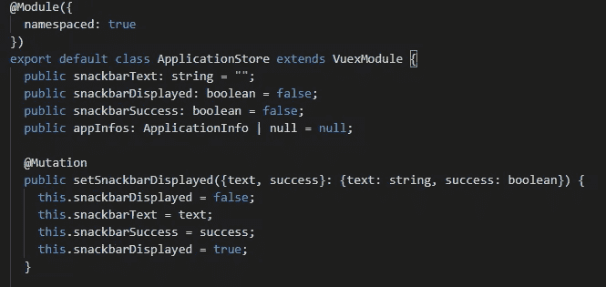
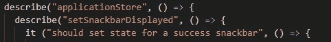
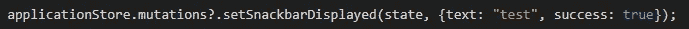
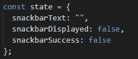
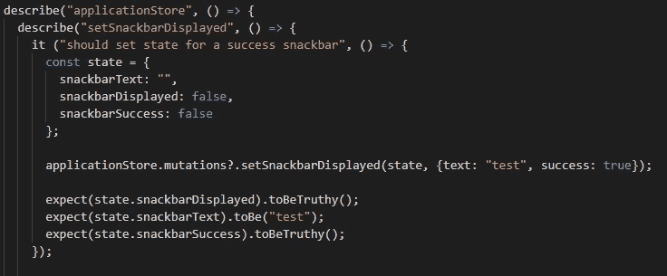
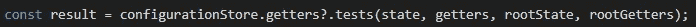
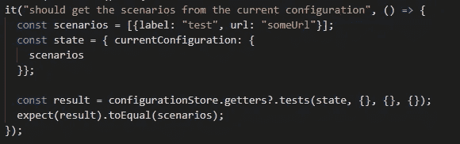

# 测试您的 VueJS + TypeScript 应用程序

> 原文：<https://medium.com/codex/test-your-vuejs-typescript-application-b7dc9133e6f?source=collection_archive---------0----------------------->

## [法典](http://medium.com/codex)

由[马库斯·斯皮斯克](https://unsplash.com/@markusspiske?utm_source=medium&utm_medium=referral)在 [Unsplash](https://unsplash.com?utm_source=medium&utm_medium=referral) 上拍摄的照片

本教程的重点是使用 TypeScript 测试 VueJS 应用程序。我们将使用 Jest(打字稿版本“ts-jest”)。

我将使用我开发的名为 [LEMU](https://github.com/Vince-F/lemu) 的开源应用程序。关于它的一个简短的词；这是一个管理可视化回归测试的图形化应用程序。这个应用程序是用 Vue CLI 创建的，带有 TypeScript 配置和 Jest 作为单元测试框架。

但是让我们开始吧。我们将讨论应用程序的单元测试。单元测试覆盖了软件的最小单元:功能。单元测试应该覆盖所有可能的情况。此外，建议从对另一部分代码依赖较少的代码部分开始。在单元测试中，您应该模拟您的依赖项，或者确保它们已经被测试覆盖。否则，如果您的一个测试失败了，跟踪错误在哪里可能会更复杂。

任何中型到大型的应用程序都依赖 Vuex 来处理状态管理。状态管理是应用程序的基础。因此，让我们从测试 Vuex 商店开始，以确保您的任何 Vue 组件都使用可靠的代码。

# 第 1 部分:测试您的存储、变异和获取器

正如我们之前所说的，Vuex 商店是您的应用程序的基础。测试它们将确保应用程序的基础工作良好。

在你的存储库的基础是状态和改变它的突变，所以我们将从突变开始。突变可能非常简单，但测试它们可能是有用的。一开始，如果你没有单元测试或者你测试的不够多，多测试总比少测试好；它会给你信心，你的突变正在起作用，即使是简单的，它会给你写测试的习惯。

所以让我们从创建第一个测试文件开始。这是商店部分的项目结构。

项目的结构

对于单元测试，它遵循“测试/单元”目录下的相同结构。

测试目录的结构

现在让我们把重点放在文件结构上。这个文件包含一个“describe”部分，用于被测试实体的名称(这里是我们的 store 模块)，在这个部分中有一个“describe ”,用于每个被测试的函数。然后放在一个“if”块中，用于给定函数的每个用例。

如果你采用下面的代码:

商店代码摘录

在测试文件中，它给出了:

测试代码摘录

## 测试突变

现在我们有了测试文件结构，让我们深入测试；从上面看到的突变开始:“setSnackbarDisplayed”。它是一个变种，将有效负载作为一个参数来设置在 UI 上显示小吃店的状态。

变异很容易测试。它是一个将状态作为第一个参数，将有效载荷作为第二个参数的函数。

首先，导入你的店铺。在这个例子中，我使用了一个名为“applicationStore”的商店。注意，这不是主存储，而是主存储中注入的模块。

“突变”是商店的财产。然后在它的属性上是你要测试的突变。“突变”属性可以不定义，所以我使用可选的链接操作符。在未定义的情况下，测试会失败，这正是我们想要的。我们将测试上面提到的突变:“setSnackbarDisplayed”。

召唤变异来测试

如前所述，突变是一个带有两个参数的函数，第一个参数是状态。创建表示状态的对象。

用于测试的状态对象

第二个参数是有效载荷，但是只要符合您的测试就行。最后，在状态对象上写下你的期望，因为你的突变改变了状态。

以下是最终结果:

对突变的测试

## 测试吸气剂

测试一个 getter 与突变非常相似。它包含在 store 对象的“getters”属性中。与“突变”属性相同，它可以是未定义的，所以让我们使用可选的链接操作符。如果它是未定义的，那么测试将会失败，这正是我们想要的。

getter 函数有四个参数:
-第一个是“状态”(模块的本地状态)
-第二个是“Getters”(模块的本地状态)
-第三个是“根状态”
-第四个也是最后一个是“根 getters”

在测试中调用 getter

然后 getter 返回值，这样您就可以在结果上写下您的期望。下面是一个测试吸气剂的例子。

测试吸气剂

因此，下面是开始测试应用程序的基础。你可以查看[下一部分关于如何测试 Vuex 商店](https://vince-f.medium.com/test-your-vuejs-typescript-application-part-2-acaa5d8ba327?source=your_stories_page-------------------------------------)的“行动”。