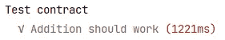

# 用 HardHat 测试智能合同👷‍♂️

> 原文：<https://medium.com/codex/testing-a-smart-contract-with-hardhat-%EF%B8%8F-b7edd925891?source=collection_archive---------0----------------------->

*使用安全帽进行智能合同开发。*


照片由[üMIT y ldr RM](https://unsplash.com/@umityildirim?utm_source=unsplash&utm_medium=referral&utm_content=creditCopyText)在 [Unsplash](https://unsplash.com/s/photos/construction?utm_source=unsplash&utm_medium=referral&utm_content=creditCopyText) 上拍摄

与 Truffle 一样，HardHat 是用于智能合约开发的最大开发工具之一。我以前用过松露，但没那么多，是时候改变了。

在本文中，我将一步一步地解释如何初始化一个新的智能合约项目，以及我们如何使用 HardHat 来测试它。我们将使用[柴](https://www.chaijs.com/)和[醚](https://docs.ethers.io/v5/)来轻松测试合同。

# 初始化安全帽项目

要开始测试，我们首先需要创建一个带有简单智能契约的基本项目。因为 HardHat 在 NPM，启动一个项目就像运行几个命令一样简单。

```
npm init -y
npm i hardhat --save-dev
npx hardhat 
> Create an empty project
npm i --save-dev @nomiclabs/hardhat-ethers ethers @nomiclabs/hardhat-waffle ethereum-waffle chai
```

当你运行 HardHat 时，它会寻找`hardhat.config.js`中的所有东西，它甚至可以光着身子运行。在这里，你可以定义你要使用的网络、任务和插件。

因为我们将在测试中使用柴和乙醚，所以我们也需要添加它们。我们还需要在配置文件的顶部添加`Hardhat-waffle`。

# 测试智能合同

在测试之前，我们需要做的第一件事是创建一个简单的智能契约。创建一个名为`contracts`的文件夹，在里面创建一个智能合同。我会叫我的`Test.sol`。

它有两个功能，我们可以很容易地进行测试。如果您想测试这些函数，您可以创建更复杂的函数，但是对于本文，我将保持简单。

有了这个小契约，我们可以通过运行`npx hardhat compile`来编译它。这将需要一段时间，并创建一些新文件，我们现在不必担心。

*确保配置文件和实体文件中的实体版本一致。*

## 创建测试

我们需要创建一个名为`test`的新文件夹，其中我们将创建一个`Test.js`文件，该文件将使用 Chai 和 Ethers 来测试我们的简单智能契约。

测试中的前三行创建了我们的`contract`对象。正如您在第 11 行和第 12 行看到的，这是我们将用来调用函数的实际对象。

测试中的最后两行检查结果是否等于我们的预期结果，在这种情况下，我们期待`6 + 6 = 12`和`6 — 6 = 0`。这是正确的。



我们的测试顺利完成。但是我们可能想更新一下我们的`Test.js`。如果我们多写几个测试，我们不希望每次都必须部署智能契约，我们可以使用`beforeEach`让它更漂亮一点。

现在，我们可以在每次测试前自动签订合同，而不必每次都重复这三行。

# 结论

这是使用 HardHat 测试智能合约的基础。如果你想了解更多，你可以点击这里查看官方文件。在部署之前，一定要确保彻底测试不可变的智能协定。

非常感谢您的阅读，祝您度过美好的一天。

[支持我支持 Medium，成为会员](https://mbvissers.medium.com/membership)。它帮了我很大的忙，它不会额外花费你，你可以阅读尽可能多的中等文章！

在 [Twitter](https://twitter.com/0xmbvissers) 和 [gm.xyz](https://gm.xyz/u/mbvissers.eth) 上关注我。

在这里查看我是[的开发人员的项目](https://kangaroomob.io/)。

在 Polygon 上查看我最新的 [NFT 作品集](https://www.pixel-pizzas.com/)。