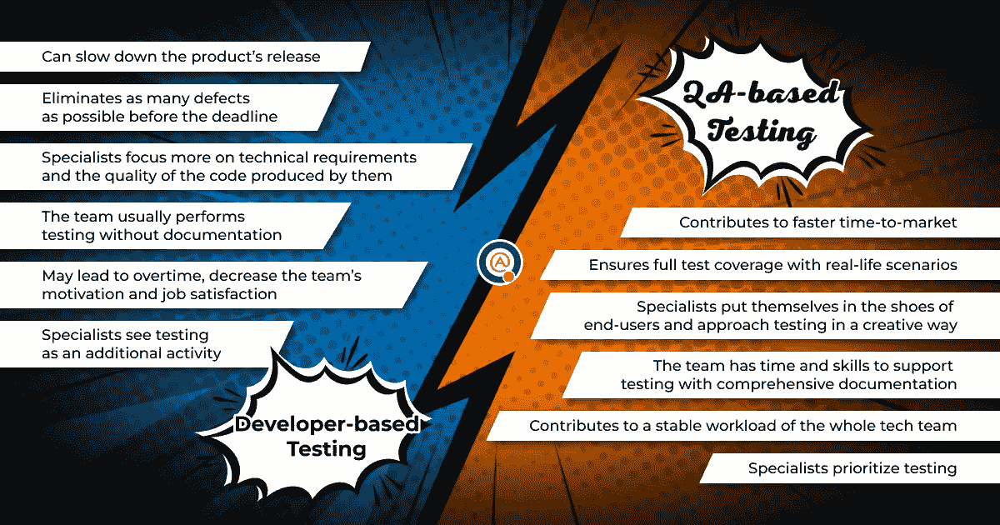

# 开发人员测试与 QA 工程师测试——什么时候做对了？

> 原文：<https://medium.com/codex/testing-by-developers-vs-testing-by-qa-engineers-when-is-it-done-right-19e0460924be?source=collection_archive---------12----------------------->

没有 consequences❓，开发人员的测试能代替 QA 团队的工作吗？是时候找出答案了。

经济不确定时期通常会迫使企业领导人提出削减开支和减少最终产品所需资源的解决方案。例如，[苹果公司已经解雇了大约 100 名招聘承包商](https://www.bloomberg.com/news/articles/2022-08-16/apple-lays-off-recruiters-as-part-of-its-slowdown-in-hiring)，因为它开始放缓扩大员工规模。[梅塔公司将招聘新工程师的计划削减了 30%](https://www.reuters.com/technology/exclusive-meta-girds-fierce-headwinds-slower-growth-second-half-memo-2022-06-30/) ，并警告员工经济放缓。如果我们以软件开发公司为例，优化资源和缩小规模意味着重组过程以补偿更小的团队。QA 经常成为第一个受到这种决策打击的领域。

裁员的一个最激进的选择是放弃 QA 专家的服务，让测试成为开发团队的责任。对于预算有限的小型科技企业或初创公司来说，这似乎也是一个不错的解决方案。

毕竟，开发人员无论如何都要确保他们的代码满足需求。在完成软件构建的某些部分后，他们必须在任何情况下进行测试。一些开发人员编写单元测试，一些甚至参与自动化软件检查。那么为什么不让他们做全光谱测试，一举两得呢？在本文中，我们将回顾这种方法的一些主要缺点，并解释为什么完全选择基于开发人员的质量保证能够并将会影响软件质量。

# 开发人员和测试人员的 QA 方式有什么区别？

#1 时间和成本

开发人员花在测试活动上的每一个小时都是不编码、不开发新功能或更新以前的功能来改进软件的一个小时。如果他们不得不同时寻找 bug 并修复它们，这就拖慢了发布时间表。软件开发是一个竞争非常激烈的市场。错过产品发布日期或推迟发布急需的更新意味着让用户失望，让其他公司占上风。

此外，众所周知，开发人员的服务费用通常高于 QA 工程师。更多的任务意味着开发团队要投入更多的时间和精力让成品看世界。这实质上增加了项目的预算。所以最初的想法是通过减少软件开发人员的数量来降低开发过程的成本。因此，我们不太可能通过给开发人员增加额外的责任来实现这个目标。

另一方面，测试人员的服务通常比较便宜，而且他们补充了开发团队的工作。如果你的 QA 专家已经选择了合适的测试工具，他们将能够给出关于软件状态的快速反馈，而开发人员将在之后立即修复错误。这样，整个过程将会更快，效率更高。此外，测试人员完全专注于寻找 bug，这是他们的首要任务。与开发人员不同，他们可以专注于这个过程。这意味着 QA 工程师将在第一次尝试中发现更多的缺陷，这将节省未来检查的时间和预算。有一个很好的解决方案可以最大限度地节省测试资源，并且仍然能够交付高质量的产品。您可以雇佣一个独立的测试团队，只做兼职工作，来执行全面的发布前测试，并开发一个符合您预算的测试计划。这将有助于优先考虑某些最需要关注的 QA 领域，以在发布后保持良好的声誉。稍后，您的内部团队可以继续处理其他不那么紧急的问题。

#2 视角

在整个团队中，开发人员最熟悉他们的代码。他们在制作和检查作品时已经看过很多次了。当眼睛习惯于信息时，一些缺陷可能会从缝隙中溜走，这是很自然的。他们也可能“视野狭窄”，只关注自己的代码部分，而没有意识到它会如何影响整个系统。

此外，开发人员可能会误解他们软件产品的需求，这种风险总是存在的。由于他们是从创建者的角度而不是从最终用户的角度来看问题，他们可能会认为一个 bug 只是一个特性，因为它不会导致任何关键的功能损失。如果开发团队之后没有测试人员来检查软件，这种缺陷就会进入生产，这是导致评审不满意的一个秘诀。

QA 工程师更倾向于以用户为中心的方法，这正是公司在为消费者准备软件时所需要的。他们带来了检查产品的新视角和设计测试用例的创造性方法。与开发人员不同，测试人员在验证系统时使用真实生活场景，包括[负面测试](https://blog.qatestlab.com/2011/04/08/positive-and-negative-testing/?utm_source=blog&utm_medium=article&utm_campaign=dev-testing-vs-qa-testing-19102022)(例如，如果我们插入不属于特定领域的信息，会发生什么)。这有助于更好地了解软件质量，发现更多的缺陷。由独立的专业团队进行适当的预发布测试将为您提供最终用户的观点，并帮助您发现一些意想不到的问题。

#3 质量保证背景

它包括相关经验和专门培训。当然，简单测试的第一次迭代可能不需要深入的 QA 知识。但是全面的端到端或者 [UI/UX 测试](https://qatestlab.com/services/manual-testing/ux-usability-testing/?utm_source=blog&utm_medium=article&utm_campaign=dev-testing-vs-qa-testing-19102022)呢？这些类型的软件检查需要以前的 QA 经验和对实践中经常出现的陷阱的理解，只有测试人员才能做到这一点。

高质量测试需要背景的第二个原因是写[测试文档](https://qatestlab.com/services/test-documentation/?utm_source=blog&utm_medium=article&utm_campaign=dev-testing-vs-qa-testing-19102022)。作为他们培训的一部分，QA 工程师学习如何创建详细的 bug 报告，设计合适的测试用例以及编写有效的测试计划。不言而喻，如果开发人员是发现缺陷的人，并且他们将是修复缺陷的人，那么可能根本不需要写任何报告——他们将知道如何重现缺陷。然而，测试文档的价值实际上在于它的未来用途。它提供了关于软件产品的历史数据，可以用于下一次迭代测试或者设置自动测试。这就是为什么最好将文档留给专业人员，以免将来使 QA 活动复杂化。

#4 动机

最后但同样重要的是。测试从来都不是开发人员的首要任务。对他们中的大多数人来说，QA 任务是他们主要职责的附加任务，甚至只是一个没有利用他们最有价值的技能的杂务。如果在最后期限前完成是危险的，开发团队将尽最大努力确保软件中没有严重的错误，尽管他们可能会错过一些较小的缺陷。例如，与设计或布局有关的问题，这些问题不会阻止软件的运行，但仍会被用户注意到。

在没有 QA 专家帮助的情况下，优先考虑速度和质量也意味着开发人员要加班。这肯定会降低他们的生产力和工作满意度，甚至可能导致倦怠和辞职。然而，在避免这种情况的同时，减少测试的时间和成本是可能的。例如，我们的团队可以提供合作的[固定预算模式。这意味着我们的测试人员只会在短时间内参与到您的项目中。在测试开始之前，我们将准备一份免费的软件评估，并定义要检查的最关键的 QA 领域。它还将包括测试的估计价格。那么我们的 QA 工程师将只执行这些特定的任务。结果，最紧急的缺陷将会很快被消除，并且测试活动不会超出您的预算。](https://qatestlab.com/approach/business-models/?utm_source=blog&utm_medium=article&utm_campaign=dev-testing-vs-qa-testing-19102022)

# 最后的想法

所以，基本上，技术团队的每个成员都必须呆在自己的领域里。当我们谈论软件开发时，它不仅是团队合作的问题，也是最终产品质量的问题。开发人员的注意力集中在如何构建软件的最佳版本上。一个 QA 工程师的头脑被训练去思考这个软件可以被破解以避免它的所有方法。这些心态截然不同，但它们都有一个目的。最好是让这两个人做他们被雇来做的事情。

当然，如果你是一名经理或团队领导，并且你近期的主要目标是找到削减预算的方法，你可以通过对团队进行一些改变来找到解决方案。虽然，有一些选项会比将测试完全放在开发人员的肩上带来更好的结果。例如，雇佣更熟练的 QA 专业人员，他们可以找到更快、更高效地完成任务的方法。

如果您认为该解决方案适合您，[我们的团队](https://qatestlab.com/?utm_source=blog&utm_medium=article&utm_campaign=dev-testing-vs-qa-testing-19102022)将随时为您服务。我们可以通过选择已经拥有必要技能和经验的专家来检查您的特定软件，从而节省您雇用和招聘新测试人员的时间。这样，重组你的团队不会导致开发过程中的任何延迟。听起来你可能会感兴趣？然后联系我们，获得满足您 QA 需求的复杂和定制的方法。