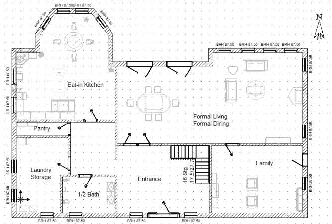

# 测试 Perl:计划还是不计划

> 原文：<https://medium.com/codex/testing-perl-to-plan-or-not-to-plan-9a7650e48ab5?source=collection_archive---------9----------------------->

让我们暂时假设您正在编写一个 Perl 模块或应用程序。您想要保持一定水平的软件质量(或者说 [kwali tee](https://qa.perl.org/phalanx/kwalitee.html) ，所以您正在编写一套测试脚本。无论你是先写它们(这对你的实践有好处[试驾开发](https://en.wikipedia.org/wiki/Test-driven_development)！)或者应用程序代码已经存在，那么您很可能会接触到[测试::简单的](https://metacpan.org/pod/Test::Simple)、[测试::更多的](https://metacpan.org/pod/Test::More)，或者[测试 2::套件](https://metacpan.org/pod/Test2::Suite) …