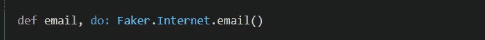

# 测试 Phoenix 和 Elixir:在工厂中集中创建数据。

> 原文：<https://medium.com/codex/testing-phoenix-and-elixir-centralize-data-creation-in-the-factory-8c6d4faa996d?source=collection_archive---------7----------------------->

## 举例说明如何在您的工厂中集中创建数据。

> 杰弗里·马提亚斯与安德里亚·莱奥帕尔迪合著了《测试灵药:灵药及其生态系统的有效且稳健的测试》一书，他最近主持了一个关于建立可维护测试工厂的讲座，我很高兴参加了这个讲座。
> 
> 本文扩展了我上一篇文章中最初讨论的一点:[如何在 Elixir 和 Phoenix 中构建可维护的测试工厂。](https://brooklinmyers.medium.com/how-to-build-maintainable-test-factories-in-elixir-and-phoenix-84312998f7e7)

照片由[亨特·哈里特](https://unsplash.com/@hharritt?utm_source=unsplash&utm_medium=referral&utm_content=creditCopyText)在 [Unsplash](https://unsplash.com/?utm_source=unsplash&utm_medium=referral&utm_content=creditCopyText) 拍摄

# 什么是工厂？

Elixir 中的工厂是处理向数据库插入数据的模块。他们还可以负责处理任何测试相关数据的生成。Ex 玛奇纳是一个创建工厂的流行库。但是，您也可以从头开始构建自己的。

本文假设你有一些在工厂测试 Phoenix 和/或 Elixir 的知识。如果您想对 Elixir 中的工厂有一个简要的了解，我在 phoenix 中写过关于[工厂和其他播种数据的方法。](/geekculture/phoenix-understanding-how-to-seed-data-c2be863ddd1d)

# 什么是集中式数据创建？

通过将所有为测试生成相关数据的方法放在您的工厂中，而不是放在代码库中的任何地方，您可以将所有的数据创建集中在一个地方。

# 为什么要集中数据创建？

通过在工厂中集中数据创建，您提供了一个单一的、方便的界面，所有的测试数据都是在这个界面中创建的。因此，举例来说，如果您需要为您的测试生成电子邮件、姓名、地址，甚至布尔值，您在工厂中只有一个地方可以生成电子邮件，而不是在代码库中分布多个不同的方法。

您的工厂可以公开用于生成数据的公共方法，这些数据可以在整个代码库中使用。这样，如果数据发生变化，只需要在一个地方进行更新。

# 偶然数据与有意数据。

意向数据是您的测试所依赖的数据。您应该显式地将有意的数据传递到您的工厂方法中，而不是依赖隐藏的值。相反，偶然数据是具体值无关紧要的数据，只要该值是有效的。考虑将附带数据随机化，这样你的测试就不会依赖于隐藏的假设并捕捉潜在的副作用。

# 如何集中创建数据？

如果您正在处理一个 Phoenix 或 Elixir 项目并使用工厂，那么您可能会在多个地方以不同方式生成相同类型的数据。

艾莉娜·格鲁布尼亚克在 [Unsplash](https://unsplash.com/?utm_source=unsplash&utm_medium=referral&utm_content=creditCopyText) 上的照片

## 在工厂中创建一个公共方法。

大多数应用程序需要的一些常见数据是电子邮件、电话号码、姓名和地址。在您的应用程序中可能有多种方法来生成这些值。

例如，在我目前的项目中，我们工厂有多种创建电子邮件的方式。

通常我们使用 ExMachina 的序列方法来创建(email-1@test.com、email-2@test.com 等电子邮件列表。)按顺序。

在同一个项目中，我们有时也会用 Faker 发邮件。Faker 是一个库，它提供了生成假数据的实用方法。

我们有时也会对电子邮件使用静态值。

然而，为了集中数据生成，理想情况下，您需要一种方法来生成一种类型的数据。在这种情况下，电子邮件。

首先，我向我们的工厂添加了以下方法。我选择使用 Faker 的电子邮件，而不是序列，因为它提供了更多的随机化。

现在，每当我们需要生成电子邮件时，我们都可以使用这种方法。这是之前的相同用户代码，但是使用了工厂方法。

> 旁注:我还没有提取姓名值，只提取了邮件。

现在，我们创建电子邮件的方式在整个应用程序中是一致的。如果我们对有效和无效电子邮件的理解发生变化，那么我们只需要在一个地方而不是许多地方改变数据生成方法。

以电子邮件为例，您可以对应用程序中使用的任何常见数据进行同样的操作。

# 工厂模板。

如果您的应用程序中有多个工厂，您可以考虑将您的数据生成方法提取到单个工厂模板模块中，以便您的工厂可以共享该代码。

照片由[阿列克谢·博夫](https://unsplash.com/@alanveob?utm_source=unsplash&utm_medium=referral&utm_content=creditCopyText)在 [Unsplash](https://unsplash.com/s/photos/stamp?utm_source=unsplash&utm_medium=referral&utm_content=creditCopyText) 上拍摄

我们目前在我们的应用程序中使用一个工厂，但是随着我们的发展，我们将把我们的大工厂分成更小的工厂。

如果您发现自己处于这种情况，您可能会考虑用您的公共数据生成函数创建一个工厂模板模块，您可以在您的单独工厂模块中使用它。

# 未来的计划。

我想实践我从 Jeffrey 的演讲中学到的东西，所以我计划从集中数据创建开始。从那里，下一步是随机化附带数据。我们仍然有很多地方使用静态数据而不是随机数据。

我希望您能从我在当前项目中尝试集中数据生成的经历中学到一些东西！此外，我希望在将来分享更多关于为 elixir 应用程序编写可维护工厂的经验。