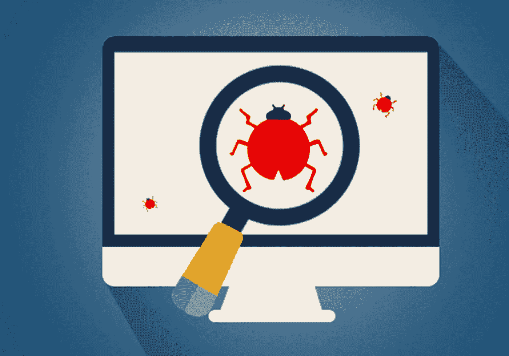

# 测试软件——为机器学习管道编写测试的实用指南

> 原文：<https://medium.com/codex/testing-software-code-a-python-practical-guide-5b92b79879b5?source=collection_archive---------5----------------------->

## Python 中的软件测试理论与实践

发现 bugs 照片来自作者的个人收藏

这篇文章深受我读过的巨著— ***《单元测试》的影响。*** 原理、实践和模式。我强烈鼓励任何想提升编程技能的人将这本书加入他们的收藏…