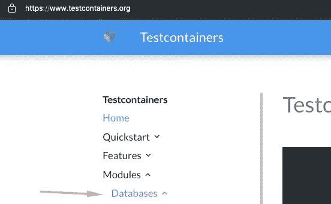

# 用 Testcontainers 测试数据层

> 原文：<https://medium.com/codex/testing-the-data-layer-with-testcontainers-59a3a7141707?source=collection_archive---------10----------------------->

## 使用 [Testcontainers](https://www.testcontainers.org/) 是测试应用程序数据层的方法之一。让我们看一个基本的例子。

开始之前，让我们明确两个假设:

*   您正在使用受支持的运行时(我将使用 Kotlin)。
*   您的本地环境中安装了 Docker。理想情况下，您在部署环境中也有[和](https://12factor.net/dev-prod-parity)，来运行与本地运行完全相同的测试。


照片由 [CHUTTERSNAP](https://unsplash.com/@chuttersnap?utm_source=medium&utm_medium=referral) 在 [Unsplash](https://unsplash.com?utm_source=medium&utm_medium=referral) 上拍摄

有多种技术可以用来测试您的应用程序的数据层，我之前提到过:

[](https://levelup.gitconnected.com/testing-your-apps-data-layer-3328d69abd02) [## 测试应用程序的数据层

### 有多种技术，您使用的技术取决于您的测试策略。

levelup.gitconnected.com](https://levelup.gitconnected.com/testing-your-apps-data-layer-3328d69abd02) 

让我们重点用一个真实的数据库来测试数据层。为了实现这一点，我们可以在测试环境之外启动数据库，但是这需要外部设置和部署，无论是通过手动创建数据库还是使用 Docker 容器。此外，在测试代码中管理数据库可以促进更好的数据隔离。

还要注意，我们将只对数据层进行单元测试，这意味着我们不会启动整个应用程序。相反，我们将隔离数据层部分，这样示例就更简单了，但无论如何都可以使用这种技术。

让我们从在构建文件中包含 Testcontainers 库开始:

```
testImplementation("org.testcontainers:testcontainers:1.+")
```

假设我们需要用 MySQL 进行测试，进入[主页](https://www.testcontainers.org/)，在下面的菜单选项中选择“MySQL 模块”:



将库声明复制到项目的构建文件中:

```
testImplementation("org.testcontainers:mysql:1.+")
```

如果没有这个，我们可以通过[构建一个通用容器](https://www.testcontainers.org/features/creating_container/)来实现。好处是，现在我们将有一个专门的实用程序类来满足我们的需求:

```
val dbServer = MySQLContainer<Nothing>("mysql")
dbServer.start()
```

这将在 Docker 中启动一个 MySQL 实例，所以要确保 Docker 服务器正在运行，否则会出现“找不到有效的 Docker 环境”的错误。

📝*我们可以使用 JUnit 注释来运行这个容器，但是我更喜欢使它显式，因为它的代码行数量几乎相同。*

现在，你可以连接到容器运行(这里使用[暴露的](https://github.com/JetBrains/Exposed)库):

```
val database = Database.connect(
    url = dbServer.jdbcUrl,
    user = dbServer.username,
    password = dbServer.password,
    driver = dbServer.driverClassName,
)
val userRepository = MySqlUserRepository(database)
```

您现在可以自由地使用这个存储库了。只是用一些断言创建一些测试。你可以使用 [SUT](https://en.wikipedia.org/wiki/System_under_test) 的方法或者直接查看数据库来断言，但是这取决于你的[测试策略](/swlh/visualizing-your-automated-testing-strategy-d25ca06abc4e)。

测试结束时，不要忘记关闭容器:

```
dbServer.stop()
```

让我们看看[的完整例子](https://github.com/lsoares/clean-architecture-sample/blob/master/src/test/kotlin/adapters/MySqlUserRepositoryTest.kt):

另外，[查看一个全栈测试的例子](https://github.com/lsoares/clean-architecture-sample/blob/master/src/test/kotlin/api/CreateUserTest.kt)。

我的建议是，在您的 CI/CD 中运行这个示例之前，不要添加更多的测试或使事情变得更复杂。

Testcontainers 中有更多值得探索的地方，比如使用通用容器[和依赖 docker-compose.yml 文件](https://www.testcontainers.org/features/creating_container/)的[。您甚至可以用它来进行 web 验收测试，这将在以后的文章中探讨。](https://www.testcontainers.org/modules/docker_compose/)

[](https://www.testcontainers.org/) [## 测试容器

### 不用 Java？以下是其他支持的语言！Testcontainers for Java 是一个支持 JUnit…

www.testcontainers.org](https://www.testcontainers.org/)