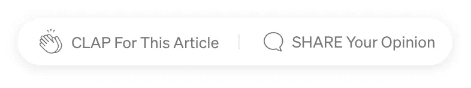

# 如何使用 Postman 进行测试

> 原文：<https://medium.com/codex/testing-with-postman-527e844eefb?source=collection_archive---------13----------------------->

## 每个 API 的安全测试


我是尼科，

我是伦敦一家票务经纪公司的高级工程师。

从办公室！是我每天(几乎)都会写的日志，记录我在日常办公室生活中所做的科技事情。

# 故事

如果你已经在 web 开发环境中呆了一段时间，你肯定会遇到“重构”这个词。

这个词的意思仅仅是改善代码的当前状态，而不对其结果做任何实质性的改变。

我刚刚换了工作，我在新工作场所的主要任务是使用 PHP 8 将旧的 Silex API 替换为一个全新的闪亮的现代 Symfony 6 应用程序。

首先，如果你在阅读这篇文章的时候没有停下来谷歌一下 Silex 是什么，那么恭喜你！你真的在这个街区待了很长时间了。

现在就来说编码吧！

**我最初面临的问题是，我正在处理的代码是遗留代码。**

我指的遗留代码不是 Michael Feathers 在他的书《有效使用遗留代码》中描述的那种代码

> 对我来说，遗留代码就是没有测试的代码。

我的意思是实际上遗留，遗留代码！

还记得需要用 array()构造来设置数组的那一天吗？

是的，遗留代码！

当然，代码的测试覆盖率为 0%,而且非常复杂、棘手、精细、复杂、繁琐、庞大，是的，它们都是同义词，只是为了让你更清楚地了解情况。

# 问题是

对我来说，重构的第一步是编写代码，集成，然后是单元测试，这样我就可以确定，如果我移动一些代码或者创建新的类、接口等等，我不会破坏任何东西。

这里的问题是，我面前有 12 年，如果不是更多年，由 1200 到 3000 行组成的文件都链接到一个管理一切的应用程序/应用程序类。

从数据库连接到检索会话到检查用户的权限和产品等。

一切。

**我不可能在不破坏某些东西的情况下接触那些代码，很可能是商业核心的东西。**

# 解决方案

我很确定我们以前都听说过自动化测试。

有很多测试库，PHPUnit，Mockery 是最流行的。

这很好，但这都是代码内测试。

作为一个社区，我们没有充分讨论的是代码外测试。

…介绍邮递员…

# 邮递员是什么？

Postman 是一个构建和使用 API 的平台。

它是这个领域的主要产品，有很多令人惊讶的特性，比如 API 客户端、模拟服务器、运行程序、监视器以及测试。

这就是我们在这篇文章中要谈论的内容

# 为什么要进行邮递员测试？

进行测试是确保 API 按预期运行、服务可靠以及任何更改都不会破坏现有功能的基础。

Postman 允许您为每个请求编写测试脚本。

万一你的项目出了问题，测试也可以作为一个调试过程。

测试可以添加到单个请求、集合或整个文件夹中。

它还有一个名为 Newman 的命令行工具。

你知道这意味着什么吗？

实际上，您可以在 CI/CD 系统上的管道中运行命令，并测试您的 API，而无需更改一行代码或向脆弱的项目添加 PHPUnit。

太棒了。

# 如何邮寄测试

在给定请求的主邮递员页面上，您会发现几个选项卡。

参数、授权、主体、设置等

我们感兴趣的是测试。

该屏幕分为两部分。

左边的主要部分包含您正在运行的实际测试，较小的部分包含一些您可以尝试的测试的小示例片段。


如前所述，编写这些测试的语言是普通的 JavaScript，这种语言非常流行，我相信你使用它不会有任何问题。

> “任何可以用 JavaScript 编写的应用程序，最终都会用 JavaScript 来编写”——杰夫·阿特伍德提到了阿特伍德定律

以下是一些例子:

```
pm.test("Status test", function () {
    pm.response.to.have.status(200);
});
// where pm stands for the Postman object and the test is checking for a 200 HTTP responsepm.test("response should be okay to process", function () {
    pm.response.to.not.be.error;
    pm.response.to.have.jsonBody("");
    pm.response.to.not.have.jsonBody("error");
});// Well, those are quite straighforward, aren't they?
```

**测试时的另一个重要特性是收集运行器。**

它使您能够以特定的顺序运行集合中的请求。

它记录您的请求测试结果，并可以使用脚本在请求之间传输数据，还可以调整工作流。


尽管这些不是真正的单元测试，但是当处理一个如此微妙的项目时，我相信这是最好的方法。

然后，当端点被测试后，在新域上复制测试并检查是否每一个都通过是非常简单的**。**

# 你的观点是什么？

你如何看待库外测试？

在你的日常实践中加入这些测试值得吗？

此外，如何重构真正的旧代码？

在下面的评论中写下你的想法。



# 结论

我已经做了将近十年的网页开发员了。

与位于伦敦市中心的世界级企业和屡获殊荣的营销机构合作。

此外，我在我的博客和在线社区上写文章和教程，并帮助企业在网上建立他们的存在。

[点击这里阅读我 100 多篇博文](https://anastasionico.uk/blog)