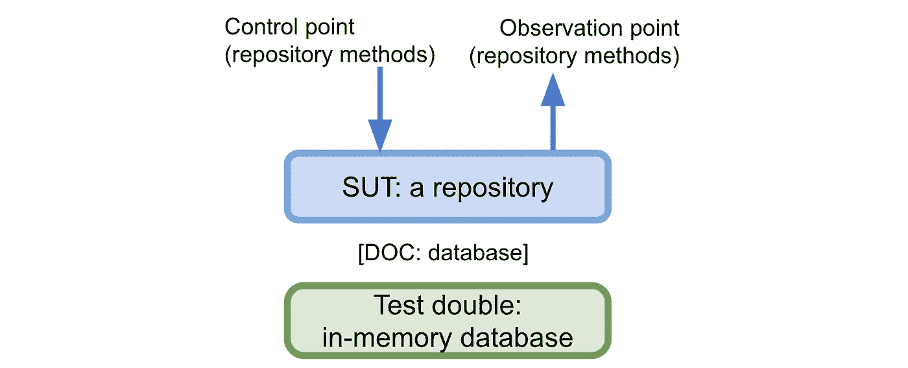
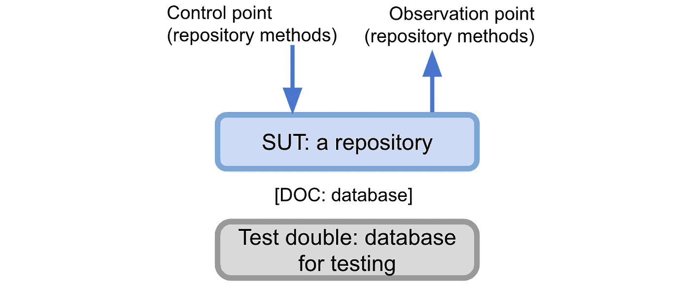

# 测试应用程序的数据层

> 原文：<https://medium.com/codex/testing-your-apps-data-layer-3328d69abd02?source=collection_archive---------1----------------------->

## 有多种技术，您使用的技术取决于您的测试策略。

测试数据层的技术可以是**直接**，比如针对[内存数据库](https://en.wikipedia.org/wiki/List_of_in-memory_databases)(比如 [H2](https://www.h2database.com/html/main.html) )或者针对真实数据库(比如使用 Docker)或者**间接**，比如启动后端应用或者作为最终用户进行测试(UI 测试)。让我们回顾一下直接选项。无论数据库技术如何(例如 PostgreSQL、Redis、MongoDB)，都可以应用所提出的技术。

📝*在决定您将使用的技术时，请记住* [*测试自动化目标*](/swlh/automated-testing-goals-d3ace8fd223a) *以及它在您的* [*自动化测试策略*](/swlh/visualizing-your-automated-testing-strategy-d25ca06abc4e) *中的位置。*

# 针对内存数据库进行测试

为了对数据层进行单元测试，我们需要对其进行适当的隔离。假设我们已经使用了[存储库模式](https://deviq.com/design-patterns/repository-pattern)。存储库的依赖组件(DoC)是一个数据库；计划是用内存数据库代替它。



内存数据库测试策略

测试将调用被测存储库(控制点)的方法。然后，我们可以通过调用其他 SUT 方法(观察点)来断言。这里有一个存储用户(`save(user)`)然后用`findAll()`断言它的例子。

这种技术的主要好处是我们不需要任何额外的螺栓和零件，因为数据库是完全以编程方式管理的。

⚠️:单元测试应该只针对你的存储库。不要测试实现细节，比如数据库模式、 [*【解串器】*](https://lsoares.medium.com/stop-testing-your-serializers-9b568ecd652f) *、查询以及类似的细节。为了实施它，* [*使它们成为私有的*](https://levelup.gitconnected.com/when-magic-numbers-are-not-magic-fcdf034295a5) *(在它们的库内)。*

# 针对真实数据库进行测试



真实数据库测试策略

正如您在图中看到的，这只是*内存数据库*技术的一个变种。在这种情况下，我们将使用真实数据库的一个实例；它给了我们更多的信心，因为它更接近生产环境。当生产数据库与内存数据库略有差异时，这样做是有好处的。因此，它加强了我们的测试安全网。

为了让它工作，您需要确保在这些测试开始之前，一个真实的数据库正在运行。我们将使用 Docker `run`命令启动 MySQL:

```
mysqld

# CREATE DATABASE clean_demo;
# CREATE USER 'clean_demo'@'localhost' IDENTIFIED BY 'my-secret-pw';
# GRANT ALL PRIVILEGES ON clean_demo.* TO 'clean_demo'@'localhost';
# FLUSH PRIVILEGES;
```

最后，我们只是在测试设置中使用那些数据库连接细节:

我的建议是将它放在一个脚本(`test.sh`)中，您可以在本地和您的 [CI/CD](https://en.wikipedia.org/wiki/CI/CD) 中运行，这样您就可以尽可能地在本地体验 CI/CD 中发生的事情。这是一个 Gradle 项目的例子:

```
#!/bin/bash

./gradlew clean test
```

# 测试容器

Testcontainers 是一个很棒的工具，它集合了前两种方法的优点。只要运行 Docker，就可以在容器中运行任何类型的数据库。这种方法的好处是容器的生命周期是以编程方式控制的。

[](/codex/testing-the-data-layer-with-testcontainers-59a3a7141707) [## 用 Testcontainers 测试数据层

### 使用 Testcontainers 库是测试应用程序数据层的方法之一(用 JVM 语言)。让我们看一个基本的…

medium.com](/codex/testing-the-data-layer-with-testcontainers-59a3a7141707) 

# 🛑嘲笑数据库驱动程序

模仿数据库客户端/驱动程序并不是对存储库进行单元测试的合适技术，因为[你会模仿你不拥有的东西](https://tech.findmypast.com/dont-mock-what-you-dont-own/)——在这里是数据库客户端库——创建对你不拥有的代码的依赖。你最终会得到你无法控制的复杂的模仿类。

也有人创建了“ [void drivers](https://blog.jooq.org/2013/02/20/easy-mocking-of-your-database/) ”库，这样你就不必自己创建 mocks 了。与使用内存数据库进行测试相比，我看不出这样做有什么价值。你将使用一个在现实生活中没有使用的驱动程序，因此不会再现任何真实的场景。测试安全网几乎不会改变。