# 值得更多关注的文本编辑器/ide…

> 原文：<https://medium.com/codex/text-editors-ides-which-deserve-more-attention-d406f2abcf94?source=collection_archive---------0----------------------->

## 当您询问文本编辑器时，我通常会想到 VSCode，因为这是我通常使用的。但是，我意识到有一些编辑器即使不是更好也是一样好的，但是不太为人所知…让我们来看看其中的一些。

这次我们这里有一些变化。它们中的一些比其他任何编辑器都更强大，其中一些被简化了，但是肯定它们都是为了让你的生活更容易。让我们直接进入…

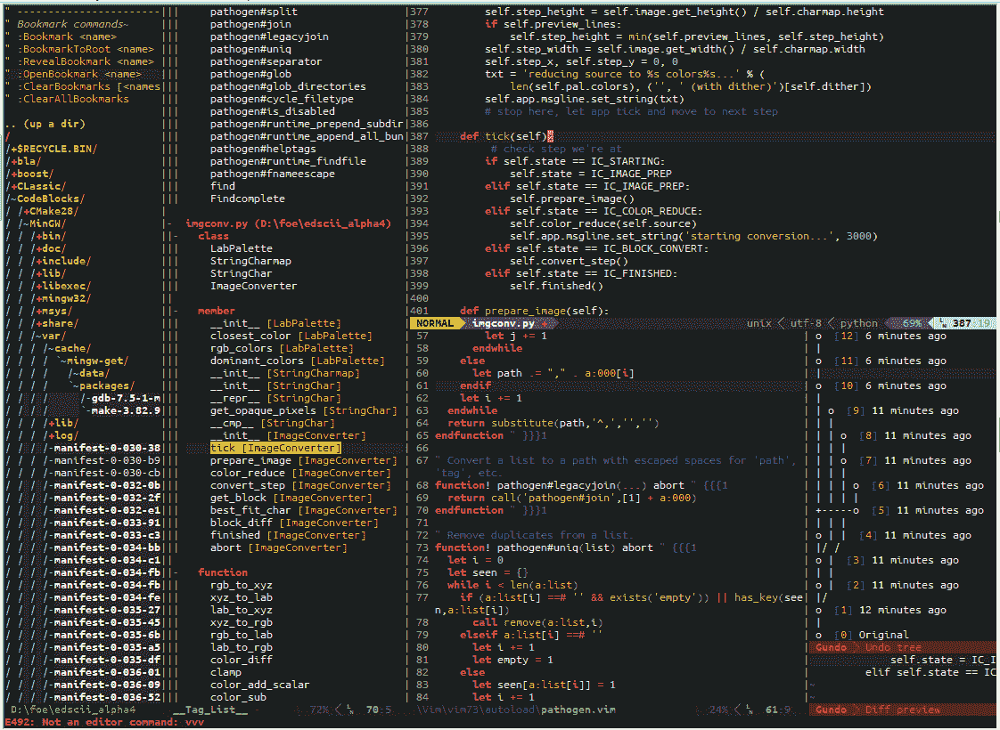

# 科莫多 IDE

尽管这个 IDE 广泛支持 Python、Pearl、Ruby 和 Tcl，但它也能很好地与其他语言和框架(如 npm、HTML/CSS 等)集成。作为一个 IDE，它还通过 GUI 提供了很好的 git 支持。它更进了一步，从网上添加了一个免费的项目管理工具，允许你同步和创建你自己的平台。它还有一个付费版本，可以让你和团队一起工作。

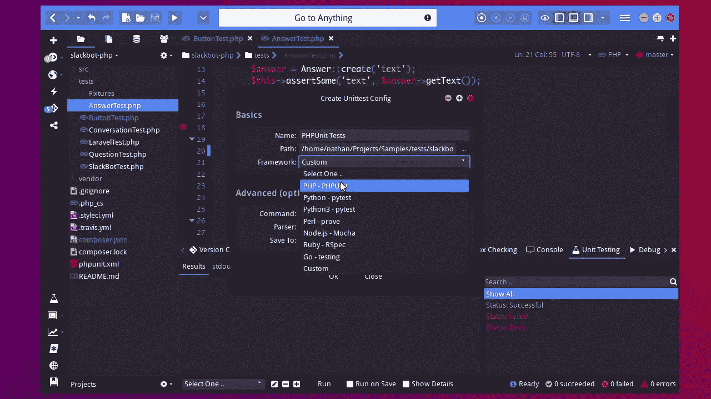

# Kdevelop IDE

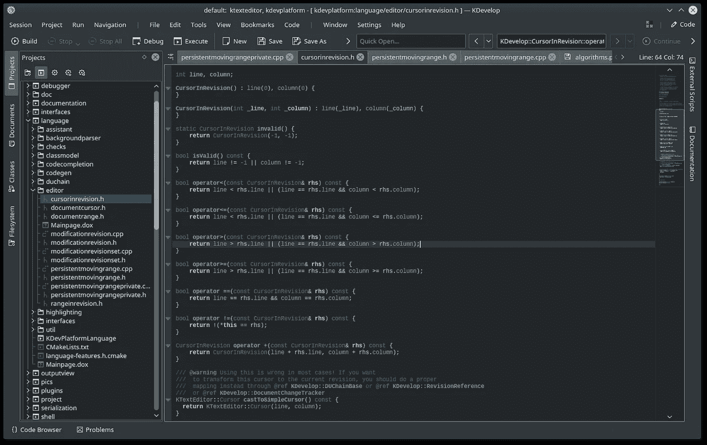

KDevelop 由 KDE 社区开发，是一个免费的开源集成开发环境，用于类似 Unix 的计算机操作系统和 Windows。它使用基于插件的体系结构，为几种编程语言提供编辑、导航和调试功能，并与构建自动化和版本控制系统集成。

如果你使用像 KDE 等离子桌面这样的东西，你会有一个一致的，干净的编辑器外观。

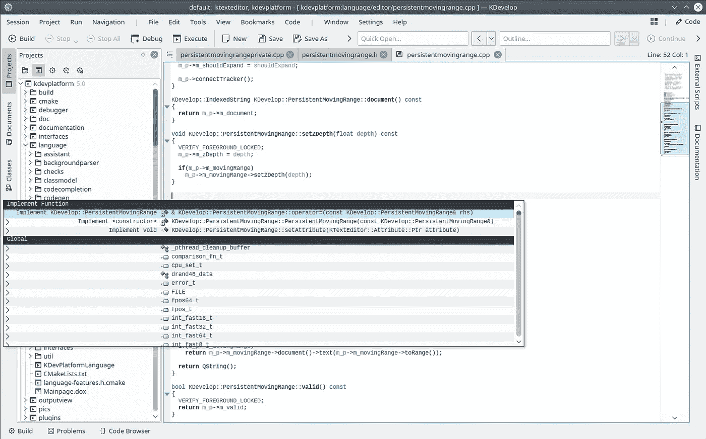

它为您提供了配置、运行、调试和集成任何框架的功能，还可以安装任何插件来添加您可能想要的功能。

# 看片台 IDE

> Light Table 是下一代代码编辑器，通过即时反馈将您与您的创作联系起来。看片台是非常可定制的，可以显示任何 Chromium 浏览器可以显示的东西。

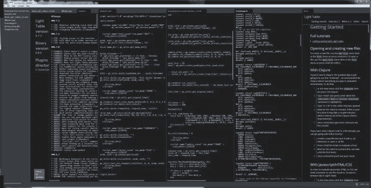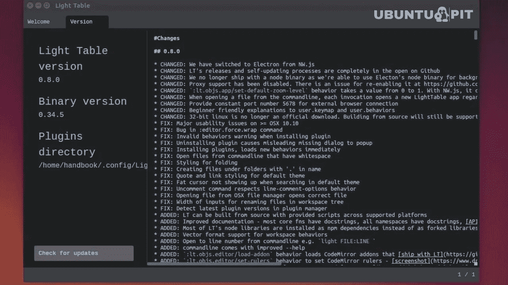

Light Table 是由 Chris Granger 和 Robert Attorri 开发的软件工程集成开发环境。

开发团队试图创建一个程序，向程序员实时展示他们添加的效果，而不是要求他们在编写代码时计算出效果。尽管该程序开始时只支持 [Clojure](https://en.wikipedia.org/wiki/Clojure) ，但它已经瞄准支持 [Python](https://en.wikipedia.org/wiki/Python_(programming_language)) 和 [JavaScript](https://en.wikipedia.org/wiki/JavaScript) 。开发者声称该软件可以减少 20%的编程时间。

# 侮辱

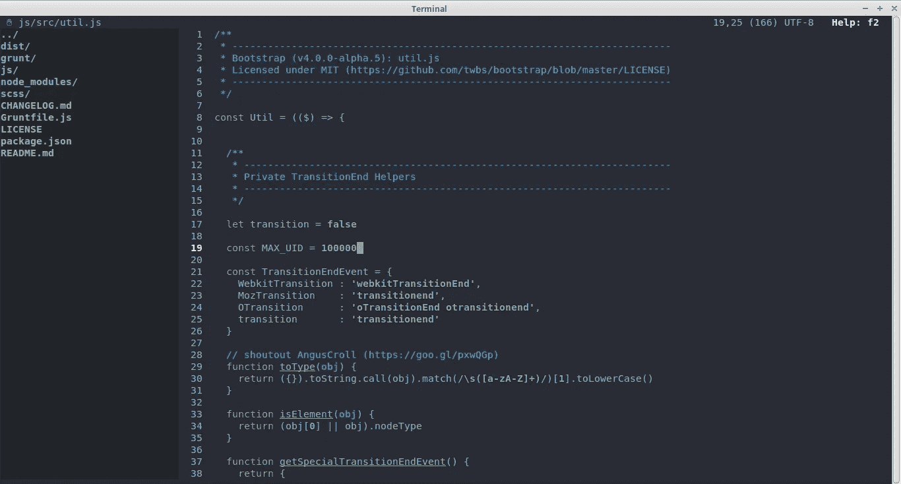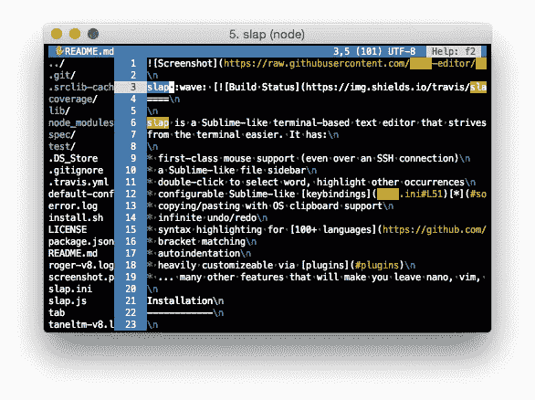

我不做作业时得到的东西，slap 是一个类似于基于终端的文本编辑器，它努力使从终端编辑变得更容易。它具有:

*   一流的鼠标支持(甚至通过 SSH 连接)
*   类似 Sublime 的文件侧边栏
*   双击选择单词，突出显示其他出现的单词
*   可配置的类似于[的按键绑定](https://github.com/slap-editor/slap#default-keybindings) [*](https://github.com/slap-editor/slap#some-keys-dont-work) (Ctrl+S 保存，Ctrl+Z 撤销等)。)
*   支持操作系统剪贴板的复制/粘贴
*   无限撤销/重做
*   [100 多种语言的语法高亮显示](https://github.com/isagalaev/highlight.js/tree/master/src/languages)
*   括号匹配
*   自动缩进
*   通过[插件](https://github.com/slap-editor/slap#plugins)进行高度定制
*   …许多其他功能会让您放弃 nano、vim 和 emacs

# 救济品

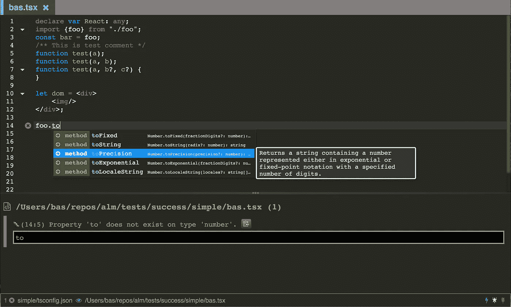

作为一个完全基于 web 的文本编辑器(用 web 浏览器打开)，Alm 是一个带有各种复活节彩蛋、动画等的文本编辑器。例如，命名一个具有以下特性的文本编辑器。

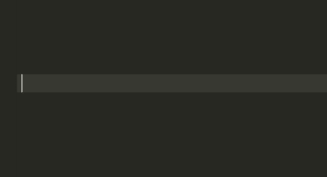

这可能是我有过的最好的功能，可以鼓励我打更多的字。我更喜欢世界上最苍白的主题，如果这意味着我会得到上述功能。

它也有很多更多的功能，你可能想在你的文本编辑器。

# SpaceVim(奖金)

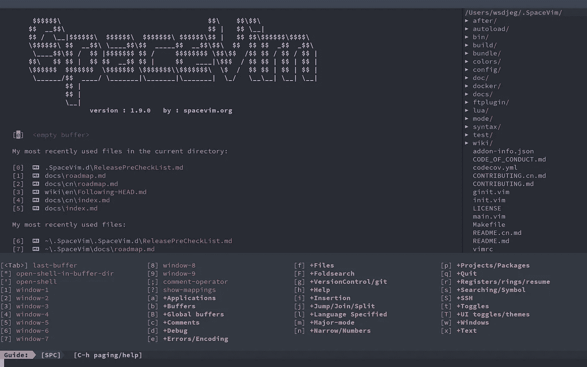

[SpaceVim](https://spacevim.org/) 是一个社区驱动的模块化 Vim 发行版。它在层中管理插件的集合，这有助于将相关的包收集在一起，以提供类似 ide 的特性。

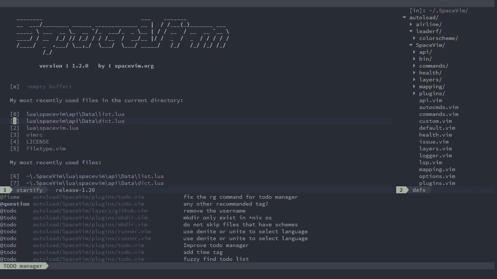

看起来很牛逼，是为终端用户设计的。虽然我真的不怎么使用类似 vim 的文本编辑器，但这个文本编辑器看起来很棒，并且充满了 vim 没有的功能。所以也许我会用它来做一些基本的“Linux 的东西”。

# 结论

所以…是的…让我知道你对上面这些的想法。也许你尝试了其中的一些并喜欢它们，也许你讨厌以上所有的。在评论区发泄吧。

我也会在我的 YouTube 频道上发布更多的视频。Twitter 上也有一些简短有用的推文。看看吧…也许会有帮助。这篇文章大概就是这么说的。我希望你喜欢它，我会在下一个遇见你。

**你好厉害:)**

> 法丁吉克