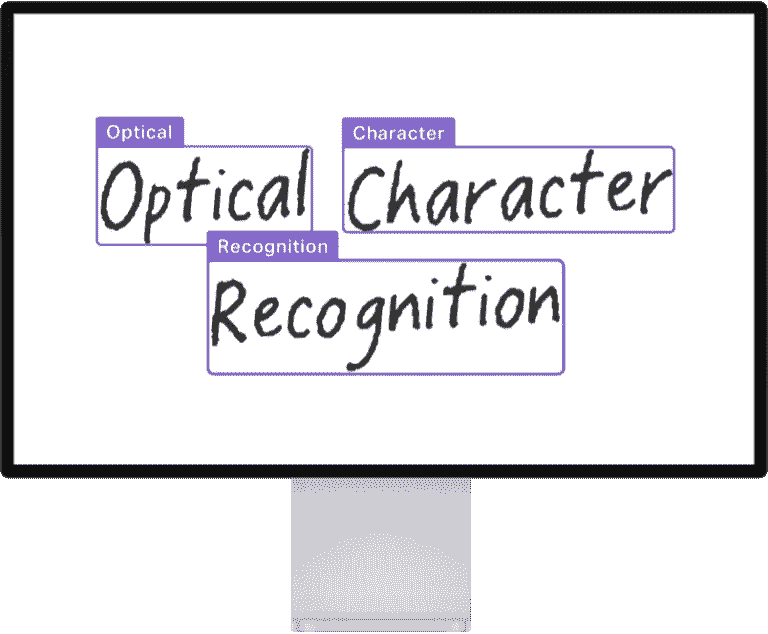
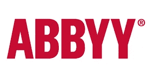
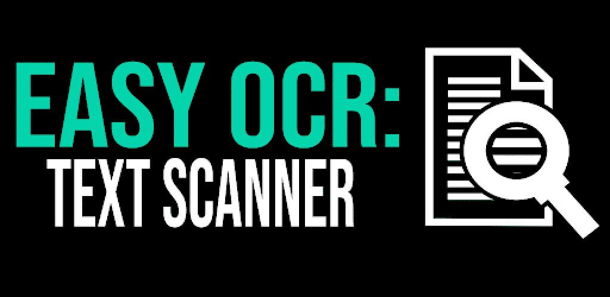
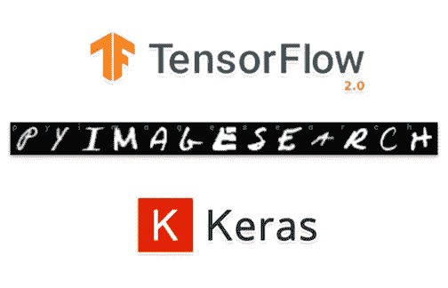
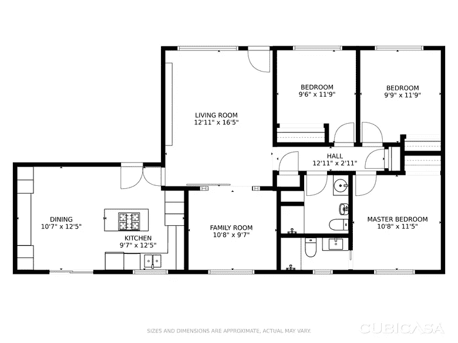
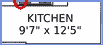
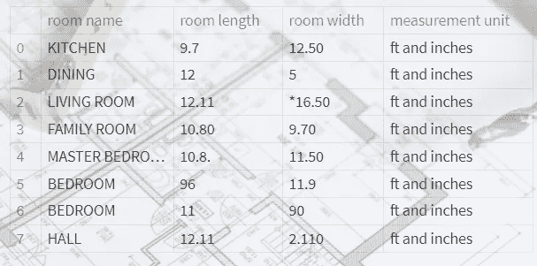

# 使用简易 OCR 提取非结构化数据的文本。

> 原文：<https://medium.com/codex/text-extraction-for-unstructured-data-using-easy-ocr-4258d983d264?source=collection_archive---------1----------------------->



> **什么是 OCR？**

光学字符识别被称为文本识别。OCR 程序从扫描的文档、相机图像和纯图像 pdf 中提取数据并重新调整其用途。OCR 软件在图像上挑出字母，将它们放入单词中，然后将单词放入句子中，从而能够访问和编辑原始内容。它还消除了手动数据输入的需要。你可以浏览[这个](https://towardsdatascience.com/a-gentle-introduction-to-ocr-ee1469a201aa)博客，了解更多关于 OCR 技术的内容。

> **OCR 的应用:**

从图像中提取文本可用于多种应用，例如从扫描文档中读取信息、社交媒体数据分析，在医疗保健领域，数据科学家使用高级数据科学技术分析文本，银行使用文本提取来比较银行对账单，还有更多文本提取的应用。你可以通过[这个](https://viso.ai/computer-vision/optical-character-recognition-ocr/)博客阅读更多 OCR 的实时用例。

> **可用于文本提取的在线工具:**

*   Google Cloud vision API:它是最强大的文本提取 API。它使用机器学习来理解您的图像，具有行业领先的预测准确性。您可以使用此[链接](https://cloud.google.com/vision)尝试一些图像。


*   Amazon Textract: Amazon Textract 使您能够检测和分析单页或多页输入文档中的文本。你可以参考这个[链接](https://docs.aws.amazon.com/textract/latest/dg/what-is.html)来获得更多关于 Amazon Textract 的见解。


*   Omnipage OCR: [文档](https://docs.uipath.com/activities/docs/omnipage-ocr)


*   艾比云 OCR: [文档](https://www.abbyy.com/cloud-ocr-sdk/documentation/)



*   UiPath 文档 OCR: [文档](https://docs.uipath.com/activities/docs/ui-path-document-ocr)


> **不同的文字提取技术:**

*   宇宙魔方


*   简易 OCR



*   Keras OCR



> **非结构化数据的文本提取:**

对于结构化数据，上述所有文本提取方法都能很好地执行。但是，对于非结构化数据，这些方法不能以适当的方式提取文本。所有这些方法都是水平地逐行扫描文档或图像。

对于这种情况，我实现了一种技术，它包括深度学习模型和简单的 OCR 模型*。*

> **问题陈述:**

这是用于非结构化数据的文本提取的示例图像，



sample.png

从这个图像中，我想提取所有房间名称及其适当尺寸的列表。

> **解决方案:**

步骤 1:使用对象检测模型(yolov4)并从平面图中裁剪仅包含文本部分的检测图像。

步骤 2:使用简单的 OCR 检测裁剪图像中的文本。

步骤 3:将房间名称与其对应的尺寸对应起来。

> **实现:**

下面是检测的代码。在这里，我在不同的文本上训练了 yolov4 模型。因此，对于检测，它会给我裁剪图像，将只包含文本部分。

```
net = cv2.dnn.readNet("custom-yolov4-detector.weights",
                      "custom-yolov4-detector.cfg")
#Reading class names
classes = [0]
layer_names = net.getLayerNames()
output_layers = [layer_names[i- 1] for i in net.getUnconnectedOutLayers()]
colors = np.random.uniform(0, 255, size=(len(classes), 3))
#print(len(classes))
img= IMG
#print(img.shape)
height, width,_ = img.shape
blob = cv2.dnn.blobFromImage(img, 1 / 255.0, (416, 416),swapRB=True, crop=False)
# give images input to darknet module
net.setInput(blob)
#  Get the output layers of model
out_names= net.getUnconnectedOutLayersNames()
layerOutputs = net.forward(out_names)
# Generating detection in the form of bounding box, confidence and class id
boxes=[]
confidences=[]
class_ids=[]
qq = 0
j = 0
for out in layerOutputs:
    for detection in out:
        scores = detection[5:]
        class_id = np.argmax(scores)
        confidence = scores[class_id]
        if confidence > 0.5:
            centerX= int(detection[0]* width)
            centerY= int(detection[1]* height)
            w= int(detection[2]* width*1.3)
            #print(w)
            h= int(detection[3]* height*1.3)
            #print(h)
            x = int(centerX - (w/ 2))
            y = int(centerY - (h/ 2))
            boxes.append([x, y, w, h])
            confidences.append(float(confidence))
            class_ids.append(class_id)

indexes= cv2.dnn.NMSBoxes(boxes, confidences, 0.3, 0.4)
indexes= np.array(indexes)
font= cv2.FONT_HERSHEY_PLAIN
colors= np.random.uniform(0, 255, size=(len(boxes),3))
Finaldf = []
for i in indexes.flatten():
    x, y, w, h= boxes[i]
    label= str(classes[class_ids[i]])
    color= colors[i]
    confidence= str(round(confidences[i],2))
    if label == '0':
        cv2.rectangle(img, (x, y), (x+w,y+h),color, 2)
        cv2.putText(img, str(qq), (x+10, y+10), font, 2, (0, 0, 255), 2)
        #print([x, y, w, h])
        obj= img[y: y+h, x: x+w]
        img1 = np.asarray(obj)
        #print(type(img1))
    cv2.imwrite("PATH TO SAVE CROPPED IMAGES".format(j), obj) 
```



cropped_img.png

现在，我们将检查图像中文本的角度。

以下是检测裁剪图像中文本角度的函数:

```
def detect_angle(image):
    mask = np.zeros(image.shape, dtype=np.uint8)
    gray = cv2.cvtColor(image, cv2.COLOR_BGR2GRAY)
    blur = cv2.GaussianBlur(gray, (3,3), 0)
    adaptive = cv2.adaptiveThreshold(blur,255,cv2.ADAPTIVE_THRESH_GAUSSIAN_C, cv2.THRESH_BINARY_INV,15,4)

    cnts = cv2.findContours(adaptive, cv2.RETR_TREE, cv2.CHAIN_APPROX_SIMPLE)
    cnts = cnts[0] if len(cnts) == 2 else cnts[1]

    for c in cnts:
        area = cv2.contourArea(c)
        if area < 45000 and area > 20:
            cv2.drawContours(mask, [c], -1, (255,255,255), -1)
    mask = cv2.cvtColor(mask, cv2.COLOR_BGR2GRAY)
    h, w = mask.shape

    # Horizontal
    if w > h:
        left = mask[0:h, 0:0+w//2]        
        right = mask[0:h, w//2:]        
        left_pixels = cv2.countNonZero(left)
        #print("L",left_pixels)
        right_pixels = cv2.countNonZero(right)
        #print("R",right_pixels)
        if left_pixels >= right_pixels:
            return 0
        else:
            return 180  

    # Vertical
    else:
        top = mask[0:h//2, 0:w]            
        bottom = mask[h//2:, 0:w]        
        top_pixels = cv2.countNonZero(top)
        #print("T",top_pixels)
        bottom_pixels = cv2.countNonZero(bottom)
        #print("B",bottom_pixels)
        if top_pixels >= bottom_pixels:
            return 270
        else:
            return 90
```

有时，图像中的文本是旋转的，在这种情况下，easy OCR 将无法正确检测文本。对于这种情况，我使用了一种算法，将图像中的文本旋转 0 度。

如果文本的角度不是 0 度，这个函数将调整文本的角度。

```
#Adjust the angle
def rotation(angle):
    if angle < -45:
        angle = -(90+ angle)
    else:
        angle = -angle
    return angle
```

在获得合适的图像后，现在我们可以应用简单的 OCR 来检测其中的文本。

```
def ocr(rotated_img):
    img = rotated_img
    gray = cv2.cvtColor(img, cv2.COLOR_BGR2GRAY)
    import easyocr
    reader = easyocr.Reader(['en'])
    result = reader.readtext(img) 
    return result
```

OCR 的输出如下所示:

```
[([[25, 11], [77, 11], [77, 25], [25, 25]], 'KITCHEN', 0.916220680138048), ([[17, 23], [85, 23], [85, 37], [17, 37]], '9\'7" x 12\'5"', 0.36220390889597476)]
```

现在，我只使用了一个简单的 python 代码，它将访问列表中每隔一个的最后一个元素，并将房间名称与其对应的维度进行映射。

最后，我的输出数据帧如下所示:



输出数据帧

参考资料:

1.  [https://www . analyticsvidhya . com/blog/2020/05/build-your-own-ocr-Google-tesse ract-opencv/](https://www.analyticsvidhya.com/blog/2020/05/build-your-own-ocr-google-tesseract-opencv/)
2.  [https://stack overflow . com/questions/58010660/detect-image-orientation-angle-based-on-text-direction](https://stackoverflow.com/questions/58010660/detect-image-orientation-angle-based-on-text-direction)

我希望这些内容能帮助你解决任何类型的文本提取问题。

# **谢谢！！**