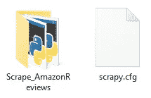
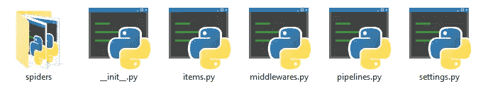
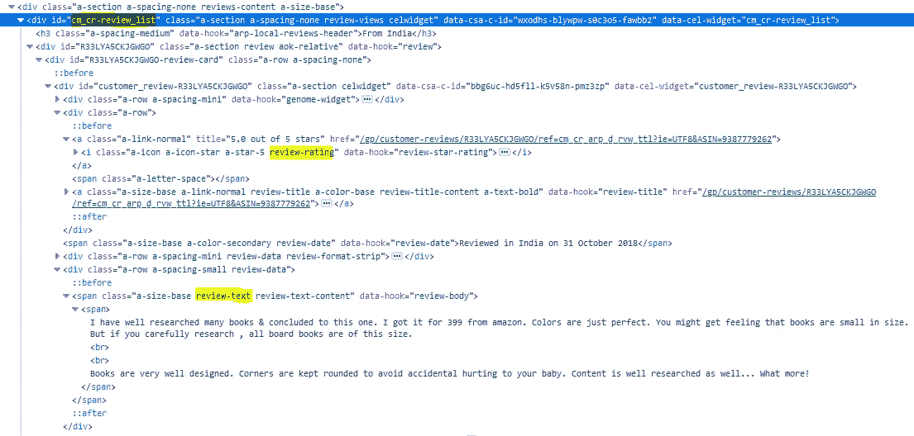
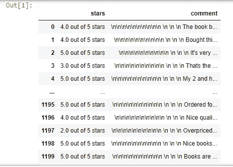
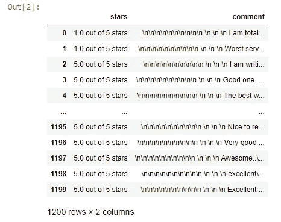

# 文本挖掘:如何使用 Scrapy 提取亚马逊评论

> 原文：<https://medium.com/codex/text-mining-how-to-extract-amazon-reviews-using-scrapy-5bd709cb826c?source=collection_archive---------2----------------------->

想过吗？如果有办法知道你的产品性能如何，人们对你的产品感觉如何，生活会变得更容易。解决方案-文本挖掘技术。

## 我们先来了解一下什么是 NLP 或者文本挖掘？

NLP 代表文本、语音、图像、符号等的自然语言处理。涉及文本的语言学分析被称为文本挖掘，它使用计算方法和技术从书籍、金融报告、新闻文章、社交媒体消息、维基百科等的非结构化文本数据中提取高质量的结构化信息。

当今时代，互联网充斥着海量数据，其中 80%的数据是非结构化数据。一般来说，对非结构化内容的解释或理解对人来说通常很容易，但对机器或计算机程序来说却非常复杂。背后的原因；它充满了模棱两可、模糊、有影响力和概率性的术语和短语，它经常强烈依赖常识、知识和推理，有时还带有讽刺意味。因此，需要将数据转换为结构化数据，以执行分析并生成有意义的见解。

有许多技术可用于执行文本挖掘，本文的目的是学习使用 Scrapy。

## 现在，让我们学习如何使用 SCRAPY 从亚马逊提取产品评论。

要提取亚马逊上销售的产品的评论，您需要遵循以下步骤:

## 第一步:

如果您使用的是 conda，那么您可以使用下面的命令从 conda-forge 安装 scrapy。

> **康达安装-康达锻造废料**

如果您没有使用 conda，您可以使用 pip 并使用下面的命令将其直接安装到您的系统中。

> **！pip 安装 scrapy**

## 第二步:

scrapy 安装后，从 conda 打开 cmd 提示符。

在 cmd 提示符下使用以下命令创建一个 scrapy 项目。

> **scrapy start project scrap _ Amazon reviews**

一旦你创建了这个项目，你会在你的系统根目录下找到“Scrape_AmazonReviews”文件。其中，一个是文件夹，包含您的 scrapy 代码，另一个是您的 scrapy 配置文件。Scrapy 配置有助于在服务器上运行和部署 Scrapy 项目。

## 第三步:

一旦我们有了项目，我们需要创建一个蜘蛛。蜘蛛是一段 python 代码，它决定了网页如何被废弃。它是抓取不同网页并从中提取内容的主要组件。在我们的例子中，这将是执行访问亚马逊和抓取亚马逊评论任务的代码块。要创建一个蜘蛛，您可以在同一个 cmd 提示符下键入以下命令。

> **刺儿头 genspider Amazon _ review**[**https://www.amazon.in/**](https://www.amazon.in/)

这将在您的根目录中创建名为“amazon_review.py”的 python 文件，您需要将该文件放在名为“Scrape _ Amazon reviews \ Scrape _ Amazon reviews \ spiders”的文件夹中。

“amazon_review.py”文件包含以下零碎的解析器代码:

## 第四步:

Spider 是在项目目录下的“spiders”文件夹中创建的。一旦你进入“Scrape_AmazonReviews”文件夹/项目，你会看到一个类似下面的目录结构。

**剪贴簿文件描述:**

让我们更详细地了解一下“Scrape _ Amazon reviews”Scrapy 项目结构和里面的支持文件。Scrapy 项目目录中的主要文件包括:

items.py

项目是将装载抓取的数据的容器。

中间件. py

蜘蛛中间件是 Scrapy 的蜘蛛处理机制的挂钩框架，您可以插入自定义功能来处理发送给蜘蛛进行处理的响应，并处理蜘蛛生成的请求和项目。

管道. py

在一个项目被爬行器抓取之后，它被发送到项目管道，该管道通过顺序执行的几个组件来处理它。每个项目管道组件都是一个 Python 类。

settings.py

它允许用户自定义所有 Scrapy 组件的行为，包括核心，扩展，管道和蜘蛛本身。

蜘蛛文件夹

Spiders 是一个目录，包含了所有作为 Python 类的 spider/crawler。每当一个人运行/抓取任何蜘蛛，然后 scrapy 看这个目录，并试图找到蜘蛛的名称提供的用户。蜘蛛定义了如何抓取某个站点或一组站点，包括如何执行抓取以及如何从它们的页面中提取数据。

## 第五步:

分析网页的 HTML 结构:

为了您的理解，我们来举一个亚马逊上可以买到的以下产品的例子:[https://www . Amazon . in/product-reviews/9387779262/ref = cm _ Cr _ getr _ d _ paging _ btm _ prev _ 1？ie=UTF8 & pageNumber=](https://www.amazon.in/product-reviews/9387779262/ref=cm_cr_getr_d_paging_btm_prev_1?ie=UTF8&pageNumber=) (从亚马逊的这个网页中提取产品评论)

现在，在我们真正开始用 python 编写抓取亚马逊评论的 spider 实现之前，我们需要识别目标网页中的模式。

下面是我们试图抓取的页面，其中包含了亚马逊上关于产品“我的第一个图书馆:10 本儿童板书”的不同评论。

我们首先使用浏览器中的 inspect-element 特性打开网页。在那里你可以看到网页的 HTML 代码。经过一点探索，我发现下面的 HTML 结构可以在网页上显示评论。

在评论页面上，有一个 id 为“cm_cr-review_list”的分部。该分部有多个子分部，评审内容位于其中。我们计划从网页中提取星级和评论文本。进一步考察，我们可以看到，每一个点评细分都进一步划分为多个区块。

其中一个模块包含所需的星级评定，其他模块包含所需的评论文本。通过更仔细地观察，我们可以很容易地看到，星级划分由类属性“review-rating”表示，评论文本由类“review-text”表示。我们现在需要做的就是使用我们的 Scrapy 解析器来挑选这些模式。

## 第六步:

然后我们需要定义一个解析函数，当我们的蜘蛛访问一个新页面时，这个函数就会被激活。在解析函数中，我们需要识别目标页面结构中的模式。然后，蜘蛛会寻找这些模式，并从网页中提取出来。

下面是抓取亚马逊评论的 Scrapy 解析器的代码示例。我们把文件命名为“extract_reiews.py”，保存在“Scrape _ Amazon reviews \ Scrape _ Amazon reviews \ spiders”文件夹中。

## 第七步:

最后，我们成功地建立了我们的蜘蛛。现在剩下的唯一任务就是运行这个蜘蛛。我们可以使用 runspider 命令来运行这个蜘蛛。输入要运行的蜘蛛文件，输出文件存储收集的结果。在下面的例子中，蜘蛛文件是 amazon_reviews.py，输出文件是 amazon_reviews.csv

要运行此命令，请打开 cmd 提示符并键入以下命令:

> **scrapy run spider scrap _ Amazon reviews \ scrap _ Amazon reviews \ spiders \ extract _ reviews . py-o extract _ reviews . CSV**

提取的“extract_reviews.csv”将保存到默认目录。

## 第八步:

提取的 reviews 文件已准备就绪，可以使用 python 打开，如下所示:

输出如下所示:

## 第九步:

针对不同的产品评论测试我们的代码。让我们检查一下我们的代码是否在不同的产品上工作，例如说博世洗衣机前负荷与 web 链接如下:[https://www . Amazon . in/Bosch-Inverter-Control-Automatic-Loading/product-reviews/b 08 Sr 372s 7/ref = cm _ Cr _ ARP _ d _ paging _ btm _ next _ 2？ie = UTF8&reviewer type = all _ reviews&page number =](https://www.amazon.in/Bosch-Inverter-Control-Automatic-Loading/product-reviews/B08SR372S7/ref=cm_cr_arp_d_paging_btm_next_2?ie=UTF8&reviewerType=all_reviews&pageNumber=)

用这个替换前面的“extract_reiews.py”中的 web 链接，并运行 cmd 作为

> **scrapy run spider scrap _ Amazon reviews \ scrap _ Amazon reviews \ spiders \ extract _ reviews _ test 2 . py-o extract _ reviews _ test 2 . CSV**

并使用 pandas python 阅读它。

耶！有用！

现在，您的结构化数据文件已经准备好使用机器学习或人工智能算法执行 NLP 语言分析。

我将在下一篇文章中写更多关于如何执行自然语言处理文本挖掘的内容，包括文本预处理、特征提取、命名实体识别和情感挖掘或对亚马逊上产品评论的情感分析。所以请关注我在[媒体](/subscribe/@vaitybharati)上的帖子😃快乐学习！

请关注我的 [GitHub](https://github.com/vaitybharati) 有 170 多个这样的库。

另外，请告诉我，你对这篇文章有什么看法。