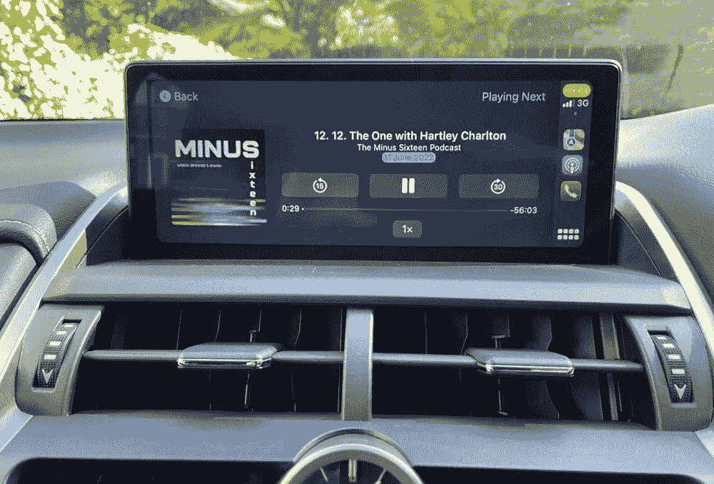

# 来自 WWDC 的最大收获——CarPlay！

> 原文：<https://medium.com/codex/the-1-big-takeaway-from-wwdc-carplay-f521e20e2ff3?source=collection_archive---------13----------------------->

## CarPlay 在 iOS 16 中被彻底重新思考。这对苹果汽车项目的未来意味着什么？

图片由作者提供

## 这一切是如何开始的

CarPlay 于 2014 年作为 iOS 7 的一部分首次推出。如果您有 iPhone 5 或更高版本，您的收音机或主机现在可以从您的…运行应用程序