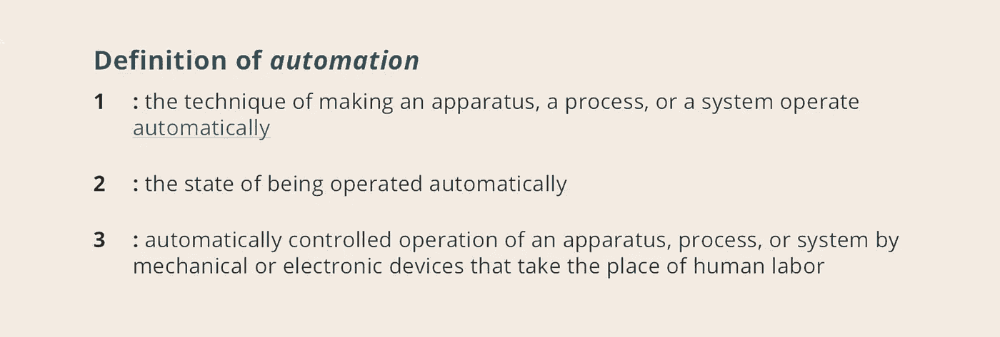
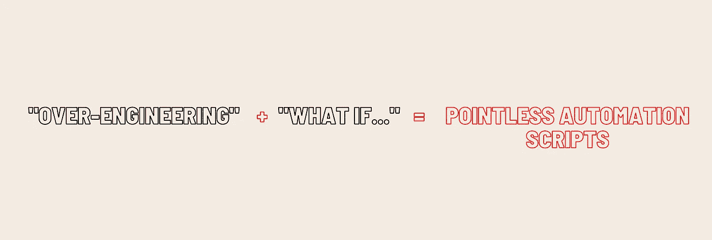

# 清理自动化套件的 10%规则

> 原文：<https://medium.com/codex/the-10-rule-to-clean-up-your-automation-suite-203a47b96853?source=collection_archive---------14----------------------->

## 您的自动化套件是否有点过于杂乱？考虑一下 10%规则

> 通过授权开发人员进行质量检查，打破传统的 QA 孤岛。

自动化，似乎我们永远也看不够，对吗？团队已经确信一堆自动化脚本是前进的方向。虽然这种说法在一定程度上是正确的，但它可能会变得过于混乱。

[韦氏词典](https://www.merriam-webster.com)将“自动化”定义如下:

由作者为这篇中型文章创建—定义通过[韦氏词典](https://www.merriam-webster.com)

就拿第一段来说:“*使一个仪器、过程或系统自动运行的技术。*“将自动化应用到我们的测试中，当涉及到重复的步骤时，可以节省大量的手工劳动。回归测试是通常自动化过程的一个主要例子。那么多少才算多呢？自动化测试太多了吗？

在软件开发团队中有一个流行的说法是:“*保持简单愚蠢*”，又名“ ***亲吻****”*。这四个字无论用在哪里，都能解释一个清晰的目标。那么这和自动化测试有什么关系呢？

在你*破土动工*之前，通常会有一个规划阶段来帮助指导你最初的步骤。所述计划可能包括所需的编程语言、并行化、第三方集成或部署管道。并且您很可能对您计划首先创建的场景流有一个想法。

在完成自动化套件的初始设置之后，问题就出现了。随着时间的推移，最初的测试不再令人满意。那些为其维护做出贡献的人开始注意到差距。“ ***万一****的念头进入他们的脑海，开始挥之不去。"*如果该特征由于……而中断，该怎么办？*”。有大量的理由可以附在那句话的末尾。*

**

*Joshua Fuller 在 Unsplash 上拍摄的照片*

*作为工程师，有时会有过度工程化的倾向。这种*过度设计*的欲望来自于想要做好的正确地方。但是过早使用会造成更大的伤害。*

*由于忽略了*吻*，我们忘记了考虑自动化的[弊端](/javarevisited/disadvantages-of-automation-cf31ef036729)。在我们知道之前，我们已经引入了五个新的测试脚本。如果这五个测试加起来只提供了总价值的 1%,那么当与一个为整个套件提供 5%价值的单一测试进行比较时，您应该质疑它们的需求。*

***的 10%法则**我以前没有读过涉及自动化的东西，所以这很可能是第一次。自动化测试应该有助于提供价值。你的时间和脑力不应该被过度工程化的测试脚本所占据。进入你的自动化套件，看看你所知道的*几乎没有断言任何东西的测试脚本。**

**

*由[作者](https://qatoddy.medium.com)为此中型文章创建*

*目的是识别出你的测试脚本中可以放弃的 10 %( T11)。你可能会超过 10%的标准，或者稍微低于这个标准，但是能够识别和去除那些无意义的测试应该有助于:*

*   *减少总运行时间。*
*   *减少[维护](/javarevisited/disadvantages-of-automation-cf31ef036729)的工作量。*
*   *释放你的智力。*
*   *清除**杂物**！*

*如果你正在努力剔除黄金中的绒毛，问自己以下问题:*

*   *自动化场景是否包含高参与度特性？*
*   *真的有人用这个功能吗？*
*   *有和这个类似的测试吗？它们能结合起来吗？*

*记住少即是多。你需要关注那些带来价值的测试。你不想花 30 分钟不断保持绒毛。*

*总而言之，自动化测试太多了。应用 **10%规则**识别并去除只会增加噪音的杂波。一个拥有 100 多个测试脚本而不是 81 个脚本的自动化套件，可能看起来令人印象深刻，但是所需的维护不值得您花费时间。*

**喜欢你读过的？鼓掌，看看我的其他文章。敬请关注更多内容！**