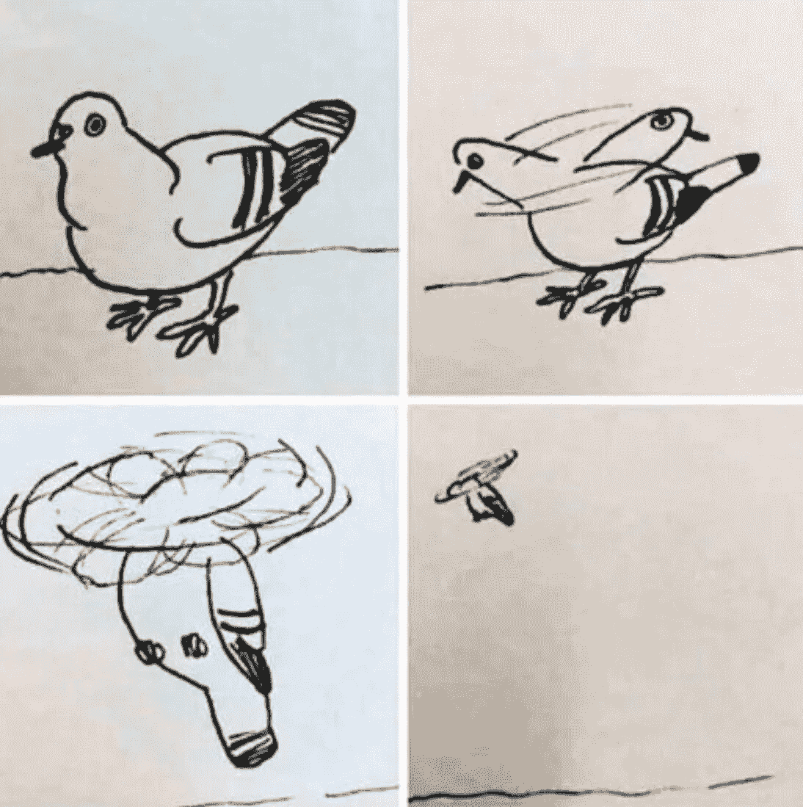
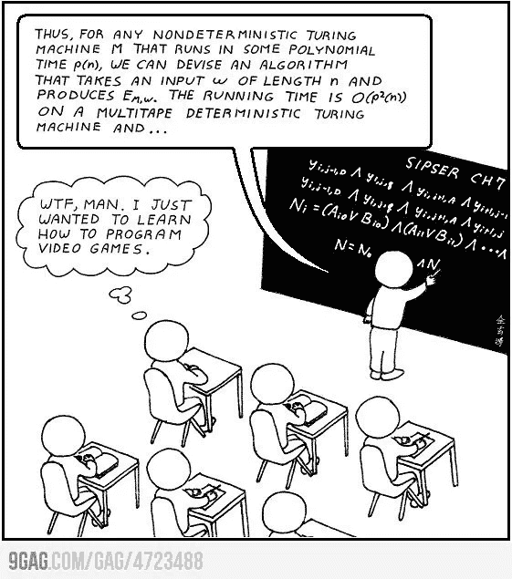

# 你在任何地方都会遇到的 5 种类型的程序员

> 原文：<https://medium.com/codex/the-5-types-of-programmers-you-will-come-across-everywhere-5ff9fccd0d23?source=collection_archive---------3----------------------->

## 等到你遇到 5 号…

我已经编程好几年了。在与几家公司、初创公司和组织合作过之后，我遇到过几种程序员——有些迟钝，有些才华横溢，有些工作狂，有些懒惰，等等。然而，我们可以将所有这些特征大致分为五种类型的程序员。

不同类型的程序员——学分:[技术类](https://www.techinasia.com/11-types-programmers-infographic)

另一方面，个人很可能是这些类型中的一种或多种的组合。我也不鼓励你成为这些类型中的任何一种，因为每一种都有自己的优缺点。这些类型的健康组合可能会给你带来你一直想成为的程序员，但是不健康的组合可能会超出限制地延迟你的项目，或者给你的项目维护人员带来一些噩梦。

# 1.胶带程序员

***说到底，你是来运产品的，不是写代码***

这是修理一切的家伙。向他指出问题所在，走开，他就会让事情发生。现在你可能不爱他或他的代码。他不关心花言巧语或琐碎的案件。但无论何时出现问题，他都会快速有效地解决。

你正坐在办公桌前，这时一个自以为是的家伙走过来，开始向你解释如果你快速使用他的模板，你的代码可以提高 36%。你所需要做的就是从他的 17 个模板中进行乘法继承，每个模板平均有 4 个参数，你甚至几乎不用写函数体！你知道这个代码会产生大量的 bug，并且会使产品延迟很多年，但是你太胆小了，不敢承认，让自己被欺负。

管道胶带程序员不怕说，“多重继承糟透了。别说了。别说了！”他不关心他的代码是漂亮还是快速。这是代码。它完成了任务。就是这样！

# 2.理论程序员

嗯，那是一种可能性，但实际上这可能是一个更好的选择。

这家伙绝对喜欢他的理论，对选择比应该做什么更感兴趣！在最终实现之前，他会反复考虑自己的决定六次。他会花 80%的时间茫然地盯着电脑，思考完成任务的方法，15%的时间抱怨不合理的截止日期，4%的时间完善选项，1%的时间编写代码。

当他的工作交付的时候，他会不情愿地以“如果他有更多的时间，他可以做得更好……”的借口提出来，天哪，他还在考虑更好的替代方案！

# 3.半吊子程序员

***好了，现在怎么办？我认为它起作用了，不是吗？变化？啊，好吧！***

这家伙已经不再编程了。他可以接受任何工作，但他只是懒得再申请了！他不介意代码质量。QA 团队不就是干这个的吗？没人喜欢这家伙。其他软件工程师不想和他合作。

但是客户和管理层喜欢他。毕竟，是他让公司保持运转。是的，他的代码将来会造成很多痛苦，但这不是重点。他在最后期限前完成了任务，而且他完全按照要求去做——不多也不少。

# 4.无代码程序员

***我是程序员，不是吗？我不写代码。那是给 noobs 的！***

这家伙很懒但是很自大。他的世界只有一个简单的真理:写代码不好。如果你必须写点什么，那你就做错了。其他人已经完成了这项工作，为什么不直接使用他们的代码呢？

他会告诉你这种开发实践有多快，即使他花的时间和其他程序员一样长或者更长。但是当你得到这个项目时，它将只有 20 行实际代码，并且非常容易阅读。它可能不是快速、高效或向前兼容的，但它会用最少的努力来完成。

# 5.强迫症完美主义程序员

***你想对我的代码做‘什么’？***

这家伙不在乎你的截止日期或预算。与编程这种艺术形式相比，这些都微不足道。他比任何人都更频繁地阅读文档，只是为了确保遵循所有的最佳实践。一个简单的警告，他就会花上几天去解决！

当你最终收到成品时，你将别无选择，只能屈服于完美格式化的、不，完美美丽的代码的惊人的荣耀和光芒四射的美丽，这是如此有效，以至于你想对它做的任何事情都只会诋毁一个杰作。他是唯一有资格编写代码的人。

# 你是什么？

你是什么类型的程序员？请在评论中告诉我。此外，请随意添加到这个列表中。

谈到编程，我把自己分为部分理论主义者和部分完美主义者。我确实有强迫症，我喜欢反复检查每件事是否完美，是否有据可查，是否处于一种好得不能再好的状态。我错过最后期限了吗？是的，有时我会。有时我工作过度，只是为了确保不失去完美。

*这篇文章的内容灵感来自于* [*史蒂文·班纳*](https://stevenbenner.com/2010/07/the-5-types-of-programmers/) *和* [*乔尔·斯波尔斯基*](https://www.joelonsoftware.com/2009/09/23/the-duct-tape-programmer/) *的博客。请务必查看这些内容，了解更多精彩内容！*

如果您有任何问题或建议，请随时联系我。您可以在这些社交媒体平台上关注我— [LinkedIn](https://www.linkedin.com/in/ab-satyaprakash/) 、 [YouTube](https://www.youtube.com/channel/UCJ6D0HS8c9Il-eX5lGbAyGg) 、 [Twitter](https://twitter.com/AbSatyaprakash) 、 [Instagram](https://www.instagram.com/absatyaprakash/) 了解更多更新内容！

**一如既往！黑客快乐！😇**

加入我的电子邮件列表，获得更多精彩的教程和编程博客 ❤️