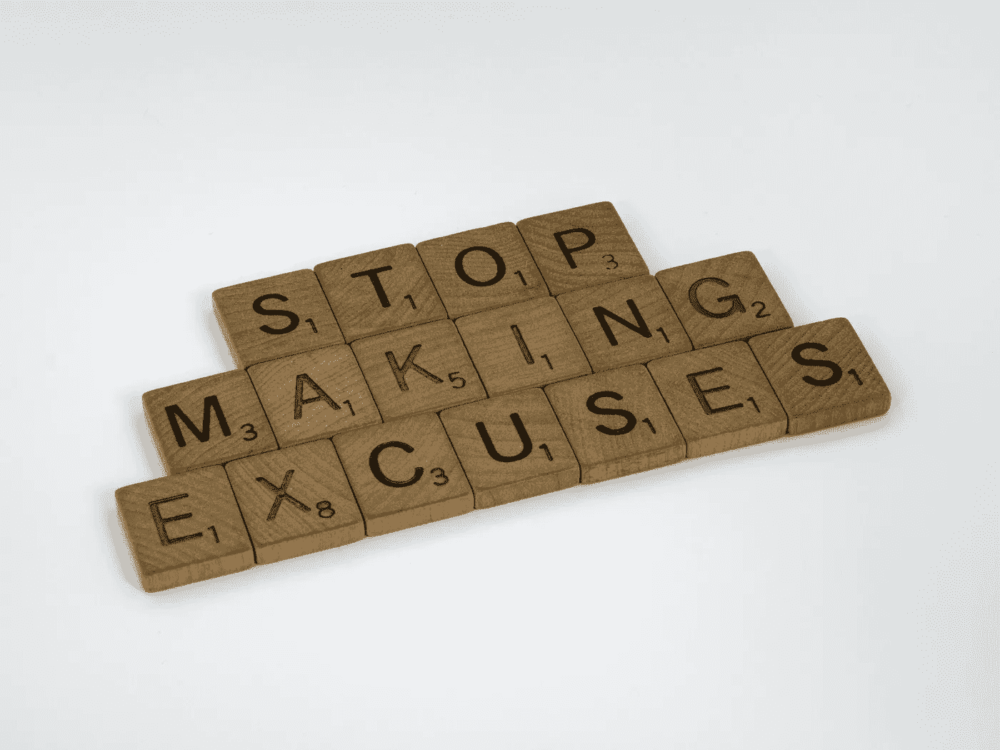

# 代码失败时的 50 个最佳借口

> 原文：<https://medium.com/codex/the-50-best-excuses-when-code-fails-63d8007da000?source=collection_archive---------2----------------------->

## 如果你没有罪，请举手。

布雷特·乔丹摄于 Pexels

在这里，我列出了我职业生涯中找到的一些借口，尽管我承认我自己也用过其中一些。我们都是人:)

1.  "只需要两条线就能修好。"可能是真的，但是太晚了，因为你已经给人留下了错误的印象。如果你是第一次接触…